# Validation and Structural Invariants

<cite>
**Referenced Files in This Document**
- [validator.py](file://src/chunkana/validator.py)
- [types.py](file://src/chunkana/types.py)
- [chunker.py](file://src/chunkana/chunker.py)
- [config.py](file://src/chunkana/config.py)
- [test_validator.py](file://tests/unit/test_validator.py)
- [test_domain_properties.py](file://tests/property/test_domain_properties.py)
- [test_core_invariants.py](file://tests/property/test_core_invariants.py)
</cite>

## Table of Contents
1. [Introduction](#introduction)
2. [Project Structure](#project-structure)
3. [Core Components](#core-components)
4. [Architecture Overview](#architecture-overview)
5. [Detailed Component Analysis](#detailed-component-analysis)
6. [Dependency Analysis](#dependency-analysis)
7. [Performance Considerations](#performance-considerations)
8. [Troubleshooting Guide](#troubleshooting-guide)
9. [Conclusion](#conclusion)

## Introduction
This document explains the validation framework and structural invariants in Chunkana. It focuses on the Validator class and its enforcement of the five core domain properties (PROP-1 through PROP-5), along with the ValidationResult dataclass and strict mode behavior. It also describes how validation integrates into the main chunking pipeline and how to interpret validation outcomes.

## Project Structure
The validation logic lives primarily in the validator module and is complemented by the Chunk data type and the MarkdownChunker pipeline. Tests exercise both the validator and the pipeline’s built-in validation steps.

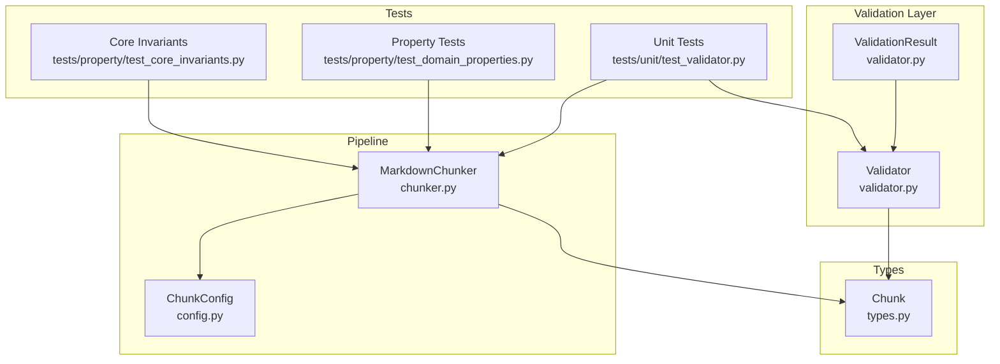

**Diagram sources**
- [validator.py](file://src/chunkana/validator.py#L1-L221)
- [types.py](file://src/chunkana/types.py#L240-L375)
- [chunker.py](file://src/chunkana/chunker.py#L430-L470)
- [config.py](file://src/chunkana/config.py#L17-L120)
- [test_validator.py](file://tests/unit/test_validator.py#L1-L262)
- [test_domain_properties.py](file://tests/property/test_domain_properties.py#L1-L406)
- [test_core_invariants.py](file://tests/property/test_core_invariants.py#L1-L347)

**Section sources**
- [validator.py](file://src/chunkana/validator.py#L1-L221)
- [types.py](file://src/chunkana/types.py#L240-L375)
- [chunker.py](file://src/chunkana/chunker.py#L430-L470)
- [config.py](file://src/chunkana/config.py#L17-L120)
- [test_validator.py](file://tests/unit/test_validator.py#L1-L262)
- [test_domain_properties.py](file://tests/property/test_domain_properties.py#L1-L406)
- [test_core_invariants.py](file://tests/property/test_core_invariants.py#L1-L347)

## Core Components
- Validator: Orchestrates checks for PROP-1 through PROP-5 and returns a ValidationResult.
- ValidationResult: Encapsulates validation outcome with success/failure factory methods.
- Chunk: Enforces structural constraints at creation time (line numbers and emptiness).
- MarkdownChunker: Applies pipeline transformations and performs built-in validation steps.

Key responsibilities:
- PROP-1: No Content Loss
- PROP-2: Size Bounds (including oversize flags and reasons)
- PROP-3: Monotonic Ordering
- PROP-4: No Empty Chunks
- PROP-5: Valid Line Numbers

**Section sources**
- [validator.py](file://src/chunkana/validator.py#L15-L221)
- [types.py](file://src/chunkana/types.py#L240-L375)
- [chunker.py](file://src/chunkana/chunker.py#L430-L470)

## Architecture Overview
The validation framework sits at the end of the chunking pipeline and can be invoked independently. It validates the final chunk list against domain properties and reports warnings or errors. The Chunk type enforces basic structural constraints, while the pipeline’s internal validation ensures size bounds and ordering are maintained.

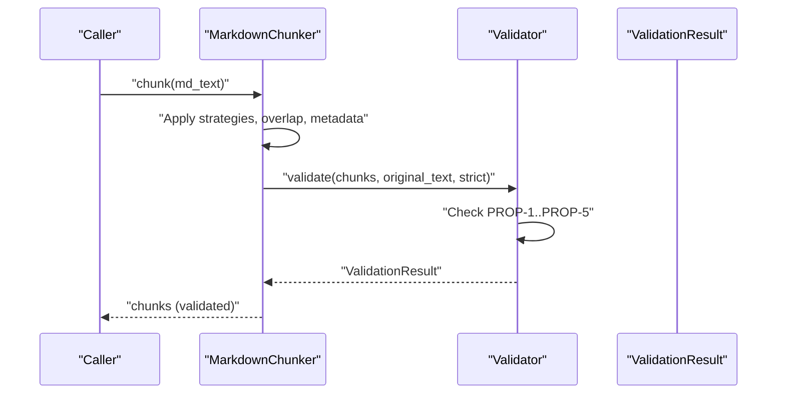

**Diagram sources**
- [chunker.py](file://src/chunkana/chunker.py#L170-L176)
- [validator.py](file://src/chunkana/validator.py#L47-L91)

## Detailed Component Analysis

### Validator and ValidationResult
- Validator.validate orchestrates checks and aggregates errors/warnings. When strict is True, warnings are elevated to errors.
- ValidationResult.success and ValidationResult.failure provide convenient constructors for consistent outcomes.
- validate_chunks is a convenience wrapper around Validator for ad-hoc validation.

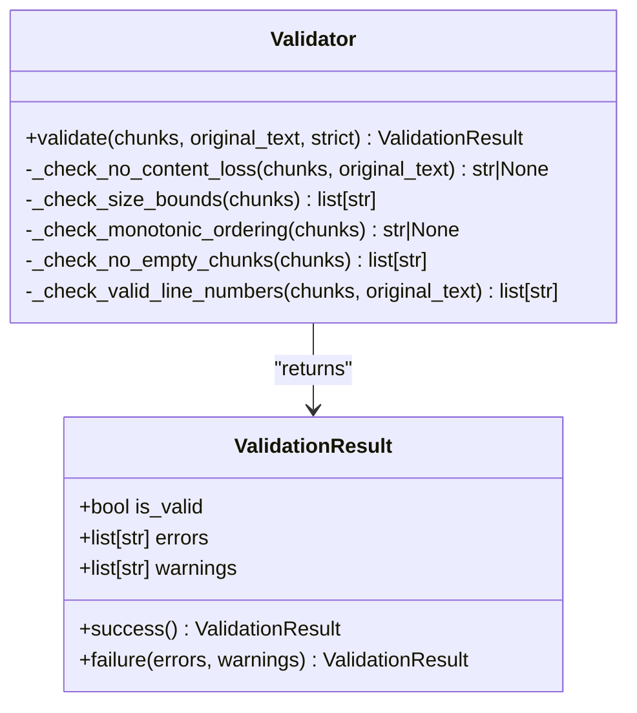

**Diagram sources**
- [validator.py](file://src/chunkana/validator.py#L15-L221)

**Section sources**
- [validator.py](file://src/chunkana/validator.py#L15-L221)

### Domain Properties (PROP-1 through PROP-5)

#### PROP-1: No Content Loss
- Purpose: Ensure the total output content is approximately equal to the original input.
- Mechanism: Sum of chunk lengths versus original length. A 10% variance tolerance is applied.
- Edge cases: Empty input with empty chunks is valid; non-empty input with no chunks is flagged as a warning/error depending on strict mode.
- Example reference: The validator computes total output and compares it to total input, applying a 0.9 multiplier threshold.

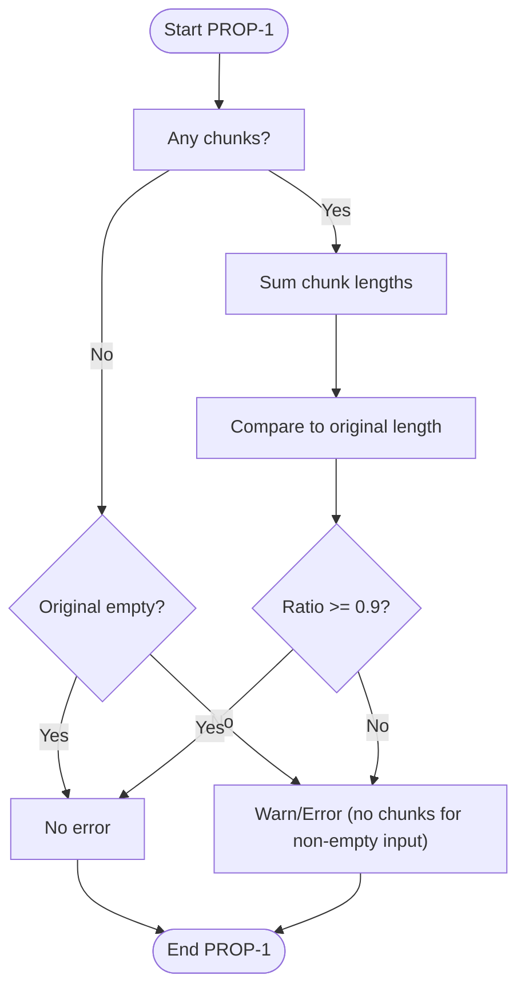

**Diagram sources**
- [validator.py](file://src/chunkana/validator.py#L93-L114)

**Section sources**
- [validator.py](file://src/chunkana/validator.py#L93-L114)

#### PROP-2: Size Bounds
- Purpose: Enforce max_chunk_size limits unless explicitly allowed.
- Oversize handling:
  - allow_oversize flag is required for oversized chunks.
  - oversize_reason must be one of code_block_integrity, table_integrity, section_integrity.
- Pipeline behavior: The chunker’s internal validation auto-sets allow_oversize and oversize_reason for oversized chunks.

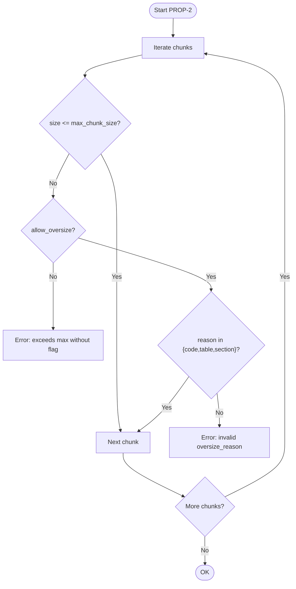

**Diagram sources**
- [validator.py](file://src/chunkana/validator.py#L115-L142)
- [chunker.py](file://src/chunkana/chunker.py#L449-L460)

**Section sources**
- [validator.py](file://src/chunkana/validator.py#L115-L142)
- [chunker.py](file://src/chunkana/chunker.py#L449-L460)

#### PROP-3: Monotonic Ordering
- Purpose: Ensure chunk start_line values are non-decreasing.
- Enforcement: The validator checks adjacency and reports an error if violated. The pipeline’s internal validation sorts chunks to enforce monotonicity.

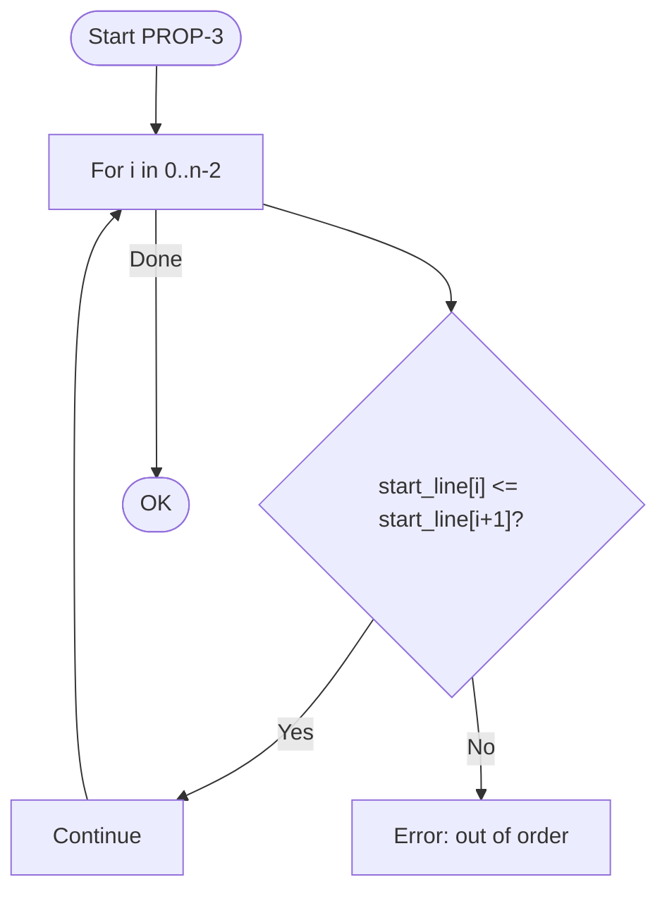

**Diagram sources**
- [validator.py](file://src/chunkana/validator.py#L144-L158)
- [chunker.py](file://src/chunkana/chunker.py#L461-L467)

**Section sources**
- [validator.py](file://src/chunkana/validator.py#L144-L158)
- [chunker.py](file://src/chunkana/chunker.py#L461-L467)

#### PROP-4: No Empty Chunks
- Purpose: Ensure no chunk has empty or whitespace-only content.
- Enforcement: The validator collects errors for empty chunks. The Chunk constructor also enforces this invariant at creation time.

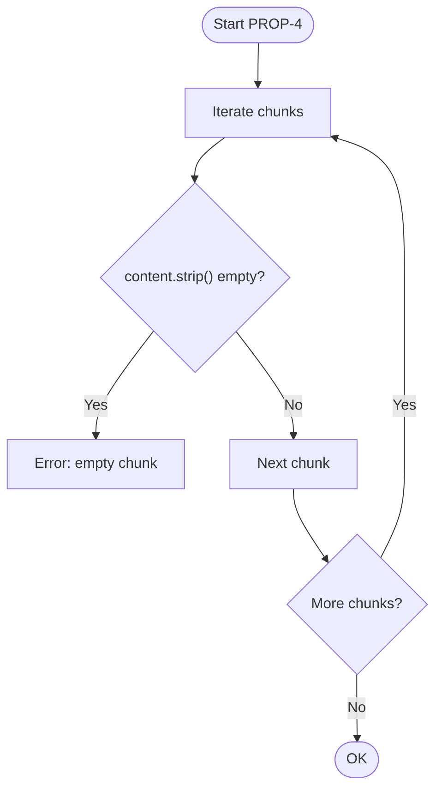

**Diagram sources**
- [validator.py](file://src/chunkana/validator.py#L159-L171)
- [types.py](file://src/chunkana/types.py#L297-L307)

**Section sources**
- [validator.py](file://src/chunkana/validator.py#L159-L171)
- [types.py](file://src/chunkana/types.py#L297-L307)

#### PROP-5: Valid Line Numbers
- Purpose: Ensure start_line >= 1 and end_line >= start_line, and end_line does not exceed total lines in the original text.
- Mechanism: Uses original_text line count to compute total_lines and validates each chunk’s boundaries.

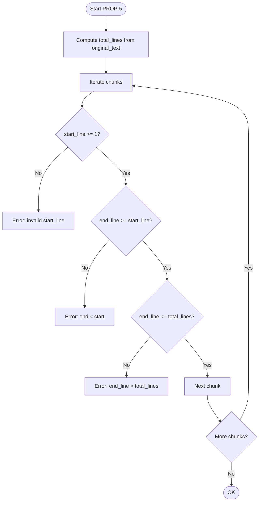

**Diagram sources**
- [validator.py](file://src/chunkana/validator.py#L173-L198)

**Section sources**
- [validator.py](file://src/chunkana/validator.py#L173-L198)

### Strict Mode Behavior
- When strict=True, warnings from validation become errors, making the result invalid.
- The convenience validate_chunks function accepts a strict parameter and forwards it to Validator.validate.

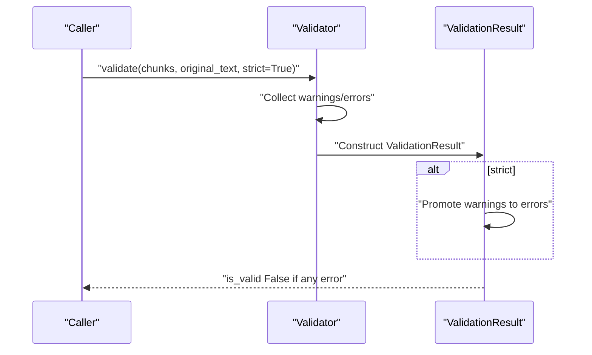

**Diagram sources**
- [validator.py](file://src/chunkana/validator.py#L47-L91)
- [test_validator.py](file://tests/unit/test_validator.py#L193-L209)

**Section sources**
- [validator.py](file://src/chunkana/validator.py#L47-L91)
- [test_validator.py](file://tests/unit/test_validator.py#L193-L209)

### Integration with the Main Chunking Pipeline
- The pipeline applies strategies, overlap, and metadata, then calls the internal validation routine.
- Internal validation:
  - PROP-1: Relaxed check logs a warning but does not fail.
  - PROP-2: Auto-sets allow_oversize and oversize_reason for oversized chunks.
  - PROP-3: Sorts chunks to enforce monotonic ordering.
  - PROP-4 and PROP-5: Enforced by Chunk.__post_init__ and validator checks respectively.

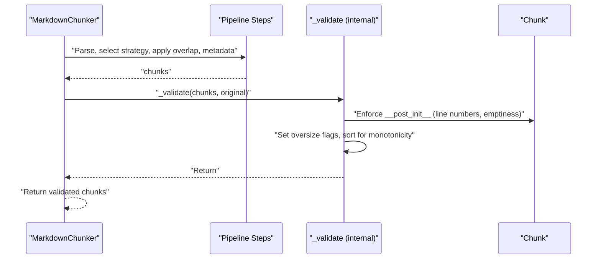

**Diagram sources**
- [chunker.py](file://src/chunkana/chunker.py#L170-L176)
- [chunker.py](file://src/chunkana/chunker.py#L431-L469)
- [types.py](file://src/chunkana/types.py#L297-L307)

**Section sources**
- [chunker.py](file://src/chunkana/chunker.py#L170-L176)
- [chunker.py](file://src/chunkana/chunker.py#L431-L469)
- [types.py](file://src/chunkana/types.py#L297-L307)

## Dependency Analysis
- Validator depends on Chunk and ChunkConfig for metadata and size limits.
- Chunk enforces structural constraints via __post_init__.
- Tests validate both the validator and the pipeline’s internal validation.

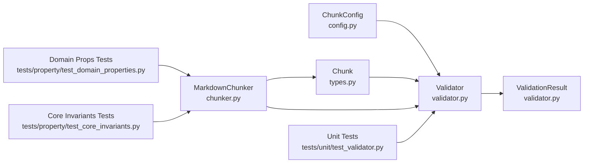

**Diagram sources**
- [validator.py](file://src/chunkana/validator.py#L15-L221)
- [types.py](file://src/chunkana/types.py#L240-L375)
- [chunker.py](file://src/chunkana/chunker.py#L430-L470)
- [config.py](file://src/chunkana/config.py#L17-L120)
- [test_validator.py](file://tests/unit/test_validator.py#L1-L262)
- [test_domain_properties.py](file://tests/property/test_domain_properties.py#L1-L406)
- [test_core_invariants.py](file://tests/property/test_core_invariants.py#L1-L347)

**Section sources**
- [validator.py](file://src/chunkana/validator.py#L15-L221)
- [types.py](file://src/chunkana/types.py#L240-L375)
- [chunker.py](file://src/chunkana/chunker.py#L430-L470)
- [config.py](file://src/chunkana/config.py#L17-L120)
- [test_validator.py](file://tests/unit/test_validator.py#L1-L262)
- [test_domain_properties.py](file://tests/property/test_domain_properties.py#L1-L406)
- [test_core_invariants.py](file://tests/property/test_core_invariants.py#L1-L347)

## Performance Considerations
- Validation adds negligible overhead compared to chunking; tests confirm validation overhead remains low.
- Oversize handling avoids expensive operations by setting metadata flags and reasons rather than recomputing content.
- Monotonic ordering enforcement sorts only when needed.

[No sources needed since this section provides general guidance]

## Troubleshooting Guide
Common issues and resolutions:
- Content loss warnings/errors:
  - Cause: Total output below 90% of input due to overlap and normalization.
  - Resolution: Review overlap settings and ensure strategies do not drop content unintentionally.
  - Reference: PROP-1 check and ratio computation.

- Oversized chunks:
  - Cause: Chunk.size > max_chunk_size without allow_oversize.
  - Resolution: Set allow_oversize and provide a valid oversize_reason (code_block_integrity, table_integrity, section_integrity).
  - Reference: PROP-2 validation and pipeline’s automatic oversize metadata assignment.

- Out-of-order chunks:
  - Cause: start_line values not monotonic.
  - Resolution: Ensure strategies and merges preserve line ordering; the pipeline sorts automatically when violated.
  - Reference: PROP-3 validation and internal sorting.

- Empty chunks:
  - Cause: Whitespace-only content.
  - Resolution: Adjust strategies or pre/post-processing to avoid empty outputs; Chunk.__post_init__ enforces this.
  - Reference: PROP-4 validation and Chunk.__post_init__.

- Invalid line numbers:
  - Cause: start_line < 1, end_line < start_line, or end_line > total_lines.
  - Resolution: Verify header_path and content alignment; PROP-5 checks ensure boundaries.
  - Reference: PROP-5 validation and line counting from original text.

Interpreting validation outcomes:
- ValidationResult.is_valid indicates whether the result is valid.
- ValidationResult.errors and ValidationResult.warnings help diagnose issues.
- In strict mode, warnings are treated as errors.

**Section sources**
- [validator.py](file://src/chunkana/validator.py#L47-L91)
- [validator.py](file://src/chunkana/validator.py#L93-L198)
- [chunker.py](file://src/chunkana/chunker.py#L431-L469)
- [types.py](file://src/chunkana/types.py#L297-L307)
- [test_validator.py](file://tests/unit/test_validator.py#L1-L262)
- [test_domain_properties.py](file://tests/property/test_domain_properties.py#L1-L406)
- [test_core_invariants.py](file://tests/property/test_core_invariants.py#L1-L347)

## Conclusion
Chunkana’s validation framework enforces five core domain properties to guarantee correctness and reliability of chunked outputs. The Validator class centralizes checks, while the Chunk type and pipeline’s internal validation ensure structural soundness. Strict mode elevates warnings to errors for stricter enforcement. Tests validate both the validator and the pipeline’s behavior, providing confidence in the system’s invariants.