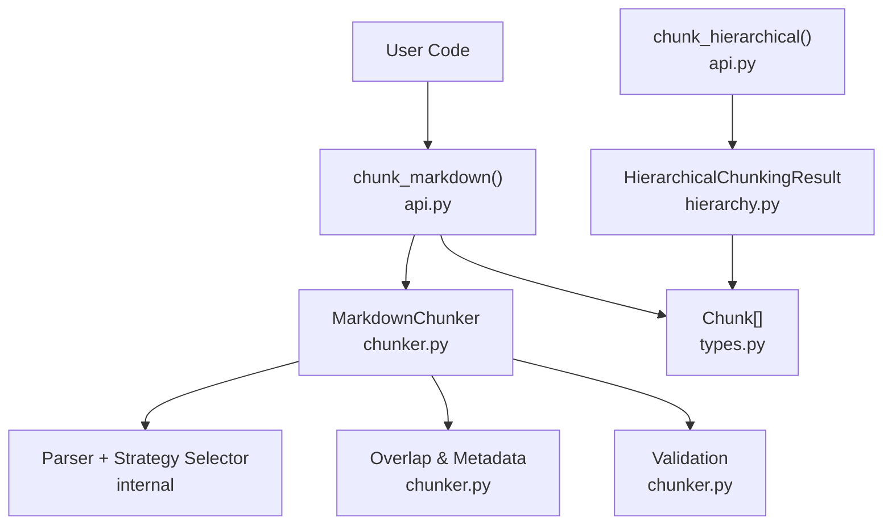
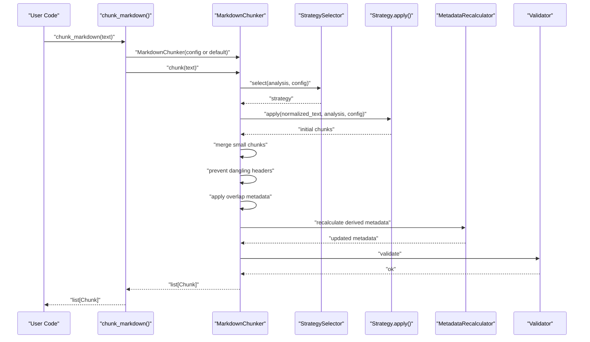
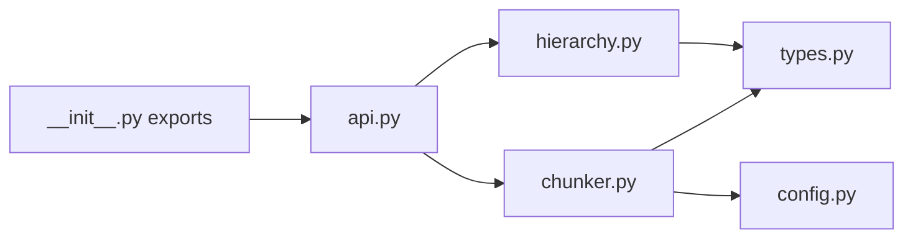

# Quick Start Guide

<cite>
**Referenced Files in This Document**
- [README.md](file://README.md)
- [docs/quickstart.md](file://docs/quickstart.md)
- [src/chunkana/__init__.py](file://src/chunkana/__init__.py)
- [src/chunkana/api.py](file://src/chunkana/api.py)
- [src/chunkana/chunker.py](file://src/chunkana/chunker.py)
- [src/chunkana/types.py](file://src/chunkana/types.py)
- [src/chunkana/config.py](file://src/chunkana/config.py)
- [src/chunkana/hierarchy.py](file://src/chunkana/hierarchy.py)
- [tests/unit/test_hierarchy.py](file://tests/unit/test_hierarchy.py)
</cite>

## Table of Contents
1. [Introduction](#introduction)
2. [Project Structure](#project-structure)
3. [Core Components](#core-components)
4. [Architecture Overview](#architecture-overview)
5. [Detailed Component Analysis](#detailed-component-analysis)
6. [Dependency Analysis](#dependency-analysis)
7. [Performance Considerations](#performance-considerations)
8. [Troubleshooting Guide](#troubleshooting-guide)
9. [Conclusion](#conclusion)

## Introduction
This quick start guide helps you begin using Chunkana to split Markdown documents into semantically coherent chunks. You will learn:
- A minimal working example with chunk_markdown()
- How to iterate over chunks and access metadata and line ranges
- A slightly more complex example using hierarchical chunking with tree navigation
- Output structure and common metadata fields such as header_path
- Troubleshooting tips for unexpected chunk boundaries
- Zero-configuration defaults and hints at advanced capabilities

All examples are copy-paste runnable and include expected output.

## Project Structure
Chunkana exposes a simple public API and a robust internal pipeline. The most relevant files for getting started are:
- Public API entry points: chunk_markdown, chunk_hierarchical, chunk_file, iter_chunks
- Core chunker class that implements the chunking pipeline
- Types and configuration for chunks, metrics, and chunking parameters
- Hierarchical result with navigation helpers

**Diagram sources**
- [src/chunkana/api.py](file://src/chunkana/api.py#L18-L41)
- [src/chunkana/chunker.py](file://src/chunkana/chunker.py#L85-L176)
- [src/chunkana/types.py](file://src/chunkana/types.py#L240-L375)
- [src/chunkana/hierarchy.py](file://src/chunkana/hierarchy.py#L16-L120)

**Section sources**
- [src/chunkana/__init__.py](file://src/chunkana/__init__.py#L24-L67)
- [src/chunkana/api.py](file://src/chunkana/api.py#L18-L41)
- [src/chunkana/chunker.py](file://src/chunkana/chunker.py#L85-L176)
- [src/chunkana/types.py](file://src/chunkana/types.py#L240-L375)
- [src/chunkana/hierarchy.py](file://src/chunkana/hierarchy.py#L16-L120)

## Core Components
- chunk_markdown(text, config=None) -> list[Chunk]: Primary convenience function for basic chunking. Returns a list of Chunk objects with content and metadata.
- MarkdownChunker: Core class implementing the chunking pipeline with strategy selection, overlap, and validation.
- Chunk: Data structure holding content, line range, and metadata.
- ChunkerConfig (alias ChunkConfig): Zero-configuration defaults are applied automatically when config is omitted.

Key zero-configuration defaults:
- max_chunk_size=4096, min_chunk_size=512, overlap_size=200
- preserve_atomic_blocks=True, extract_preamble=True
- overlap_cap_ratio=0.35 for adaptive overlap caps

Common metadata fields you will use:
- header_path: Hierarchical path to the first header in a chunk (e.g., "/Introduction/Section 1")
- content_type: "text" | "code" | "table" | "mixed" | "preamble"
- chunk_index: Sequential index of the chunk
- start_line, end_line: Approximate line range in the source document
- previous_content, next_content: Overlap context from adjacent chunks (metadata-only)
- overlap_size: Size of context window used for overlap

**Section sources**
- [src/chunkana/api.py](file://src/chunkana/api.py#L18-L41)
- [src/chunkana/chunker.py](file://src/chunkana/chunker.py#L85-L176)
- [src/chunkana/types.py](file://src/chunkana/types.py#L240-L375)
- [src/chunkana/config.py](file://src/chunkana/config.py#L17-L126)

## Architecture Overview
The chunking pipeline is linear and designed for simplicity and correctness:
1. Parse markdown once
2. Select strategy based on content analysis
3. Apply strategy to produce initial chunks
4. Merge small chunks and prevent dangling headers
5. Optionally apply overlap metadata
6. Add standard metadata and recalculate derived fields
7. Validate invariants

**Diagram sources**
- [src/chunkana/api.py](file://src/chunkana/api.py#L18-L41)
- [src/chunkana/chunker.py](file://src/chunkana/chunker.py#L85-L176)
- [src/chunkana/chunker.py](file://src/chunkana/chunker.py#L217-L248)

## Detailed Component Analysis

### Minimal Working Example: chunk_markdown()
Goal: Import the library and process a simple Markdown document.

Steps:
1. Import chunk_markdown from chunkana.
2. Prepare a Markdown string.
3. Call chunk_markdown(text) to get a list of Chunk objects.
4. Iterate over chunks and print content and metadata.

Copy-paste runnable example:
- See the minimal example in the repository’s quickstart documentation.

What you will observe:
- A list of Chunk objects with content and metadata.
- Each chunk has start_line and end_line approximating its position.
- header_path indicates the hierarchical path to the first header in the chunk.

Common metadata fields to inspect:
- header_path: e.g., "/Introduction/Section 1"
- content_type: "text", "code", "table", "mixed", or "preamble"
- chunk_index: integer index
- previous_content/next_content: overlap context (metadata-only)
- overlap_size: overlap window size

Expected output highlights:
- Multiple chunks for sections with code blocks and tables preserved.
- header_path reflects the header hierarchy.
- start_line and end_line define approximate ranges.

**Section sources**
- [docs/quickstart.md](file://docs/quickstart.md#L11-L35)
- [src/chunkana/api.py](file://src/chunkana/api.py#L18-L41)
- [src/chunkana/types.py](file://src/chunkana/types.py#L240-L375)

### Slightly More Complex Example: Hierarchical Chunking with Tree Navigation
Goal: Create a hierarchical result and navigate the tree.

Steps:
1. Use chunk_hierarchical(text) to get a HierarchicalChunkingResult.
2. Access root_id and navigate children, parents, ancestors, and siblings.
3. Retrieve flat chunks suitable for flat retrieval.

Copy-paste runnable example:
- See the hierarchical example in the repository’s README.

What you will observe:
- HierarchicalChunkingResult with navigation methods.
- get_chunk(root_id) returns the root document chunk.
- get_children(root_id) returns top-level sections.
- get_parent(child_id) returns the parent chunk.
- get_ancestors(child_id) returns the path to root.
- get_flat_chunks() returns leaf chunks plus non-leaf chunks with significant content.

Common metadata fields for navigation:
- chunk_id: Unique identifier used by navigation methods
- parent_id: Parent chunk identifier
- children_ids: List of child identifiers
- hierarchy_level: Numeric level (0=root, 1=sections, etc.)
- header_path: Path to the first header in the chunk

**Section sources**
- [README.md](file://README.md#L62-L85)
- [src/chunkana/api.py](file://src/chunkana/api.py#L273-L305)
- [src/chunkana/chunker.py](file://src/chunkana/chunker.py#L217-L248)
- [src/chunkana/hierarchy.py](file://src/chunkana/hierarchy.py#L16-L120)
- [tests/unit/test_hierarchy.py](file://tests/unit/test_hierarchy.py#L48-L120)

### Chunk Iteration, Metadata Access, and Line Range Inspection
How to iterate over chunks:
- Use chunk_markdown(text) to get list[Chunk].
- Iterate over chunks and access:
  - chunk.content
  - chunk.start_line, chunk.end_line
  - chunk.metadata["header_path"]
  - chunk.metadata["content_type"]
  - chunk.metadata["chunk_index"]

For streaming large documents:
- Use iter_chunks(text) to lazily yield chunks one at a time.

For file-based chunking:
- Use chunk_file(file_path, encoding="utf-8") to read and chunk a file.

**Section sources**
- [src/chunkana/api.py](file://src/chunkana/api.py#L138-L163)
- [src/chunkana/api.py](file://src/chunkana/api.py#L193-L226)
- [src/chunkana/types.py](file://src/chunkana/types.py#L240-L375)

### Output Structure and Common Metadata Fields
Chunk structure:
- content: The text content of the chunk
- start_line, end_line: Approximate line range in the source document
- metadata: Dictionary with fields such as:
  - header_path: Hierarchical path to the first header
  - content_type: "text" | "code" | "table" | "mixed" | "preamble"
  - chunk_index: Sequential index
  - previous_content, next_content: Overlap context (metadata-only)
  - overlap_size: Overlap window size
  - strategy: Strategy name used
  - small_chunk, small_chunk_reason: Flags for small chunks
  - allow_oversize, oversize_reason: Oversized chunk flags

Chunking metrics:
- Use chunk_with_metrics(text) to get (chunks, metrics) with:
  - total_chunks, avg_chunk_size, std_dev_size
  - min_size, max_size
  - undersize_count, oversize_count

**Section sources**
- [src/chunkana/types.py](file://src/chunkana/types.py#L240-L375)
- [src/chunkana/api.py](file://src/chunkana/api.py#L106-L136)

### Advanced Capabilities (Zero-Configuration Defaults)
- Zero-configuration defaults are applied automatically when config is omitted.
- Advanced features include:
  - Adaptive sizing (use_adaptive_sizing)
  - Streaming chunking for large files (chunk_file_streaming)
  - Code-context binding and LaTeX handling
  - Table grouping
  - Hierarchical validation and strict mode

Hints:
- For code-heavy documents, consider ChunkConfig.for_code_heavy().
- For structured documents, consider ChunkConfig.for_structured().
- For minimal chunks, consider ChunkConfig.minimal().
- For adaptive sizing, consider ChunkConfig.with_adaptive_sizing() or specialized variants.

**Section sources**
- [src/chunkana/config.py](file://src/chunkana/config.py#L310-L407)
- [src/chunkana/api.py](file://src/chunkana/api.py#L228-L271)

## Dependency Analysis
Public API exports and relationships:
- chunk_markdown, chunk_hierarchical, chunk_file, iter_chunks are exported from __init__ and implemented in api.py.
- MarkdownChunker orchestrates parsing, strategy selection, overlap, and validation.
- HierarchicalChunkingResult provides navigation methods and stores chunks flat with parent/child metadata.

**Diagram sources**
- [src/chunkana/__init__.py](file://src/chunkana/__init__.py#L24-L67)
- [src/chunkana/api.py](file://src/chunkana/api.py#L18-L41)
- [src/chunkana/chunker.py](file://src/chunkana/chunker.py#L85-L176)
- [src/chunkana/hierarchy.py](file://src/chunkana/hierarchy.py#L16-L120)
- [src/chunkana/types.py](file://src/chunkana/types.py#L240-L375)
- [src/chunkana/config.py](file://src/chunkana/config.py#L17-L126)

**Section sources**
- [src/chunkana/__init__.py](file://src/chunkana/__init__.py#L24-L67)
- [src/chunkana/api.py](file://src/chunkana/api.py#L18-L41)
- [src/chunkana/chunker.py](file://src/chunkana/chunker.py#L85-L176)
- [src/chunkana/hierarchy.py](file://src/chunkana/hierarchy.py#L16-L120)
- [src/chunkana/types.py](file://src/chunkana/types.py#L240-L375)
- [src/chunkana/config.py](file://src/chunkana/config.py#L17-L126)

## Performance Considerations
- chunk_markdown() is optimized for speed and correctness with a single parse pass and linear pipeline.
- chunk_hierarchical() adds navigation indexing and hierarchy construction; performance is still efficient for typical documents.
- For very large files (>10 MB), use chunk_file_streaming() to avoid loading the entire file into memory.

[No sources needed since this section provides general guidance]

## Troubleshooting Guide
Unexpected chunk boundaries:
- If a chunk ends with a header and the following chunk starts with content, Chunkana prevents dangling headers by moving the header to the next chunk. This preserves semantic coherence.
- If you see small chunks that feel “micro”, they may be flagged as small_chunk if they cannot merge without exceeding max_chunk_size and are structurally weak. Consider adjusting min_chunk_size or enabling adaptive sizing.

Text encoding issues:
- When reading files, ensure the encoding matches the file. The default is UTF-8. If you encounter decoding errors, specify the correct encoding in chunk_file(file_path, encoding="...").

Incorrect import paths:
- Import from chunkana, not from internal submodules. The public API is exposed via __init__.py. Use from chunkana import chunk_markdown, chunk_hierarchical, etc.

**Section sources**
- [README.md](file://README.md#L130-L140)
- [src/chunkana/api.py](file://src/chunkana/api.py#L193-L226)
- [src/chunkana/chunker.py](file://src/chunkana/chunker.py#L431-L470)

## Conclusion
You can start using Chunkana in minutes:
- Install the package and import chunk_markdown.
- Process a simple Markdown document and iterate over chunks.
- Explore hierarchical chunking and tree navigation for structured retrieval.
- Inspect metadata like header_path and content_type.
- Adjust configuration for your workload, or rely on zero-configuration defaults.

[No sources needed since this section summarizes without analyzing specific files]