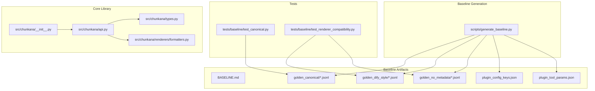
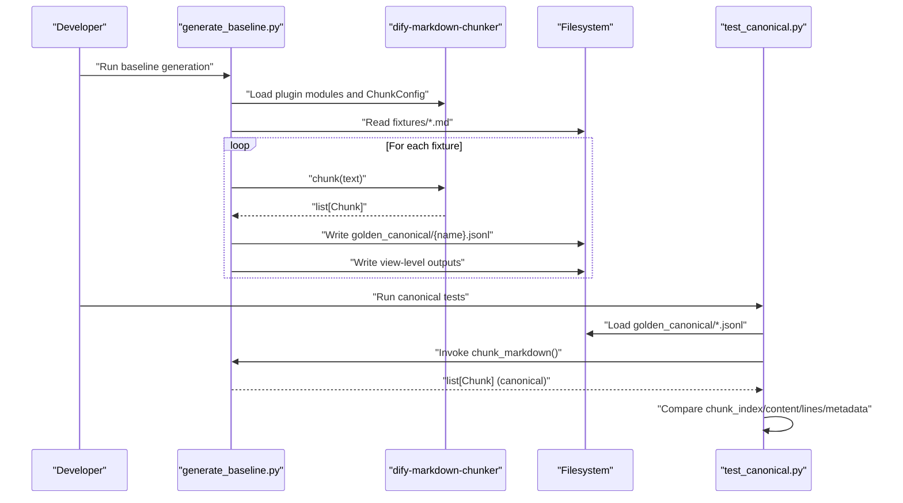
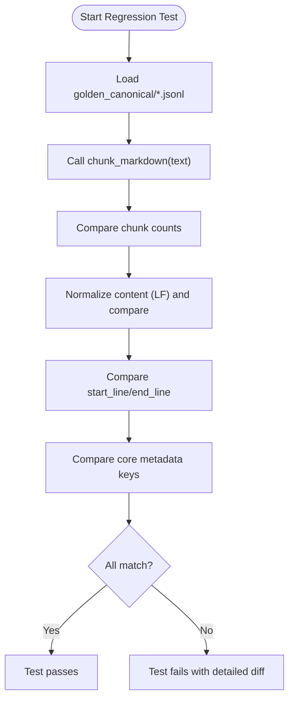
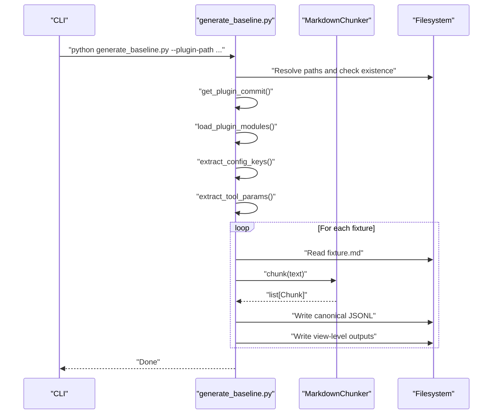
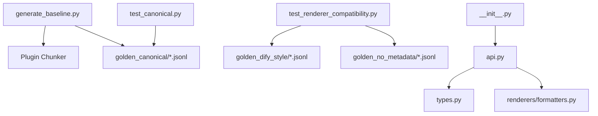

# Canonical Format

<cite>
**Referenced Files in This Document**
- [generate_baseline.py](file://scripts/generate_baseline.py)
- [BASELINE.md](file://BASELINE.md)
- [MIGRATION_GUIDE.md](file://MIGRATION_GUIDE.md)
- [test_canonical.py](file://tests/baseline/test_canonical.py)
- [test_renderer_compatibility.py](file://tests/baseline/test_renderer_compatibility.py)
- [formatters.py](file://src/chunkana/renderers/formatters.py)
- [types.py](file://src/chunkana/types.py)
- [__init__.py](file://src/chunkana/__init__.py)
- [simple_text.jsonl](file://tests/baseline/golden_canonical/simple_text.jsonl)
- [code_heavy.jsonl](file://tests/baseline/golden_canonical/code_heavy.jsonl)
- [api.py](file://src/chunkana/api.py)
</cite>

## Table of Contents
1. [Introduction](#introduction)
2. [Project Structure](#project-structure)
3. [Core Components](#core-components)
4. [Architecture Overview](#architecture-overview)
5. [Detailed Component Analysis](#detailed-component-analysis)
6. [Dependency Analysis](#dependency-analysis)
7. [Performance Considerations](#performance-considerations)
8. [Troubleshooting Guide](#troubleshooting-guide)
9. [Conclusion](#conclusion)
10. [Appendices](#appendices)

## Introduction
This document defines the canonical format used as the authoritative, stable representation for testing and baseline validation in the project. The canonical format is a deterministic, complete, and round-trip faithful serialization of chunked Markdown content. It serves as the ground truth for regression testing and is used to generate and maintain golden files via the baseline generation script. The document explains the design principles behind the canonical format, its structure, and how it relates to other renderers. It also covers how changes to the canonical format trigger migration procedures and versioning considerations, and provides contributor guidance for updating baselines and validating format correctness.

## Project Structure
The canonical format lives alongside the baseline artifacts and is validated by dedicated tests. The key locations are:
- Baseline generation script: scripts/generate_baseline.py
- Baseline reference and schema: BASELINE.md
- Migration and compatibility guarantees: MIGRATION_GUIDE.md
- Canonical tests: tests/baseline/test_canonical.py
- Renderer compatibility tests: tests/baseline/test_renderer_compatibility.py
- Canonical JSONL outputs: tests/baseline/golden_canonical/*.jsonl
- Core types and renderers: src/chunkana/types.py, src/chunkana/renderers/formatters.py
- Public API: src/chunkana/api.py

**Diagram sources**
- [generate_baseline.py](file://scripts/generate_baseline.py#L140-L193)
- [BASELINE.md](file://BASELINE.md#L15-L75)
- [test_canonical.py](file://tests/baseline/test_canonical.py#L1-L158)
- [test_renderer_compatibility.py](file://tests/baseline/test_renderer_compatibility.py#L1-L157)
- [types.py](file://src/chunkana/types.py#L240-L376)
- [formatters.py](file://src/chunkana/renderers/formatters.py#L15-L146)
- [__init__.py](file://src/chunkana/__init__.py#L25-L71)

**Section sources**
- [generate_baseline.py](file://scripts/generate_baseline.py#L140-L193)
- [BASELINE.md](file://BASELINE.md#L15-L75)

## Core Components
- Canonical JSONL output: A line-delimited JSON stream where each line is a record representing a chunk. It preserves the canonical chunk representation with content, line ranges, and metadata.
- Golden files: Persisted canonical outputs used for regression testing. They are generated from a pinned plugin commit and stored under tests/baseline/golden_canonical/.
- Baseline generation script: scripts/generate_baseline.py orchestrates reading fixtures, invoking the plugin chunker, and writing canonical and view-level outputs.
- Tests: tests/baseline/test_canonical.py validates canonical output against golden files; tests/baseline/test_renderer_compatibility.py validates renderer outputs against view-level goldens.

Key responsibilities:
- Determinism: Canonical output is derived from a fixed algorithm and pinned plugin commit, ensuring reproducible results.
- Completeness: Canonical JSONL captures all essential fields: chunk_index, content, start_line, end_line, and metadata.
- Round-trip fidelity: Canonical output is the authoritative source; renderers must match the plugin’s behavior byte-for-byte for view-level outputs.

**Section sources**
- [BASELINE.md](file://BASELINE.md#L56-L75)
- [test_canonical.py](file://tests/baseline/test_canonical.py#L58-L136)
- [test_renderer_compatibility.py](file://tests/baseline/test_renderer_compatibility.py#L45-L139)
- [generate_baseline.py](file://scripts/generate_baseline.py#L140-L193)

## Architecture Overview
The canonical format is produced by running the plugin chunker on fixtures and serializing the resulting chunks to JSONL. The tests then compare the library’s canonical output to these golden files to ensure parity.

**Diagram sources**
- [generate_baseline.py](file://scripts/generate_baseline.py#L140-L193)
- [test_canonical.py](file://tests/baseline/test_canonical.py#L58-L136)
- [BASELINE.md](file://BASELINE.md#L90-L108)

## Detailed Component Analysis

### Canonical JSONL Schema and Structural Invariants
The canonical JSONL schema is defined in the baseline reference and is enforced by the generation script and tests.

- Record shape:
  - chunk_index: integer index of the chunk in the document
  - content: string content of the chunk
  - start_line: integer 1-based start line number
  - end_line: integer 1-based end line number
  - metadata: object containing chunk metadata

- Metadata fields commonly present in canonical outputs:
  - strategy: strategy used to create the chunk
  - content_type: type of content (e.g., text, code, table, mixed, preamble)
  - header_path: hierarchical path to the first header in the chunk
  - header_level: level of the first header in the chunk
  - previous_content/next_content: optional overlap context (when applicable)
  - overlap_size: size of overlap window used for context metadata
  - has_code: boolean indicating presence of code blocks
  - chunk_index: repeated for convenience
  - Other fields may vary by strategy and content type

- Structural invariants preserved:
  - Line numbering is exact and deterministic
  - Content is normalized to LF-only for comparisons
  - Metadata keys that must match are explicitly validated by tests
  - Overlap metadata is compared after normalization

Examples of canonical JSONL records:
- [simple_text.jsonl](file://tests/baseline/golden_canonical/simple_text.jsonl#L1-L4)
- [code_heavy.jsonl](file://tests/baseline/golden_canonical/code_heavy.jsonl#L1-L2)

**Section sources**
- [BASELINE.md](file://BASELINE.md#L61-L65)
- [test_canonical.py](file://tests/baseline/test_canonical.py#L24-L42)
- [test_canonical.py](file://tests/baseline/test_canonical.py#L86-L136)
- [simple_text.jsonl](file://tests/baseline/golden_canonical/simple_text.jsonl#L1-L4)
- [code_heavy.jsonl](file://tests/baseline/golden_canonical/code_heavy.jsonl#L1-L2)

### Design Principles: Determinism, Completeness, Round-Trip Fidelity
- Determinism:
  - Canonical output is derived from a fixed algorithm and pinned plugin commit.
  - The generation script enforces exact JSON formatting and ordering.
  - Tests normalize line endings and compare content precisely.

- Completeness:
  - Canonical JSONL includes all essential fields: chunk_index, content, start_line, end_line, and metadata.
  - Tests validate that core metadata keys are present and equal.

- Round-trip fidelity:
  - Canonical output is the authoritative source.
  - Renderer outputs are validated against view-level goldens to ensure byte-for-byte parity.

**Section sources**
- [BASELINE.md](file://BASELINE.md#L1-L21)
- [BASELINE.md](file://BASELINE.md#L90-L108)
- [test_canonical.py](file://tests/baseline/test_canonical.py#L86-L136)
- [test_renderer_compatibility.py](file://tests/baseline/test_renderer_compatibility.py#L45-L139)

### How the Canonical Format Serves as Ground Truth for Regression Testing
- Canonical tests:
  - Load golden canonical outputs line-by-line
  - Invoke chunk_markdown() to produce canonical chunks
  - Compare chunk counts, content (LF normalization), line numbers, and selected metadata fields
- Renderer compatibility tests:
  - Validate render_dify_style() and render_with_embedded_overlap() against view-level goldens
  - Ensure byte-for-byte equality for include_metadata=True and include_metadata=False modes

**Diagram sources**
- [test_canonical.py](file://tests/baseline/test_canonical.py#L58-L136)

**Section sources**
- [test_canonical.py](file://tests/baseline/test_canonical.py#L58-L136)
- [test_renderer_compatibility.py](file://tests/baseline/test_renderer_compatibility.py#L45-L139)

### Golden Files Generation and Maintenance Using generate_baseline.py
The baseline generation script performs the following steps:
- Validates plugin path and fixtures directory
- Reads fixtures (*.md) and runs the plugin chunker on each
- Writes canonical JSONL outputs to tests/baseline/golden_canonical/
- Writes view-level outputs to tests/baseline/golden_dify_style/ and tests/baseline/golden_no_metadata/
- Extracts plugin configuration keys and tool parameters for documentation and verification

**Diagram sources**
- [generate_baseline.py](file://scripts/generate_baseline.py#L195-L275)
- [generate_baseline.py](file://scripts/generate_baseline.py#L140-L193)

**Section sources**
- [generate_baseline.py](file://scripts/generate_baseline.py#L195-L275)
- [generate_baseline.py](file://scripts/generate_baseline.py#L140-L193)
- [BASELINE.md](file://BASELINE.md#L90-L108)

### Structure of Canonical JSONL Output
- Each file contains one JSON object per line.
- Each record includes:
  - chunk_index: integer
  - content: string
  - start_line: integer
  - end_line: integer
  - metadata: object

- Metadata fields commonly validated:
  - strategy, content_type, header_path, header_level
  - previous_content, next_content, overlap_size
  - has_code, chunk_index

- Tests enforce:
  - Exact content comparison (LF normalization)
  - Exact line number ranges
  - Presence and equality of core metadata keys

**Section sources**
- [BASELINE.md](file://BASELINE.md#L61-L65)
- [test_canonical.py](file://tests/baseline/test_canonical.py#L86-L136)

### Comparing Canonical Output with Other Renderers
- Canonical vs. Dify-style renderer:
  - Canonical: list[Chunk] with content and metadata
  - Dify-style: strings with <metadata> blocks and content
  - Tests validate byte-for-byte equality for include_metadata=True

- Canonical vs. Embedded overlap renderer:
  - Canonical: metadata-only overlap fields
  - Embedded overlap: previous_content + content + next_content concatenated
  - Tests validate byte-for-byte equality for include_metadata=False

- The renderer mapping is documented and used to select the appropriate renderer.

**Section sources**
- [BASELINE.md](file://BASELINE.md#L66-L75)
- [BASELINE.md](file://BASELINE.md#L80-L88)
- [test_renderer_compatibility.py](file://tests/baseline/test_renderer_compatibility.py#L45-L139)
- [formatters.py](file://src/chunkana/renderers/formatters.py#L56-L117)

### How Changes to the Canonical Format Trigger Migration Procedures and Versioning Considerations
- Compatibility guarantees:
  - Canonical output must match plugin outputs byte-for-byte for canonical tests
  - Renderer outputs must match view-level goldens for renderer compatibility tests
  - Streaming boundaries and overlap metadata are explicitly not guaranteed and documented

- Migration considerations:
  - If canonical output changes, update golden files using the baseline generation script
  - Update BASELINE.md with the new pinned plugin commit and parameters
  - Run canonical and renderer tests to verify parity
  - Document behavioral differences and update migration guide accordingly

- Versioning:
  - The pinned plugin commit in BASELINE.md anchors compatibility
  - Changes to the canonical format imply a migration and require updating baselines and tests

**Section sources**
- [MIGRATION_GUIDE.md](file://MIGRATION_GUIDE.md#L336-L350)
- [MIGRATION_GUIDE.md](file://MIGRATION_GUIDE.md#L345-L350)
- [BASELINE.md](file://BASELINE.md#L1-L21)
- [BASELINE.md](file://BASELINE.md#L109-L115)

### Guidance for Contributors on Updating Baselines and Validating Format Correctness
Steps to update baselines:
1. Pin the plugin to the specified commit and install dependencies.
2. Run the baseline generation script with the plugin path.
3. Review generated canonical and view-level outputs.
4. Update BASELINE.md with the new commit and parameters.
5. Run canonical and renderer tests to validate parity.

Validation checklist:
- Canonical tests pass: chunk counts, content, line numbers, core metadata
- Renderer compatibility tests pass: Dify-style and embedded overlap outputs
- Ensure fixtures have corresponding golden outputs

**Section sources**
- [BASELINE.md](file://BASELINE.md#L90-L108)
- [test_canonical.py](file://tests/baseline/test_canonical.py#L137-L158)
- [test_renderer_compatibility.py](file://tests/baseline/test_renderer_compatibility.py#L141-L157)

## Dependency Analysis
The canonical format depends on:
- The plugin chunker for generating canonical outputs
- The baseline generation script for serialization
- Tests for validation against golden files
- Core types and renderers for producing canonical and rendered outputs

**Diagram sources**
- [generate_baseline.py](file://scripts/generate_baseline.py#L140-L193)
- [test_canonical.py](file://tests/baseline/test_canonical.py#L58-L136)
- [test_renderer_compatibility.py](file://tests/baseline/test_renderer_compatibility.py#L45-L139)
- [types.py](file://src/chunkana/types.py#L240-L376)
- [formatters.py](file://src/chunkana/renderers/formatters.py#L15-L146)
- [__init__.py](file://src/chunkana/__init__.py#L25-L71)

**Section sources**
- [generate_baseline.py](file://scripts/generate_baseline.py#L140-L193)
- [test_canonical.py](file://tests/baseline/test_canonical.py#L58-L136)
- [test_renderer_compatibility.py](file://tests/baseline/test_renderer_compatibility.py#L45-L139)
- [types.py](file://src/chunkana/types.py#L240-L376)
- [formatters.py](file://src/chunkana/renderers/formatters.py#L15-L146)
- [__init__.py](file://src/chunkana/__init__.py#L25-L71)

## Performance Considerations
- Canonical format is a static artifact used for testing; runtime performance is not a concern for the format itself.
- The generation script reads fixtures and writes JSONL; ensure adequate disk I/O and memory for large fixture sets.
- Tests normalize content and compare line-by-line; keep fixture sizes reasonable for CI performance.

[No sources needed since this section provides general guidance]

## Troubleshooting Guide
Common issues and resolutions:
- Missing golden outputs:
  - Ensure fixtures have corresponding golden files; tests explicitly check for missing files.
- Content mismatches:
  - Verify line ending normalization (CRLF→LF) and absence of stripping.
  - Compare metadata keys that must match (strategy, content_type, header_path).
- Renderer mismatches:
  - Confirm correct renderer selection: render_dify_style() for include_metadata=True, render_with_embedded_overlap() for include_metadata=False.
- Streaming differences:
  - Streaming boundaries and overlap metadata are not guaranteed; consult the migration guide for documented differences.

**Section sources**
- [test_canonical.py](file://tests/baseline/test_canonical.py#L137-L158)
- [test_renderer_compatibility.py](file://tests/baseline/test_renderer_compatibility.py#L141-L157)
- [MIGRATION_GUIDE.md](file://MIGRATION_GUIDE.md#L345-L350)

## Conclusion
The canonical format is the authoritative, stable representation used for testing and baseline validation. It is deterministic, complete, and round-trip faithful, anchored by a pinned plugin commit and validated by comprehensive tests. Golden files are generated and maintained using the baseline generation script, and contributors should follow the documented steps to update baselines and validate format correctness. When changes occur, migration procedures and versioning considerations ensure continuity and compatibility.

[No sources needed since this section summarizes without analyzing specific files]

## Appendices

### Appendix A: Canonical JSONL Record Fields
- chunk_index: integer
- content: string
- start_line: integer
- end_line: integer
- metadata: object

**Section sources**
- [BASELINE.md](file://BASELINE.md#L61-L65)
- [test_canonical.py](file://tests/baseline/test_canonical.py#L86-L136)

### Appendix B: Renderer Mapping
- include_metadata=True → render_dify_style()
- include_metadata=False → render_with_embedded_overlap()

**Section sources**
- [BASELINE.md](file://BASELINE.md#L80-L88)
- [test_renderer_compatibility.py](file://tests/baseline/test_renderer_compatibility.py#L45-L139)