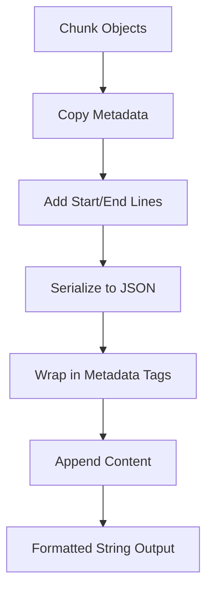
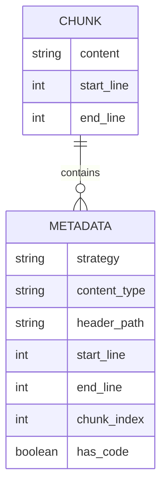
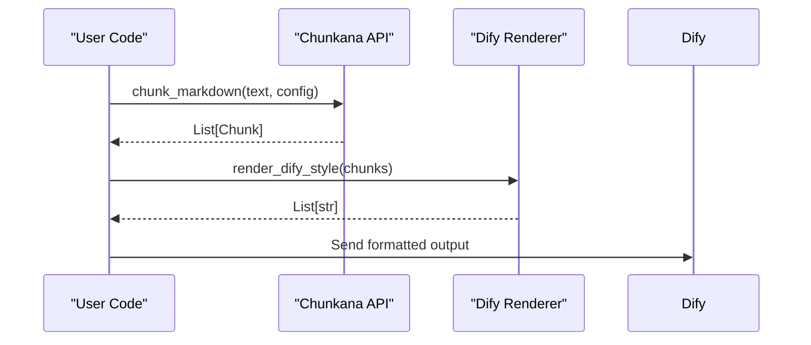

# Dify-Compatible Renderer

<cite>
**Referenced Files in This Document**   
- [formatters.py](file://src/chunkana/renderers/formatters.py)
- [dify.md](file://docs/integrations/dify.md)
- [types.py](file://src/chunkana/types.py)
- [api.py](file://src/chunkana/api.py)
- [config.py](file://src/chunkana/config.py)
- [test_renderer_compatibility.py](file://tests/baseline/test_renderer_compatibility.py)
- [renderers.md](file://docs/renderers.md)
- [code_heavy.jsonl](file://tests/baseline/golden_dify_style/code_heavy.jsonl)
- [mixed_content.jsonl](file://tests/baseline/golden_dify_style/mixed_content.jsonl)
- [simple_text.jsonl](file://tests/baseline/golden_dify_style/simple_text.jsonl)
- [structural.jsonl](file://tests/baseline/golden_dify_style/structural.jsonl)
- [headers_deep.jsonl](file://tests/baseline/golden_dify_style/headers_deep.jsonl)
- [latex_formulas.jsonl](file://tests/baseline/golden_dify_style/latex_formulas.jsonl)
- [list_heavy.jsonl](file://tests/baseline/golden_dify_style/list_heavy.jsonl)
- [nested_fences.jsonl](file://tests/baseline/golden_dify_style/nested_fences.jsonl)
- [code_context.jsonl](file://tests/baseline/golden_dify_style/code_context.jsonl)
</cite>

## Table of Contents
1. [Introduction](#introduction)
2. [Core Functionality](#core-functionality)
3. [Format Requirements](#format-requirements)
4. [Transformation Examples](#transformation-examples)
5. [Configuration and Invocation](#configuration-and-invocation)
6. [Validation and Testing](#validation-and-testing)
7. [Performance Considerations](#performance-considerations)
8. [Best Practices](#best-practices)
9. [Troubleshooting Guide](#troubleshooting-guide)

## Introduction

The Dify-compatible renderer enables seamless integration between the Chunkana document processing system and the Dify AI platform. This renderer transforms canonical chunk structures into a format that meets Dify's specific requirements for metadata presentation and content organization. The primary purpose is to ensure compatibility with Dify's workflow expectations while preserving the semantic integrity of the original document chunks.

The renderer operates as a pure function that formats chunks without modifying the underlying Chunk objects. It serves as a bridge between Chunkana's internal representation and Dify's expected input format, allowing users to leverage Chunkana's advanced chunking capabilities within Dify-powered applications. This integration is particularly valuable for AI workflows that require structured document processing with rich metadata context.

**Section sources**
- [dify.md](file://docs/integrations/dify.md)
- [formatters.py](file://src/chunkana/renderers/formatters.py)

## Core Functionality

The Dify-compatible renderer implements the `render_dify_style` function, which transforms Chunk objects into strings formatted according to Dify's requirements. This function combines the chunk's metadata with its start and end line positions, embedding them in a structured metadata block that precedes the actual content.

The renderer follows a specific transformation pattern: it creates a metadata dictionary by copying the chunk's existing metadata and adding `start_line` and `end_line` fields from the Chunk object. This combined metadata is then serialized as formatted JSON and wrapped in `<metadata>` tags. The original content follows this metadata block without modification.

This approach ensures that all necessary context information is preserved while meeting Dify's format expectations. The renderer does not alter the canonical chunk structure, maintaining separation between data representation and presentation. This design allows the same chunks to be rendered in different formats for different target systems without duplicating processing logic.

**Diagram sources **
- [formatters.py](file://src/chunkana/renderers/formatters.py#L56-L84)

**Section sources**
- [formatters.py](file://src/chunkana/renderers/formatters.py#L56-L84)
- [types.py](file://src/chunkana/types.py#L240-L375)

## Format Requirements

The Dify-compatible renderer must adhere to specific format requirements to ensure seamless integration with the Dify AI platform. The output format consists of a metadata block followed by the chunk content, with the metadata block containing JSON-formatted data enclosed in `<metadata>` and `</metadata>` tags.

The metadata block includes all fields from the chunk's metadata dictionary plus two additional fields: `start_line` and `end_line`, which indicate the chunk's position in the original document. These line numbers provide context for locating the chunk within the source text. The JSON is formatted with indentation for readability but without additional styling or custom formatting.

The content portion follows the metadata block with a newline separator. The content itself remains unmodified from the original chunk, preserving all formatting, code blocks, and structural elements. This separation ensures that metadata and content are clearly delineated while maintaining the integrity of the original text.

The renderer handles edge cases such as empty metadata, special characters, and Unicode content, ensuring robust output across diverse document types. It also manages cases where overlap content is present in the metadata, though this does not affect the primary content portion of the output.

**Section sources**
- [formatters.py](file://src/chunkana/renderers/formatters.py#L56-L84)
- [dify.md](file://docs/integrations/dify.md)

## Transformation Examples

The Dify-compatible renderer produces consistent output across various document types, as demonstrated by the golden test fixtures. For code-heavy documents, the renderer preserves code blocks while adding metadata that includes code-specific fields like `content_type`, `code_role`, and `has_related_code`.

In mixed-content documents, the renderer maintains the relationship between explanatory text and adjacent code blocks, with metadata indicating the presence of code through the `has_code` field. The `header_path` field reflects the document's hierarchical structure, showing the path from the root to the current section.

For simple text documents, the renderer includes basic structural metadata such as `header_path`, `header_level`, and overlap information when present. The `previous_content` and `next_content` fields in the metadata provide context for adjacent chunks, enabling contextual understanding without modifying the primary content.

Documents with deep header hierarchies demonstrate the renderer's ability to track complex structural relationships, with the `header_path` accurately reflecting nested sections. The metadata also includes `section_tags` that list all headers contained within the chunk, providing additional context for content retrieval and analysis.

**Diagram sources **
- [code_heavy.jsonl](file://tests/baseline/golden_dify_style/code_heavy.jsonl)
- [mixed_content.jsonl](file://tests/baseline/golden_dify_style/mixed_content.jsonl)
- [simple_text.jsonl](file://tests/baseline/golden_dify_style/simple_text.jsonl)
- [structural.jsonl](file://tests/baseline/golden_dify_style/structural.jsonl)

**Section sources**
- [code_heavy.jsonl](file://tests/baseline/golden_dify_style/code_heavy.jsonl)
- [mixed_content.jsonl](file://tests/baseline/golden_dify_style/mixed_content.jsonl)
- [simple_text.jsonl](file://tests/baseline/golden_dify_style/simple_text.jsonl)
- [structural.jsonl](file://tests/baseline/golden_dify_style/structural.jsonl)
- [headers_deep.jsonl](file://tests/baseline/golden_dify_style/headers_deep.jsonl)
- [latex_formulas.jsonl](file://tests/baseline/golden_dify_style/latex_formulas.jsonl)
- [list_heavy.jsonl](file://tests/baseline/golden_dify_style/list_heavy.jsonl)
- [nested_fences.jsonl](file://tests/baseline/golden_dify_style/nested_fences.jsonl)
- [code_context.jsonl](file://tests/baseline/golden_dify_style/code_context.jsonl)

## Configuration and Invocation

The Dify-compatible renderer is invoked through the `render_dify_style` function, which takes a list of Chunk objects as input and returns a list of formatted strings. This function is imported from the `chunkana.renderers` module and can be used in conjunction with Chunkana's chunking functions to create a complete processing pipeline.

To use the renderer, first chunk the input text using one of Chunkana's API functions such as `chunk_markdown`, then pass the resulting chunks to `render_dify_style`. The configuration for the chunking process is handled separately through the `ChunkerConfig` class, which allows customization of parameters like `max_chunk_size`, `min_chunk_size`, and `overlap_size`.

The renderer works seamlessly with Dify's parameter expectations, where `include_metadata=True` maps directly to using `render_dify_style`. For workflows that require different output formats, alternative renderers like `render_with_embedded_overlap` are available, but `render_dify_style` specifically addresses Dify's metadata inclusion requirements.

**Diagram sources **
- [api.py](file://src/chunkana/api.py#L18-L40)
- [formatters.py](file://src/chunkana/renderers/formatters.py#L56-L84)
- [dify.md](file://docs/integrations/dify.md)

**Section sources**
- [api.py](file://src/chunkana/api.py#L18-L40)
- [formatters.py](file://src/chunkana/renderers/formatters.py#L56-L84)
- [dify.md](file://docs/integrations/dify.md)

## Validation and Testing

The Dify-compatible renderer's output is validated through comprehensive test suites that ensure compatibility with Dify's expectations. The baseline tests compare the renderer's output against golden files that represent the expected format, verifying byte-for-byte identical output for various document types.

The testing framework uses fixture documents with diverse content patterns, including code-heavy texts, mixed-content documents, and structurally complex markdown files. For each fixture, the system generates chunks and renders them using `render_dify_style`, then compares the output against the corresponding golden file in the `golden_dify_style` directory.

These tests validate multiple aspects of the renderer's behavior, including proper metadata inclusion, correct JSON formatting, accurate line number reporting, and preservation of original content. The test suite also verifies edge cases such as empty chunks, documents with special characters, and files with complex nesting structures.

The validation process ensures that the renderer maintains backward compatibility with previous versions while supporting all required features. This rigorous testing approach guarantees that the output remains consistent and reliable across different document types and configurations.

**Section sources**
- [test_renderer_compatibility.py](file://tests/baseline/test_renderer_compatibility.py)
- [golden_dify_style](file://tests/baseline/golden_dify_style/)

## Performance Considerations

The Dify-compatible renderer is designed for efficient processing with minimal overhead. Since it operates as a pure function that doesn't modify the underlying chunks, it avoids expensive data transformations and memory allocations. The primary computational cost comes from JSON serialization of the metadata, which scales linearly with the size and complexity of the metadata dictionary.

For large documents with many chunks, the renderer processes each chunk independently, allowing for potential parallelization if needed. The memory footprint is predictable, as the output size is approximately the sum of the original content size plus the metadata overhead.

The renderer's performance is optimized by using Python's built-in JSON library with efficient encoding options. The `ensure_ascii=False` parameter allows direct Unicode handling without additional encoding steps, while the `indent=2` parameter provides readable output without excessive whitespace.

In production AI workflows, the renderer typically represents a small fraction of the overall processing time, with the chunking phase being the primary performance bottleneck. However, its efficiency ensures that formatting does not become a limiting factor in high-throughput applications.

**Section sources**
- [formatters.py](file://src/chunkana/renderers/formatters.py#L56-L84)
- [types.py](file://src/chunkana/types.py#L240-L375)

## Best Practices

When using the Dify-compatible renderer in production AI workflows, several best practices should be followed to ensure optimal results. First, always validate the chunking configuration to match the document type, using appropriate values for `max_chunk_size` and `overlap_size` based on the expected content.

For documents with significant code content, consider using the `code_aware` strategy to ensure proper handling of code blocks and their surrounding context. When processing technical documentation, enable code-context binding to maintain relationships between code examples and their explanations.

It's recommended to test the output with a representative sample of documents before deploying to production, verifying that the rendered format meets Dify's requirements. The golden test fixtures provide excellent examples for validation purposes.

Monitor the output for proper metadata inclusion, ensuring that `start_line` and `end_line` values are accurate and that all necessary context fields are present. For debugging, the `render_inline_metadata` function can provide additional visibility into the chunk structure.

Finally, consider the downstream processing requirements when configuring the renderer, ensuring that the output format supports the intended AI workflows and retrieval patterns.

**Section sources**
- [dify.md](file://docs/integrations/dify.md)
- [config.py](file://src/chunkana/config.py)
- [renderers.md](file://docs/renderers.md)

## Troubleshooting Guide

Common issues with the Dify-compatible renderer typically involve configuration mismatches or unexpected output formats. If the output doesn't match Dify's expectations, verify that `render_dify_style` is being used correctly and that the input consists of valid Chunk objects.

One frequent issue is missing metadata fields in the output. This usually indicates that the source chunks lack the expected metadata, which can be resolved by ensuring proper chunking configuration. Check that the `ChunkerConfig` settings are appropriate for the document type and that strategy selection is working as expected.

Another common problem is incorrect line numbers in the metadata. This can occur if the original text has been modified after chunking or if encoding issues affect line counting. Ensure consistent text handling throughout the processing pipeline and validate that the input text matches the expected format.

For JSON formatting issues in the metadata block, verify that all metadata values are JSON-serializable and that special characters are properly handled. The renderer should automatically manage Unicode and special characters, but custom metadata fields may require validation.

If output comparison fails despite correct functionality, check for differences in line endings or whitespace, as these can affect byte-for-byte comparisons in automated tests.

**Section sources**
- [test_renderer_compatibility.py](file://tests/baseline/test_renderer_compatibility.py)
- [dify.md](file://docs/integrations/dify.md)
- [test_renderers.py](file://tests/unit/test_renderers.py)