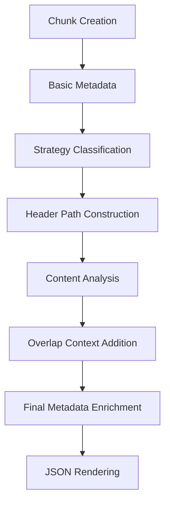
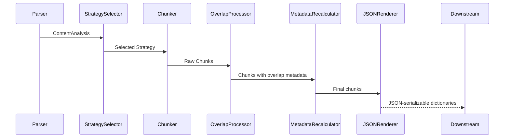
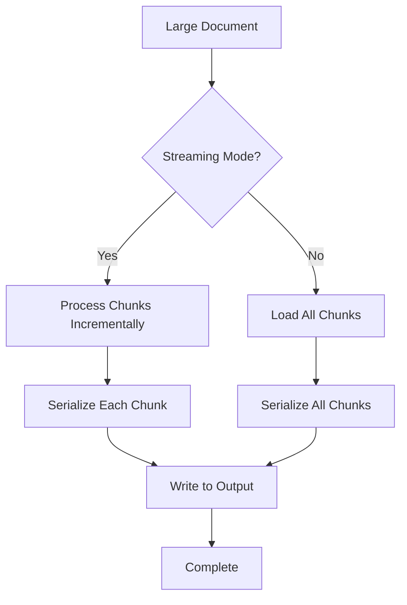

# JSON Renderer

<cite>
**Referenced Files in This Document**   
- [formatters.py](file://src/chunkana/renderers/formatters.py)
- [types.py](file://src/chunkana/types.py)
- [chunker.py](file://src/chunkana/chunker.py)
- [config.py](file://src/chunkana/config.py)
- [api.py](file://src/chunkana/api.py)
- [simple_text.jsonl](file://tests/baseline/golden_canonical/simple_text.jsonl)
- [code_heavy.jsonl](file://tests/baseline/golden_canonical/code_heavy.jsonl)
- [test_renderers.py](file://tests/unit/test_renderers.py)
- [renderers.md](file://docs/renderers.md)
</cite>

## Table of Contents
1. [Introduction](#introduction)
2. [Core Components](#core-components)
3. [JSON Output Schema](#json-output-schema)
4. [Metadata Enrichment Process](#metadata-enrichment-process)
5. [Hierarchical Relationships in Flat JSON](#hierarchical-relationships-in-flat-json)
6. [Integration with Chunking Pipeline](#integration-with-chunking-pipeline)
7. [Configuration Impact on Output](#configuration-impact-on-output)
8. [Usage Patterns in RAG Systems](#usage-patterns-in-rag-systems)
9. [Data Export Workflows](#data-export-workflows)
10. [Troubleshooting Schema Mismatches](#troubleshooting-schema-mismatches)
11. [Performance Considerations](#performance-considerations)

## Introduction
The JSON renderer in Chunkana serves as a critical component for producing structured, standardized output that enables seamless integration with downstream processing systems. This documentation provides comprehensive details about the JSON renderer's functionality, schema structure, and integration points within the chunking pipeline. The renderer converts semantic chunks of Markdown content into well-defined JSON objects that preserve both content and contextual metadata, making them suitable for retrieval-augmented generation (RAG) systems, data export workflows, and various downstream applications.

The JSON renderer operates as a pure function that transforms Chunk objects into dictionaries without modifying the original chunks. It serves as the foundation for other rendering formats and provides a round-trip safe serialization mechanism that maintains data integrity throughout the processing pipeline.

**Section sources**
- [formatters.py](file://src/chunkana/renderers/formatters.py#L1-L146)
- [renderers.md](file://docs/renderers.md#L1-L136)

## Core Components

The JSON renderer is implemented as the `render_json` function in the `formatters.py` module, which converts a list of Chunk objects into a list of dictionaries suitable for JSON serialization. This function serves as the primary mechanism for producing structured output from the chunking process.

The renderer leverages the `to_dict()` method of the Chunk class, which systematically extracts all relevant properties including content, line ranges, and metadata. The resulting dictionaries contain standardized fields that enable consistent processing across different applications and systems.

The implementation follows a functional programming approach, ensuring that the original Chunk objects remain unmodified during the rendering process. This design choice preserves data integrity and allows for multiple rendering operations on the same chunk set without side effects.

**Section sources**
- [formatters.py](file://src/chunkana/renderers/formatters.py#L15-L27)
- [types.py](file://src/chunkana/types.py#L240-L375)

## JSON Output Schema

The JSON output produced by the renderer follows a standardized schema with the following fields:

```json
{
  "content": "string",
  "start_line": "integer",
  "end_line": "integer",
  "size": "integer",
  "line_count": "integer",
  "metadata": "object"
}
```

**Field Descriptions:**
- **content**: The actual text content of the chunk, preserving the original Markdown formatting
- **start_line**: The starting line number (1-indexed) of the chunk in the source document
- **end_line**: The ending line number (1-indexed) of the chunk in the source document
- **size**: The character count of the chunk content
- **line_count**: The number of lines in the chunk
- **metadata**: An object containing additional contextual information about the chunk

The metadata object includes various fields that provide context about the chunk's origin and characteristics:
- **chunk_index**: Sequential index of the chunk in the document
- **strategy**: The chunking strategy that created this chunk
- **header_path**: Hierarchical path to the first header in the chunk (e.g., "/Level1/Level2")
- **header_level**: Level of the first header in the chunk (1-6)
- **content_type**: Classification of the chunk content ("text", "code", "table", "mixed", "preamble")
- **has_code**: Boolean indicating whether the chunk contains code blocks
- **previous_content**: Preview text from the previous chunk (when overlap is enabled)
- **next_content**: Preview text from the next chunk (when overlap is enabled)
- **overlap_size**: Size of the context window used for overlap metadata

**Section sources**
- [types.py](file://src/chunkana/types.py#L240-L375)
- [simple_text.jsonl](file://tests/baseline/golden_canonical/simple_text.jsonl#L1-L4)
- [code_heavy.jsonl](file://tests/baseline/golden_canonical/code_heavy.jsonl#L1-L2)

## Metadata Enrichment Process

The metadata enrichment process occurs throughout the chunking pipeline and is finalized during the JSON rendering phase. Metadata fields are populated at various stages of processing, creating a comprehensive context for each chunk.

During chunk creation, basic metadata is established including the chunking strategy, content type classification, and header hierarchy information. The `header_path` field is constructed by analyzing the document's header structure and creating a hierarchical path that represents the chunk's position within the document's outline.

As chunks progress through the pipeline, additional metadata is added:
- **Overlap context**: When overlap is enabled, `previous_content` and `next_content` fields are populated with preview text from adjacent chunks
- **Structural indicators**: Fields like `small_chunk` and `small_chunk_reason` are added to identify chunks that meet specific criteria
- **Content analysis**: Various content-specific flags and classifications are added based on the chunk's composition

The enrichment process ensures that each chunk carries sufficient context for downstream applications to understand its relationship to surrounding content and its role within the overall document structure.



**Diagram sources**
- [chunker.py](file://src/chunkana/chunker.py#L85-L176)
- [types.py](file://src/chunkana/types.py#L240-L375)

## Hierarchical Relationships in Flat JSON

Despite producing flat JSON objects, the renderer effectively represents hierarchical relationships through the `header_path` metadata field. This field encodes the document's hierarchical structure using a path-like format that mirrors directory paths in file systems.

The `header_path` follows the format "/Level1/Level2/Level3" where each segment corresponds to a header level in the document hierarchy. This approach allows flat JSON structures to maintain the parent-child relationships inherent in the original document structure.

For example, a chunk with `header_path` "/Introduction/Background/Technical Details" indicates that it belongs to the "Technical Details" section, which is a subsection of "Background", which itself is part of the "Introduction" section. This hierarchical encoding enables downstream systems to reconstruct the document's outline and understand the contextual relationships between chunks.

The renderer also includes the `header_level` field to indicate the depth of the primary header in the chunk, providing additional context about the chunk's position in the document hierarchy.

**Section sources**
- [types.py](file://src/chunkana/types.py#L260-L265)
- [headers_deep.jsonl](file://tests/baseline/golden_canonical/headers_deep.jsonl#L1-L5)

## Integration with Chunking Pipeline

The JSON renderer integrates seamlessly with the core chunking pipeline, serving as the final transformation step that prepares chunks for downstream consumption. The integration follows a linear pipeline architecture:



The renderer receives fully processed chunks from the chunking pipeline and converts them into dictionaries using the `to_dict()` method of the Chunk class. This method systematically extracts all relevant properties and formats them according to the standardized schema.

The integration is designed to be non-invasive, with the renderer operating as a pure function that does not modify the original chunks. This allows the same chunk set to be rendered in multiple formats or processed further without data loss.

**Diagram sources**
- [chunker.py](file://src/chunkana/chunker.py#L85-L176)
- [formatters.py](file://src/chunkana/renderers/formatters.py#L15-L27)

## Configuration Impact on Output

Configuration options significantly affect the structure and content of the JSON output. The `ChunkConfig` object controls various aspects of the chunking process that ultimately influence the rendered JSON.

Key configuration parameters and their impact:

- **max_chunk_size** and **min_chunk_size**: Determine the size boundaries for chunks, affecting how content is divided and consequently how many JSON objects are produced
- **overlap_size**: Controls whether `previous_content` and `next_content` fields are populated in the metadata
- **preserve_atomic_blocks**: Affects whether code blocks and tables are kept intact, influencing the `content_type` and structural characteristics of chunks
- **use_adaptive_sizing**: When enabled, adds adaptive sizing metadata to chunks, including `adaptive_size`, `content_complexity`, and `size_scale_factor`
- **enable_code_context_binding**: Influences metadata for code-related chunks, potentially adding context about related code blocks and explanations

The configuration also affects hierarchical representation through parameters like `include_document_summary`, which determines whether a root document-level chunk is created in hierarchical mode.

**Section sources**
- [config.py](file://src/chunkana/config.py#L17-L507)
- [chunker.py](file://src/chunkana/chunker.py#L48-L65)

## Usage Patterns in RAG Systems

The JSON renderer supports several key usage patterns in retrieval-augmented generation (RAG) systems:

**Semantic Search Integration:**
The structured JSON output enables efficient indexing in vector databases, with metadata fields providing valuable context for search relevance. The `header_path` and `content_type` fields allow for filtered searches based on document section or content category.

**Context Preservation:**
The overlap metadata (`previous_content` and `next_content`) helps language models understand chunk boundaries and maintain context across chunk boundaries. This is particularly valuable when processing long documents that exceed model context windows.

**Hierarchical Navigation:**
The `header_path` field enables hierarchical navigation and retrieval, allowing RAG systems to retrieve not just isolated chunks but entire sections or subsections of documents. This supports multi-level retrieval strategies that can provide both detailed information and broader context.

**Content Filtering:**
Metadata fields like `content_type` and `has_code` enable content-based filtering, allowing RAG systems to retrieve only chunks of specific types (e.g., only code examples or only text explanations).

**Section sources**
- [renderers.md](file://docs/renderers.md#L80-L102)
- [test_renderers.py](file://tests/unit/test_renderers.py#L1-L296)

## Data Export Workflows

The JSON renderer facilitates various data export workflows by providing a standardized, interoperable output format. The rendered JSON can be easily integrated into different data processing pipelines and storage systems.

**Round-trip Safety:**
The renderer ensures round-trip safety, meaning that chunks can be serialized to JSON and deserialized back to Chunk objects without data loss. This is validated by the `Chunk.from_dict()` and `Chunk.to_dict()` methods, which maintain data integrity throughout the serialization process.

**Streaming Export:**
For large documents, the renderer can be combined with streaming chunking to produce JSON output incrementally, minimizing memory usage. This enables efficient processing of documents that would otherwise exceed available memory.

**Format Conversion:**
The JSON output serves as an intermediate format that can be easily converted to other data interchange formats such as CSV, XML, or custom binary formats, supporting integration with legacy systems and specialized applications.

**Batch Processing:**
The renderer supports batch processing of multiple documents, producing JSON arrays that can be written to files or sent to message queues for distributed processing.

**Section sources**
- [formatters.py](file://src/chunkana/renderers/formatters.py#L15-L27)
- [api.py](file://src/chunkana/api.py#L18-L305)

## Troubleshooting Schema Mismatches

Common issues related to JSON schema mismatches and their solutions:

**Missing Required Fields:**
Ensure that all chunks have valid content and line numbers. The Chunk class validates these fields during initialization, preventing creation of invalid chunks.

**Metadata Field Inconsistencies:**
Verify that metadata enrichment is complete by checking that the `MetadataRecalculator` has processed all chunks. Incomplete processing may result in missing metadata fields.

**Type Mismatches:**
Ensure proper type handling during JSON serialization, particularly for numeric fields like line numbers and character counts. The renderer uses explicit type conversion to prevent string/number confusion.

**Unicode Encoding Issues:**
The renderer handles Unicode content correctly, but downstream systems must ensure proper encoding support. Use UTF-8 encoding for JSON files containing non-ASCII characters.

**Schema Evolution:**
When upgrading Chunkana versions, check for changes in the JSON schema. The system maintains backward compatibility for core fields, but new metadata fields may be added in newer versions.

**Section sources**
- [test_renderers.py](file://tests/unit/test_renderers.py#L64-L296)
- [types.py](file://src/chunkana/types.py#L240-L375)

## Performance Considerations

Several performance considerations are important when serializing large chunk sets:

**Memory Efficiency:**
For large documents, consider using streaming approaches to avoid loading all chunks into memory simultaneously. The combination of streaming chunking and incremental JSON serialization can significantly reduce memory footprint.

**Serialization Speed:**
The JSON rendering process is generally fast, but performance can be affected by chunk size and metadata complexity. For optimal performance, avoid excessive metadata fields and maintain reasonable chunk sizes.

**I/O Optimization:**
When writing JSON output to files, consider using buffered I/O operations to minimize disk access overhead. For very large outputs, streaming directly to compressed formats (e.g., JSONL with gzip) can save both time and storage space.

**Parallel Processing:**
For batch processing multiple documents, implement parallel processing to leverage multiple CPU cores. Each document can be chunked and rendered independently, enabling efficient scaling.

**Caching Strategies:**
Consider implementing caching for frequently accessed documents to avoid repeated chunking and rendering operations. The deterministic nature of the chunking process makes it well-suited for caching.



**Diagram sources**
- [chunker.py](file://src/chunkana/chunker.py#L249-L299)
- [formatters.py](file://src/chunkana/renderers/formatters.py#L15-L27)