# Renderer System Architecture

<cite>
**Referenced Files in This Document**   
- [formatters.py](file://src/chunkana/renderers/formatters.py)
- [chunker.py](file://src/chunkana/chunker.py)
- [types.py](file://src/chunkana/types.py)
- [config.py](file://src/chunkana/config.py)
- [api.py](file://src/chunkana/api.py)
- [__init__.py](file://src/chunkana/renderers/__init__.py)
- [renderers.md](file://docs/renderers.md)
- [test_renderers.py](file://tests/unit/test_renderers.py)
- [test_renderers.py](file://tests/property/test_renderers.py)
</cite>

## Table of Contents
1. [Introduction](#introduction)
2. [Core Components](#core-components)
3. [Architecture Overview](#architecture-overview)
4. [Renderer Interface Abstraction](#renderer-interface-abstraction)
5. [Renderer Selection and Configuration](#renderer-selection-and-configuration)
6. [Extensibility Mechanism](#extensibility-mechanism)
7. [Data Flow Analysis](#data-flow-analysis)
8. [Error Handling](#error-handling)
9. [Performance Characteristics](#performance-characteristics)
10. [Implementation Guidelines](#implementation-guidelines)
11. [Conclusion](#conclusion)

## Introduction

The renderer system in Chunkana provides a modular architecture for converting chunked markdown content into various output formats while maintaining a clean separation between the core chunking pipeline and output formatting. This system enables multiple output formats to be generated from a single chunking operation, supporting diverse integration requirements across different platforms and use cases.

The renderer system is designed around several key principles:
- **Immutability**: Renderers do not modify the original chunk objects, ensuring data integrity throughout the processing pipeline
- **Modularity**: Each renderer is implemented as a pure function, allowing for easy extension and composition
- **Configuration-driven**: Renderer selection and behavior are controlled through configuration parameters
- **Extensibility**: The system provides clear interfaces for adding custom renderers

This documentation provides a comprehensive analysis of the renderer system architecture, detailing its components, data flow, error handling mechanisms, and performance characteristics. It also includes implementation guidelines for developers who wish to extend the system with new output formats.

## Core Components

The renderer system consists of several core components that work together to transform chunked content into various output formats. These components include the renderer functions themselves, the chunk data structure, configuration system, and API interfaces.

The system's design follows a functional programming approach where renderers are pure functions that take chunk data as input and produce formatted output without side effects. This design ensures that the original chunk data remains unchanged, allowing multiple renderers to process the same data independently.

The renderer functions are organized in the `src/chunkana/renderers` module and include implementations for various output formats such as JSON, Dify-style metadata blocks, and overlap-embedded content. Each renderer function operates on a list of `Chunk` objects and returns formatted output in the appropriate format.

**Section sources**
- [formatters.py](file://src/chunkana/renderers/formatters.py)
- [types.py](file://src/chunkana/types.py)
- [__init__.py](file://src/chunkana/renderers/__init__.py)

## Architecture Overview

The renderer system architecture is built on a modular design that separates the chunking pipeline from the output formatting process. This separation allows for multiple output formats to be generated from a single chunking operation, providing flexibility for different integration scenarios.

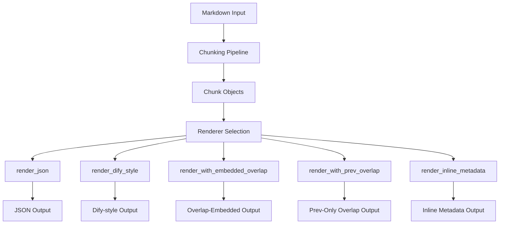

**Diagram sources **
- [formatters.py](file://src/chunkana/renderers/formatters.py)
- [chunker.py](file://src/chunkana/chunker.py)

The architecture follows a pipeline pattern where the input markdown is first processed by the chunking system to produce structured `Chunk` objects. These chunk objects contain both the content and associated metadata, including information about overlap with adjacent chunks. The renderer selection component then determines which renderer function to apply based on configuration or direct API calls.

Each renderer function transforms the chunk data into a specific output format without modifying the original data. This approach enables multiple renderers to process the same chunk data independently, supporting use cases where different output formats are needed simultaneously.

**Section sources**
- [formatters.py](file://src/chunkana/renderers/formatters.py)
- [chunker.py](file://src/chunkana/chunker.py)
- [types.py](file://src/chunkana/types.py)

## Renderer Interface Abstraction

The renderer system implements a clean interface abstraction between the core chunker and the various renderer functions. This abstraction is achieved through a consistent function signature and data contract that all renderers adhere to.

All renderer functions follow the same pattern: they accept a list of `Chunk` objects as input and return formatted output in the appropriate type (typically a list of strings or dictionaries). The `Chunk` class serves as the contract between the chunking system and the renderers, providing a stable interface that insulates renderers from changes in the chunking algorithm.

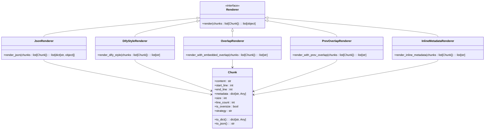

**Diagram sources **
- [types.py](file://src/chunkana/types.py)
- [formatters.py](file://src/chunkana/renderers/formatters.py)

The `Chunk` class provides several properties and methods that facilitate rendering:
- `content`: The actual text content of the chunk
- `start_line` and `end_line`: Line position in the source document
- `metadata`: Dictionary containing additional information about the chunk
- `size`: Character count of the content
- `line_count`: Number of lines in the chunk
- `is_oversize`: Flag indicating if the chunk exceeds the maximum size
- `strategy`: Name of the strategy that created the chunk
- `to_dict()`: Method to convert the chunk to a dictionary representation
- `to_json()`: Method to serialize the chunk to JSON

This interface abstraction allows renderers to access the information they need without being coupled to the internal implementation details of the chunking system. It also enables the addition of new renderers without requiring changes to the core chunking logic.

**Section sources**
- [types.py](file://src/chunkana/types.py)
- [formatters.py](file://src/chunkana/renderers/formatters.py)

## Renderer Selection and Configuration

Renderer functions are selected and invoked based on configuration parameters and API usage patterns. The system provides multiple mechanisms for selecting renderers, ranging from direct function calls to configuration-driven selection.

The primary method for renderer selection is through direct API calls. Applications can import specific renderer functions and apply them to chunked content:

```python
from chunkana import chunk_markdown
from chunkana.renderers import render_json, render_dify_style

# Chunk the markdown content
chunks = chunk_markdown(text)

# Apply different renderers
json_output = render_json(chunks)
dify_output = render_dify_style(chunks)
```

The system also supports configuration-driven renderer selection through the API functions in `api.py`. These functions provide convenience wrappers that handle both chunking and rendering:

```python
from chunkana import chunk_with_analysis

# This returns a ChunkingResult object that can be serialized
result = chunk_with_analysis(text)
# The result can be converted to JSON using its to_dict() method
json_output = result.to_dict()
```

Configuration parameters in `ChunkConfig` influence the data available to renderers, particularly regarding overlap behavior:

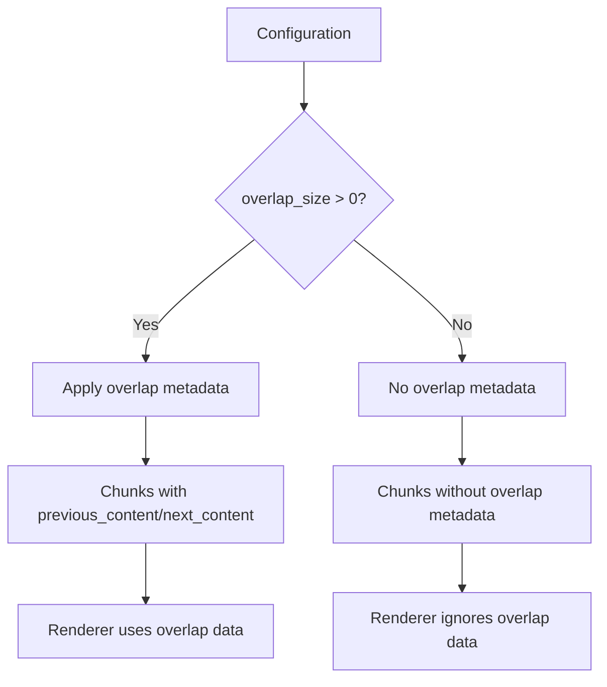

**Diagram sources **
- [config.py](file://src/chunkana/config.py)
- [chunker.py](file://src/chunkana/chunker.py)
- [formatters.py](file://src/chunkana/renderers/formatters.py)

The `overlap_size` parameter in `ChunkConfig` determines whether overlap metadata is generated during chunking. When `overlap_size > 0`, the chunking process adds `previous_content` and `next_content` fields to the chunk metadata, which renderers can then use to generate overlap-aware output.

The renderer selection process follows these steps:
1. Content is chunked using the configured strategy
2. Overlap metadata is added if `overlap_size > 0`
3. Application code selects the appropriate renderer function
4. The selected renderer processes the chunks and generates output

This approach provides flexibility in renderer selection while maintaining a clear separation between the chunking logic and output formatting.

**Section sources**
- [config.py](file://src/chunkana/config.py)
- [chunker.py](file://src/chunkana/chunker.py)
- [api.py](file://src/chunkana/api.py)
- [formatters.py](file://src/chunkana/renderers/formatters.py)

## Extensibility Mechanism

The renderer system provides a straightforward extensibility mechanism that allows users to register custom renderers. This extensibility is achieved through the modular design of the renderers module and the consistent function signature used by all renderer functions.

To create a custom renderer, users need to implement a function that follows the same pattern as the built-in renderers:

```python
def custom_renderer(chunks: list[Chunk]) -> list[str]:
    """
    Custom renderer function.
    
    Args:
        chunks: List of Chunk objects
        
    Returns:
        List of formatted strings
    """
    result = []
    for chunk in chunks:
        # Custom formatting logic here
        formatted = f"Custom: {chunk.content}"
        result.append(formatted)
    return result
```

The extensibility mechanism is supported by several design features:

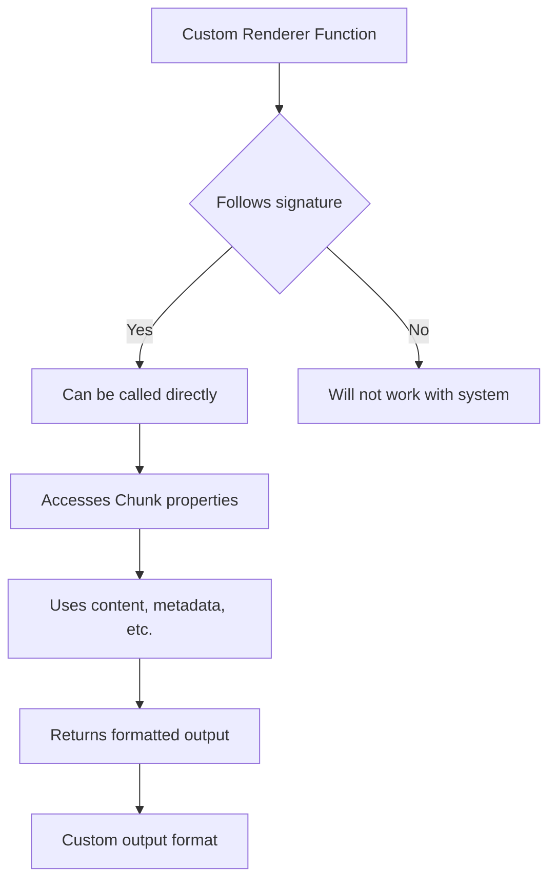

**Diagram sources **
- [formatters.py](file://src/chunkana/renderers/formatters.py)
- [types.py](file://src/chunkana/types.py)

Key aspects of the extensibility mechanism include:

1. **Function Signature**: Custom renderers must accept a list of `Chunk` objects and return a list of the appropriate output type (usually strings or dictionaries).

2. **Chunk Interface**: Custom renderers can access all properties and methods of the `Chunk` class, including content, metadata, and helper methods.

3. **Immutability**: Custom renderers should not modify the original chunk objects, maintaining the system's principle of data integrity.

4. **Error Handling**: Custom renderers should handle potential errors gracefully, particularly when expected metadata fields are missing.

5. **Type Hints**: Using proper type hints helps ensure compatibility with the rest of the system.

The system does not require explicit registration of custom renderers. Instead, users can simply define their renderer functions and call them directly on chunked content. This approach reduces complexity and makes it easy to experiment with different output formats.

For users who want to integrate custom renderers more deeply into their applications, they can create wrapper functions or classes that combine chunking and rendering:

```python
def process_with_custom_renderer(text: str) -> list[str]:
    """Process text with custom rendering."""
    chunks = chunk_markdown(text)
    return custom_renderer(chunks)
```

This extensibility mechanism allows the system to adapt to new requirements and integration scenarios without modifying the core codebase.

**Section sources**
- [formatters.py](file://src/chunkana/renderers/formatters.py)
- [types.py](file://src/chunkana/types.py)
- [renderers.md](file://docs/renderers.md)

## Data Flow Analysis

The data flow in the renderer system follows a clear pipeline from input markdown to final serialized output. This section analyzes the data flow for both hierarchical and flat chunk results, illustrating how data is transformed at each stage.

### Flat Chunk Data Flow

For flat chunking, the data flow follows a linear pipeline:

```mermaid
flowchart LR
A[Raw Markdown] --> B[Parse]
B --> C[Analyze Content]
C --> D[Select Strategy]
D --> E[Apply Chunking]
E --> F[Merge Small Chunks]
F --> G[Apply Overlap]
G --> H[Add Metadata]
H --> I[Validate]
I --> J[Chunk Objects]
J --> K[Select Renderer]
K --> L[Format Output]
L --> M[Final Output]
```

**Diagram sources **
- [chunker.py](file://src/chunkana/chunker.py)
- [formatters.py](file://src/chunkana/renderers/formatters.py)

### Hierarchical Chunk Data Flow

For hierarchical chunking, an additional step constructs the parent-child relationships:

```mermaid
flowchart LR
A[Raw Markdown] --> B[Parse]
B --> C[Analyze Content]
C --> D[Select Strategy]
D --> E[Apply Chunking]
E --> F[Merge Small Chunks]
F --> G[Apply Overlap]
G --> H[Add Metadata]
H --> I[Validate]
I --> J[Chunk Objects]
J --> K[Build Hierarchy]
K --> L[Hierarchical Result]
L --> M[Select Renderer]
M --> N[Format Output]
N --> O[Final Output]
```

**Diagram sources **
- [chunker.py](file://src/chunkana/chunker.py)
- [hierarchy.py](file://src/chunkana/hierarchy.py)
- [formatters.py](file://src/chunkana/renderers/formatters.py)

### Detailed Data Transformation

The data transformation process can be analyzed at the chunk level, showing how metadata evolves through the pipeline:

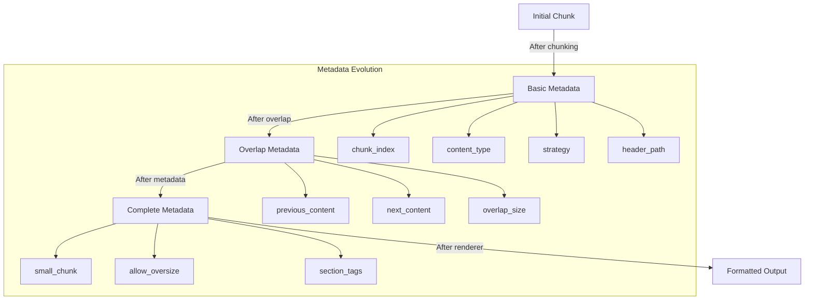

**Diagram sources **
- [chunker.py](file://src/chunkana/chunker.py)
- [types.py](file://src/chunkana/types.py)

The data flow begins with raw markdown text, which is parsed and analyzed to understand its structure and content characteristics. Based on this analysis, a chunking strategy is selected and applied to divide the content into manageable chunks.

After the initial chunking, several post-processing steps enhance the chunks with additional information:
- Small chunks are merged with adjacent chunks when possible
- Overlap metadata is added to provide context from neighboring chunks
- Standard metadata fields are added to each chunk
- Derived metadata is recalculated based on the final chunk structure

For hierarchical chunking, an additional step constructs parent-child relationships between chunks based on their header structure, creating a tree-like organization of the content.

Finally, the appropriate renderer is selected and applied to transform the chunked data into the desired output format. The renderer accesses the chunk data through the defined interface, formatting it according to its specific requirements.

This data flow ensures that all necessary information is available to the renderers while maintaining a clean separation between the chunking logic and output formatting.

**Section sources**
- [chunker.py](file://src/chunkana/chunker.py)
- [formatters.py](file://src/chunkana/renderers/formatters.py)
- [types.py](file://src/chunkana/types.py)

## Error Handling

The renderer system includes comprehensive error handling mechanisms to address potential issues during rendering, such as serialization failures or invalid data types. These mechanisms are designed to ensure robust operation even when encountering unexpected data.

### Error Types and Handling

The system handles several types of errors that may occur during rendering:

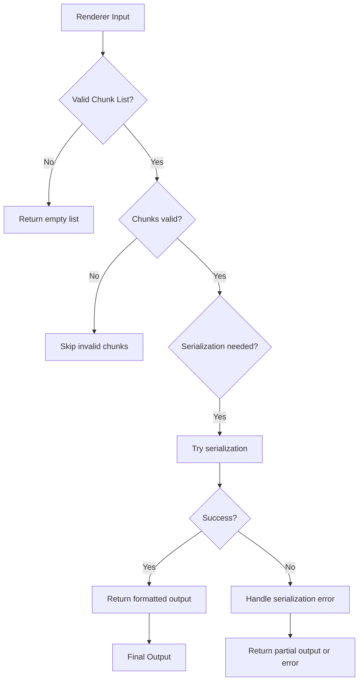

**Diagram sources **
- [formatters.py](file://src/chunkana/renderers/formatters.py)
- [types.py](file://src/chunkana/types.py)

### Specific Error Handling Scenarios

#### Serialization Failures

When rendering to JSON or other serialized formats, the system handles serialization errors gracefully:

```python
def render_json(chunks: list["Chunk"]) -> list[dict[str, object]]:
    """Convert chunks to list of dictionaries."""
    return [chunk.to_dict() for chunk in chunks]
```

The `to_dict()` method on the `Chunk` class handles the conversion of chunk data to a serializable format. If serialization fails for a particular chunk, the list comprehension will raise an exception, which should be handled by the calling code.

#### Invalid Data Types

The renderer system handles missing or invalid data types in chunk metadata:

```python
def render_with_embedded_overlap(chunks: list["Chunk"]) -> list[str]:
    """Render chunks with bidirectional overlap embedded into content string."""
    result = []
    for chunk in chunks:
        parts = []
        prev = chunk.metadata.get("previous_content", "")
        next_ = chunk.metadata.get("next_content", "")
        if prev:
            parts.append(prev)
        parts.append(chunk.content)
        if next_:
            parts.append(next_)
        result.append("\n".join(parts))
    return result
```

This function uses the `get()` method with default values to handle missing metadata fields, ensuring that the renderer can process chunks even when expected metadata is absent.

#### Empty Input

All renderers handle empty input lists gracefully:

```python
def render_json(chunks: list["Chunk"]) -> list[dict[str, object]]:
    """Convert chunks to list of dictionaries."""
    return [chunk.to_dict() for chunk in chunks]
```

When given an empty list, this function returns an empty list rather than raising an error.

### Exception Classes

The system defines several exception classes in `exceptions.py` to handle different error categories:

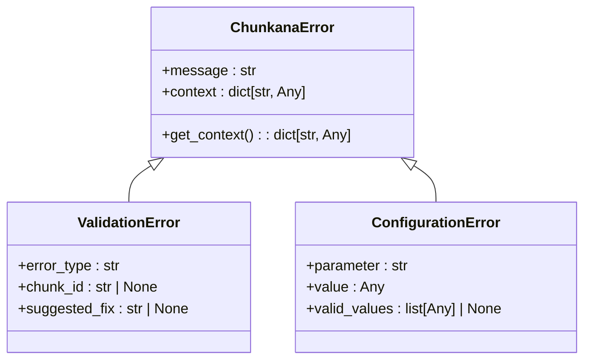

**Diagram sources **
- [exceptions.py](file://src/chunkana/exceptions.py)

These exception classes provide actionable error messages and debugging context, helping users diagnose and resolve issues. The base `ChunkanaError` class includes a context dictionary that can contain additional information for debugging.

The error handling strategy prioritizes robustness and usability:
- Renderers fail gracefully when possible, returning partial results rather than failing completely
- Clear error messages help users understand what went wrong
- Context information aids in debugging complex issues
- Default values are used for missing metadata to prevent cascading failures

This approach ensures that the renderer system can handle real-world data variations while providing useful feedback when issues do occur.

**Section sources**
- [formatters.py](file://src/chunkana/renderers/formatters.py)
- [exceptions.py](file://src/chunkana/exceptions.py)
- [types.py](file://src/chunkana/types.py)

## Performance Characteristics

The renderer system is designed with performance and memory efficiency in mind, particularly when processing large documents. This section analyzes the performance characteristics and memory usage patterns of the system.

### Time Complexity Analysis

The time complexity of the renderer functions varies depending on the specific renderer and input size:

```mermaid
graph TD
A[Time Complexity] --> B[O(n) Renderers]
A --> C[O(n*m) Renderers]
B --> D[render_json]
B --> E[render_with_prev_overlap]
B --> F[render_inline_metadata]
C --> G[render_dify_style]
C --> H[render_with_embedded_overlap]
D --> I["O(n) - linear in number of chunks"]
E --> I
F --> I
G --> J["O(n*m) - linear in chunks, m is metadata size"]
H --> J
```

**Diagram sources **
- [formatters.py](file://src/chunkana/renderers/formatters.py)

Most renderer functions have O(n) time complexity, where n is the number of chunks. The `render_json` function, for example, iterates through each chunk once to convert it to a dictionary representation. Similarly, `render_with_prev_overlap` processes each chunk once to add previous overlap content.

Renderers that involve JSON serialization of metadata, such as `render_dify_style`, have O(n*m) complexity where m is the average size of the metadata. This is because JSON serialization time depends on the size of the data being serialized.

### Memory Usage Patterns

The memory usage of the renderer system follows predictable patterns based on the input size and renderer type:

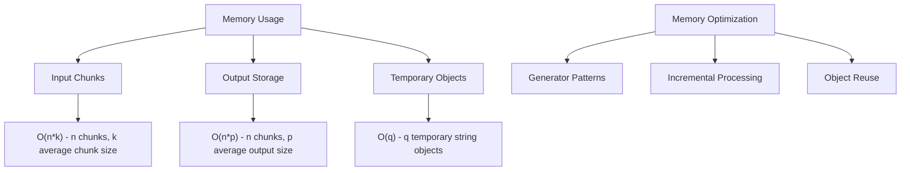

**Diagram sources **
- [formatters.py](file://src/chunkana/renderers/formatters.py)
- [chunker.py](file://src/chunkana/chunker.py)

The system's memory usage consists of three main components:
1. Input chunks: The memory required to store the input chunk objects
2. Output storage: The memory required to store the formatted output
3. Temporary objects: Memory used during processing for intermediate results

For large documents, the system can potentially double memory usage during rendering, as both the input chunks and output strings are stored in memory simultaneously. However, this can be mitigated by processing chunks incrementally or using generator patterns.

### Performance Optimizations

The renderer system includes several performance optimizations:

1. **Efficient String Operations**: The system uses efficient string concatenation methods, such as `join()`, to minimize memory allocations.

2. **Lazy Evaluation**: Some operations are performed only when needed, reducing unnecessary computation.

3. **Caching**: Frequently accessed data is cached to avoid recomputation.

4. **Batch Processing**: Operations are performed in batches when possible to reduce overhead.

### Scalability Considerations

When rendering large documents, the following considerations apply:

- **Memory**: The system's memory usage scales linearly with document size. For very large documents, streaming or incremental processing may be necessary.
- **Processing Time**: Rendering time scales linearly with the number of chunks, making it predictable for large documents.
- **I/O**: For file-based operations, I/O can become a bottleneck, particularly when writing large output files.
- **Serialization**: JSON serialization can be a significant cost for renderers that include metadata, particularly when metadata is large.

The system performs well for typical document sizes, with rendering time dominated by the chunking process rather than the rendering itself. For extremely large documents, the bottleneck is typically the initial parsing and chunking rather than the rendering step.

**Section sources**
- [formatters.py](file://src/chunkana/renderers/formatters.py)
- [chunker.py](file://src/chunkana/chunker.py)
- [types.py](file://src/chunkana/types.py)

## Implementation Guidelines

This section provides implementation guidelines for developers extending the renderer system with new formats. These guidelines cover best practices for creating custom renderers that integrate seamlessly with the existing system.

### Creating Custom Renderers

When implementing a new renderer, follow these guidelines:

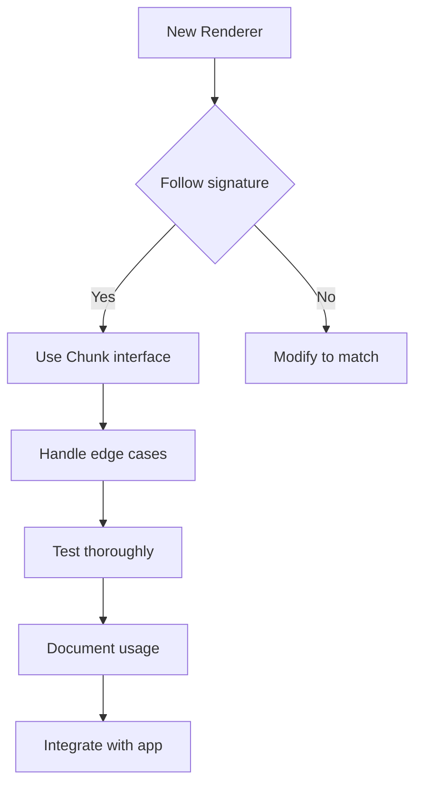

**Diagram sources **
- [formatters.py](file://src/chunkana/renderers/formatters.py)

1. **Function Signature**: Ensure your renderer function has the same signature as the built-in renderers:
   ```python
   def my_renderer(chunks: list[Chunk]) -> list[str]:
       # Implementation
   ```

2. **Use the Chunk Interface**: Access chunk data through the defined properties and methods rather than directly accessing internal attributes.

3. **Handle Missing Data**: Use default values and safe access patterns for metadata fields that may be missing:
   ```python
   prev = chunk.metadata.get("previous_content", "")
   ```

4. **Preserve Immutability**: Do not modify the original chunk objects. The renderer should be a pure function with no side effects.

5. **Handle Edge Cases**: Test your renderer with empty input, single chunks, and chunks with minimal content.

6. **Error Handling**: Implement graceful error handling, particularly for serialization operations.

7. **Performance**: Optimize string operations and avoid unnecessary data copying.

8. **Documentation**: Provide clear documentation for your renderer's behavior and output format.

### Example Implementation

Here's an example of implementing a custom renderer:

```python
def render_markdown_with_annotations(chunks: list[Chunk]) -> list[str]:
    """
    Render chunks with markdown annotations for context.
    
    Each chunk is formatted with:
    - A header indicating the chunk index and type
    - The content with context annotations
    - Metadata as a collapsible section
    
    Args:
        chunks: List of Chunk objects
        
    Returns:
        List of formatted markdown strings
    """
    result = []
    for i, chunk in enumerate(chunks):
        # Build header
        header_parts = [f"## Chunk {i}"]
        if "content_type" in chunk.metadata:
            header_parts.append(f"({chunk.metadata['content_type']})")
        header = " ".join(header_parts)
        
        # Build content with context
        content_parts = []
        prev = chunk.metadata.get("previous_content", "")
        if prev:
            content_parts.append(f"> Context from previous: {prev[:50]}...")
        
        content_parts.append(chunk.content)
        
        next_ = chunk.metadata.get("next_content", "")
        if next_:
            content_parts.append(f"> Context to next: {next_[:50]}...")
        
        content = "\n\n".join(content_parts)
        
        # Build metadata section
        metadata_lines = ["<details>", "<summary>Metadata</summary>", ""]
        
        # Sort metadata keys for consistent output
        for key in sorted(chunk.metadata.keys()):
            value = chunk.metadata[key]
            metadata_lines.append(f"- {key}: {value}")
        
        metadata_lines.extend(["", "</details>"])
        metadata_section = "\n".join(metadata_lines)
        
        # Combine all parts
        full_output = "\n\n".join([header, content, metadata_section])
        result.append(full_output)
    
    return result
```

### Integration Patterns

Custom renderers can be integrated into applications in several ways:

1. **Direct Usage**: Import and call the renderer function directly:
   ```python
   from my_renderers import render_markdown_with_annotations
   
   chunks = chunk_markdown(text)
   output = render_markdown_with_annotations(chunks)
   ```

2. **Wrapper Functions**: Create convenience functions that combine chunking and rendering:
   ```python
   def process_with_annotation_renderer(text: str) -> list[str]:
       chunks = chunk_markdown(text)
       return render_markdown_with_annotations(chunks)
   ```

3. **Configuration-Driven**: Add configuration options to select custom renderers:
   ```python
   RENDERER_MAP = {
       "json": render_json,
       "dify": render_dify_style,
       "annotations": render_markdown_with_annotations,
   }
   
   def render_with_config(chunks: list[Chunk], config: dict) -> list[str]:
       renderer_name = config.get("renderer", "json")
       renderer = RENDERER_MAP.get(renderer_name, render_json)
       return renderer(chunks)
   ```

4. **Plugin Architecture**: Implement a plugin system that discovers and loads custom renderers:
   ```python
   # In __init__.py
   from . import formatters
   from . import my_custom_renderers
   
   __all__ = [
       # ... existing exports
       "render_markdown_with_annotations",
   ]
   ```

Following these guidelines ensures that custom renderers integrate smoothly with the existing system and can be used effectively in various applications.

**Section sources**
- [formatters.py](file://src/chunkana/renderers/formatters.py)
- [renderers.md](file://docs/renderers.md)
- [test_renderers.py](file://tests/unit/test_renderers.py)

## Conclusion

The renderer system in Chunkana provides a robust, modular architecture for generating multiple output formats from a single chunking pipeline. Its design emphasizes separation of concerns, immutability, and extensibility, making it adaptable to various integration requirements.

Key architectural features include:
- Clean interface abstraction between the core chunker and renderers
- Configuration-driven renderer selection
- Straightforward extensibility mechanism for custom formats
- Comprehensive error handling for robust operation
- Efficient performance characteristics for large documents

The system's modular design allows developers to create new renderers that integrate seamlessly with the existing codebase. By following the implementation guidelines, custom renderers can be developed to support new output formats while maintaining compatibility with the core system.

The renderer system effectively addresses the requirements for flexible output formatting in document processing applications. Its combination of simplicity, performance, and extensibility makes it well-suited for a wide range of use cases, from simple JSON serialization to complex, context-aware formatting for AI applications.

Future enhancements could include additional built-in renderers, improved performance for very large documents, and enhanced configuration options for fine-tuning renderer behavior. However, the current architecture provides a solid foundation that can accommodate these improvements without requiring major changes to the core design.