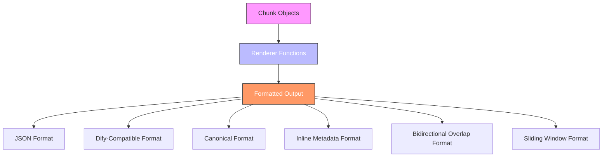
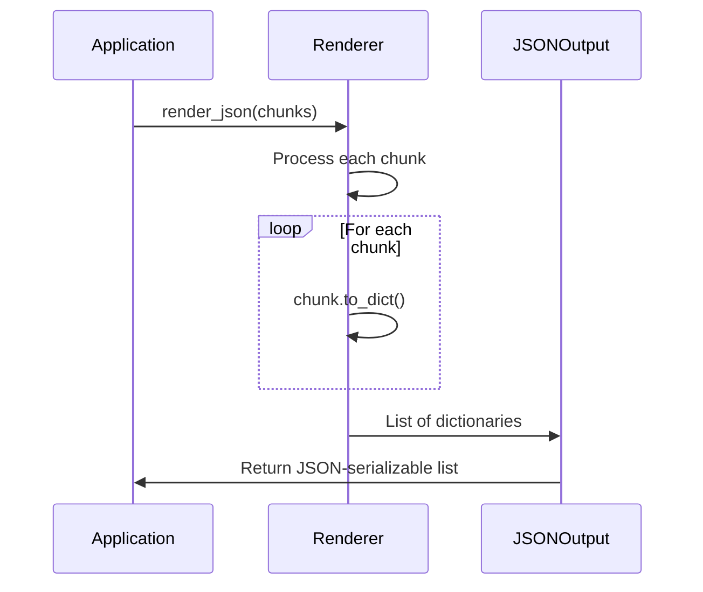
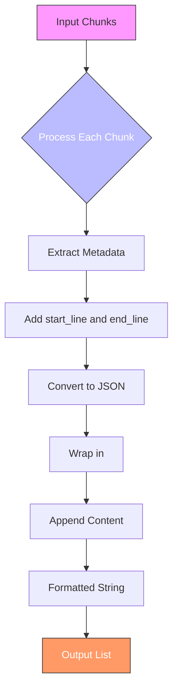
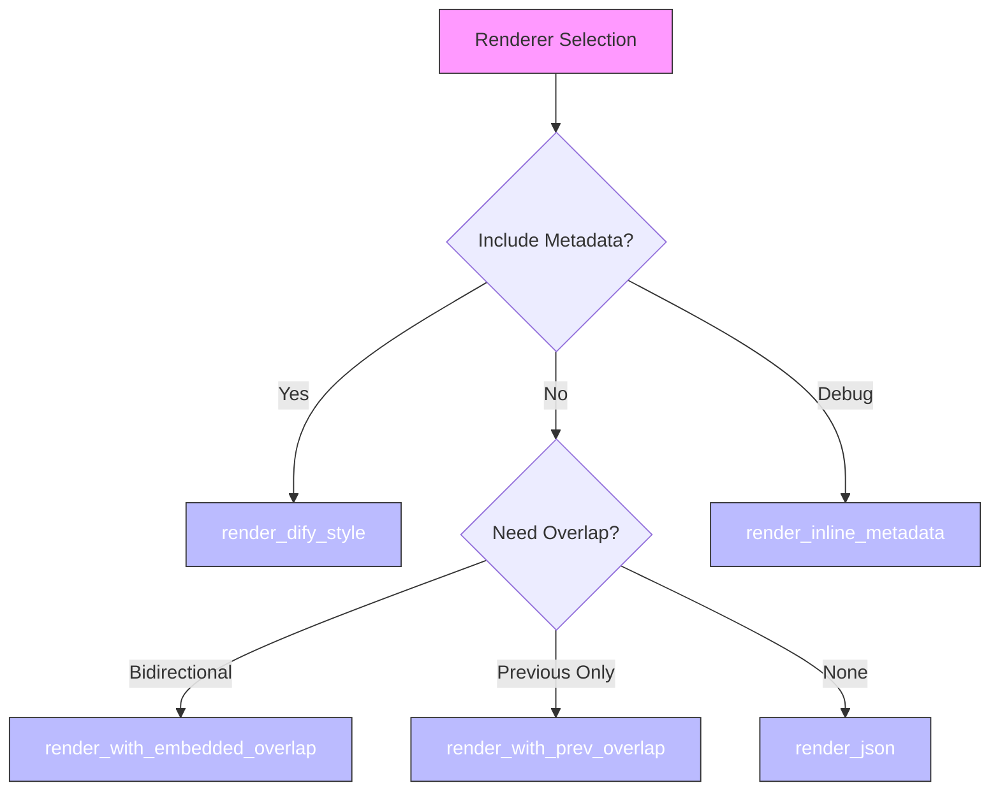

# Renderers and Output Formats

<cite>
**Referenced Files in This Document**   
- [formatters.py](file://src/chunkana/renderers/formatters.py)
- [types.py](file://src/chunkana/types.py)
- [api.py](file://src/chunkana/api.py)
- [__init__.py](file://src/chunkana/renderers/__init__.py)
- [renderers.md](file://docs/renderers.md)
- [dify.md](file://docs/integrations/dify.md)
- [test_renderers.py](file://tests/unit/test_renderers.py)
- [test_renderer_compatibility.py](file://tests/baseline/test_renderer_compatibility.py)
- [simple_text.jsonl](file://tests/baseline/golden_canonical/simple_text.jsonl)
- [simple_text.jsonl](file://tests/baseline/golden_dify_style/simple_text.jsonl)
</cite>

## Table of Contents
1. [Introduction](#introduction)
2. [Renderer System Design](#renderer-system-design)
3. [JSON Renderer](#json-renderer)
4. [Dify-Compatible Renderer](#dify-compatible-renderer)
5. [Canonical Format](#canonical-format)
6. [Other Renderers](#other-renderers)
7. [Output Format Structure](#output-format-structure)
8. [Examples of Rendered Output](#examples-of-rendered-output)
9. [Using Renderers with Hierarchical Results](#using-renderers-with-hierarchical-results)
10. [Renderer Selection Guide](#renderer-selection-guide)

## Introduction

Chunkana's renderer system transforms chunked content into various representations suitable for different integration scenarios. The system provides multiple output formats while maintaining the integrity of the original chunks. Renderers are pure functions that format output without modifying the underlying Chunk objects, ensuring consistent and predictable behavior across different use cases.

The renderer system supports several key formats: JSON for structured data exchange, Dify-compatible format for AI platform integration, and canonical format for testing and debugging. Each renderer serves a specific purpose and is designed to work seamlessly with Chunkana's chunking strategies and hierarchical processing capabilities.

**Section sources**
- [formatters.py](file://src/chunkana/renderers/formatters.py#L1-L146)
- [renderers.md](file://docs/renderers.md#L1-L136)

## Renderer System Design

The renderer system in Chunkana is designed as a collection of pure functions that take a list of Chunk objects and return formatted output. This design ensures that renderers do not modify the original chunks, preserving data integrity throughout the processing pipeline. The system follows a functional programming approach, where each renderer is a stateless transformation function.

All renderers are implemented in the `src/chunkana/renderers/formatters.py` module and exposed through the `src/chunkana/renderers/__init__.py` interface. The system is extensible, allowing new renderers to be added by implementing additional formatting functions that follow the same pattern: accepting a list of chunks and returning the appropriately formatted output.

The renderer system maintains several important invariants:
- **Immutability**: Renderers never modify Chunk objects
- **Unicode safety**: All renderers handle Unicode characters correctly
- **Determinism**: Identical input always produces identical output
- **Empty overlap handling**: Missing overlap metadata is handled gracefully

This design enables reliable testing and ensures consistent behavior across different environments and integration scenarios.



**Diagram sources **
- [formatters.py](file://src/chunkana/renderers/formatters.py#L1-L146)
- [__init__.py](file://src/chunkana/renderers/__init__.py#L1-L23)

**Section sources**
- [formatters.py](file://src/chunkana/renderers/formatters.py#L1-L146)
- [__init__.py](file://src/chunkana/renderers/__init__.py#L1-L23)

## JSON Renderer

The JSON renderer (`render_json`) converts chunks to a list of dictionaries suitable for structured data exchange. This format is ideal for API responses, data serialization, and interoperability with other systems that expect JSON input. The renderer produces output that is round-trip safe, meaning chunks can be reconstructed from the JSON representation without data loss.

Each dictionary in the output list contains the chunk's content, start and end line numbers, size, line count, and metadata. The `to_dict()` method of the Chunk class (defined in `types.py`) handles the conversion, ensuring all required fields are included. The JSON renderer is particularly useful for applications that need to transmit chunked data over networks or store it in databases.

The renderer maintains compatibility with the canonical format used in testing, producing output that matches the golden canonical files in the test suite. This ensures consistency between development, testing, and production environments.



**Diagram sources **
- [formatters.py](file://src/chunkana/renderers/formatters.py#L15-L27)
- [types.py](file://src/chunkana/types.py#L329-L338)

**Section sources**
- [formatters.py](file://src/chunkana/renderers/formatters.py#L15-L27)
- [types.py](file://src/chunkana/types.py#L329-L338)

## Dify-Compatible Renderer

The Dify-compatible renderer (`render_dify_style`) formats chunks with `<metadata>` blocks that contain JSON metadata followed by the actual content. This format matches the output of the Dify markdown chunker plugin when `include_metadata=True`, enabling seamless migration from the plugin to Chunkana.

The renderer includes both the chunk's metadata and line number information (start_line and end_line) in the metadata block. This comprehensive metadata enables Dify workflows to maintain context about the chunk's position in the original document. The format is byte-for-byte identical to the plugin output, as verified by baseline tests in `test_renderer_compatibility.py`.

For integration with Dify, this renderer should be used when the workflow requires metadata to be included with each chunk. It's particularly useful for applications that need to preserve document structure and context for retrieval-augmented generation (RAG) systems.



**Diagram sources **
- [formatters.py](file://src/chunkana/renderers/formatters.py#L56-L84)
- [dify.md](file://docs/integrations/dify.md#L1-L126)

**Section sources**
- [formatters.py](file://src/chunkana/renderers/formatters.py#L56-L84)
- [dify.md](file://docs/integrations/dify.md#L1-L126)

## Canonical Format

The canonical format represents the standard, unmodified chunk output used for testing and debugging. This format is stored in JSONL files in the `tests/baseline/golden_canonical/` directory and serves as the source of truth for chunking behavior. The canonical format preserves all chunk properties exactly as they are produced by the chunking process.

Each line in a canonical JSONL file contains a JSON representation of a single chunk, including its content, line numbers, and metadata. This format enables precise comparison between Chunkana's output and the reference implementation, ensuring functional parity. The canonical format is used in the `test_canonical.py` test suite to verify that Chunkana produces identical output to the original plugin.

The canonical format is particularly valuable for regression testing, as it captures the exact structure and content of chunks, including whitespace and line endings. This level of precision ensures that any changes to the chunking algorithm can be thoroughly validated against the expected output.

**Section sources**
- [simple_text.jsonl](file://tests/baseline/golden_canonical/simple_text.jsonl#L1-L4)
- [test_canonical.py](file://tests/baseline/test_canonical.py#L1-L158)

## Other Renderers

In addition to the JSON and Dify-compatible renderers, Chunkana provides several other rendering options for specialized use cases:

- **`render_with_embedded_overlap`**: Produces output with bidirectional overlap embedded in the content string. This format includes previous_content and next_content from metadata, creating a "rich context" mode suitable for RAG systems that benefit from overlapping context.

- **`render_with_prev_overlap`**: Generates output with only previous overlap embedded (sliding window style). This format is useful when you need context from the preceding chunk but want to avoid including future content.

- **`render_inline_metadata`**: Embeds metadata as inline comments at the start of content. This format is particularly useful for debugging and inspection, as it makes metadata visible within the text content.

Each of these renderers serves a specific purpose and can be selected based on the requirements of the target integration. The choice of renderer depends on whether you need metadata included, how much contextual overlap is required, and the specific format expected by the consuming system.



**Diagram sources **
- [formatters.py](file://src/chunkana/renderers/formatters.py#L87-L145)
- [renderers.md](file://docs/renderers.md#L80-L102)

**Section sources**
- [formatters.py](file://src/chunkana/renderers/formatters.py#L87-L145)
- [renderers.md](file://docs/renderers.md#L80-L102)

## Output Format Structure

The structure of each output format is designed to meet specific integration requirements while maintaining consistency across the renderer system. All formats preserve the fundamental properties of chunks, including content, line numbers, and metadata, but present them in different arrangements.

The JSON format uses a structured dictionary approach with clearly defined fields for content, line numbers, and metadata. The Dify-compatible format wraps metadata in XML-like tags with JSON content, making it easily parsable while maintaining human readability. The canonical format follows the JSON structure but is stored in JSONL format for efficient processing of large datasets.

Each format handles metadata inclusion differently:
- JSON renderer includes metadata as a nested dictionary
- Dify-compatible renderer includes metadata in a tagged block with additional line number information
- Overlap renderers include metadata-derived content directly in the output string
- Inline metadata renderer includes metadata as a comment at the start of content

The structure of these formats ensures that consumers can reliably parse and utilize the chunked content according to their specific needs.

**Section sources**
- [formatters.py](file://src/chunkana/renderers/formatters.py#L1-L146)
- [types.py](file://src/chunkana/types.py#L240-L375)

## Examples of Rendered Output

The following examples demonstrate how the same input document is rendered in different formats. Using the `simple_text.md` fixture, we can see the output differences:

For the JSON renderer, the output is a list of dictionaries:
```json
[
  {
    "content": "# Simple Document\n\nThis is a simple document...",
    "start_line": 1,
    "end_line": 13,
    "size": 245,
    "line_count": 13,
    "metadata": {
      "strategy": "structural",
      "content_type": "section",
      "header_path": "/Simple Document",
      "chunk_index": 0,
      "has_code": false
    }
  }
]
```

For the Dify-compatible renderer, the output includes metadata tags:
```
<metadata>
{
  "strategy": "structural",
  "content_type": "section",
  "header_path": "/Simple Document",
  "chunk_index": 0,
  "has_code": false,
  "start_line": 1,
  "end_line": 13
}
</metadata>
# Simple Document

This is a simple document...
```

For the bidirectional overlap renderer, the output embeds context:
```
# Simple Document

This is a simple document...
[previous_content from next chunk]...concluding remarks.
```

These examples illustrate how the same underlying chunk data can be presented in different ways to suit various integration requirements.

**Section sources**
- [simple_text.jsonl](file://tests/baseline/golden_canonical/simple_text.jsonl#L1-L4)
- [simple_text.jsonl](file://tests/baseline/golden_dify_style/simple_text.jsonl#L1-L4)

## Using Renderers with Hierarchical Results

Renderers can be used with both flat and hierarchical chunking results. When working with hierarchical results from `chunk_hierarchical()`, you can apply renderers to different levels of the hierarchy depending on your needs.

For leaf-node processing, extract the flat chunks using `get_flat_chunks()` and apply the desired renderer:
```python
result = chunk_hierarchical(text)
leaf_chunks = result.get_flat_chunks()
formatted_output = render_dify_style(leaf_chunks)
```

For full hierarchy processing, use `get_all_chunks()` to include parent and intermediate nodes:
```python
all_chunks = result.get_all_chunks()
formatted_output = render_json(all_chunks)
```

This flexibility allows you to choose whether to process only the content-bearing leaf chunks or to include the structural hierarchy in your output. The renderer system works identically with both flat and hierarchical chunk lists, ensuring consistent formatting regardless of the source.

**Section sources**
- [api.py](file://src/chunkana/api.py#L273-L304)
- [dify.md](file://docs/integrations/dify.md#L87-L103)

## Renderer Selection Guide

Choosing the appropriate renderer depends on your specific integration scenario:

| Use Case | Recommended Renderer |
|----------|---------------------|
| Dify plugin with metadata | `render_dify_style` |
| Dify plugin without metadata | `render_with_embedded_overlap` |
| JSON API output | `render_json` |
| RAG with bidirectional context | `render_with_embedded_overlap` |
| RAG with sliding window | `render_with_prev_overlap` |
| Debugging and inspection | `render_inline_metadata` |

The decision tree for renderer selection is straightforward:
```
Need output for Dify plugin?
├── Yes, with metadata → render_dify_style()
├── Yes, without metadata → render_with_embedded_overlap()
└── No
    ├── Need JSON/dict → render_json()
    ├── Need bidirectional context → render_with_embedded_overlap()
    ├── Need sliding window → render_with_prev_overlap()
    └── Need inline metadata → render_inline_metadata()
```

This guide helps ensure you select the most appropriate renderer for your specific use case, balancing the need for metadata, contextual overlap, and format compatibility.

**Section sources**
- [renderers.md](file://docs/renderers.md#L80-L102)
- [dify.md](file://docs/integrations/dify.md#L22-L31)