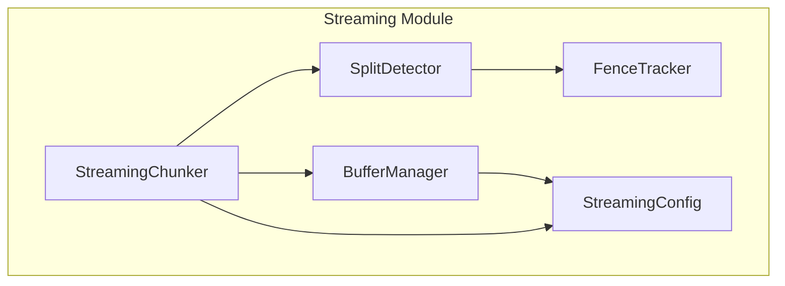
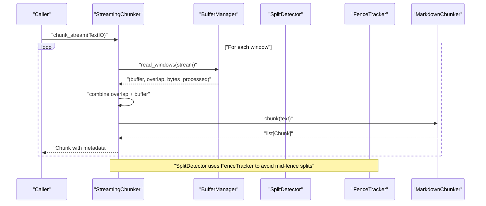
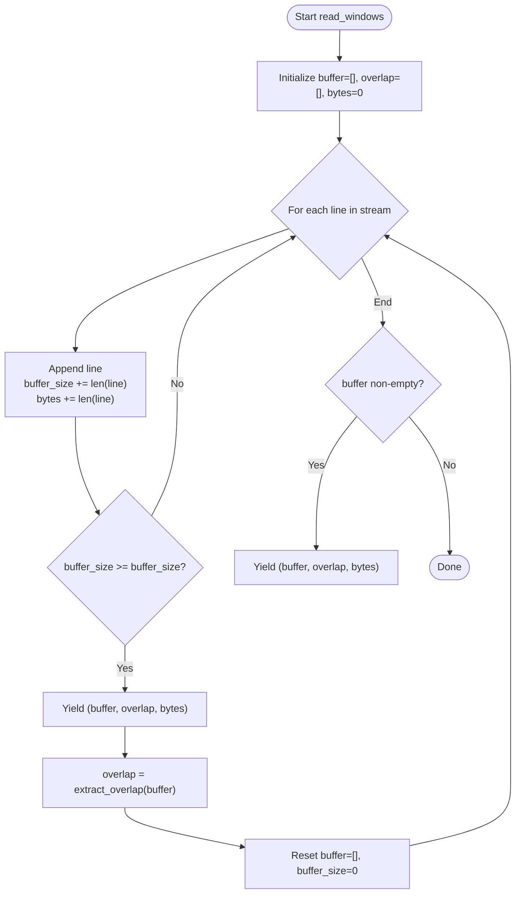
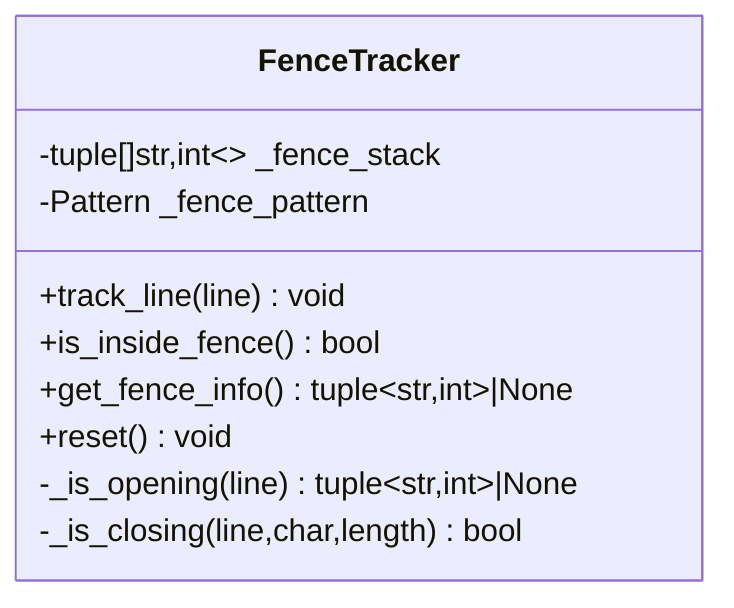
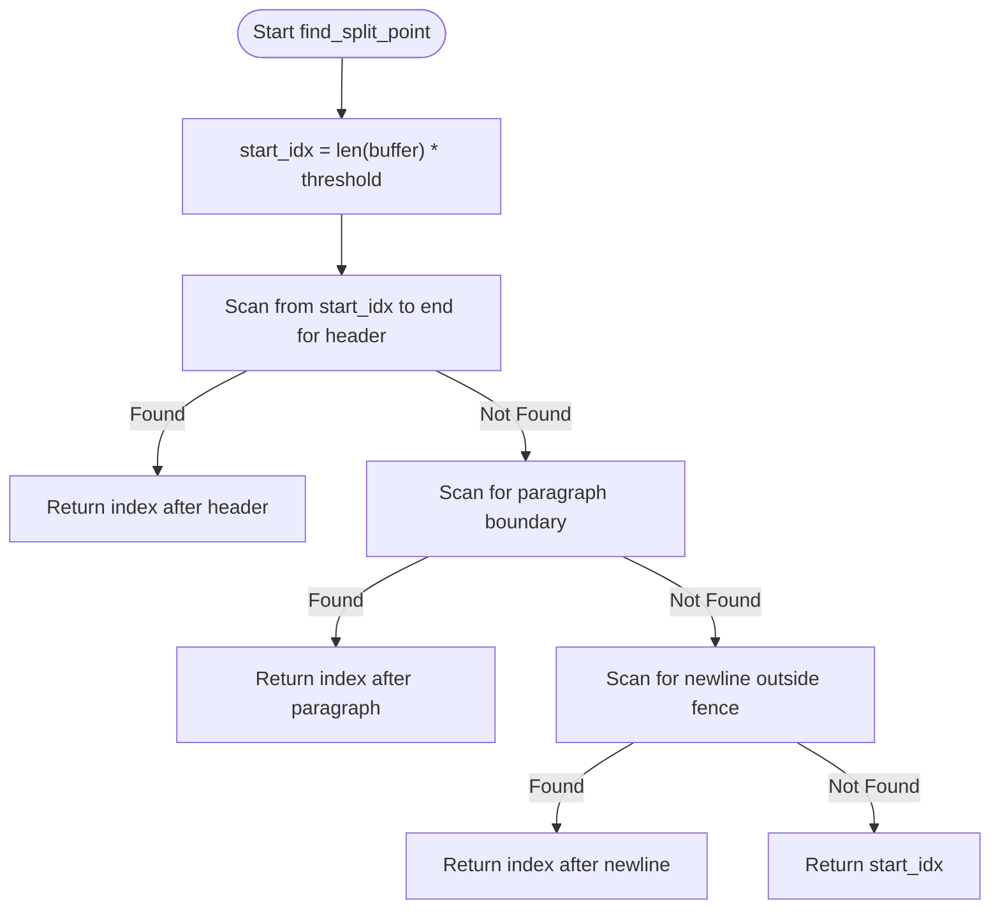
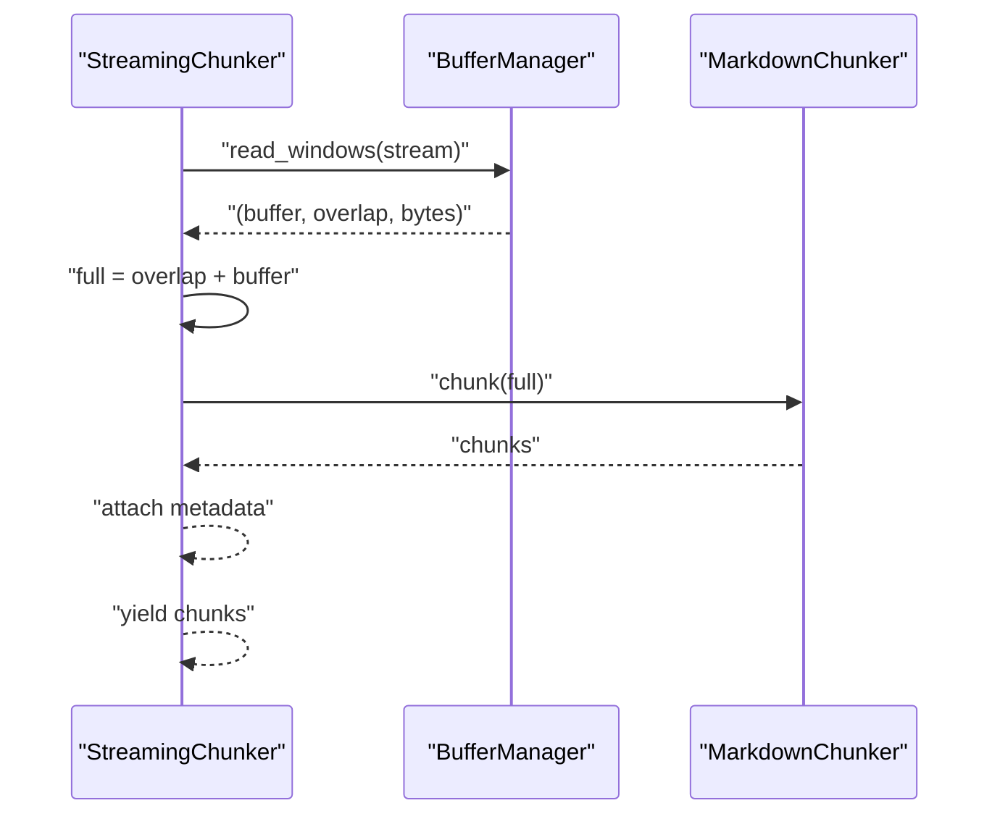
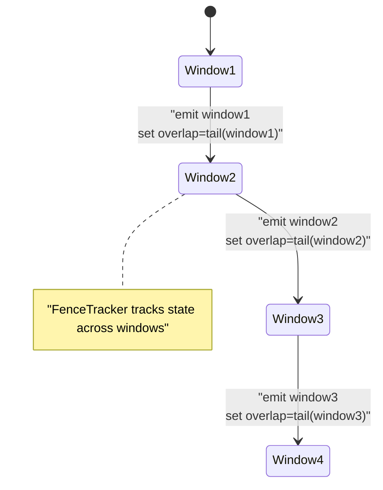
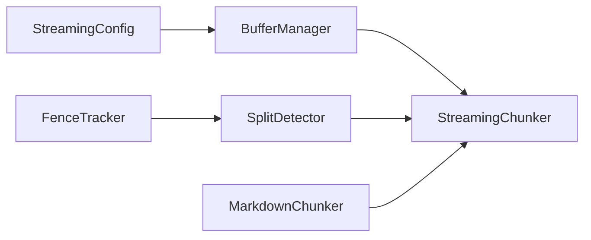

# Buffer Management

<cite>
**Referenced Files in This Document**
- [buffer_manager.py](file://src/chunkana/streaming/buffer_manager.py)
- [config.py](file://src/chunkana/streaming/config.py)
- [fence_tracker.py](file://src/chunkana/streaming/fence_tracker.py)
- [split_detector.py](file://src/chunkana/streaming/split_detector.py)
- [streaming_chunker.py](file://src/chunkana/streaming/streaming_chunker.py)
- [test_streaming.py](file://tests/unit/test_streaming.py)
</cite>

## Table of Contents
1. [Introduction](#introduction)
2. [Project Structure](#project-structure)
3. [Core Components](#core-components)
4. [Architecture Overview](#architecture-overview)
5. [Detailed Component Analysis](#detailed-component-analysis)
6. [Dependency Analysis](#dependency-analysis)
7. [Performance Considerations](#performance-considerations)
8. [Troubleshooting Guide](#troubleshooting-guide)
9. [Conclusion](#conclusion)

## Introduction
This document explains the BufferManager component in Chunkana’s streaming system. It focuses on how BufferManager incrementally accumulates text from streams, maintains a low memory footprint, and coordinates with the broader streaming pipeline to ensure atomic blocks (code, tables, LaTeX) remain intact across chunk boundaries. It also covers the sliding window mechanism, buffer sizing strategies, configuration parameters, and synchronization with streaming consumers.

## Project Structure
The streaming subsystem resides under src/chunkana/streaming and includes:
- BufferManager: Sliding window buffer over a TextIO stream
- StreamingConfig: Streaming parameters (buffer_size, overlap_lines, safe_split_threshold)
- FenceTracker: Tracks fenced code block state across windows
- SplitDetector: Finds safe split points respecting semantic boundaries and fences
- StreamingChunker: Orchestrates buffering, splitting, and chunking

**Diagram sources**
- [buffer_manager.py](file://src/chunkana/streaming/buffer_manager.py#L1-L62)
- [config.py](file://src/chunkana/streaming/config.py#L1-L24)
- [fence_tracker.py](file://src/chunkana/streaming/fence_tracker.py#L1-L65)
- [split_detector.py](file://src/chunkana/streaming/split_detector.py#L1-L93)
- [streaming_chunker.py](file://src/chunkana/streaming/streaming_chunker.py#L1-L99)

**Section sources**
- [buffer_manager.py](file://src/chunkana/streaming/buffer_manager.py#L1-L62)
- [config.py](file://src/chunkana/streaming/config.py#L1-L24)
- [streaming_chunker.py](file://src/chunkana/streaming/streaming_chunker.py#L1-L99)

## Core Components
- BufferManager: Reads a TextIO stream line-by-line, aggregates lines until buffer_size bytes is reached, yields a window tuple of (buffer_lines, overlap_lines, bytes_processed), and resets the buffer with a trailing overlap for the next window.
- StreamingConfig: Holds buffer_size, overlap_lines, max_memory_mb, and safe_split_threshold.
- FenceTracker: Tracks fenced code block state across windows to prevent splitting inside fences.
- SplitDetector: Determines safe split points prioritizing headers, paragraph boundaries, and newlines outside fences, falling back to a threshold-based split.
- StreamingChunker: Streams windows, combines overlap with buffer, passes the resulting text to the base MarkdownChunker, and attaches streaming metadata to each chunk.

**Section sources**
- [buffer_manager.py](file://src/chunkana/streaming/buffer_manager.py#L1-L62)
- [config.py](file://src/chunkana/streaming/config.py#L1-L24)
- [fence_tracker.py](file://src/chunkana/streaming/fence_tracker.py#L1-L65)
- [split_detector.py](file://src/chunkana/streaming/split_detector.py#L1-L93)
- [streaming_chunker.py](file://src/chunkana/streaming/streaming_chunker.py#L1-L99)

## Architecture Overview
The streaming pipeline reads a stream in fixed-size windows, ensures atomic blocks are preserved across boundaries, and produces chunks with streaming metadata.

**Diagram sources**
- [streaming_chunker.py](file://src/chunkana/streaming/streaming_chunker.py#L43-L99)
- [buffer_manager.py](file://src/chunkana/streaming/buffer_manager.py#L29-L62)
- [split_detector.py](file://src/chunkana/streaming/split_detector.py#L26-L93)
- [fence_tracker.py](file://src/chunkana/streaming/fence_tracker.py#L10-L65)

## Detailed Component Analysis

### BufferManager
Responsibilities:
- Incrementally accumulate lines from a TextIO stream
- Maintain a sliding window with byte-based size control
- Preserve overlap between consecutive windows
- Yield windows with metadata bytes_processed for consumer synchronization

Key behaviors:
- Aggregates lines until buffer_size bytes is reached
- Emits a window tuple (buffer_lines, overlap_lines, bytes_processed)
- After each emit, sets overlap_lines to the tail of the emitted buffer
- Emits a final window for remaining content

**Diagram sources**
- [buffer_manager.py](file://src/chunkana/streaming/buffer_manager.py#L29-L62)

**Section sources**
- [buffer_manager.py](file://src/chunkana/streaming/buffer_manager.py#L29-L62)

### StreamingConfig
Parameters:
- buffer_size: Maximum bytes per buffer window (default 100KB)
- overlap_lines: Number of lines to carry forward as overlap (default 20)
- max_memory_mb: Memory usage ceiling in MB (default 100)
- safe_split_threshold: Fraction of buffer to start looking for a split (default 0.8)

Tuning guidance:
- Increase buffer_size for throughput when I/O is fast and CPU-bound
- Decrease buffer_size to reduce peak memory and latency
- Increase overlap_lines to improve semantic chunking quality at the cost of memory and recomputation
- Adjust safe_split_threshold to favor earlier or later splits

**Section sources**
- [config.py](file://src/chunkana/streaming/config.py#L8-L24)

### FenceTracker
Purpose:
- Track fenced code block state across buffer boundaries
- Prevent splitting inside fenced regions

Behavior:
- Maintains a stack of (fence_char, fence_length) tuples
- Detects opening and closing fences
- Exposes is_inside_fence() and get_fence_info()

**Diagram sources**
- [fence_tracker.py](file://src/chunkana/streaming/fence_tracker.py#L10-L65)

**Section sources**
- [fence_tracker.py](file://src/chunkana/streaming/fence_tracker.py#L10-L65)

### SplitDetector
Purpose:
- Determine safe split points within a buffer window
- Prefer semantic boundaries (headers, paragraph breaks) over arbitrary splits
- Avoid splitting inside fenced regions

Priority:
1. Header boundary (line before a header)
2. Paragraph boundary (double newline)
3. Newline outside fence
4. Fallback: threshold position

**Diagram sources**
- [split_detector.py](file://src/chunkana/streaming/split_detector.py#L26-L93)
- [fence_tracker.py](file://src/chunkana/streaming/fence_tracker.py#L10-L65)

**Section sources**
- [split_detector.py](file://src/chunkana/streaming/split_detector.py#L26-L93)

### StreamingChunker
Role:
- Orchestrates streaming: reads windows, combines overlap, chunks text, and attaches metadata
- Uses MarkdownChunker for actual chunking

Processing steps:
- Open file/stream
- Iterate windows from BufferManager
- Combine overlap + buffer into full text
- Pass to MarkdownChunker.chunk
- Attach stream_chunk_index, stream_window_index, bytes_processed
- Yield chunks

**Diagram sources**
- [streaming_chunker.py](file://src/chunkana/streaming/streaming_chunker.py#L43-L99)

**Section sources**
- [streaming_chunker.py](file://src/chunkana/streaming/streaming_chunker.py#L43-L99)

### Buffer State Transitions During Fence Detection and Split Events
Below is a conceptual illustration of how buffer state evolves across windows and split decisions:

[No sources needed since this diagram shows conceptual workflow, not actual code structure]

## Dependency Analysis
- BufferManager depends on StreamingConfig for buffer_size and overlap_lines
- StreamingChunker composes BufferManager, SplitDetector, and MarkdownChunker
- SplitDetector depends on FenceTracker to avoid mid-fence splits
- Tests validate BufferManager behavior, StreamingConfig defaults, and streaming integration

**Diagram sources**
- [buffer_manager.py](file://src/chunkana/streaming/buffer_manager.py#L29-L62)
- [config.py](file://src/chunkana/streaming/config.py#L8-L24)
- [streaming_chunker.py](file://src/chunkana/streaming/streaming_chunker.py#L18-L42)
- [split_detector.py](file://src/chunkana/streaming/split_detector.py#L10-L25)
- [fence_tracker.py](file://src/chunkana/streaming/fence_tracker.py#L10-L21)

**Section sources**
- [test_streaming.py](file://tests/unit/test_streaming.py#L171-L232)
- [test_streaming.py](file://tests/unit/test_streaming.py#L233-L287)

## Performance Considerations
- Buffer sizing:
  - Larger buffer_size reduces I/O overhead and increases throughput but raises peak memory and latency
  - Smaller buffer_size lowers memory and latency but increases I/O and chunk count
- Overlap:
  - Larger overlap_lines improves semantic chunking quality by preserving context across boundaries but increases memory and recomputation
- Split threshold:
  - Higher safe_split_threshold delays splits, potentially reducing fragmentation but increasing window sizes
  - Lower threshold enables earlier splits, reducing memory but risking more boundary cuts
- Atomic blocks:
  - FenceTracker prevents mid-fence splits; ensure overlap_lines is sufficient to capture fence boundaries
- Throughput vs. memory:
  - Tune buffer_size and overlap_lines to meet max_memory_mb targets
  - Consider input characteristics (code-heavy vs. prose-heavy) to adjust thresholds and overlap

[No sources needed since this section provides general guidance]

## Troubleshooting Guide
Common issues and remedies:
- Empty or whitespace-only streams:
  - StreamingChunker returns no chunks; expected behavior
- Very small buffer_size:
  - Leads to frequent windows and higher overhead; increase buffer_size
- Large overlap_lines:
  - May increase memory usage; reduce overlap_lines or increase buffer_size
- Mid-fence splits:
  - Ensure FenceTracker is used by SplitDetector; verify overlap_lines is adequate
- Synchronization with consumers:
  - Use bytes_processed metadata to track progress across windows
- Validation:
  - Tests demonstrate expected behavior for small/large files, overlap extraction, and streaming metadata

**Section sources**
- [test_streaming.py](file://tests/unit/test_streaming.py#L150-L169)
- [test_streaming.py](file://tests/unit/test_streaming.py#L171-L232)
- [test_streaming.py](file://tests/unit/test_streaming.py#L290-L360)

## Conclusion
BufferManager provides a lightweight, memory-conscious sliding window over streaming text. Combined with FenceTracker and SplitDetector, it preserves atomic blocks across chunk boundaries while enabling efficient, scalable chunking. Proper tuning of buffer_size, overlap_lines, and safe_split_threshold balances throughput, memory usage, and chunk quality according to input characteristics.