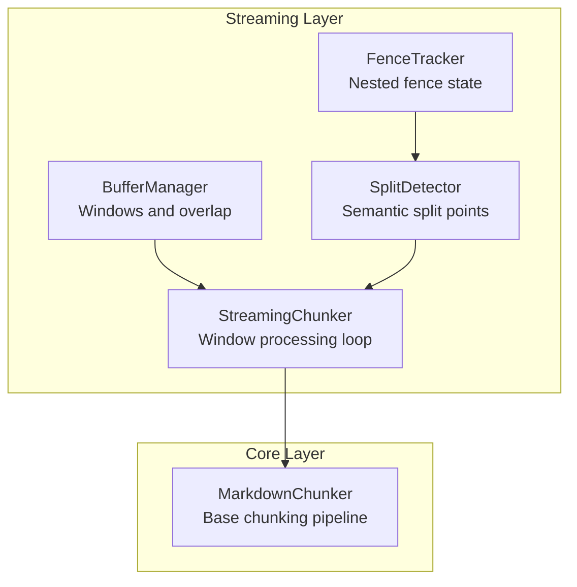
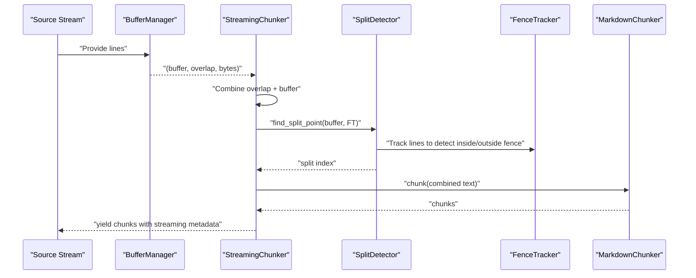
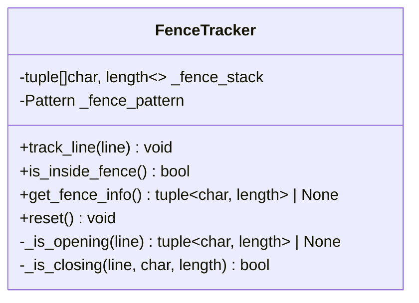
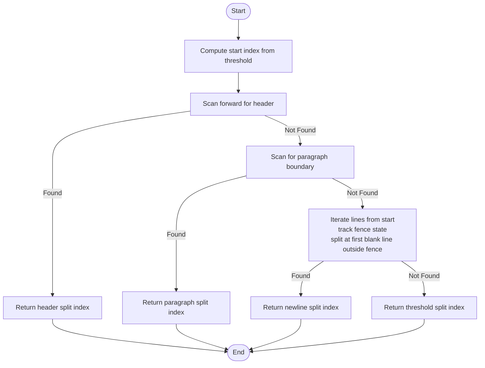
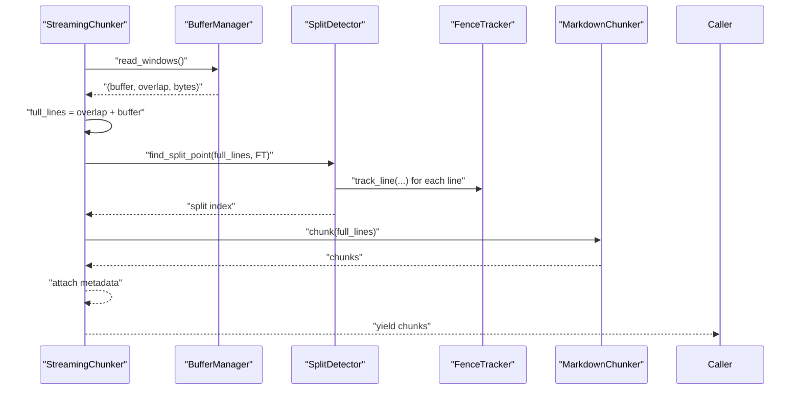
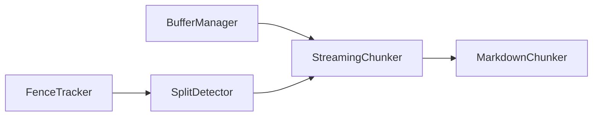

# Fence and Boundary Tracking

<cite>
**Referenced Files in This Document**
- [fence_tracker.py](file://src/chunkana/streaming/fence_tracker.py)
- [split_detector.py](file://src/chunkana/streaming/split_detector.py)
- [streaming_chunker.py](file://src/chunkana/streaming/streaming_chunker.py)
- [buffer_manager.py](file://src/chunkana/streaming/buffer_manager.py)
- [config.py](file://src/chunkana/streaming/config.py)
- [chunker.py](file://src/chunkana/chunker.py)
- [test_streaming.py](file://tests/unit/test_streaming.py)
- [nested_fences.md](file://tests/baseline/fixtures/nested_fences.md)
</cite>

## Table of Contents
1. [Introduction](#introduction)
2. [Project Structure](#project-structure)
3. [Core Components](#core-components)
4. [Architecture Overview](#architecture-overview)
5. [Detailed Component Analysis](#detailed-component-analysis)
6. [Dependency Analysis](#dependency-analysis)
7. [Performance Considerations](#performance-considerations)
8. [Troubleshooting Guide](#troubleshooting-guide)
9. [Conclusion](#conclusion)

## Introduction
This document explains how Chunkana’s streaming processor tracks semantic boundaries and prevents premature chunking across nested fenced content. It focuses on:
- How FenceTracker maintains state for nested code fences and other fenced regions to avoid splitting inside fenced blocks.
- How SplitDetector identifies safe split points using Markdown semantics (headers, paragraphs, and newlines outside fences).
- How these components integrate with StreamingChunker and BufferManager to preserve semantic integrity during streaming processing.
- Edge cases such as incomplete fences at stream ends and recovery strategies.
- Guidance on configuring sensitivity thresholds for split detection.

## Project Structure
The streaming subsystem resides under src/chunkana/streaming and orchestrates buffer windows, fence tracking, and split detection before delegating to the base chunker.

**Diagram sources**
- [buffer_manager.py](file://src/chunkana/streaming/buffer_manager.py#L1-L62)
- [fence_tracker.py](file://src/chunkana/streaming/fence_tracker.py#L1-L65)
- [split_detector.py](file://src/chunkana/streaming/split_detector.py#L1-L93)
- [streaming_chunker.py](file://src/chunkana/streaming/streaming_chunker.py#L1-L99)
- [chunker.py](file://src/chunkana/chunker.py#L85-L177)

**Section sources**
- [buffer_manager.py](file://src/chunkana/streaming/buffer_manager.py#L1-L62)
- [fence_tracker.py](file://src/chunkana/streaming/fence_tracker.py#L1-L65)
- [split_detector.py](file://src/chunkana/streaming/split_detector.py#L1-L93)
- [streaming_chunker.py](file://src/chunkana/streaming/streaming_chunker.py#L1-L99)
- [chunker.py](file://src/chunkana/chunker.py#L85-L177)

## Core Components
- FenceTracker: Tracks nested fenced regions (e.g., code fences) across buffer boundaries to prevent mid-block splits.
- SplitDetector: Finds safe split points prioritizing semantic boundaries (headers, paragraphs) and newlines outside fences.
- StreamingChunker: Streams input in windows, applies split detection, and delegates to the base chunker for chunking.
- BufferManager: Produces overlapping windows to maintain context across boundaries.
- StreamingConfig: Tunable parameters for buffer sizes, overlap, and split sensitivity.

**Section sources**
- [fence_tracker.py](file://src/chunkana/streaming/fence_tracker.py#L1-L65)
- [split_detector.py](file://src/chunkana/streaming/split_detector.py#L1-L93)
- [streaming_chunker.py](file://src/chunkana/streaming/streaming_chunker.py#L1-L99)
- [buffer_manager.py](file://src/chunkana/streaming/buffer_manager.py#L1-L62)
- [config.py](file://src/chunkana/streaming/config.py#L1-L24)

## Architecture Overview
The streaming pipeline reads input in windows, detects safe split points, and passes combined content to the base chunker. FenceTracker ensures fenced content remains intact.

**Diagram sources**
- [buffer_manager.py](file://src/chunkana/streaming/buffer_manager.py#L29-L62)
- [streaming_chunker.py](file://src/chunkana/streaming/streaming_chunker.py#L56-L99)
- [split_detector.py](file://src/chunkana/streaming/split_detector.py#L26-L93)
- [fence_tracker.py](file://src/chunkana/streaming/fence_tracker.py#L22-L65)
- [chunker.py](file://src/chunkana/chunker.py#L85-L177)

## Detailed Component Analysis

### FenceTracker: Nested Fence State Management
FenceTracker maintains a stack of active fences to handle nesting and ensure fenced content is not split mid-block. It recognizes opening and closing fences and updates state accordingly.

Key behaviors:
- Opening detection: Matches fenced lines and pushes (character, length) onto the stack.
- Closing detection: Compares closing line against the last opened fence’s character and length.
- Inside/outside checks: Used by SplitDetector to avoid splitting inside fenced regions.

**Diagram sources**
- [fence_tracker.py](file://src/chunkana/streaming/fence_tracker.py#L10-L65)

State transitions during fence opening/closing:
- Opening a fence: Push (fence_char, fence_length) onto stack.
- Closing a fence: Pop when the current line matches the expected closing pattern.
- Nested fences: Inner fences close before outer fences can close.

Examples from the codebase:
- Nested fences fixture demonstrates nested fenced regions.
- Tests demonstrate split detection around fenced content.

**Section sources**
- [fence_tracker.py](file://src/chunkana/streaming/fence_tracker.py#L10-L65)
- [nested_fences.md](file://tests/baseline/fixtures/nested_fences.md#L1-L15)
- [test_streaming.py](file://tests/unit/test_streaming.py#L316-L343)

### SplitDetector: Semantic Split Point Detection
SplitDetector prioritizes semantic boundaries over arbitrary splits:
1. Header boundary: Split before the next header line.
2. Paragraph boundary: Split at a double newline separating paragraphs.
3. Newline outside fence: Split at the first blank line outside a fenced region.
4. Fallback: Split at a configurable threshold position.

**Diagram sources**
- [split_detector.py](file://src/chunkana/streaming/split_detector.py#L26-L93)
- [fence_tracker.py](file://src/chunkana/streaming/fence_tracker.py#L22-L65)

Interaction with FenceTracker:
- SplitDetector creates a temporary FenceTracker copy to simulate tracking across the buffer without mutating shared state.
- It scans from the threshold index and only considers blank lines that occur when the tracker reports outside a fence.

Edge cases handled by SplitDetector:
- Fallback split at threshold when no semantic boundary is found.
- Paragraph boundary detection ignores blank lines inside fences.

**Section sources**
- [split_detector.py](file://src/chunkana/streaming/split_detector.py#L1-L93)
- [test_streaming.py](file://tests/unit/test_streaming.py#L233-L287)

### StreamingChunker: Window Processing and Integration
StreamingChunker coordinates buffer windows, split detection, and base chunking:
- Reads windows from BufferManager.
- Combines overlap with current buffer to preserve context.
- Uses SplitDetector to compute a safe split index.
- Delegates to MarkdownChunker for chunking the combined text.
- Attaches streaming metadata to each chunk.

**Diagram sources**
- [streaming_chunker.py](file://src/chunkana/streaming/streaming_chunker.py#L43-L99)
- [buffer_manager.py](file://src/chunkana/streaming/buffer_manager.py#L29-L62)
- [split_detector.py](file://src/chunkana/streaming/split_detector.py#L26-L93)
- [fence_tracker.py](file://src/chunkana/streaming/fence_tracker.py#L22-L65)
- [chunker.py](file://src/chunkana/chunker.py#L85-L177)

**Section sources**
- [streaming_chunker.py](file://src/chunkana/streaming/streaming_chunker.py#L1-L99)
- [buffer_manager.py](file://src/chunkana/streaming/buffer_manager.py#L1-L62)
- [chunker.py](file://src/chunkana/chunker.py#L85-L177)

### BufferManager: Windowing and Overlap
BufferManager reads the stream and yields fixed-size windows with a trailing overlap to preserve context across boundaries. Overlap helps SplitDetector detect paragraph boundaries and header transitions that cross window edges.

Key behaviors:
- Maintains a buffer until it reaches the configured byte size.
- Emits the current buffer along with the overlap from the previous buffer.
- On the final partial buffer, emits remaining content with appropriate overlap.

**Section sources**
- [buffer_manager.py](file://src/chunkana/streaming/buffer_manager.py#L1-L62)

### Configuration: Sensitivity Thresholds
StreamingConfig exposes:
- buffer_size: Controls window size.
- overlap_lines: Number of lines carried over to the next window.
- safe_split_threshold: Fraction of buffer where SplitDetector starts scanning for semantic boundaries.

Guidance:
- Increase safe_split_threshold to favor earlier splits and reduce overlap; decrease to preserve more context and avoid early splits.
- Adjust buffer_size to balance memory usage and processing overhead.
- Increase overlap_lines to improve paragraph/header detection across window boundaries.

**Section sources**
- [config.py](file://src/chunkana/streaming/config.py#L1-L24)
- [test_streaming.py](file://tests/unit/test_streaming.py#L17-L42)

## Dependency Analysis
The streaming components depend on each other as follows:
- SplitDetector depends on FenceTracker to avoid splitting inside fenced regions.
- StreamingChunker composes BufferManager, SplitDetector, and MarkdownChunker.
- FenceTracker and SplitDetector are standalone and only depend on standard library regex.

**Diagram sources**
- [fence_tracker.py](file://src/chunkana/streaming/fence_tracker.py#L1-L65)
- [split_detector.py](file://src/chunkana/streaming/split_detector.py#L1-L93)
- [streaming_chunker.py](file://src/chunkana/streaming/streaming_chunker.py#L1-L99)
- [buffer_manager.py](file://src/chunkana/streaming/buffer_manager.py#L1-L62)
- [chunker.py](file://src/chunkana/chunker.py#L85-L177)

**Section sources**
- [fence_tracker.py](file://src/chunkana/streaming/fence_tracker.py#L1-L65)
- [split_detector.py](file://src/chunkana/streaming/split_detector.py#L1-L93)
- [streaming_chunker.py](file://src/chunkana/streaming/streaming_chunker.py#L1-L99)
- [buffer_manager.py](file://src/chunkana/streaming/buffer_manager.py#L1-L62)
- [chunker.py](file://src/chunkana/chunker.py#L85-L177)

## Performance Considerations
- Regex-based parsing: FenceTracker and SplitDetector rely on regex to detect fenced regions and headers. This is efficient for typical Markdown content.
- Window size and overlap: Larger buffer_size reduces I/O but increases memory usage. Larger overlap_lines improves semantic detection near boundaries but increases processing overhead.
- Threshold scanning: SplitDetector scans from the threshold index; higher thresholds reduce scan cost but may cause earlier splits.

[No sources needed since this section provides general guidance]

## Troubleshooting Guide
Common issues and resolutions:
- Premature splits inside fenced content:
  - Cause: SplitDetector chose a newline inside a fence.
  - Resolution: Verify overlap is sufficient and safe_split_threshold is not too high. Ensure nested fences are correctly formed.
- Headers or paragraphs ignored at boundaries:
  - Cause: Insufficient overlap or threshold too high.
  - Resolution: Increase overlap_lines and/or decrease safe_split_threshold.
- Incomplete fences at stream end:
  - Symptom: FenceTracker retains state across windows.
  - Resolution: The base chunker’s parser handles fenced content; ensure the final window includes the complete fence. If a fence is truly incomplete, treat it as plain text in the final chunk.
- Recovery strategies:
  - Increase overlap_lines to capture fence terminators crossing windows.
  - Decrease safe_split_threshold to allow SplitDetector to consider earlier boundaries.
  - Validate nested fence syntax using the nested fences fixture as a reference.

Evidence from tests:
- Preservation of code blocks across windows.
- Fallback split behavior when no semantic boundary is found.
- Overlap extraction and windowing behavior.

**Section sources**
- [test_streaming.py](file://tests/unit/test_streaming.py#L171-L232)
- [test_streaming.py](file://tests/unit/test_streaming.py#L233-L287)
- [test_streaming.py](file://tests/unit/test_streaming.py#L316-L343)
- [nested_fences.md](file://tests/baseline/fixtures/nested_fences.md#L1-L15)

## Conclusion
FenceTracker and SplitDetector together ensure semantic integrity in Chunkana’s streaming pipeline by preventing splits inside fenced content and preferring Markdown-aware boundaries. StreamingChunker integrates these components with BufferManager and the base chunker to deliver robust, memory-efficient chunking. Proper tuning of StreamingConfig parameters allows balancing performance and semantic fidelity.