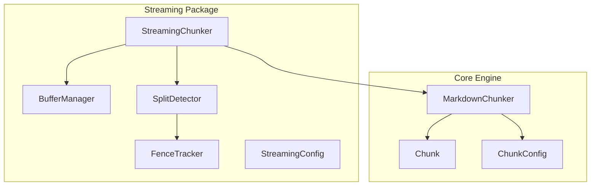
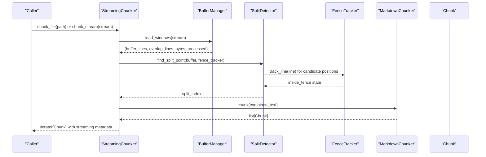
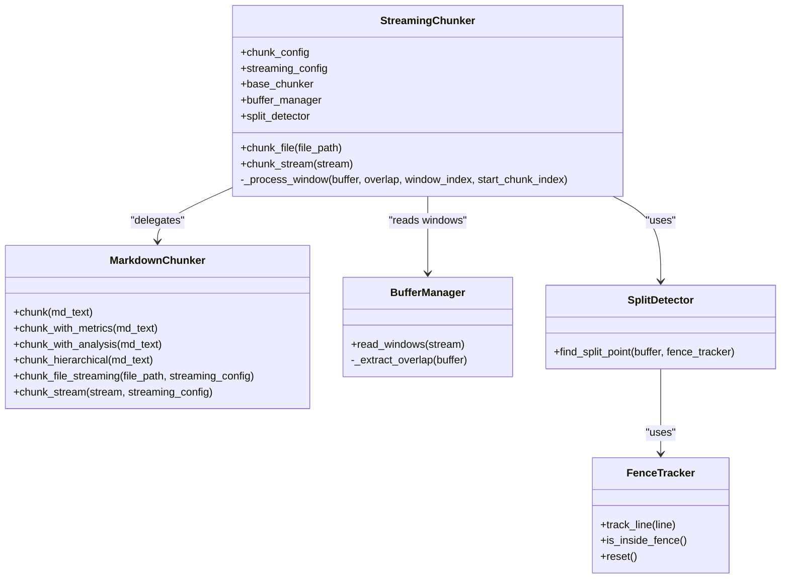
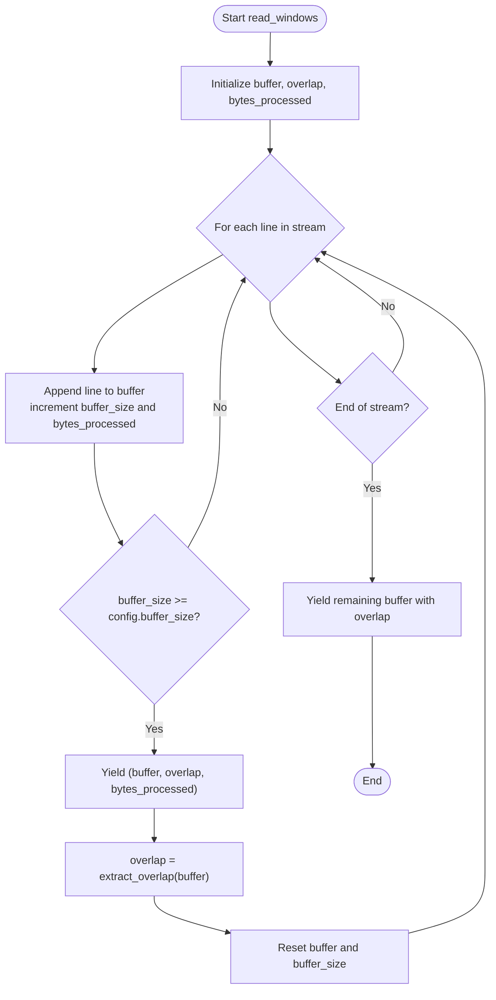
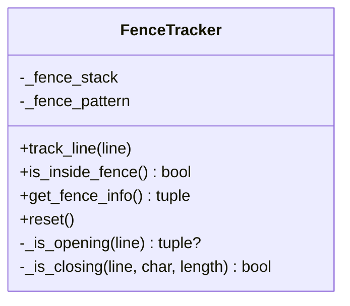
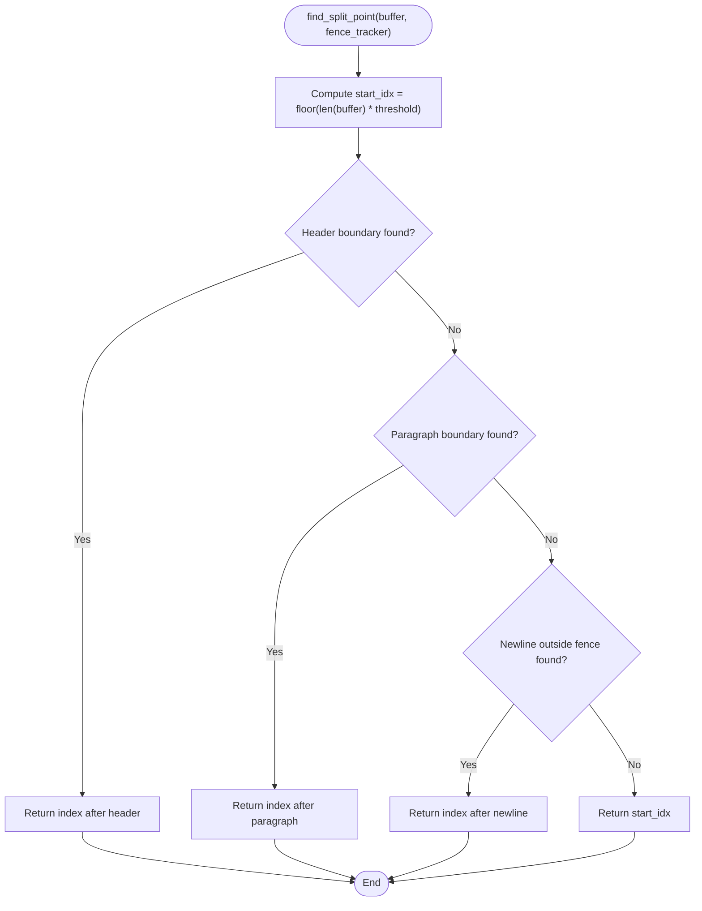
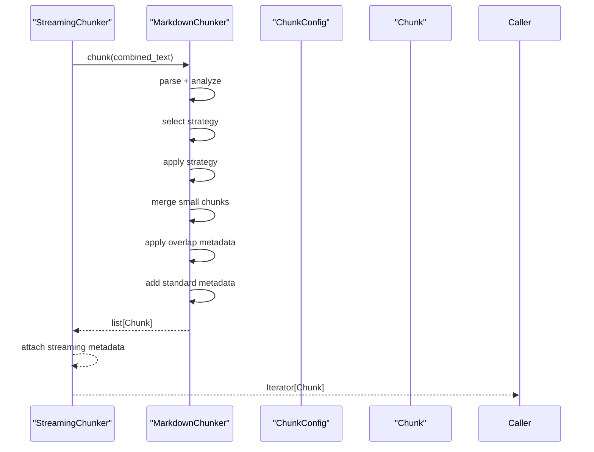
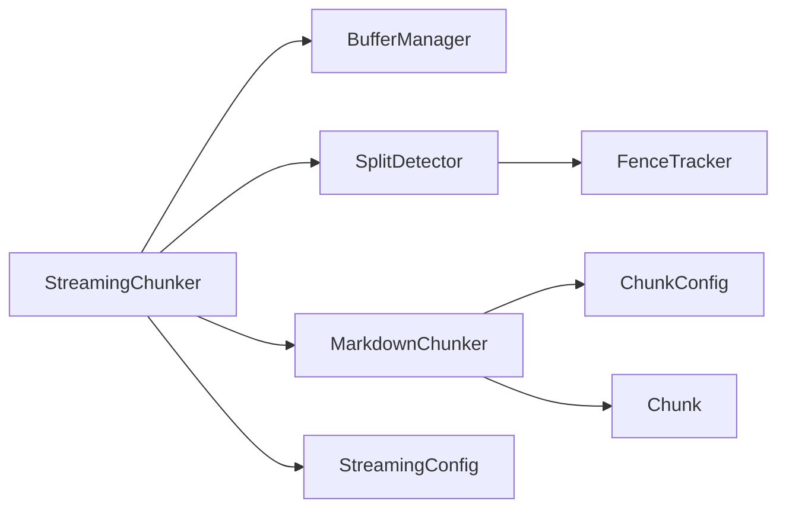

# Streaming Architecture Overview

<cite>
**Referenced Files in This Document**
- [streaming_chunker.py](file://src/chunkana/streaming/streaming_chunker.py)
- [buffer_manager.py](file://src/chunkana/streaming/buffer_manager.py)
- [fence_tracker.py](file://src/chunkana/streaming/fence_tracker.py)
- [split_detector.py](file://src/chunkana/streaming/split_detector.py)
- [config.py](file://src/chunkana/streaming/config.py)
- [chunker.py](file://src/chunkana/chunker.py)
- [types.py](file://src/chunkana/types.py)
- [config.py](file://src/chunkana/config.py)
- [test_streaming.py](file://tests/unit/test_streaming.py)
</cite>

## Table of Contents
1. [Introduction](#introduction)
2. [Project Structure](#project-structure)
3. [Core Components](#core-components)
4. [Architecture Overview](#architecture-overview)
5. [Detailed Component Analysis](#detailed-component-analysis)
6. [Dependency Analysis](#dependency-analysis)
7. [Performance Considerations](#performance-considerations)
8. [Troubleshooting Guide](#troubleshooting-guide)
9. [Conclusion](#conclusion)

## Introduction
This document explains the streaming architecture in Chunkana designed to process large Markdown files efficiently while maintaining memory usage within limits. The streaming pipeline reads input incrementally, manages overlapping windows, detects safe split points across boundaries, and delegates actual chunking to the core chunking engine. It ensures code block integrity, minimizes memory footprint, and preserves semantic boundaries for robust chunking outcomes.

## Project Structure
The streaming architecture resides under the streaming package and integrates with the core chunking engine. The key files are:
- Streaming orchestrator: StreamingChunker
- Buffer management: BufferManager
- Boundary detection: FenceTracker and SplitDetector
- Streaming configuration: StreamingConfig
- Integration with core chunking: MarkdownChunker and Chunk types

**Diagram sources**
- [streaming_chunker.py](file://src/chunkana/streaming/streaming_chunker.py#L18-L99)
- [buffer_manager.py](file://src/chunkana/streaming/buffer_manager.py#L13-L62)
- [fence_tracker.py](file://src/chunkana/streaming/fence_tracker.py#L10-L65)
- [split_detector.py](file://src/chunkana/streaming/split_detector.py#L10-L93)
- [config.py](file://src/chunkana/streaming/config.py#L8-L24)
- [chunker.py](file://src/chunkana/chunker.py#L37-L177)
- [types.py](file://src/chunkana/types.py#L240-L320)
- [config.py](file://src/chunkana/config.py#L17-L126)

**Section sources**
- [streaming_chunker.py](file://src/chunkana/streaming/streaming_chunker.py#L18-L99)
- [buffer_manager.py](file://src/chunkana/streaming/buffer_manager.py#L13-L62)
- [fence_tracker.py](file://src/chunkana/streaming/fence_tracker.py#L10-L65)
- [split_detector.py](file://src/chunkana/streaming/split_detector.py#L10-L93)
- [config.py](file://src/chunkana/streaming/config.py#L8-L24)
- [chunker.py](file://src/chunkana/chunker.py#L37-L177)
- [types.py](file://src/chunkana/types.py#L240-L320)
- [config.py](file://src/chunkana/config.py#L17-L126)

## Core Components
- StreamingChunker: Orchestrates streaming processing by reading windows, combining overlaps, and delegating to the core chunker. It attaches streaming metadata to emitted chunks.
- BufferManager: Reads streams line-by-line, emits fixed-size windows with overlap, and tracks cumulative byte counts.
- FenceTracker: Tracks fenced code block state across window boundaries to prevent splitting mid-fence.
- SplitDetector: Identifies safe split points prioritizing headers, paragraph boundaries, and newline outside fences, falling back to a threshold position.
- StreamingConfig: Tunable parameters controlling buffer size, overlap lines, memory ceiling, and safe split threshold.
- MarkdownChunker: Core chunking engine that applies strategy selection and produces chunks with metadata.
- Chunk and ChunkConfig: Data models and configuration for chunk representation and behavior.

**Section sources**
- [streaming_chunker.py](file://src/chunkana/streaming/streaming_chunker.py#L18-L99)
- [buffer_manager.py](file://src/chunkana/streaming/buffer_manager.py#L13-L62)
- [fence_tracker.py](file://src/chunkana/streaming/fence_tracker.py#L10-L65)
- [split_detector.py](file://src/chunkana/streaming/split_detector.py#L10-L93)
- [config.py](file://src/chunkana/streaming/config.py#L8-L24)
- [chunker.py](file://src/chunkana/chunker.py#L37-L177)
- [types.py](file://src/chunkana/types.py#L240-L320)
- [config.py](file://src/chunkana/config.py#L17-L126)

## Architecture Overview
The streaming pipeline transforms an input stream into a sequence of chunks with constant memory usage. It reads incremental windows, ensures safe boundaries, and delegates to the core chunker for strategy-driven segmentation.

**Diagram sources**
- [streaming_chunker.py](file://src/chunkana/streaming/streaming_chunker.py#L43-L99)
- [buffer_manager.py](file://src/chunkana/streaming/buffer_manager.py#L29-L55)
- [split_detector.py](file://src/chunkana/streaming/split_detector.py#L26-L62)
- [fence_tracker.py](file://src/chunkana/streaming/fence_tracker.py#L22-L41)
- [chunker.py](file://src/chunkana/chunker.py#L85-L177)
- [types.py](file://src/chunkana/types.py#L240-L320)

## Detailed Component Analysis

### StreamingChunker
Responsibilities:
- Initializes core chunker and streaming components.
- Iterates over windows from BufferManager.
- Combines overlap with buffer content and delegates to MarkdownChunker.
- Attaches streaming metadata to each emitted chunk.

Key behaviors:
- Window processing yields chunks with stream_chunk_index, stream_window_index, and bytes_processed.
- Delegates actual chunking to MarkdownChunker.chunk.

**Diagram sources**
- [streaming_chunker.py](file://src/chunkana/streaming/streaming_chunker.py#L18-L99)
- [chunker.py](file://src/chunkana/chunker.py#L249-L300)
- [buffer_manager.py](file://src/chunkana/streaming/buffer_manager.py#L13-L62)
- [split_detector.py](file://src/chunkana/streaming/split_detector.py#L10-L93)
- [fence_tracker.py](file://src/chunkana/streaming/fence_tracker.py#L10-L65)

**Section sources**
- [streaming_chunker.py](file://src/chunkana/streaming/streaming_chunker.py#L18-L99)
- [chunker.py](file://src/chunkana/chunker.py#L249-L300)

### BufferManager
Responsibilities:
- Reads input line-by-line.
- Emits windows when buffer_size threshold is reached.
- Maintains overlap_lines from the end of the previous buffer for continuity.

Behavior highlights:
- Yields tuples of (buffer_lines, overlap_lines, bytes_processed).
- Extracts overlap from the tail of the buffer.

**Diagram sources**
- [buffer_manager.py](file://src/chunkana/streaming/buffer_manager.py#L29-L55)

**Section sources**
- [buffer_manager.py](file://src/chunkana/streaming/buffer_manager.py#L13-L62)

### FenceTracker
Responsibilities:
- Tracks fenced code block state across window boundaries.
- Detects opening and closing fences to prevent splitting mid-block.

Behavior highlights:
- Maintains a stack of active fences.
- Resets state when fences close.
- Provides is_inside_fence for downstream decisions.

**Diagram sources**
- [fence_tracker.py](file://src/chunkana/streaming/fence_tracker.py#L10-L65)

**Section sources**
- [fence_tracker.py](file://src/chunkana/streaming/fence_tracker.py#L10-L65)

### SplitDetector
Responsibilities:
- Determines safe split points within a buffer window.
- Prioritizes semantic boundaries: header lines, paragraph breaks, and blank lines outside fences.
- Falls back to a threshold-based split when no better option exists.

Algorithm outline:
- Compute start_idx from threshold × buffer length.
- Try header boundary first.
- Try paragraph boundary second.
- Try newline outside fence third.
- Fallback to threshold position.

**Diagram sources**
- [split_detector.py](file://src/chunkana/streaming/split_detector.py#L26-L62)
- [fence_tracker.py](file://src/chunkana/streaming/fence_tracker.py#L22-L41)

**Section sources**
- [split_detector.py](file://src/chunkana/streaming/split_detector.py#L10-L93)
- [fence_tracker.py](file://src/chunkana/streaming/fence_tracker.py#L10-L65)

### StreamingConfig
Responsibilities:
- Defines buffer_size, overlap_lines, max_memory_mb, and safe_split_threshold.
- Controls memory usage and split behavior.

Defaults:
- buffer_size: 100KB
- overlap_lines: 20
- max_memory_mb: 100
- safe_split_threshold: 0.8

**Section sources**
- [config.py](file://src/chunkana/streaming/config.py#L8-L24)

### Integration with Core Chunking Engine and Strategy Selection
- StreamingChunker composes a MarkdownChunker with the caller’s ChunkConfig and delegates windowed text to chunk().
- MarkdownChunker performs:
  - Parsing and analysis
  - Strategy selection
  - Applying strategy and merging small chunks
  - Applying overlap metadata (no physical duplication)
  - Adding standard and adaptive metadata
  - Validation
- StreamingChunker augments emitted chunks with streaming metadata (stream_chunk_index, stream_window_index, bytes_processed).

**Diagram sources**
- [streaming_chunker.py](file://src/chunkana/streaming/streaming_chunker.py#L79-L99)
- [chunker.py](file://src/chunkana/chunker.py#L85-L177)
- [types.py](file://src/chunkana/types.py#L240-L320)
- [config.py](file://src/chunkana/config.py#L17-L126)

**Section sources**
- [streaming_chunker.py](file://src/chunkana/streaming/streaming_chunker.py#L18-L99)
- [chunker.py](file://src/chunkana/chunker.py#L85-L177)
- [types.py](file://src/chunkana/types.py#L240-L320)
- [config.py](file://src/chunkana/config.py#L17-L126)

## Dependency Analysis
- StreamingChunker depends on BufferManager, SplitDetector, and MarkdownChunker.
- SplitDetector depends on FenceTracker to avoid splitting inside fenced code blocks.
- MarkdownChunker depends on ChunkConfig and Chunk types for behavior and output.
- StreamingConfig is consumed by BufferManager and SplitDetector indirectly via StreamingChunker.

**Diagram sources**
- [streaming_chunker.py](file://src/chunkana/streaming/streaming_chunker.py#L18-L99)
- [buffer_manager.py](file://src/chunkana/streaming/buffer_manager.py#L13-L62)
- [split_detector.py](file://src/chunkana/streaming/split_detector.py#L10-L93)
- [fence_tracker.py](file://src/chunkana/streaming/fence_tracker.py#L10-L65)
- [chunker.py](file://src/chunkana/chunker.py#L37-L177)
- [types.py](file://src/chunkana/types.py#L240-L320)
- [config.py](file://src/chunkana/config.py#L17-L126)
- [config.py](file://src/chunkana/streaming/config.py#L8-L24)

**Section sources**
- [streaming_chunker.py](file://src/chunkana/streaming/streaming_chunker.py#L18-L99)
- [buffer_manager.py](file://src/chunkana/streaming/buffer_manager.py#L13-L62)
- [split_detector.py](file://src/chunkana/streaming/split_detector.py#L10-L93)
- [fence_tracker.py](file://src/chunkana/streaming/fence_tracker.py#L10-L65)
- [chunker.py](file://src/chunkana/chunker.py#L37-L177)
- [types.py](file://src/chunkana/types.py#L240-L320)
- [config.py](file://src/chunkana/config.py#L17-L126)
- [config.py](file://src/chunkana/streaming/config.py#L8-L24)

## Performance Considerations
- Constant memory usage: Only one window plus overlap is held in memory at a time, controlled by buffer_size and overlap_lines.
- Minimal overhead: Windows are emitted when buffer_size threshold is reached; overlap_lines provide continuity without duplicating content.
- Safe split enforcement: SplitDetector avoids splitting inside fenced code blocks and prefers semantic boundaries, reducing post-processing retries.
- Core engine efficiency: MarkdownChunker applies strategy selection and overlap metadata only once per windowed text, preserving performance.

[No sources needed since this section provides general guidance]

## Troubleshooting Guide
Common issues and remedies:
- Empty or whitespace-only streams: StreamingChunker returns no chunks; verify input content.
- Unexpected chunk boundaries near fences: Adjust safe_split_threshold or increase overlap_lines to improve boundary detection.
- Oversized chunks due to code blocks: MarkdownChunker may mark chunks as intentionally oversized; adjust max_chunk_size or strategy_override if needed.
- Streaming metadata missing: Ensure StreamingChunker is used; streaming metadata is attached automatically.

Validation references:
- StreamingChunker behavior and metadata assertions are covered in unit tests.
- BufferManager windowing and overlap correctness verified by tests.
- SplitDetector split point detection validated by tests.

**Section sources**
- [test_streaming.py](file://tests/unit/test_streaming.py#L54-L169)
- [test_streaming.py](file://tests/unit/test_streaming.py#L171-L232)
- [test_streaming.py](file://tests/unit/test_streaming.py#L233-L288)
- [test_streaming.py](file://tests/unit/test_streaming.py#L289-L362)

## Trade-offs and Limitations
- Reduced global context awareness: Because processing is windowed, cross-window context is limited. This is mitigated by overlap_lines and metadata-only overlap.
- Certain strategies constrained: Some strategies rely on global analysis; streaming favors local-safe boundaries and semantic-aware splitting.
- Code block integrity: SplitDetector prevents mid-fence splits, but very long fenced blocks may still require larger buffer_size or overlap_lines to avoid oversize chunks.

[No sources needed since this section provides general guidance]

## Conclusion
The streaming architecture in Chunkana achieves memory-efficient processing for large Markdown files by combining incremental buffering, safe boundary detection, and delegation to the core chunking engine. StreamingChunker orchestrates the pipeline, BufferManager controls memory usage, FenceTracker protects code blocks, and SplitDetector ensures semantic boundaries. Together, they deliver robust chunking with predictable memory characteristics and streaming metadata for traceability.