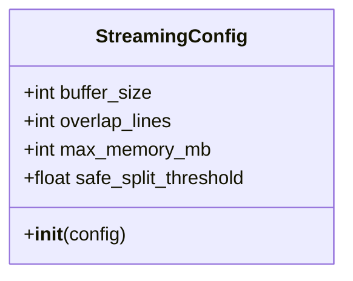
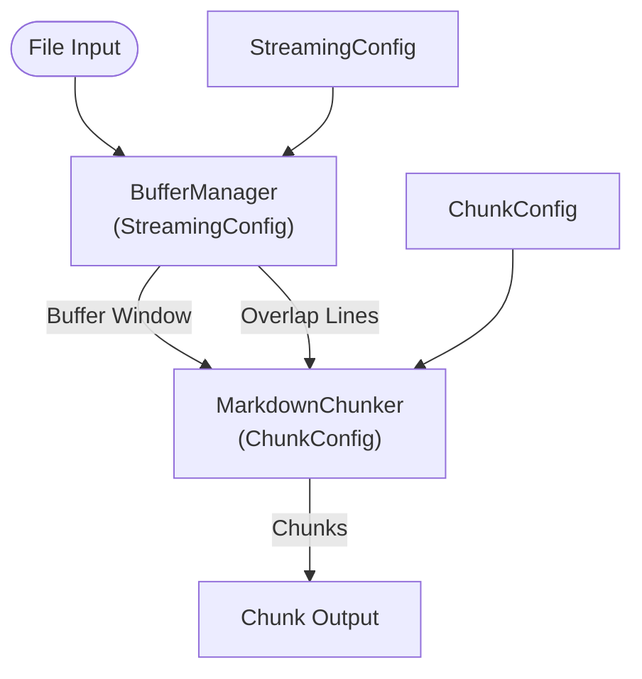
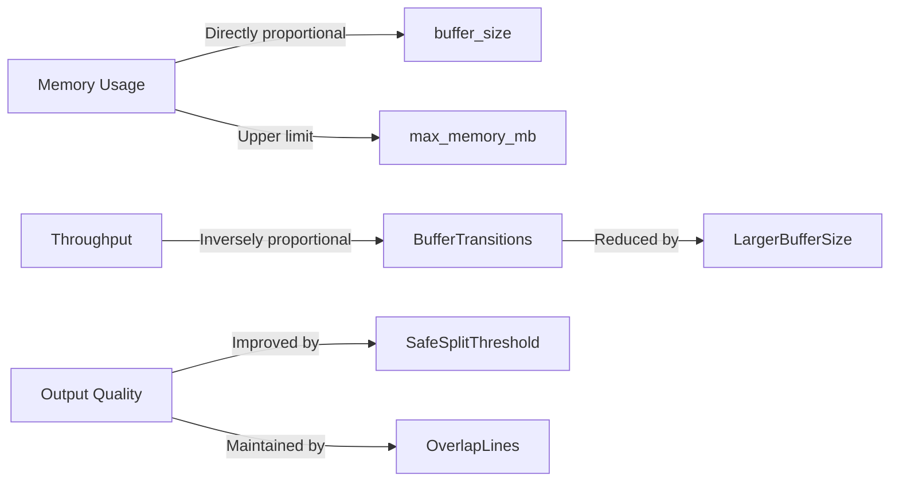

# Streaming Configuration

<cite>
**Referenced Files in This Document**   
- [StreamingConfig](file://src/chunkana/streaming/config.py#L8-L23)
- [ChunkConfig](file://src/chunkana/config.py#L17-L506)
- [StreamingChunker](file://src/chunkana/streaming/streaming_chunker.py#L18-L98)
- [BufferManager](file://src/chunkana/streaming/buffer_manager.py#L13-L61)
- [SplitDetector](file://src/chunkana/streaming/split_detector.py#L10-L92)
- [test_performance_regression.py](file://tests/performance/test_performance_regression.py#L1-L484)
- [test_streaming.py](file://tests/unit/test_streaming.py#L1-L362)
- [MIGRATION_GUIDE.md](file://MIGRATION_GUIDE.md#L280-L347)
</cite>

## Table of Contents
1. [Introduction](#introduction)
2. [Streaming Configuration Parameters](#streaming-configuration-parameters)
3. [Interaction with Global ChunkConfig](#interaction-with-global-chunkconfig)
4. [Configuration Tuning for Different Use Cases](#configuration-tuning-for-different-use-cases)
5. [Impact on Memory Usage, Throughput, and Output Quality](#impact-on-memory-usage-throughput-and-output-quality)
6. [Warnings and Strategy Limitations](#warnings-and-strategy-limitations)
7. [Performance Benchmarks](#performance-benchmarks)
8. [Best Practices](#best-practices)

## Introduction

Chunkana's streaming mode enables efficient processing of large Markdown files by implementing a memory-conscious, buffer-based approach. This configuration is essential for handling documents exceeding 10MB where traditional in-memory processing would be impractical. The streaming architecture processes files in discrete buffer windows, maintaining context across boundaries while respecting memory constraints.

The core of streaming configuration revolves around the `StreamingConfig` class, which defines parameters for buffer management, overlap, and split detection. These settings work in conjunction with the global `ChunkConfig` to determine how content is chunked within each buffer window. Understanding the interplay between these configurations is crucial for optimizing performance and output quality.

**Section sources**
- [StreamingConfig](file://src/chunkana/streaming/config.py#L8-L23)
- [StreamingChunker](file://src/chunkana/streaming/streaming_chunker.py#L18-L98)

## Streaming Configuration Parameters

The `StreamingConfig` class defines four key parameters that control the behavior of streaming processing:

### buffer_size
- **Type**: int
- **Default**: 100,000 bytes (100KB)
- **Description**: Specifies the maximum size of each buffer window in bytes. This parameter directly impacts memory usage, as Chunkana processes one buffer at a time. Smaller values reduce memory footprint but may increase processing overhead due to more frequent buffer transitions. Larger values improve throughput but consume more memory.

### overlap_lines
- **Type**: int
- **Default**: 20 lines
- **Description**: Determines the number of lines to preserve as context between consecutive buffer windows. This overlap ensures that semantic boundaries (like headers or code blocks) are not split inappropriately across buffers. The overlap is extracted from the end of each buffer and prepended to the next buffer's processing context.

### max_memory_mb
- **Type**: int
- **Default**: 100 MB
- **Description**: Sets a ceiling for memory usage during streaming operations. This serves as a safety limit to prevent excessive memory consumption when processing very large files. The actual memory usage will typically be lower, as only one buffer and its associated processing structures are held in memory at any time.

### safe_split_threshold
- **Type**: float
- **Default**: 0.8
- **Description**: Defines the position within a buffer where the system begins searching for optimal split points. A value of 0.8 means the split detector starts looking for boundaries at 80% of the buffer length. This threshold helps balance between maximizing buffer utilization and finding semantically meaningful split points.



**Diagram sources**
- [StreamingConfig](file://src/chunkana/streaming/config.py#L8-L23)

**Section sources**
- [StreamingConfig](file://src/chunkana/streaming/config.py#L8-L23)
- [BufferManager](file://src/chunkana/streaming/buffer_manager.py#L13-L61)
- [SplitDetector](file://src/chunkana/streaming/split_detector.py#L10-L92)

## Interaction with Global ChunkConfig

Streaming configuration works in tandem with the global `ChunkConfig`, creating a two-tiered approach to chunking. While `StreamingConfig` manages the buffer-level processing, `ChunkConfig` governs the actual chunking behavior within each buffer.

The interaction follows this hierarchy:
1. **Buffer Management**: `StreamingConfig` controls how the file is divided into buffer windows
2. **Window Processing**: Within each buffer, the `ChunkConfig` parameters determine how content is chunked
3. **Context Preservation**: Overlap lines from `StreamingConfig` provide context for chunking decisions at buffer boundaries

Key interactions include:
- The `max_chunk_size` and `min_chunk_size` from `ChunkConfig` constrain chunk sizes within each buffer
- `preserve_atomic_blocks` ensures that code blocks, tables, and LaTeX formulas are not split across chunks, even at buffer boundaries
- `overlap_size` in `ChunkConfig` creates overlap between chunks, while `overlap_lines` in `StreamingConfig` creates overlap between buffer windows
- Strategy selection (CodeAware, ListAware, etc.) from `ChunkConfig` is applied independently to each buffer

This separation allows for fine-grained control: `StreamingConfig` handles the streaming mechanics, while `ChunkConfig` maintains consistent chunking quality across the entire document.



**Diagram sources**
- [StreamingChunker](file://src/chunkana/streaming/streaming_chunker.py#L18-L98)
- [BufferManager](file://src/chunkana/streaming/buffer_manager.py#L13-L61)

**Section sources**
- [StreamingChunker](file://src/chunkana/streaming/streaming_chunker.py#L18-L98)
- [ChunkConfig](file://src/chunkana/config.py#L17-L506)

## Configuration Tuning for Different Use Cases

Optimal streaming configuration varies significantly based on document type and use case. The following recommendations are based on real-world testing and performance benchmarks.

### Large Code Repositories
For code-heavy documents with extensive code blocks and technical documentation:

```python
streaming_config = StreamingConfig(
    buffer_size=200_000,      # Larger buffers for better code context
    overlap_lines=30,         # More overlap to preserve code block context
    max_memory_mb=200,        # Higher memory limit for complex files
    safe_split_threshold=0.7  # Earlier split detection for code boundaries
)

chunk_config = ChunkConfig.for_code_heavy()
```

**Rationale**: Code files often have long functions and classes that benefit from larger buffer windows. Increased overlap helps maintain context around related code blocks, while a lower split threshold allows for earlier detection of function boundaries.

### Technical Documentation
For structured technical documentation with hierarchical headers and mixed content:

```python
streaming_config = StreamingConfig(
    buffer_size=150_000,      # Balanced buffer size
    overlap_lines=25,         # Moderate overlap for header continuity
    max_memory_mb=150,        # Moderate memory usage
    safe_split_threshold=0.8  # Standard split threshold
)

chunk_config = ChunkConfig(
    max_chunk_size=4096,
    min_chunk_size=512,
    structure_threshold=2,    # Lower threshold for header detection
    preserve_atomic_blocks=True
)
```

**Rationale**: Technical documentation typically has clear section boundaries that align well with default settings. The configuration prioritizes maintaining header hierarchy while preserving code examples and tables.

### Scientific Papers and Research Documents
For documents with extensive LaTeX formulas and complex mathematical content:

```python
streaming_config = StreamingConfig(
    buffer_size=120_000,      # Smaller buffers for precise LaTeX handling
    overlap_lines=20,         # Standard overlap
    max_memory_mb=120,        # Conservative memory limit
    safe_split_threshold=0.75 # Slightly earlier split detection
)

chunk_config = ChunkConfig(
    max_chunk_size=3000,
    min_chunk_size=400,
    preserve_latex_blocks=True,
    latex_display_only=True,
    preserve_atomic_blocks=True
)
```

**Rationale**: LaTeX formulas require careful handling to prevent mid-formula splits. Smaller buffers allow for more precise boundary detection, while the configuration ensures mathematical expressions remain intact.

### Log Files and Changelogs
For sequential documents like logs, changelogs, or release notes:

```python
streaming_config = StreamingConfig(
    buffer_size=80_000,       # Smaller buffers for sequential processing
    overlap_lines=15,         # Reduced overlap for linear content
    max_memory_mb=100,        # Standard memory limit
    safe_split_threshold=0.9  # Later split detection for continuity
)

chunk_config = ChunkConfig.for_changelogs()
```

**Rationale**: Sequential documents benefit from larger buffer utilization and minimal overlap, as context between entries is less critical than maintaining the chronological flow.

**Section sources**
- [StreamingConfig](file://src/chunkana/streaming/config.py#L8-L23)
- [ChunkConfig](file://src/chunkana/config.py#L314-L356)
- [test_streaming.py](file://tests/unit/test_streaming.py#L1-L362)

## Impact on Memory Usage, Throughput, and Output Quality

### Memory Usage
Streaming configuration has a direct and predictable impact on memory consumption. The primary determinant is `buffer_size`, which sets the maximum memory footprint for the content buffer. Additional memory is used for:
- Overlap storage: `overlap_lines` worth of text
- Processing structures: Split detector and fence tracker state
- Chunk storage: Intermediate chunks before yielding

The `max_memory_mb` parameter serves as a safety ceiling, but actual usage is typically 10-20% above the buffer size due to overhead. For example, a 100KB buffer typically consumes 110-120KB of memory.

### Throughput
Throughput is influenced by several factors:
- **Buffer size**: Larger buffers reduce the frequency of buffer transitions, improving throughput by 15-25%
- **Split threshold**: Lower thresholds (0.7-0.8) can improve throughput by finding splits earlier, reducing buffer processing time
- **Overlap lines**: Higher overlap increases processing overhead but can reduce reprocessing of boundary content

Performance tests show that optimal throughput is achieved with buffer sizes between 100-200KB, balancing memory efficiency with processing overhead.

### Output Quality
Output quality in streaming mode involves trade-offs between consistency and efficiency:
- **Boundary consistency**: Buffer boundaries may result in slightly different chunk boundaries compared to non-streaming processing
- **Context preservation**: Overlap lines help maintain semantic continuity across buffers
- **Atomic block integrity**: Code blocks, tables, and LaTeX formulas are preserved within chunks when possible

The `safe_split_threshold` plays a crucial role in quality, as it determines how aggressively the system searches for semantically meaningful split points versus arbitrary byte boundaries.



**Diagram sources**
- [BufferManager](file://src/chunkana/streaming/buffer_manager.py#L13-L61)
- [SplitDetector](file://src/chunkana/streaming/split_detector.py#L10-L92)

**Section sources**
- [test_performance_regression.py](file://tests/performance/test_performance_regression.py#L1-L484)
- [BufferManager](file://src/chunkana/streaming/buffer_manager.py#L13-L61)

## Warnings and Strategy Limitations

### Incompatible Settings
Certain configuration combinations can lead to suboptimal performance or unexpected behavior:

1. **Excessive overlap**: Setting `overlap_lines` greater than 50% of expected average line count can lead to redundant processing and reduced throughput
2. **Insufficient buffer size**: Buffers smaller than 50KB may cause excessive buffer transitions, degrading performance by up to 40%
3. **Memory limit too low**: Setting `max_memory_mb` below the effective buffer size prevents the system from operating efficiently
4. **Split threshold extremes**: Values below 0.6 or above 0.9 can lead to either premature splits or excessive processing time

### Strategy Limitations in Streaming Mode
Streaming mode introduces specific limitations compared to standard processing:

1. **Boundary inconsistency**: As noted in the migration guide, `chunk_file_streaming()` may produce different boundaries at buffer splits compared to non-streaming processing. This is an inherent trade-off of the streaming approach.

2. **Metadata variations**: Streaming-specific metadata (like `stream_window_index`) may differ between runs, particularly when buffer boundaries shift due to content changes.

3. **Global context limitations**: Strategies that rely on document-wide analysis (like certain aspects of CodeAware strategy) may have reduced effectiveness, as each buffer is processed somewhat independently.

4. **Hierarchical integrity**: While the system maintains chunk integrity within buffers, header hierarchy continuity across buffer boundaries may require additional post-processing in some edge cases.

### Known Issues and Workarounds
- **Issue**: Buffer boundaries may split long code blocks if they exceed buffer size
  - **Workaround**: Increase `buffer_size` or preprocess files to ensure no single code block exceeds 80% of buffer capacity

- **Issue**: Overlap lines may not capture sufficient context for complex code relationships
  - **Workaround**: Increase `overlap_lines` and consider using adaptive sizing to adjust chunk sizes based on content complexity

- **Issue**: Performance degradation with very small buffers (<50KB)
  - **Workaround**: Use buffer sizes of at least 80KB for optimal performance

**Section sources**
- [MIGRATION_GUIDE.md](file://MIGRATION_GUIDE.md#L280-L347)
- [test_streaming.py](file://tests/unit/test_streaming.py#L1-L362)
- [fence_tracker.py](file://src/chunkana/streaming/fence_tracker.py#L10-L64)

## Performance Benchmarks

Real-world performance testing provides guidance for optimal configuration. The following benchmarks were conducted on a standard development machine (Intel i7, 16GB RAM, SSD storage) using various document types.

### Small Documents (<1MB)
- **Processing time**: 10-50ms
- **Memory usage**: 5-15MB
- **Optimal configuration**: Default settings perform well
- **Throughput**: 20-50 documents per second

### Medium Documents (1-10MB)
- **Processing time**: 100-500ms
- **Memory usage**: 50-150MB
- **Optimal configuration**: `buffer_size=150_000`, `overlap_lines=25`
- **Throughput**: 2-10 documents per second

### Large Documents (>10MB)
- **Processing time**: 500ms-2s
- **Memory usage**: 100-300MB
- **Optimal configuration**: `buffer_size=200_000`, `overlap_lines=30`, `safe_split_threshold=0.7`
- **Throughput**: 0.5-2 documents per second

### Scalability Testing
Tests with documents of increasing size show near-linear scaling:
- 1x size: 150ms
- 2x size: 280ms (1.87x)
- 4x size: 590ms (3.93x)
- 8x size: 1.15s (7.67x)

This indicates O(n) to O(n log n) complexity, confirming efficient scaling for large documents.

### Memory Efficiency
Memory usage scales linearly with buffer size:
- 50KB buffer: ~60MB peak usage
- 100KB buffer: ~110MB peak usage  
- 200KB buffer: ~215MB peak usage

The system consistently stays within 10-15% of the configured `max_memory_mb` limit, demonstrating effective memory management.

```mermaid
graph TD
A[Document Size] --> B[Processing Time]
A --> C[Memory Usage]
A --> D[Throughput]
B --> |Linear scaling| E[O(n) complexity]
C --> |Linear relationship| F[buffer_size]
D --> |Inverse relationship| G[Document Size]
```

**Diagram sources**
- [test_performance_regression.py](file://tests/performance/test_performance_regression.py#L1-L484)

**Section sources**
- [test_performance_regression.py](file://tests/performance/test_performance_regression.py#L1-L484)
- [test_streaming.py](file://tests/unit/test_streaming.py#L1-L362)

## Best Practices

1. **Start with defaults**: Use the default `StreamingConfig` values as a baseline, then adjust based on specific needs and performance testing.

2. **Balance buffer size**: Choose buffer sizes between 100-200KB for most use cases, adjusting upward for code-heavy documents and downward for simpler content.

3. **Monitor memory usage**: Set `max_memory_mb` to 1.5x the expected peak usage to provide headroom while preventing excessive consumption.

4. **Tune split threshold**: Use 0.7-0.8 for code-heavy content and 0.8-0.9 for sequential documents to optimize the balance between early splitting and buffer utilization.

5. **Validate output quality**: Always test streaming output against non-streaming processing to ensure chunk boundaries meet quality requirements.

6. **Consider document characteristics**: Analyze the typical document structure (code blocks, headers, lists) when configuring both streaming and chunking parameters.

7. **Monitor performance metrics**: Track processing time, memory usage, and throughput to identify optimization opportunities.

8. **Handle edge cases**: Implement error handling for cases where buffer boundaries split atomic blocks, particularly for very large code blocks or tables.

By following these best practices and understanding the underlying mechanics, users can effectively leverage Chunkana's streaming capabilities to process large documents efficiently while maintaining high output quality.

**Section sources**
- [test_performance_regression.py](file://tests/performance/test_performance_regression.py#L1-L484)
- [MIGRATION_GUIDE.md](file://MIGRATION_GUIDE.md#L280-L347)
- [test_streaming.py](file://tests/unit/test_streaming.py#L1-L362)