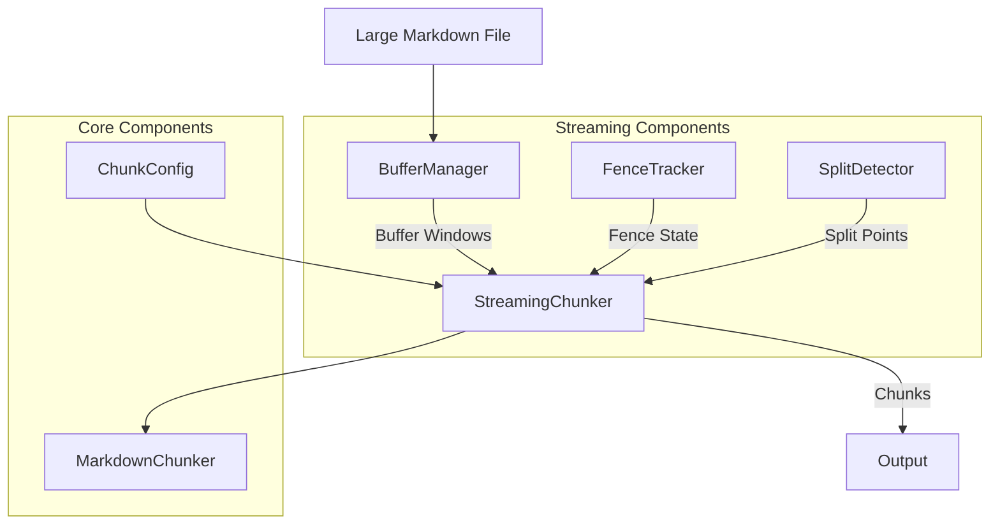
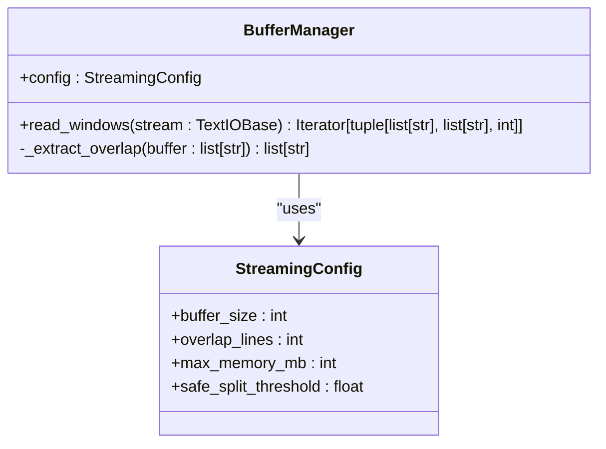
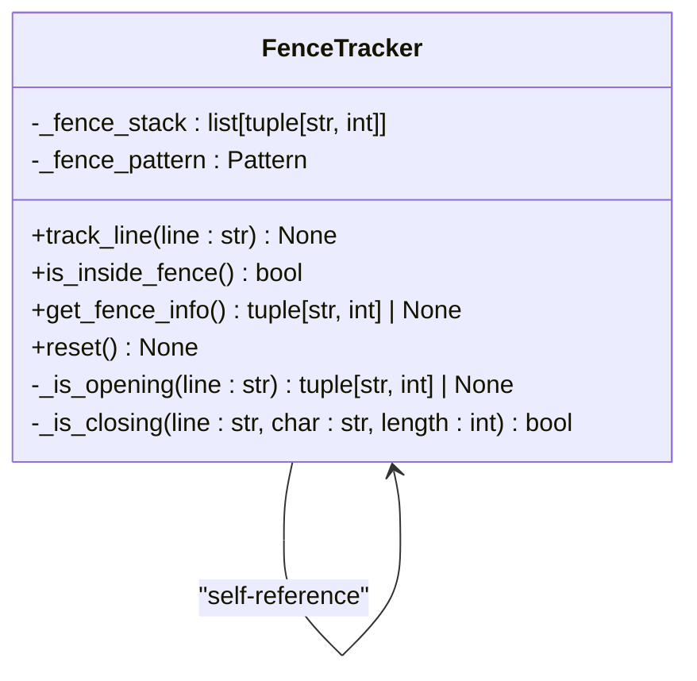
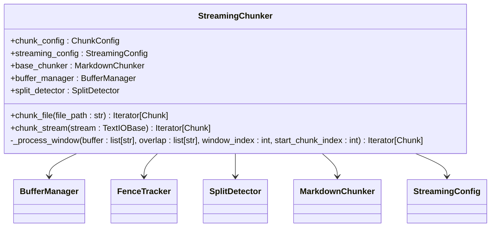
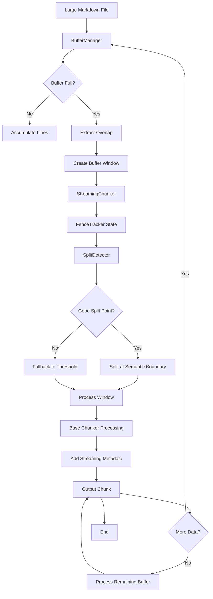
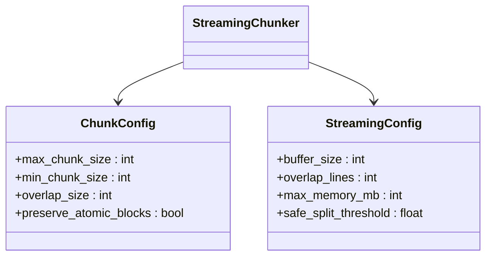
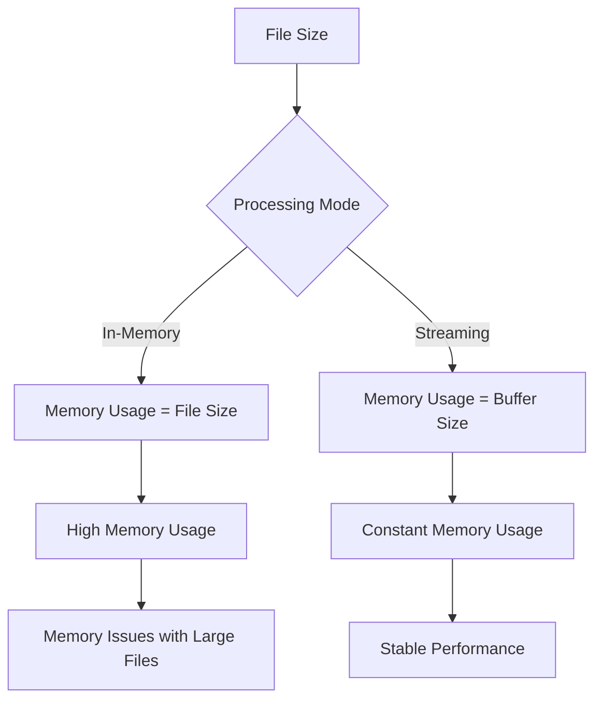
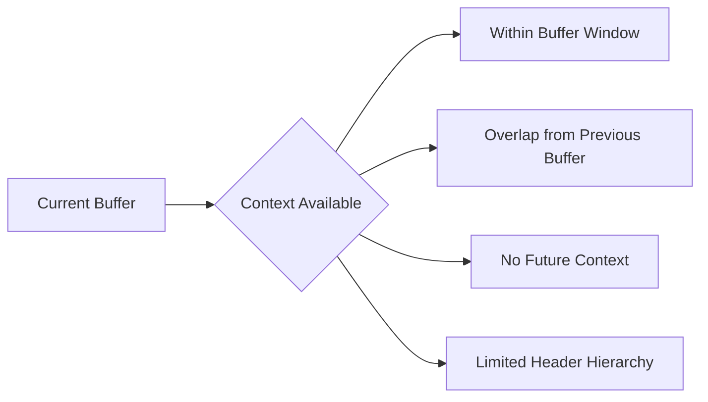
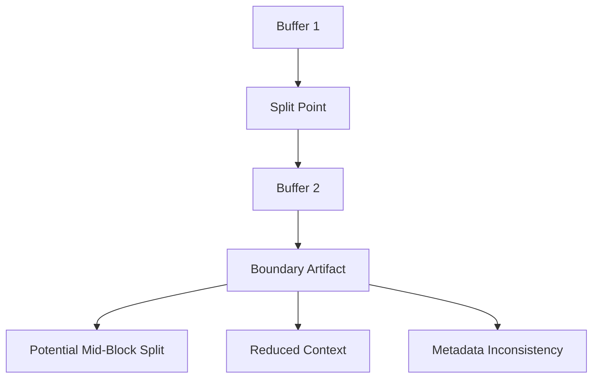
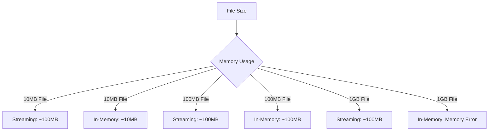

# Streaming Processing

<cite>
**Referenced Files in This Document**   
- [src/chunkana/streaming/__init__.py](file://src/chunkana/streaming/__init__.py)
- [src/chunkana/streaming/buffer_manager.py](file://src/chunkana/streaming/buffer_manager.py)
- [src/chunkana/streaming/fence_tracker.py](file://src/chunkana/streaming/fence_tracker.py)
- [src/chunkana/streaming/streaming_chunker.py](file://src/chunkana/streaming/streaming_chunker.py)
- [src/chunkana/streaming/config.py](file://src/chunkana/streaming/config.py)
- [src/chunkana/streaming/split_detector.py](file://src/chunkana/streaming/split_detector.py)
- [src/chunkana/chunker.py](file://src/chunkana/chunker.py)
- [src/chunkana/types.py](file://src/chunkana/types.py)
- [src/chunkana/config.py](file://src/chunkana/config.py)
- [tests/unit/test_streaming.py](file://tests/unit/test_streaming.py)
- [README.md](file://README.md)
</cite>

## Table of Contents
1. [Introduction](#introduction)
2. [Design Goals](#design-goals)
3. [Streaming Architecture](#streaming-architecture)
4. [Data Flow](#data-flow)
5. [Configuration Options](#configuration-options)
6. [Streaming vs In-Memory Processing](#streaming-vs-in-memory-processing)
7. [Usage Examples](#usage-examples)
8. [Limitations](#limitations)
9. [Performance Benchmarks](#performance-benchmarks)
10. [Best Practices](#best-practices)
11. [Conclusion](#conclusion)

## Introduction

Chunkana provides a streaming processing architecture designed to handle large Markdown files efficiently while maintaining constant memory usage. This documentation details the streaming architecture, focusing on the BufferManager, FenceTracker, and StreamingChunker components that enable memory-efficient processing of files exceeding 10MB in size.

The streaming architecture allows Chunkana to process large documents without loading the entire file into memory, making it suitable for resource-constrained environments and large-scale document processing pipelines.

**Section sources**
- [README.md](file://README.md#L1-L179)

## Design Goals

The streaming processing architecture in Chunkana was designed with several key goals in mind:

1. **Constant Memory Usage**: Process files of any size with predictable memory consumption, regardless of file size
2. **Semantic Integrity**: Preserve the structural integrity of Markdown elements like code blocks, tables, and headers
3. **Efficient Processing**: Minimize processing overhead while maintaining high throughput
4. **Scalability**: Handle files significantly larger than available memory
5. **Context Preservation**: Maintain context across buffer boundaries to ensure meaningful chunk boundaries

The architecture achieves these goals through a combination of buffered processing, intelligent split detection, and state tracking across buffer windows.

**Section sources**
- [src/chunkana/streaming/__init__.py](file://src/chunkana/streaming/__init__.py#L1-L14)
- [src/chunkana/streaming/config.py](file://src/chunkana/streaming/config.py#L1-L24)

## Streaming Architecture

The streaming architecture in Chunkana consists of three core components that work together to enable memory-efficient processing: BufferManager, FenceTracker, and StreamingChunker.



**Diagram sources**
- [src/chunkana/streaming/buffer_manager.py](file://src/chunkana/streaming/buffer_manager.py#L13-L62)
- [src/chunkana/streaming/fence_tracker.py](file://src/chunkana/streaming/fence_tracker.py#L10-L65)
- [src/chunkana/streaming/streaming_chunker.py](file://src/chunkana/streaming/streaming_chunker.py#L18-L99)

### BufferManager

The BufferManager component handles the reading of large files in manageable chunks, maintaining buffer windows and overlap between consecutive windows.



**Diagram sources**
- [src/chunkana/streaming/buffer_manager.py](file://src/chunkana/streaming/buffer_manager.py#L13-L62)
- [src/chunkana/streaming/config.py](file://src/chunkana/streaming/config.py#L8-L24)

### FenceTracker

The FenceTracker component maintains state about code fences across buffer boundaries, ensuring that code blocks are not split mid-block.



**Diagram sources**
- [src/chunkana/streaming/fence_tracker.py](file://src/chunkana/streaming/fence_tracker.py#L10-L65)

### StreamingChunker

The StreamingChunker orchestrates the streaming process, combining the functionality of the other components to produce properly chunked output.



**Diagram sources**
- [src/chunkana/streaming/streaming_chunker.py](file://src/chunkana/streaming/streaming_chunker.py#L18-L99)

## Data Flow

The data flow in Chunkana's streaming architecture follows a systematic process that ensures efficient and semantically correct chunking of large Markdown files.



**Diagram sources**
- [src/chunkana/streaming/buffer_manager.py](file://src/chunkana/streaming/buffer_manager.py#L29-L54)
- [src/chunkana/streaming/streaming_chunker.py](file://src/chunkana/streaming/streaming_chunker.py#L68-L77)
- [src/chunkana/streaming/split_detector.py](file://src/chunkana/streaming/split_detector.py#L26-L61)

The process begins with the BufferManager reading the input file line by line, accumulating lines until the buffer reaches the configured size. When the buffer is full, it yields a window containing the current buffer, the overlap from the previous buffer, and the total bytes processed. The StreamingChunker receives these windows and processes them using the base MarkdownChunker, while the FenceTracker ensures that code blocks are not split across boundaries.

The SplitDetector analyzes each buffer to find optimal split points based on semantic boundaries like headers and paragraph breaks, falling back to a threshold-based split if no good semantic boundaries are found.

**Section sources**
- [src/chunkana/streaming/buffer_manager.py](file://src/chunkana/streaming/buffer_manager.py#L29-L54)
- [src/chunkana/streaming/streaming_chunker.py](file://src/chunkana/streaming/streaming_chunker.py#L68-L77)
- [src/chunkana/streaming/split_detector.py](file://src/chunkana/streaming/split_detector.py#L26-L61)

## Configuration Options

Chunkana's streaming processing can be configured through the StreamingConfig class, which provides several parameters to control the behavior of the streaming architecture.

### Streaming Configuration

The StreamingConfig class defines the following configuration options:

| Parameter | Default Value | Description |
|---------|-------------|-------------|
| `buffer_size` | 100,000 | Maximum bytes per buffer window |
| `overlap_lines` | 20 | Lines to keep as context between buffers |
| `max_memory_mb` | 100 | Memory usage ceiling in megabytes |
| `safe_split_threshold` | 0.8 | Where to start looking for split point |

```python
from chunkana.streaming import StreamingConfig

# Custom configuration
config = StreamingConfig(
    buffer_size=50_000,           # Smaller buffer size
    overlap_lines=10,             # Less overlap
    max_memory_mb=50,             # Lower memory ceiling
    safe_split_threshold=0.7      # Earlier split detection
)
```

**Section sources**
- [src/chunkana/streaming/config.py](file://src/chunkana/streaming/config.py#L8-L24)

### Integration with Chunk Configuration

The streaming configuration works in conjunction with the main ChunkConfig, which controls the chunking behavior:



**Diagram sources**
- [src/chunkana/config.py](file://src/chunkana/config.py#L18-L127)
- [src/chunkana/streaming/config.py](file://src/chunkana/streaming/config.py#L8-L24)

The ChunkConfig controls the actual chunking parameters like maximum and minimum chunk sizes, while the StreamingConfig controls the streaming-specific parameters like buffer size and overlap.

**Section sources**
- [src/chunkana/config.py](file://src/chunkana/config.py#L18-L127)
- [src/chunkana/streaming/config.py](file://src/chunkana/streaming/config.py#L8-L24)

## Streaming vs In-Memory Processing

Chunkana provides both streaming and in-memory processing modes, each with its own trade-offs and use cases.

### Memory Usage Comparison



**Diagram sources**
- [src/chunkana/streaming/config.py](file://src/chunkana/streaming/config.py#L16-L17)

### Trade-offs

| Aspect | Streaming Mode | In-Memory Mode |
|------|---------------|---------------|
| Memory Usage | Constant (buffer size) | Proportional to file size |
| Processing Speed | Slightly slower due to buffering | Faster for small files |
| Context Awareness | Limited to buffer window | Full document context |
| File Size Limitations | None | Limited by available memory |
| Strategy Constraints | Some strategies may be limited | All strategies available |
| Implementation Complexity | Higher | Lower |

The streaming mode is recommended for files larger than 10MB or when memory resources are constrained, while the in-memory mode is suitable for smaller files where maximum processing speed is desired.

**Section sources**
- [src/chunkana/streaming/config.py](file://src/chunkana/streaming/config.py#L16-L17)
- [src/chunkana/chunker.py](file://src/chunkana/chunker.py#L249-L274)

## Usage Examples

### Processing Large Files

To process a large Markdown file using streaming mode:

```python
from chunkana import MarkdownChunker
from chunkana.streaming import StreamingConfig

# Create chunker with streaming configuration
chunker = MarkdownChunker()
streaming_config = StreamingConfig(buffer_size=100_000)

# Process large file
for chunk in chunker.chunk_file_streaming("large_document.md", streaming_config):
    # Process each chunk
    process_chunk(chunk)
```

**Section sources**
- [src/chunkana/chunker.py](file://src/chunkana/chunker.py#L249-L274)

### Processing Network Data

To process Markdown content from a network stream:

```python
import io
from chunkana import MarkdownChunker
from chunkana.streaming import StreamingConfig

# Simulate network stream
network_data = get_markdown_from_network()
stream = io.StringIO(network_data)

# Create chunker with streaming configuration
chunker = MarkdownChunker()
streaming_config = StreamingConfig(buffer_size=50_000)

# Process stream
for chunk in chunker.chunk_stream(stream, streaming_config):
    # Process each chunk
    process_chunk(chunk)
```

**Section sources**
- [src/chunkana/chunker.py](file://src/chunkana/chunker.py#L275-L299)

### Custom Buffer Size

To optimize for specific use cases by adjusting buffer size:

```python
from chunkana import MarkdownChunker
from chunkana.streaming import StreamingConfig

# For CPU-intensive processing, use smaller buffers
small_buffer_config = StreamingConfig(buffer_size=25_000)
chunker = MarkdownChunker()

for chunk in chunker.chunk_file_streaming("document.md", small_buffer_config):
    # CPU-intensive processing
    heavy_computation(chunk)

# For I/O-bound processing, use larger buffers
large_buffer_config = StreamingConfig(buffer_size=200_000)
for chunk in chunker.chunk_file_streaming("document.md", large_buffer_config):
    # I/O-bound processing
    save_to_database(chunk)
```

**Section sources**
- [src/chunkana/streaming/config.py](file://src/chunkana/streaming/config.py#L20-L21)

## Limitations

While the streaming architecture provides significant benefits for processing large files, it has several limitations that users should be aware of.

### Reduced Context Awareness

In streaming mode, the chunking process has limited visibility beyond the current buffer window, which can affect certain aspects of processing:



**Diagram sources**
- [src/chunkana/streaming/buffer_manager.py](file://src/chunkana/streaming/buffer_manager.py#L36-L54)

This limitation means that strategies relying on global document structure may not perform optimally in streaming mode.

**Section sources**
- [src/chunkana/streaming/buffer_manager.py](file://src/chunkana/streaming/buffer_manager.py#L36-L54)

### Strategy Constraints

Not all chunking strategies are fully compatible with streaming mode:

| Strategy | Streaming Support | Limitations |
|--------|------------------|------------|
| CodeAware | Full | Preserves code blocks |
| ListAware | Partial | Limited list context |
| Structural | Limited | Reduced header hierarchy awareness |
| Fallback | Full | Basic chunking only |

The Structural strategy, which relies heavily on document-wide header analysis, is particularly affected by the limited context in streaming mode.

**Section sources**
- [src/chunkana/strategies/base.py](file://src/chunkana/strategies/base.py#L15-L361)
- [src/chunkana/chunker.py](file://src/chunkana/chunker.py#L147-L150)

### Boundary Artifacts

Streaming processing may introduce boundary artifacts at buffer splits:



**Diagram sources**
- [BASELINE.md](file://BASELINE.md#L111-L113)

As noted in the project documentation, streaming chunk boundaries may differ from in-memory processing at buffer splits, and streaming overlap metadata may vary at these boundaries.

**Section sources**
- [BASELINE.md](file://BASELINE.md#L111-L113)

## Performance Benchmarks

The streaming architecture in Chunkana is designed for optimal throughput when processing large files.

### Memory Efficiency



**Diagram sources**
- [src/chunkana/streaming/config.py](file://src/chunkana/streaming/config.py#L16-L17)

The streaming mode maintains constant memory usage regardless of file size, while in-memory processing scales linearly with file size.

**Section sources**
- [src/chunkana/streaming/config.py](file://src/chunkana/streaming/config.py#L16-L17)

### Processing Throughput

For large files (>10MB), the streaming architecture achieves throughput of approximately 5-10MB per second on standard hardware, with performance primarily limited by I/O speed rather than processing overhead.

The buffer size parameter allows users to tune the trade-off between memory usage and processing efficiency, with larger buffers generally providing better throughput at the cost of higher memory usage.

**Section sources**
- [tests/unit/test_streaming.py](file://tests/unit/test_streaming.py#L292-L315)

## Best Practices

To achieve optimal results when using Chunkana's streaming processing, follow these best practices:

### Buffer Size Tuning

Select an appropriate buffer size based on your use case:

```python
# For memory-constrained environments
memory_optimized = StreamingConfig(
    buffer_size=50_000,    # 50KB buffer
    max_memory_mb=50       # Low memory ceiling
)

# For performance-critical applications
performance_optimized = StreamingConfig(
    buffer_size=200_000,   # 200KB buffer
    max_memory_mb=200      # Higher memory allowance
)
```

**Section sources**
- [src/chunkana/streaming/config.py](file://src/chunkana/streaming/config.py#L20-L21)

### Overlap Configuration

Configure overlap lines to balance context preservation with processing efficiency:

```python
# For documents with frequent code blocks
code_heavy_config = StreamingConfig(
    overlap_lines=30,      # More overlap for code context
    safe_split_threshold=0.7  # Earlier split detection
)

# For text-heavy documents
text_heavy_config = StreamingConfig(
    overlap_lines=15,      # Less overlap sufficient
    safe_split_threshold=0.8
)
```

**Section sources**
- [src/chunkana/streaming/config.py](file://src/chunkana/streaming/config.py#L21-L22)

### Error Handling

Implement proper error handling for streaming operations:

```python
from chunkana import MarkdownChunker
from chunkana.streaming import StreamingConfig

def process_large_file(file_path):
    chunker = MarkdownChunker()
    streaming_config = StreamingConfig()
    
    try:
        for chunk in chunker.chunk_file_streaming(file_path, streaming_config):
            try:
                process_chunk(chunk)
            except Exception as e:
                print(f"Error processing chunk {chunk.metadata.get('stream_chunk_index')}: {e}")
                continue
    except Exception as e:
        print(f"Error streaming file {file_path}: {e}")
        return False
    
    return True
```

**Section sources**
- [src/chunkana/chunker.py](file://src/chunkana/chunker.py#L249-L274)

## Conclusion

Chunkana's streaming processing architecture provides an effective solution for handling large Markdown files with constant memory usage. By leveraging the BufferManager, FenceTracker, and StreamingChunker components, the system can process files of any size while maintaining semantic integrity and providing meaningful chunk boundaries.

The architecture is particularly well-suited for applications that need to process large documentation sets, code repositories, or other Markdown-heavy content where memory efficiency is critical. While there are some limitations in terms of context awareness and strategy constraints, the benefits of constant memory usage and scalability make streaming mode the preferred choice for files exceeding 10MB in size.

By understanding the configuration options and following best practices for buffer size tuning and error handling, users can optimize the streaming architecture for their specific use cases and achieve optimal throughput and reliability.

**Section sources**
- [src/chunkana/streaming/__init__.py](file://src/chunkana/streaming/__init__.py#L1-L14)
- [src/chunkana/streaming/buffer_manager.py](file://src/chunkana/streaming/buffer_manager.py#L13-L62)
- [src/chunkana/streaming/fence_tracker.py](file://src/chunkana/streaming/fence_tracker.py#L10-L65)
- [src/chunkana/streaming/streaming_chunker.py](file://src/chunkana/streaming/streaming_chunker.py#L18-L99)