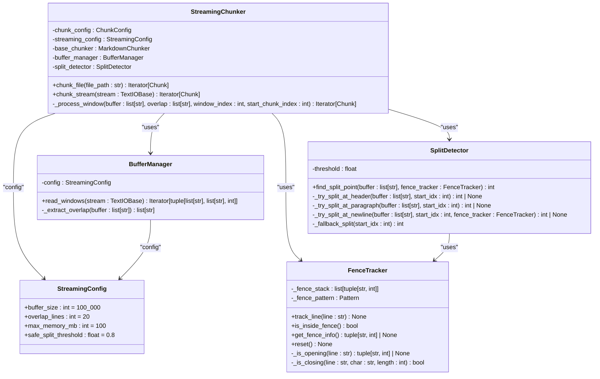
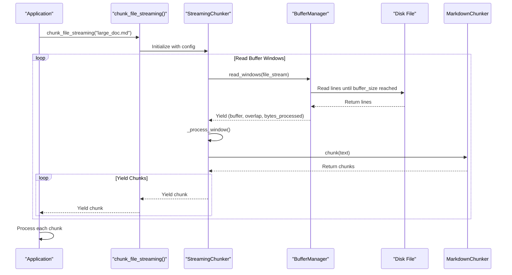
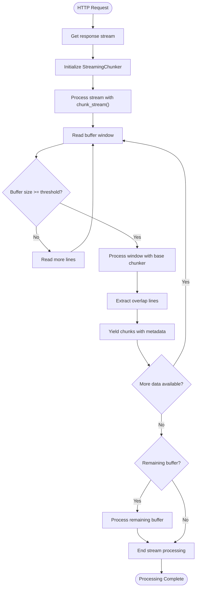
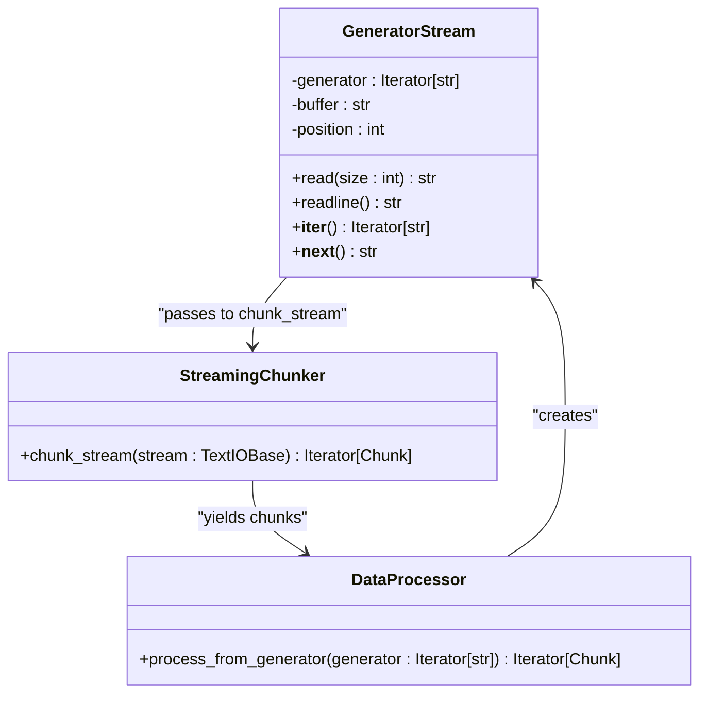
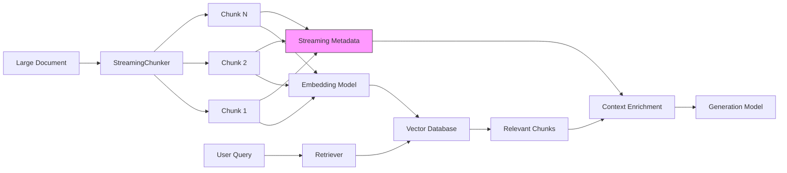
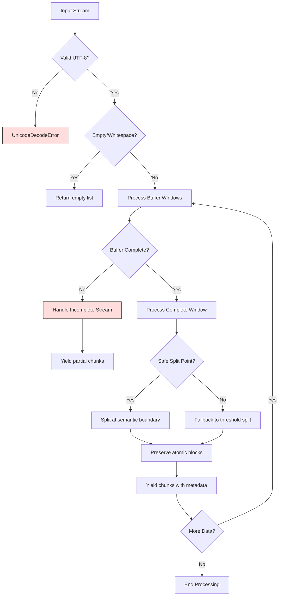
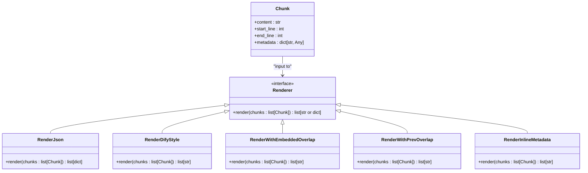
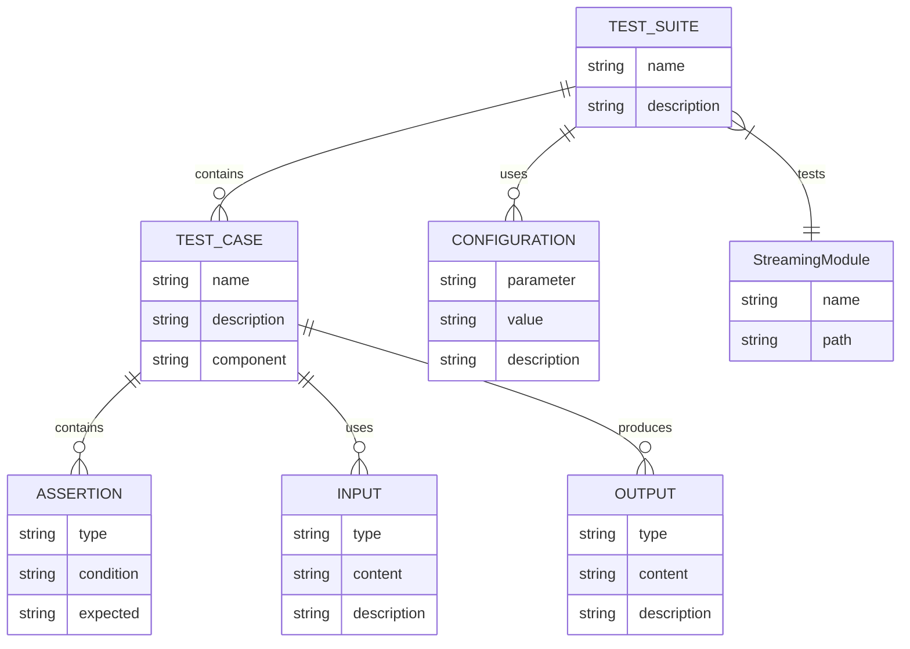

# Streaming Usage Patterns

<cite>
**Referenced Files in This Document**   
- [StreamingConfig](file://src/chunkana/streaming/config.py)
- [StreamingChunker](file://src/chunkana/streaming/streaming_chunker.py)
- [BufferManager](file://src/chunkana/streaming/buffer_manager.py)
- [SplitDetector](file://src/chunkana/streaming/split_detector.py)
- [FenceTracker](file://src/chunkana/streaming/fence_tracker.py)
- [chunk_file_streaming](file://src/chunkana/api.py#L228-L271)
- [MarkdownChunker.chunk_file_streaming](file://src/chunkana/chunker.py#L249-L274)
- [MarkdownChunker.chunk_stream](file://src/chunkana/chunker.py#L275-L299)
- [render_json](file://src/chunkana/renderers/formatters.py#L15-L27)
- [render_dify_style](file://src/chunkana/renderers/formatters.py#L56-L84)
- [render_with_embedded_overlap](file://src/chunkana/renderers/formatters.py#L87-L116)
- [render_with_prev_overlap](file://src/chunkana/renderers/formatters.py#L119-L145)
- [test_streaming.py](file://tests/unit/test_streaming.py)
</cite>

## Table of Contents
1. [Introduction](#introduction)
2. [Core Streaming Components](#core-streaming-components)
3. [Processing Large Files from Disk](#processing-large-files-from-disk)
4. [Handling Network Streams](#handling-network-streams)
5. [Generator-Based Source Processing](#generator-based-source-processing)
6. [Integration with RAG Pipelines](#integration-with-rag-pipelines)
7. [Error Handling Strategies](#error-handling-strategies)
8. [Renderer Integration and Output Formats](#renderer-integration-and-output-formats)
9. [Performance Optimization](#performance-optimization)
10. [Common Pitfalls and Solutions](#common-pitfalls-and-solutions)
11. [Test Case Validation](#test-case-validation)

## Introduction

Chunkana's streaming API provides memory-efficient processing for large markdown files, enabling chunking of documents exceeding 10MB without loading the entire file into memory. The streaming architecture processes files in buffer windows with configurable overlap, maintaining critical invariants such as line coverage, atomic block preservation, and monotonic ordering. This document details practical usage patterns for the streaming API, covering various input sources, error handling strategies, renderer integration, performance optimization, and common pitfalls.

**Section sources**
- [StreamingChunker](file://src/chunkana/streaming/streaming_chunker.py#L1-L99)
- [chunk_file_streaming](file://src/chunkana/api.py#L228-L271)

## Core Streaming Components

The streaming architecture consists of several key components that work together to enable memory-efficient processing:



**Diagram sources **
- [StreamingConfig](file://src/chunkana/streaming/config.py#L8-L23)
- [StreamingChunker](file://src/chunkana/streaming/streaming_chunker.py#L18-L99)
- [BufferManager](file://src/chunkana/streaming/buffer_manager.py#L13-L61)
- [SplitDetector](file://src/chunkana/streaming/split_detector.py#L10-L93)
- [FenceTracker](file://src/chunkana/streaming/fence_tracker.py#L10-L65)

**Section sources**
- [StreamingConfig](file://src/chunkana/streaming/config.py#L8-L23)
- [StreamingChunker](file://src/chunkana/streaming/streaming_chunker.py#L18-L99)
- [BufferManager](file://src/chunkana/streaming/buffer_manager.py#L13-L61)
- [SplitDetector](file://src/chunkana/streaming/split_detector.py#L10-L93)
- [FenceTracker](file://src/chunkana/streaming/fence_tracker.py#L10-L65)

## Processing Large Files from Disk

The primary interface for processing large files from disk is the `chunk_file_streaming` function, which can be accessed through both the API module and the MarkdownChunker class. This function reads files in chunks, processes them in buffer windows, and yields chunks incrementally.



**Diagram sources **
- [chunk_file_streaming](file://src/chunkana/api.py#L228-L271)
- [StreamingChunker.chunk_file](file://src/chunkana/streaming/streaming_chunker.py#L43-L54)
- [BufferManager.read_windows](file://src/chunkana/streaming/buffer_manager.py#L29-L55)

**Section sources**
- [chunk_file_streaming](file://src/chunkana/api.py#L228-L271)
- [StreamingChunker.chunk_file](file://src/chunkana/streaming/streaming_chunker.py#L43-L54)
- [BufferManager.read_windows](file://src/chunkana/streaming/buffer_manager.py#L29-L55)

## Handling Network Streams

For network streams or any text stream source, use the `chunk_stream` method of the MarkdownChunker class or the streaming capabilities of the StreamingChunker directly. This approach is ideal for processing content from HTTP responses, database streams, or other network sources.



**Diagram sources **
- [MarkdownChunker.chunk_stream](file://src/chunkana/chunker.py#L275-L299)
- [StreamingChunker.chunk_stream](file://src/chunkana/streaming/streaming_chunker.py#L56-L78)
- [BufferManager.read_windows](file://src/chunkana/streaming/buffer_manager.py#L29-L55)

**Section sources**
- [MarkdownChunker.chunk_stream](file://src/chunkana/chunker.py#L275-L299)
- [StreamingChunker.chunk_stream](file://src/chunkana/streaming/streaming_chunker.py#L56-L78)

## Generator-Based Source Processing

Generator-based sources can be processed by wrapping them in a text stream interface. This pattern is useful for processing data from databases, message queues, or other sources that provide data through generators.



**Diagram sources **
- [StreamingChunker.chunk_stream](file://src/chunkana/streaming/streaming_chunker.py#L56-L78)
- [BufferManager.read_windows](file://src/chunkana/streaming/buffer_manager.py#L29-L55)

**Section sources**
- [StreamingChunker.chunk_stream](file://src/chunkana/streaming/streaming_chunker.py#L56-L78)

## Integration with RAG Pipelines

The streaming API integrates seamlessly with RAG (Retrieval-Augmented Generation) pipelines by providing chunks with metadata that enhances context preservation. The overlap metadata fields (`previous_content` and `next_content`) are particularly valuable for maintaining context across chunk boundaries.



**Diagram sources **
- [MarkdownChunker._apply_overlap](file://src/chunkana/chunker.py#L301-L369)
- [Chunk](file://src/chunkana/types.py#L241-L375)

**Section sources**
- [MarkdownChunker._apply_overlap](file://src/chunkana/chunker.py#L301-L369)

## Error Handling Strategies

The streaming API includes comprehensive error handling for various scenarios, including incomplete streams and corrupted input. The system maintains invariants even when processing malformed input.



**Diagram sources **
- [StreamingChunker.chunk_stream](file://src/chunkana/streaming/streaming_chunker.py#L56-L78)
- [BufferManager.read_windows](file://src/chunkana/streaming/buffer_manager.py#L29-L55)
- [SplitDetector.find_split_point](file://src/chunkana/streaming/split_detector.py#L26-L61)

**Section sources**
- [StreamingChunker.chunk_stream](file://src/chunkana/streaming/streaming_chunker.py#L56-L78)
- [BufferManager.read_windows](file://src/chunkana/streaming/buffer_manager.py#L29-L55)
- [SplitDetector.find_split_point](file://src/chunkana/streaming/split_detector.py#L26-L61)

## Renderer Integration and Output Formats

The streaming API integrates with various renderers to produce different output formats suitable for different downstream applications. The renderers are pure functions that format chunks without modifying them.



**Diagram sources **
- [render_json](file://src/chunkana/renderers/formatters.py#L15-L27)
- [render_dify_style](file://src/chunkana/renderers/formatters.py#L56-L84)
- [render_with_embedded_overlap](file://src/chunkana/renderers/formatters.py#L87-L116)
- [render_with_prev_overlap](file://src/chunkana/renderers/formatters.py#L119-L145)
- [render_inline_metadata](file://src/chunkana/renderers/formatters.py#L30-L53)

**Section sources**
- [render_json](file://src/chunkana/renderers/formatters.py#L15-L27)
- [render_dify_style](file://src/chunkana/renderers/formatters.py#L56-L84)
- [render_with_embedded_overlap](file://src/chunkana/renderers/formatters.py#L87-L116)
- [render_with_prev_overlap](file://src/chunkana/renderers/formatters.py#L119-L145)

## Performance Optimization

Optimal performance can be achieved by tuning buffer size, overlap lines, and other streaming configuration parameters based on the specific use case and hardware constraints.

```mermaid
flowchart TD
A[Performance Goals] --> B{Memory Constrained?}
B --> |Yes| C[Smaller buffer_size<br/>(e.g., 50KB)]
B --> |No| D[Larger buffer_size<br/>(e.g., 500KB)]
A --> E{Preserve Context?}
E --> |Yes| F[Increase overlap_lines<br/>(e.g., 30-50)]
E --> |No| G[Default overlap_lines<br/>(20)]
A --> H{Large Files?}
H --> |Yes| I[Adjust safe_split_threshold<br/>(e.g., 0.7-0.9)]
H --> |No| J[Default safe_split_threshold<br/>(0.8)]
C --> K[Monitor max_memory_mb]
D --> K
F --> L[Test with sample data]
G --> L
I --> L
J --> L
L --> M[Measure throughput]
M --> N{Optimal?}
N --> |No| O[Adjust parameters]
O --> L
N --> |Yes| P[Deploy optimized config]
style K fill:#ff9,stroke:#333
style L fill:#ff9,stroke:#333
style M fill:#ff9,stroke:#333
```

**Diagram sources **
- [StreamingConfig](file://src/chunkana/streaming/config.py#L8-L23)
- [BufferManager](file://src/chunkana/streaming/buffer_manager.py#L13-L61)
- [SplitDetector](file://src/chunkana/streaming/split_detector.py#L10-L93)

**Section sources**
- [StreamingConfig](file://src/chunkana/streaming/config.py#L8-L23)

## Common Pitfalls and Solutions

Several common pitfalls can occur when using the streaming API, but they can be avoided with proper usage patterns and awareness of the system's behavior.

```mermaid
flowchart TD
A[Common Pitfalls] --> B[Improper Stream Closure]
A --> C[Memory Leaks]
A --> D[Inconsistent Chunk Boundaries]
A --> E[Lost Metadata]
B --> F[Use context managers<br/>with open() or StringIO]
C --> G[Process chunks immediately<br/>avoid storing all in memory]
D --> H[Understand buffer-based<br/>splitting differences]
E --> I[Preserve metadata when<br/>transforming chunks]
F --> J[Solution: Always use 'with' statements]
G --> K[Solution: Process chunks in pipeline]
H --> L[Solution: Accept streaming<br/>boundary variations]
I --> M[Solution: Copy metadata when<br/>creating new chunks]
style B fill:#fdd,stroke:#333
style C fill:#fdd,stroke:#333
style D fill:#fdd,stroke:#333
style E fill:#fdd,stroke:#333
style J fill:#dfd,stroke:#333
style K fill:#dfd,stroke:#333
style L fill:#dfd,stroke:#333
style M fill:#dfd,stroke:#333
```

**Diagram sources **
- [StreamingChunker.chunk_file](file://src/chunkana/streaming/streaming_chunker.py#L53-L54)
- [StreamingChunker.chunk_stream](file://src/chunkana/streaming/streaming_chunker.py#L68-L77)
- [Chunk](file://src/chunkana/types.py#L241-L375)

**Section sources**
- [StreamingChunker.chunk_file](file://src/chunkana/streaming/streaming_chunker.py#L53-L54)
- [StreamingChunker.chunk_stream](file://src/chunkana/streaming/streaming_chunker.py#L68-L77)

## Test Case Validation

The streaming functionality is thoroughly tested in test_streaming.py, with test cases that validate expected behavior for various scenarios including edge cases and error conditions.



**Diagram sources **
- [test_streaming.py](file://tests/unit/test_streaming.py)
- [StreamingConfig](file://src/chunkana/streaming/config.py#L8-L23)
- [StreamingChunker](file://src/chunkana/streaming/streaming_chunker.py#L18-L99)

**Section sources**
- [test_streaming.py](file://tests/unit/test_streaming.py)