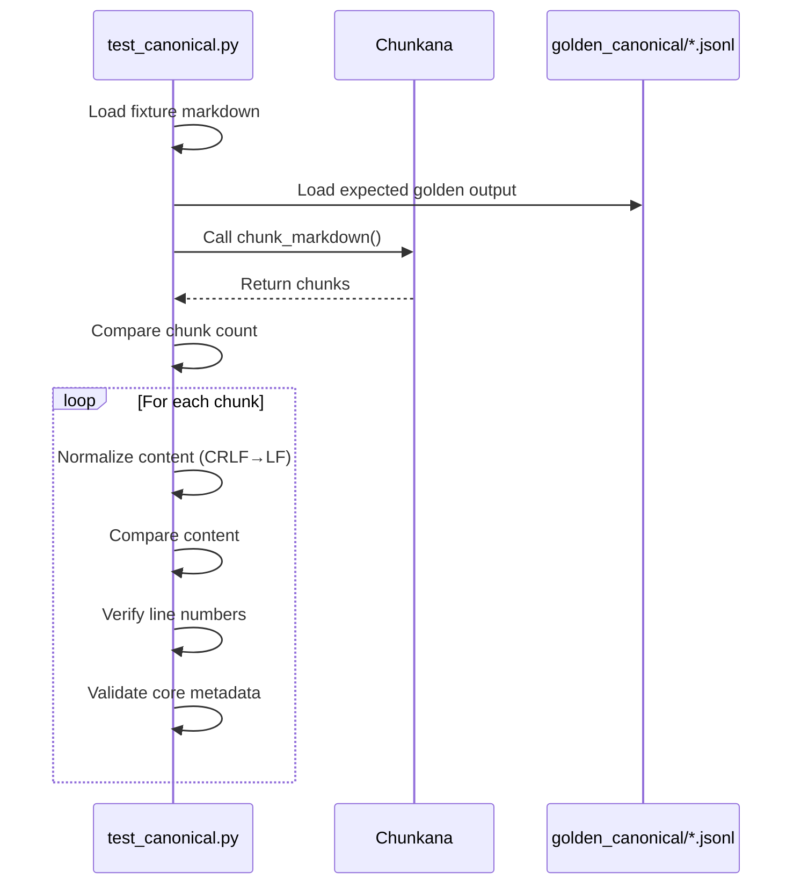
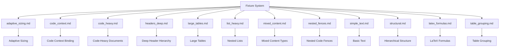
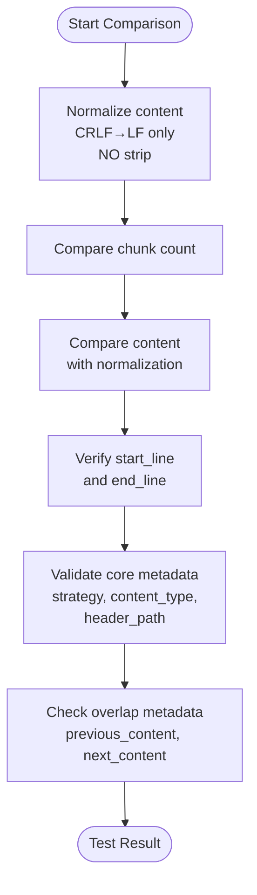
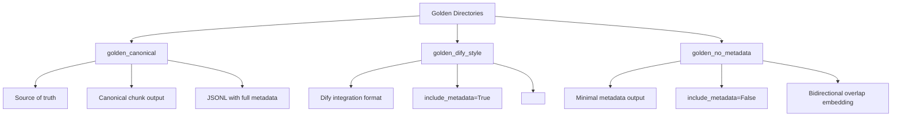
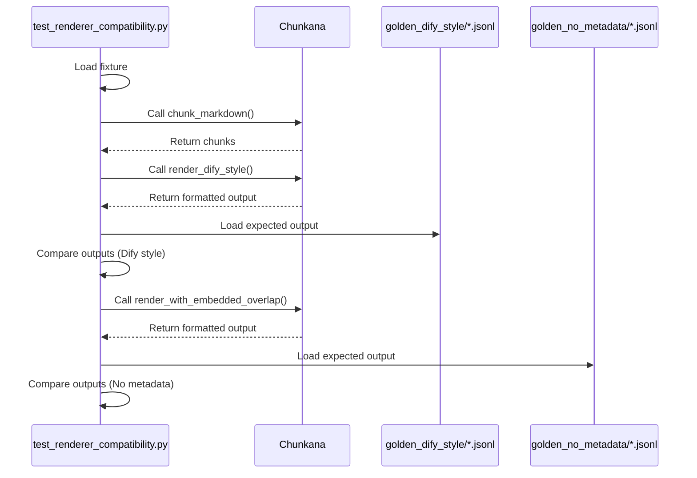
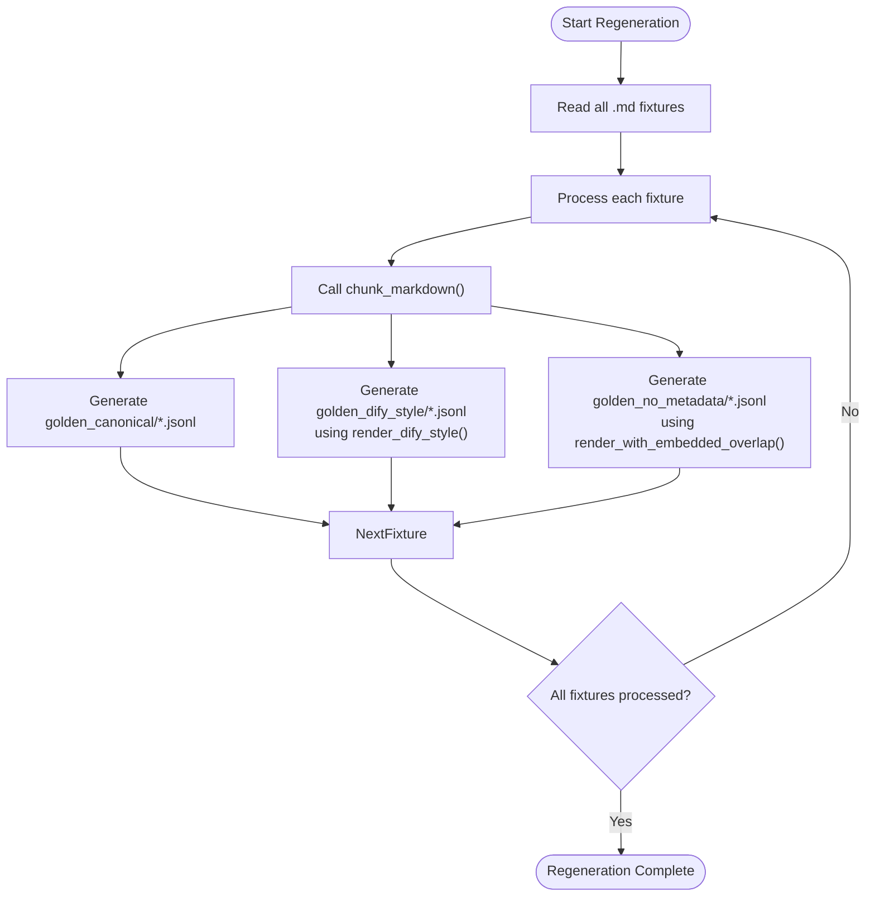

# Baseline Comparison Testing

<cite>
**Referenced Files in This Document**   
- [test_canonical.py](file://tests/baseline/test_canonical.py)
- [regenerate_goldens.py](file://scripts/regenerate_goldens.py)
- [generate_baseline.py](file://scripts/generate_baseline.py)
- [BASELINE.md](file://BASELINE.md)
- [formatters.py](file://src/chunkana/renderers/formatters.py)
- [adaptive_sizing.md](file://tests/baseline/fixtures/adaptive_sizing.md)
- [code_context.md](file://tests/baseline/fixtures/code_context.md)
- [simple_text.md](file://tests/baseline/fixtures/simple_text.md)
- [simple_text.jsonl](file://tests/baseline/golden_canonical/simple_text.jsonl)
- [golden_dify_style/simple_text.jsonl](file://tests/baseline/golden_dify_style/simple_text.jsonl)
- [golden_no_metadata/simple_text.jsonl](file://tests/baseline/golden_no_metadata/simple_text.jsonl)
- [test_config_parity.py](file://tests/baseline/test_config_parity.py)
- [test_renderer_compatibility.py](file://tests/baseline/test_renderer_compatibility.py)
</cite>

## Table of Contents
1. [Introduction](#introduction)
2. [Golden File Testing Approach](#golden-file-testing-approach)
3. [Canonical Output Verification](#canonical-output-verification)
4. [Fixture System and Test Coverage](#fixture-system-and-test-coverage)
5. [Normalization and Comparison Strategies](#normalization-and-comparison-strategies)
6. [Golden Directory Purposes](#golden-directory-purposes)
7. [Renderer Compatibility Testing](#renderer-compatibility-testing)
8. [Configuration Parity Testing](#configuration-parity-testing)
9. [Golden File Regeneration](#golden-file-regeneration)
10. [Best Practices](#best-practices)

## Introduction
Baseline comparison testing in Chunkana ensures consistent and reliable chunking behavior by comparing current output against established golden files. This documentation details the comprehensive testing framework that verifies Chunkana's compatibility with the reference implementation from dify-markdown-chunker v2. The system uses multiple golden directories to validate different output formats and employs a robust fixture system to test various document types and edge cases. The testing approach focuses on byte-for-byte comparison of canonical outputs while accommodating different rendering requirements for integration scenarios.

## Golden File Testing Approach
Chunkana employs a golden file testing strategy to maintain compatibility with the reference implementation. The system uses the `test_canonical.py` module to compare Chunkana's output against golden files stored in the `golden_canonical` directory. This approach establishes a source of truth for chunking behavior, ensuring that any changes to the chunking algorithm maintain consistency with the baseline established from the dify-markdown-chunker v2 plugin at a specific commit (120d008bafd0525853cc977ab62fab6a94a410d7). The testing framework verifies that chunk content, line numbers, and core metadata remain identical between Chunkana's output and the golden files, providing a reliable mechanism for detecting regressions and ensuring compatibility.

**Section sources**
- [test_canonical.py](file://tests/baseline/test_canonical.py#L1-L158)
- [BASELINE.md](file://BASELINE.md#L1-L115)

## Canonical Output Verification
The `test_canonical.py` module performs rigorous verification of Chunkana's canonical output by comparing it against golden files in the `golden_canonical` directory. The test compares several key aspects of each chunk:

1. **Chunk count**: Verifies that the number of chunks produced by Chunkana matches the expected count from the golden file
2. **Content**: Compares chunk content with CRLF to LF normalization (without stripping whitespace)
3. **Line numbers**: Ensures exact match of `start_line` and `end_line` values
4. **Metadata**: Validates core metadata keys including strategy, content_type, and header_path

The test uses a precise comparison methodology that normalizes line endings from CRLF to LF but does not strip whitespace, preserving the exact content structure. For metadata comparison, the test focuses on key subsets that are guaranteed to match, such as strategy, content_type, and header_path, while acknowledging that certain keys like chunk_id may differ due to being generated.



**Diagram sources**
- [test_canonical.py](file://tests/baseline/test_canonical.py#L58-L158)

**Section sources**
- [test_canonical.py](file://tests/baseline/test_canonical.py#L58-L158)

## Fixture System and Test Coverage
Chunkana's baseline testing framework utilizes a comprehensive fixture system with various Markdown inputs that represent different document types and edge cases. The fixtures directory contains 12 test files, each designed to validate specific aspects of the chunking behavior:

- `adaptive_sizing.md`: Tests adaptive chunk sizing with varying content density
- `code_context.md`: Validates code-context binding scenarios
- `code_heavy.md`: Evaluates performance with code-heavy documents
- `headers_deep.md`: Tests deep header hierarchy (h1-h6) processing
- `large_tables.md`: Handles multiple tables, some exceeding chunk size
- `list_heavy.md`: Processes nested lists with mixed ordered/unordered items
- `mixed_content.md`: Tests combination of all element types
- `nested_fences.md`: Validates nested code fences (``` inside ~~~~)
- `simple_text.md`: Basic text without special structures
- `structural.md`: Clear hierarchical structure
- `latex_formulas.md`: Processes LaTeX formulas (inline and display)
- `table_grouping.md`: Tests related tables grouping scenarios

This diverse set of fixtures ensures comprehensive test coverage across different document structures and edge cases, validating Chunkana's ability to handle real-world Markdown content consistently.



**Diagram sources**
- [BASELINE.md](file://BASELINE.md#L35-L53)
- [tests/baseline/fixtures](file://tests/baseline/fixtures)

**Section sources**
- [BASELINE.md](file://BASELINE.md#L35-L53)
- [tests/baseline/fixtures](file://tests/baseline/fixtures)

## Normalization and Comparison Strategies
The baseline testing framework employs specific normalization and comparison strategies to ensure accurate and reliable test results. The primary normalization process handles line ending differences by converting CRLF (Windows) to LF (Unix) line endings, while explicitly avoiding whitespace stripping to preserve content integrity.

For metadata comparison, the framework focuses on key subsets that are guaranteed to match between Chunkana and the reference implementation. The core metadata keys validated include:

- **strategy**: The chunking strategy used (e.g., structural, code_aware)
- **content_type**: The type of content in the chunk
- **header_path**: The hierarchical path of headers to this chunk

The test also validates overlap metadata (previous_content and next_content) when present, applying the same line ending normalization. This targeted comparison approach acknowledges that certain metadata keys like chunk_id are generated and may differ, while ensuring that the essential structural and semantic information remains consistent.



**Diagram sources**
- [test_canonical.py](file://tests/baseline/test_canonical.py#L24-L26)
- [test_canonical.py](file://tests/baseline/test_canonical.py#L114-L134)

**Section sources**
- [test_canonical.py](file://tests/baseline/test_canonical.py#L24-L26)
- [test_canonical.py](file://tests/baseline/test_canonical.py#L114-L134)

## Golden Directory Purposes
Chunkana maintains three distinct golden directories, each serving a specific purpose in the testing framework:

### golden_canonical
The `golden_canonical` directory contains the source of truth for chunking behavior. These JSONL files store the canonical chunk output (list[Chunk]) serialized from the reference implementation. This directory serves as the primary baseline for verifying Chunkana's core chunking functionality, ensuring byte-for-byte consistency in chunk content, line numbers, and metadata.

### golden_dify_style
The `golden_dify_style` directory contains view-level output formatted for integration with Dify, corresponding to the `include_metadata=True` parameter in the reference implementation. These files validate that Chunkana's `render_dify_style()` function produces output that matches the reference implementation's metadata formatting, including the `<metadata>` block with JSON content.

### golden_no_metadata
The `golden_no_metadata` directory contains view-level output for scenarios where metadata is not included (`include_metadata=False`). These files verify that Chunkana's `render_with_embedded_overlap()` function correctly implements the bidirectional overlap embedding (previous + content + next) used by the reference implementation.

Each golden directory plays a crucial role in ensuring comprehensive compatibility testing across different output formats and integration scenarios.



**Diagram sources**
- [BASELINE.md](file://BASELINE.md#L54-L77)
- [formatters.py](file://src/chunkana/renderers/formatters.py#L56-L84)
- [formatters.py](file://src/chunkana/renderers/formatters.py#L87-L116)

**Section sources**
- [BASELINE.md](file://BASELINE.md#L54-L77)
- [formatters.py](file://src/chunkana/renderers/formatters.py#L56-L116)

## Renderer Compatibility Testing
Chunkana's renderer compatibility tests ensure that the output formatting functions produce results that match the reference implementation's behavior. The `test_renderer_compatibility.py` module validates two key rendering scenarios:

1. **Dify-style rendering**: Tests that `render_dify_style()` matches the output of the reference implementation with `include_metadata=True`. This format includes a `<metadata>` block containing JSON-formatted metadata followed by the chunk content.

2. **No-metadata rendering**: Verifies that `render_with_embedded_overlap()` matches the output with `include_metadata=False`. This format uses bidirectional overlap embedding, combining previous_content, content, and next_content with line breaks.

The tests perform byte-for-byte comparison of the rendered output after normalizing line endings, ensuring that Chunkana's renderers produce identical results to the reference implementation. This compatibility is crucial for seamless integration with systems expecting the specific output formats used by the dify-markdown-chunker v2 plugin.



**Diagram sources**
- [test_renderer_compatibility.py](file://tests/baseline/test_renderer_compatibility.py#L45-L157)
- [formatters.py](file://src/chunkana/renderers/formatters.py#L56-L116)

**Section sources**
- [test_renderer_compatibility.py](file://tests/baseline/test_renderer_compatibility.py#L45-L157)

## Configuration Parity Testing
The configuration parity tests ensure that Chunkana's `ChunkerConfig` class maintains compatibility with the reference implementation's configuration structure. The `test_config_parity.py` module verifies two critical aspects:

1. **Field completeness**: Confirms that `ChunkerConfig.to_dict()` includes all keys present in the reference implementation's `ChunkConfig`, ensuring Chunkana can serialize all expected configuration fields.

2. **Deserialization compatibility**: Validates that `ChunkerConfig.from_dict()` can accept all keys from the reference implementation, allowing Chunkana to properly deserialize configurations from the plugin.

The test uses the `plugin_config_keys.json` file, generated from the reference implementation, as the source of truth for expected configuration keys. Additionally, it verifies that Chunkana's extension keys—additional configuration options beyond the reference implementation—are properly included in the serialization process.

**Section sources**
- [test_config_parity.py](file://tests/baseline/test_config_parity.py#L1-L127)
- [BASELINE.md](file://BASELINE.md#L15-L18)

## Golden File Regeneration
Golden files can be regenerated using the `regenerate_goldens.py` script when Chunkana's behavior is considered correct and the baselines need updating. This script processes all fixture files in the `tests/baseline/fixtures` directory and generates updated golden files for all three output formats:

1. **Canonical output**: Generated using `chunk_to_dict()` to serialize chunks to JSONL format
2. **Dify-style output**: Produced by `render_dify_style()` for integration compatibility
3. **No-metadata output**: Created by `render_with_embedded_overlap()` for minimal metadata scenarios

The regeneration process ensures that all golden files are updated consistently based on the current behavior of Chunkana, maintaining the integrity of the baseline testing system when intentional changes are made to the chunking algorithm or output formatting.



**Diagram sources**
- [regenerate_goldens.py](file://scripts/regenerate_goldens.py#L34-L77)
- [generate_baseline.py](file://scripts/generate_baseline.py#L140-L192)

**Section sources**
- [regenerate_goldens.py](file://scripts/regenerate_goldens.py#L34-L77)

## Best Practices
To maintain effective baseline comparison testing in Chunkana, follow these best practices:

1. **Regular golden file updates**: When implementing new features or fixing bugs that intentionally change chunking behavior, regenerate the golden files to establish a new baseline.

2. **Comprehensive fixture coverage**: Add new fixture files to test edge cases and document types not currently covered by the existing test suite.

3. **Consistent testing parameters**: Use the same configuration parameters (max_chunk_size=4096, min_chunk_size=512, overlap_size=200) when generating and comparing golden files to ensure consistency.

4. **Integration-specific validation**: Verify renderer output against the specific requirements of target integration platforms, particularly for metadata formatting and overlap handling.

5. **Version control discipline**: Commit golden file updates alongside code changes that affect chunking behavior, with clear commit messages explaining the rationale for the baseline update.

6. **Cross-platform compatibility**: Ensure tests account for line ending differences between operating systems by using the standardized CRLF to LF normalization.

7. **Metadata subset focus**: When comparing metadata, focus on the core keys that define chunking behavior rather than generated or transient fields.

Following these practices ensures that the baseline testing system remains effective in maintaining compatibility while allowing for necessary evolution of Chunkana's functionality.

**Section sources**
- [BASELINE.md](file://BASELINE.md)
- [test_canonical.py](file://tests/baseline/test_canonical.py)
- [regenerate_goldens.py](file://scripts/regenerate_goldens.py)
- [test_renderer_compatibility.py](file://tests/baseline/test_renderer_compatibility.py)