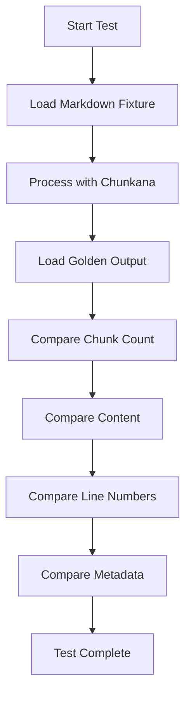
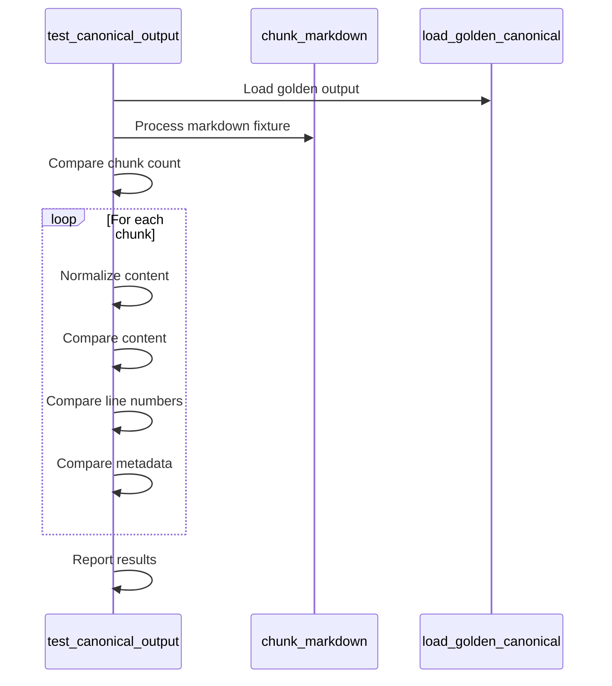
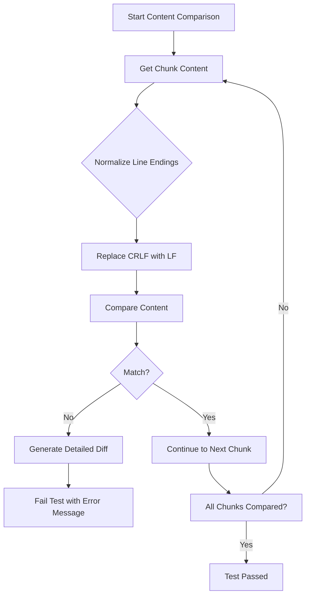
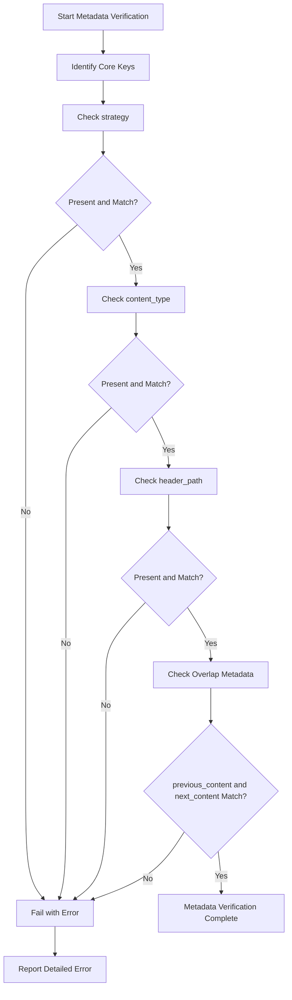
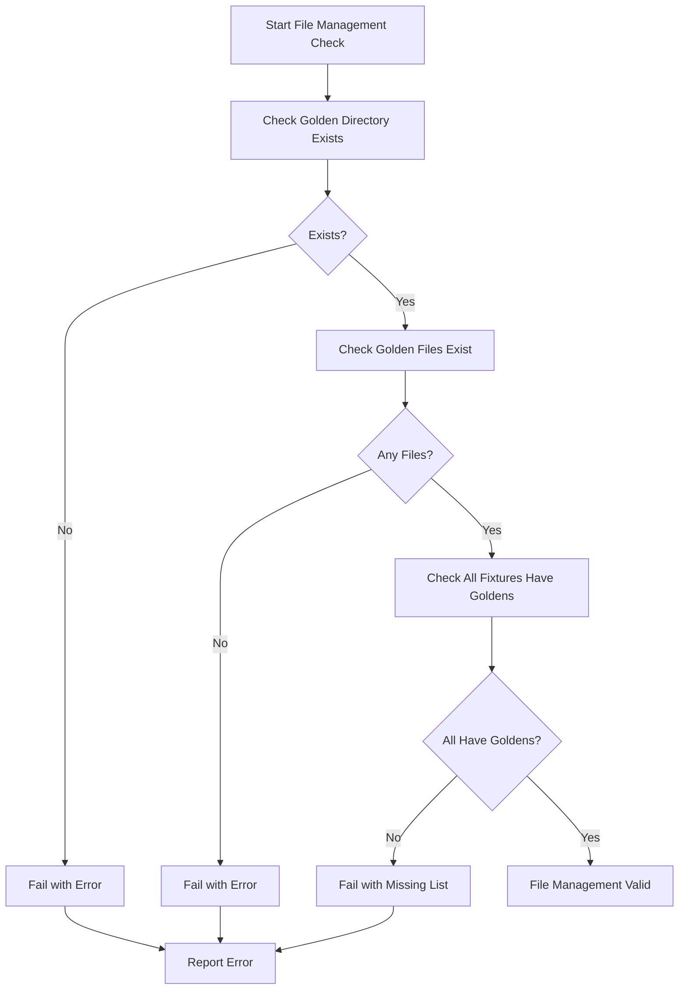
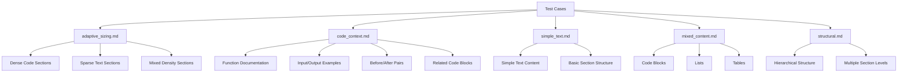

# Canonical Output Validation

<cite>
**Referenced Files in This Document**   
- [test_canonical.py](file://tests/baseline/test_canonical.py)
- [adaptive_sizing.md](file://tests/baseline/fixtures/adaptive_sizing.md)
- [code_context.md](file://tests/baseline/fixtures/code_context.md)
- [adaptive_sizing.jsonl](file://tests/baseline/golden_canonical/adaptive_sizing.jsonl)
- [code_context.jsonl](file://tests/baseline/golden_canonical/code_context.jsonl)
- [api.py](file://src/chunkana/api.py)
- [chunker.py](file://src/chunkana/chunker.py)
- [types.py](file://src/chunkana/types.py)
- [metadata_recalculator.py](file://src/chunkana/metadata_recalculator.py)
- [validator.py](file://src/chunkana/validator.py)
- [conftest.py](file://tests/conftest.py)
</cite>

## Table of Contents
1. [Introduction](#introduction)
2. [Test Framework Overview](#test-framework-overview)
3. [Core Validation Process](#core-validation-process)
4. [Normalization and Content Comparison](#normalization-and-content-comparison)
5. [Metadata Verification Strategy](#metadata-verification-strategy)
6. [Fixture and Golden File Management](#fixture-and-golden-file-management)
7. [Test Case Examples](#test-case-examples)
8. [Conclusion](#conclusion)

## Introduction

The canonical output validation system in Chunkana ensures byte-for-byte consistency between the library's output and predefined golden files. This validation framework serves as the source of truth for Chunkana's chunking behavior, guaranteeing that any changes to the codebase maintain identical output to the reference implementation. The test suite verifies that Chunkana produces consistent, predictable chunks across various document structures and edge cases, which is critical for reliable retrieval-augmented generation (RAG) systems.

The validation process compares Chunkana's output against golden files stored in JSONL format, which were generated from a reference plugin implementation at a specific commit point. This approach ensures that Chunkana maintains compatibility with the expected output format and behavior, providing a robust mechanism for regression testing and quality assurance.

**Section sources**
- [test_canonical.py](file://tests/baseline/test_canonical.py#L1-L158)

## Test Framework Overview

The canonical output validation is implemented in `test_canonical.py`, which contains a comprehensive test suite for verifying Chunkana's output consistency. The test framework follows a structured approach to validate chunking results against golden files, ensuring that all aspects of the output match the expected format and content.

The test suite uses pytest parametrization to automatically discover and test all fixture files that have corresponding golden outputs. This approach ensures that every test case is evaluated against its reference implementation, providing comprehensive coverage of different document structures and edge cases. The framework is designed to be extensible, allowing new test cases to be added simply by creating new fixture and golden file pairs.

The validation process begins by loading the markdown fixture and processing it through Chunkana's `chunk_markdown` function. The resulting chunks are then compared against the golden output loaded from the corresponding JSONL file. The comparison covers multiple aspects of the chunking output, including chunk count, content, line numbers, and metadata, ensuring comprehensive validation.

**Diagram sources**
- [test_canonical.py](file://tests/baseline/test_canonical.py#L58-L158)

**Section sources**
- [test_canonical.py](file://tests/baseline/test_canonical.py#L1-L158)

## Core Validation Process

The core validation process in `test_canonical_output` performs a comprehensive comparison between Chunkana's output and the golden files. The test verifies multiple aspects of the chunking results to ensure byte-for-byte consistency with the reference implementation.

First, the test compares the chunk count between Chunkana's output and the golden file. A mismatch in the number of chunks indicates a fundamental difference in the chunking behavior, which could affect downstream applications. The comparison is performed using a simple length check, with a descriptive error message that includes both expected and actual counts.

Next, the test iterates through each chunk pair (from Chunkana and the golden file) to perform detailed comparisons. For each chunk, the test verifies that the content matches exactly after normalization, that the start and end line numbers are identical, and that the core metadata fields are consistent. This multi-layered approach ensures that all critical aspects of the chunking output are validated.

The validation process is designed to fail fast when mismatches are detected, providing detailed error messages that help identify the specific nature of the discrepancy. This approach facilitates rapid debugging and resolution of any issues that arise during development or maintenance.

**Diagram sources**
- [test_canonical.py](file://tests/baseline/test_canonical.py#L78-L135)

**Section sources**
- [test_canonical.py](file://tests/baseline/test_canonical.py#L58-L135)

## Normalization and Content Comparison

The content comparison process in the canonical output validation includes a normalization step to handle line ending differences between platforms. The `normalize_content` function converts CRLF line endings to LF, ensuring that the comparison is not affected by platform-specific line ending variations. This normalization is critical for maintaining consistency across different operating systems and development environments.

Importantly, the normalization process does not strip whitespace from the content, preserving the exact formatting of the original text. This approach ensures that the validation is sensitive to whitespace differences, which could affect the meaning or structure of the content in certain contexts. By only normalizing line endings and not performing additional text manipulation, the test maintains a high degree of fidelity to the original content.

When a content mismatch is detected, the test provides a detailed diff that shows the first 200 characters of both the expected and actual content. This information helps developers quickly identify the nature and location of the discrepancy, facilitating efficient debugging and resolution. The diff includes character counts for both strings, making it easy to spot truncation or insertion issues.

The content comparison is performed for each chunk individually, ensuring that any differences are identified at the most granular level possible. This approach allows developers to pinpoint exactly which part of the document is being processed differently, rather than just knowing that there is a general mismatch somewhere in the output.

**Diagram sources**
- [test_canonical.py](file://tests/baseline/test_canonical.py#L24-L27)
- [test_canonical.py](file://tests/baseline/test_canonical.py#L87-L97)

**Section sources**
- [test_canonical.py](file://tests/baseline/test_canonical.py#L24-L97)

## Metadata Verification Strategy

The metadata verification strategy in the canonical output validation focuses on comparing core metadata fields that are guaranteed to match between Chunkana's output and the golden files. The test specifically checks key fields such as `strategy`, `content_type`, and `header_path`, which are essential for understanding the nature and context of each chunk.

The verification process is designed to be selective, comparing only the metadata keys that should be consistent across implementations. This approach acknowledges that certain metadata fields, such as `chunk_id`, may differ between runs due to their generated nature. By focusing on the core metadata fields, the test ensures that the essential characteristics of each chunk are preserved while allowing for expected variations in generated fields.

For metadata fields related to overlap context (`previous_content` and `next_content`), the test performs a normalized comparison similar to the main content comparison. This ensures that the overlap context is consistent between implementations, which is important for maintaining the integrity of the chunking strategy. The overlap context is normalized to handle line ending differences, ensuring that the comparison is not affected by platform-specific variations.

The metadata verification process includes specific assertions for each core field, providing detailed error messages when mismatches are detected. These error messages include both the expected and actual values, making it easy to identify the nature of the discrepancy. This level of detail facilitates rapid debugging and resolution of any issues that arise during development.

**Diagram sources**
- [test_canonical.py](file://tests/baseline/test_canonical.py#L114-L134)

**Section sources**
- [test_canonical.py](file://tests/baseline/test_canonical.py#L114-L134)

## Fixture and Golden File Management

The fixture and golden file management system in Chunkana's test suite ensures that all test cases have corresponding reference outputs. The test framework includes two validation functions, `test_golden_canonical_exists` and `test_fixtures_have_goldens`, that verify the presence and completeness of the golden files.

The `test_golden_canonical_exists` function checks that the golden canonical directory exists and contains at least one golden file. This basic validation ensures that the test suite has access to the reference outputs needed for comparison. Without this validation, tests could fail silently or produce misleading results if the golden files are missing.

The `test_fixtures_have_goldens` function performs a more comprehensive check, verifying that every fixture file has a corresponding golden output. This validation prevents the introduction of new test cases without their reference outputs, maintaining the integrity of the test suite. If any fixture files are missing their golden outputs, the test fails with a detailed error message listing the missing files.

The fixture system uses a variety of markdown files that represent different document structures and edge cases. These include files like `adaptive_sizing.md`, `code_context.md`, `simple_text.md`, and `structural.md`, each designed to test specific aspects of the chunking algorithm. This diverse set of test cases ensures that Chunkana's output is validated across a wide range of scenarios, from simple text documents to complex, code-heavy files.

**Diagram sources**
- [test_canonical.py](file://tests/baseline/test_canonical.py#L137-L157)

**Section sources**
- [test_canonical.py](file://tests/baseline/test_canonical.py#L137-L157)

## Test Case Examples

The canonical output validation includes several test case examples that demonstrate the variety of document structures and edge cases covered by the test suite. These examples illustrate how the validation framework ensures consistency across different types of content and chunking scenarios.

The `adaptive_sizing.md` fixture tests adaptive chunk sizing with varying content density. This document contains sections with different characteristics, including dense code sections, sparse text sections, and mixed density sections. The corresponding golden file shows how Chunkana adapts chunk sizes based on content density, creating larger chunks for code-heavy sections and smaller chunks for prose sections.

The `code_context.md` fixture tests code-context binding scenarios where explanatory text should be bound to code blocks. This document includes function documentation, input/output examples, before/after code pairs, and related code blocks. The golden output demonstrates how Chunkana preserves the relationship between code and its explanatory context, ensuring that related content is kept together in the same chunk.

The `simple_text.md` fixture provides a basic test case with a straightforward document structure. This file contains multiple sections with plain text content, allowing the validation framework to verify that Chunkana handles simple documents correctly. The corresponding golden file shows the expected chunking behavior for a document with a clear hierarchical structure.

The `mixed_content.md` fixture combines various Markdown elements, including code blocks, lists, and tables. This test case verifies that Chunkana can handle documents with mixed content types, preserving the integrity of each element while creating meaningful chunks. The golden output demonstrates how the chunker balances the need to keep atomic elements intact with the goal of creating semantically coherent chunks.

**Diagram sources**
- [adaptive_sizing.md](file://tests/baseline/fixtures/adaptive_sizing.md)
- [code_context.md](file://tests/baseline/fixtures/code_context.md)
- [simple_text.md](file://tests/baseline/fixtures/simple_text.md)
- [mixed_content.md](file://tests/baseline/fixtures/mixed_content.md)
- [structural.md](file://tests/baseline/fixtures/structural.md)

**Section sources**
- [adaptive_sizing.md](file://tests/baseline/fixtures/adaptive_sizing.md)
- [code_context.md](file://tests/baseline/fixtures/code_context.md)
- [adaptive_sizing.jsonl](file://tests/baseline/golden_canonical/adaptive_sizing.jsonl)
- [code_context.jsonl](file://tests/baseline/golden_canonical/code_context.jsonl)

## Conclusion

The canonical output validation system in Chunkana provides a robust framework for ensuring byte-for-byte consistency between the library's output and predefined golden files. This validation approach is essential for maintaining the reliability and predictability of the chunking process, which is critical for applications that depend on consistent text segmentation.

The test suite comprehensively validates multiple aspects of the chunking output, including chunk count, content, line numbers, and metadata. By using a combination of normalization, selective comparison, and detailed error reporting, the validation framework provides a high degree of confidence in the correctness of Chunkana's output.

The fixture and golden file management system ensures that all test cases have corresponding reference outputs, maintaining the integrity of the test suite over time. The diverse set of test cases covers a wide range of document structures and edge cases, providing comprehensive coverage of the chunking algorithm's behavior.

Overall, the canonical output validation system serves as a critical quality assurance mechanism for Chunkana, ensuring that any changes to the codebase maintain compatibility with the expected output format and behavior. This approach supports the development of reliable, predictable text chunking solutions for retrieval-augmented generation systems.