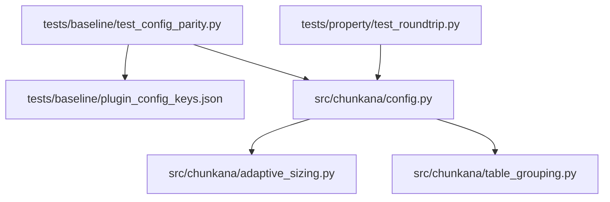
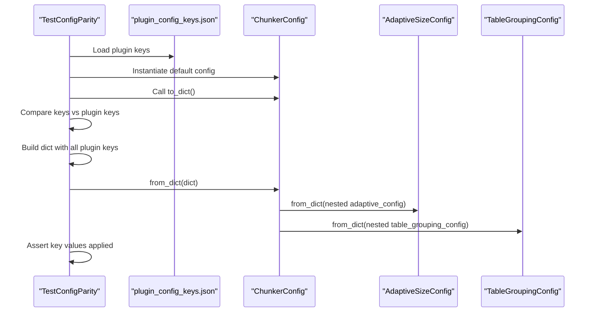
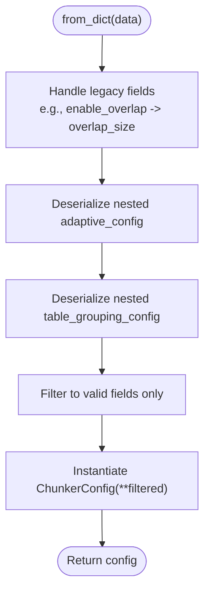
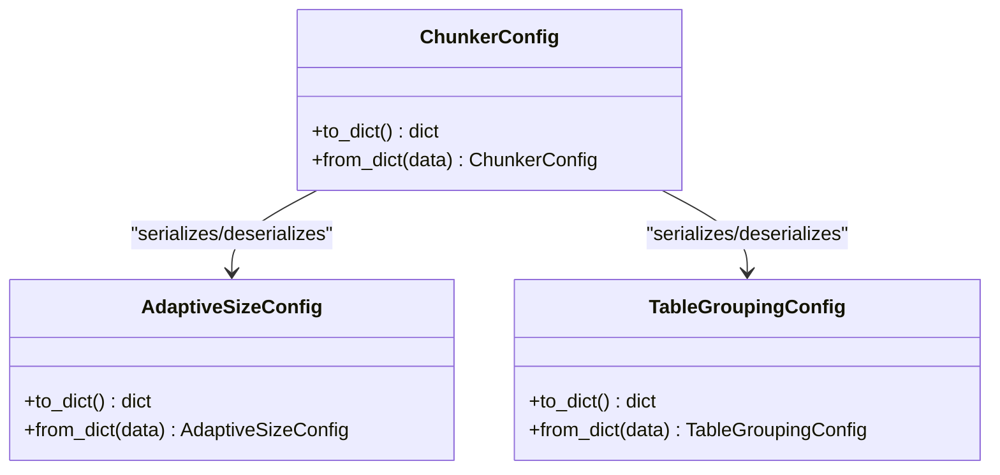
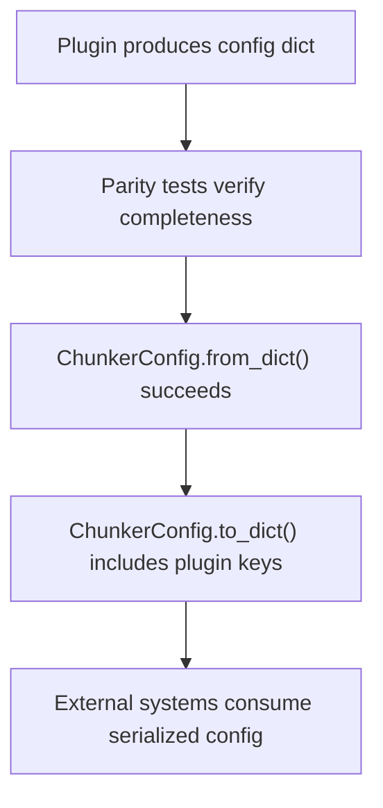
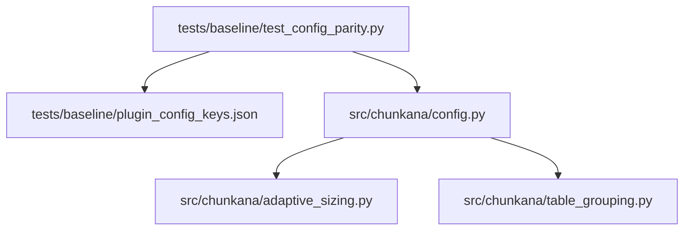

# Configuration Parity Testing

<cite>
**Referenced Files in This Document**
- [test_config_parity.py](file://tests/baseline/test_config_parity.py)
- [plugin_config_keys.json](file://tests/baseline/plugin_config_keys.json)
- [config.py](file://src/chunkana/config.py)
- [adaptive_sizing.py](file://src/chunkana/adaptive_sizing.py)
- [table_grouping.py](file://src/chunkana/table_grouping.py)
- [test_roundtrip.py](file://tests/property/test_roundtrip.py)
</cite>

## Table of Contents
1. [Introduction](#introduction)
2. [Project Structure](#project-structure)
3. [Core Components](#core-components)
4. [Architecture Overview](#architecture-overview)
5. [Detailed Component Analysis](#detailed-component-analysis)
6. [Dependency Analysis](#dependency-analysis)
7. [Performance Considerations](#performance-considerations)
8. [Troubleshooting Guide](#troubleshooting-guide)
9. [Conclusion](#conclusion)

## Introduction
This document explains how Chunkana’s configuration parity tests ensure compatibility between ChunkerConfig and the plugin’s ChunkConfig. It covers:
- How the test suite verifies that ChunkerConfig.to_dict() includes all plugin keys and that ChunkerConfig.from_dict() accepts all plugin configuration parameters.
- How plugin_config_keys.json serves as the authoritative source of truth for expected plugin fields.
- How Chunkana’s extension keys (beyond the plugin parity set) are validated to remain present in serialization.
- How these tests prevent integration issues by enforcing bidirectional compatibility between Chunkana and external systems.

## Project Structure
The configuration parity testing spans a small set of focused files:
- A test module that asserts parity between ChunkerConfig and the plugin’s expected fields.
- A JSON file that enumerates the plugin’s configuration keys.
- The ChunkerConfig implementation that serializes and deserializes configuration.
- Supporting configuration classes for nested structures (adaptive sizing and table grouping).

**Diagram sources**
- [test_config_parity.py](file://tests/baseline/test_config_parity.py#L1-L127)
- [plugin_config_keys.json](file://tests/baseline/plugin_config_keys.json#L1-L22)
- [config.py](file://src/chunkana/config.py#L408-L506)
- [adaptive_sizing.py](file://src/chunkana/adaptive_sizing.py#L77-L101)
- [table_grouping.py](file://src/chunkana/table_grouping.py#L48-L66)

**Section sources**
- [test_config_parity.py](file://tests/baseline/test_config_parity.py#L1-L127)
- [plugin_config_keys.json](file://tests/baseline/plugin_config_keys.json#L1-L22)
- [config.py](file://src/chunkana/config.py#L408-L506)

## Core Components
- Test suite for configuration parity:
  - Ensures ChunkerConfig.to_dict() contains all plugin keys.
  - Ensures ChunkerConfig.from_dict() accepts all plugin keys and applies defaults appropriately.
  - Verifies the expected count of plugin keys.
  - Verifies Chunkana extension keys are present in serialization.
- Source of truth for plugin keys:
  - A JSON file enumerating the plugin’s configuration keys and associated commit.
- ChunkerConfig implementation:
  - Provides to_dict() and from_dict() with support for nested configuration objects and legacy parameter handling.
  - Serializes both plugin parity fields and Chunkana extension fields.

Key responsibilities:
- test_config_parity.py orchestrates parity checks against plugin_config_keys.json.
- config.py defines the serialization contract and deserialization logic.
- adaptive_sizing.py and table_grouping.py define nested configuration objects that are serialized/deserialized alongside ChunkerConfig.

**Section sources**
- [test_config_parity.py](file://tests/baseline/test_config_parity.py#L1-L127)
- [plugin_config_keys.json](file://tests/baseline/plugin_config_keys.json#L1-L22)
- [config.py](file://src/chunkana/config.py#L408-L506)
- [adaptive_sizing.py](file://src/chunkana/adaptive_sizing.py#L77-L101)
- [table_grouping.py](file://src/chunkana/table_grouping.py#L48-L66)

## Architecture Overview
The parity test enforces a strict contract between ChunkerConfig and the plugin’s expected configuration surface. The test loads the plugin keys from a JSON file and compares them against ChunkerConfig’s serialized representation. Deserialization is verified by constructing a dictionary with all plugin keys and ensuring no exceptions occur during construction.

**Diagram sources**
- [test_config_parity.py](file://tests/baseline/test_config_parity.py#L39-L101)
- [plugin_config_keys.json](file://tests/baseline/plugin_config_keys.json#L1-L22)
- [config.py](file://src/chunkana/config.py#L452-L503)
- [adaptive_sizing.py](file://src/chunkana/adaptive_sizing.py#L89-L101)
- [table_grouping.py](file://src/chunkana/table_grouping.py#L58-L66)

## Detailed Component Analysis

### Test Suite: Configuration Parity
The test suite performs four primary checks:
- Existence of the plugin keys file.
- That to_dict() contains all plugin keys.
- That from_dict() accepts all plugin keys and applies defaults.
- That the expected number of plugin keys equals the baseline count.
- That Chunkana extension keys are present in serialization.

Behavior highlights:
- The test constructs a dictionary populated with all plugin keys and assigns representative default values for each key. Certain keys receive special handling (for example, a computed property and a few numeric thresholds).
- The test asserts that deserialization succeeds and that selected key values are applied as expected.
- The test verifies the total number of plugin keys matches the baseline expectation.

Examples from the test code:
- Constructing a dictionary with all plugin keys and assigning defaults for each key.
- Passing the constructed dictionary to ChunkerConfig.from_dict() without raising.
- Asserting that selected key values (for example, max_chunk_size and code_threshold) are applied after deserialization.
- Verifying the expected count of plugin keys equals the baseline.

Purpose of plugin_config_keys.json:
- Serves as the single source of truth for the plugin’s configuration fields and the commit reference used to generate the baseline.
- The test reads this file to compare against ChunkerConfig’s serialized output.

Verification of Chunkana extension keys:
- The test enumerates Chunkana-specific keys (for example, overlap_cap_ratio, use_adaptive_sizing, preserve_latex_blocks, and others) and ensures they are present in ChunkerConfig.to_dict().

How these tests prevent integration issues:
- They guarantee that any configuration produced by the plugin can be consumed by ChunkerConfig.from_dict() without errors.
- They guarantee that any configuration produced by ChunkerConfig can be serialized to a dictionary that includes all plugin-required keys, preventing downstream consumers from missing fields.

**Section sources**
- [test_config_parity.py](file://tests/baseline/test_config_parity.py#L33-L127)
- [plugin_config_keys.json](file://tests/baseline/plugin_config_keys.json#L1-L22)

### ChunkerConfig Serialization Contract
ChunkerConfig implements to_dict() and from_dict() to maintain compatibility with external systems and nested configuration objects.

Key behaviors:
- to_dict() includes:
  - All plugin parity fields enumerated in plugin_config_keys.json.
  - Computed properties (for example, a derived enable_overlap flag).
  - Chunkana extension fields (for example, overlap_cap_ratio, use_adaptive_sizing, preserve_latex_blocks, and nested adaptive_config and table_grouping_config).
- from_dict() includes:
  - Legacy parameter handling (for example, mapping enable_overlap to overlap_size).
  - Nested configuration deserialization for adaptive_config and table_grouping_config.
  - Forward compatibility by ignoring unknown fields while applying valid parameters.

Bidirectional compatibility:
- Round-trip property tests confirm that to_dict() -> from_dict() preserves all plugin parity and extension fields, including nested configurations.

**Diagram sources**
- [config.py](file://src/chunkana/config.py#L452-L503)
- [adaptive_sizing.py](file://src/chunkana/adaptive_sizing.py#L89-L101)
- [table_grouping.py](file://src/chunkana/table_grouping.py#L58-L66)

**Section sources**
- [config.py](file://src/chunkana/config.py#L408-L506)
- [test_roundtrip.py](file://tests/property/test_roundtrip.py#L224-L315)

### Nested Configuration Objects
ChunkerConfig composes two nested configuration objects:
- AdaptiveSizeConfig: Provides adaptive sizing parameters and supports to_dict()/from_dict().
- TableGroupingConfig: Provides table grouping parameters and supports to_dict()/from_dict().

Serialization and deserialization:
- Both nested objects are included in ChunkerConfig.to_dict() and reconstructed in ChunkerConfig.from_dict().

**Diagram sources**
- [config.py](file://src/chunkana/config.py#L408-L506)
- [adaptive_sizing.py](file://src/chunkana/adaptive_sizing.py#L77-L101)
- [table_grouping.py](file://src/chunkana/table_grouping.py#L48-L66)

**Section sources**
- [adaptive_sizing.py](file://src/chunkana/adaptive_sizing.py#L77-L101)
- [table_grouping.py](file://src/chunkana/table_grouping.py#L48-L66)

### Conceptual Overview
The parity tests establish a contract that ensures:
- External systems can serialize their configuration into a dictionary that includes all plugin-required keys.
- Chunkana can accept such dictionaries and reconstruct a valid configuration without errors.
- Chunkana’s own extension keys are preserved in serialization so downstream consumers can leverage Chunkana-specific features.

[No sources needed since this diagram shows conceptual workflow, not actual code structure]

## Dependency Analysis
The parity test depends on:
- plugin_config_keys.json for the authoritative list of plugin keys.
- ChunkerConfig.to_dict() and ChunkerConfig.from_dict() for serialization and deserialization.

ChunkerConfig depends on:
- AdaptiveSizeConfig and TableGroupingConfig for nested configuration support.
- Dataclasses introspection to filter valid parameters during deserialization.

**Diagram sources**
- [test_config_parity.py](file://tests/baseline/test_config_parity.py#L1-L127)
- [plugin_config_keys.json](file://tests/baseline/plugin_config_keys.json#L1-L22)
- [config.py](file://src/chunkana/config.py#L408-L506)
- [adaptive_sizing.py](file://src/chunkana/adaptive_sizing.py#L77-L101)
- [table_grouping.py](file://src/chunkana/table_grouping.py#L48-L66)

**Section sources**
- [test_config_parity.py](file://tests/baseline/test_config_parity.py#L1-L127)
- [config.py](file://src/chunkana/config.py#L408-L506)

## Performance Considerations
- The parity tests operate on small, static datasets (a fixed list of plugin keys and a small set of representative values), so performance is negligible.
- Serialization and deserialization costs are bounded by the number of fields in ChunkerConfig and its nested objects, which is constant for typical usage.

[No sources needed since this section provides general guidance]

## Troubleshooting Guide
Common issues and resolutions:
- Missing plugin keys in to_dict():
  - Ensure all plugin keys from plugin_config_keys.json are included in ChunkerConfig.to_dict().
  - Confirm that computed properties and extension fields are included.
- from_dict() rejects plugin keys:
  - Verify that from_dict() filters unknown fields and handles legacy parameters correctly.
  - Ensure nested configurations (adaptive_config, table_grouping_config) are supported.
- Unexpected defaults after deserialization:
  - Review the test’s construction of the dictionary with defaults for each plugin key.
  - Confirm that defaults align with the intended behavior for the plugin’s configuration surface.

Related validations:
- Round-trip property tests confirm that to_dict() -> from_dict() preserves all fields, including nested configurations.
- Tests for overlap_cap_ratio validate that extension fields are preserved across serialization.

**Section sources**
- [test_config_parity.py](file://tests/baseline/test_config_parity.py#L39-L101)
- [test_roundtrip.py](file://tests/property/test_roundtrip.py#L224-L315)

## Conclusion
Configuration parity testing ensures that ChunkerConfig remains compatible with the plugin’s expected configuration surface. By validating that to_dict() includes all plugin keys and that from_dict() accepts all plugin parameters, the tests prevent integration issues across external systems. The use of plugin_config_keys.json as the source of truth guarantees consistency with the plugin’s evolving configuration schema. Additionally, the inclusion of Chunkana extension keys in serialization enables downstream consumers to leverage Chunkana-specific capabilities without losing compatibility with the plugin’s configuration contract.