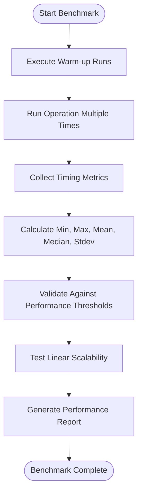
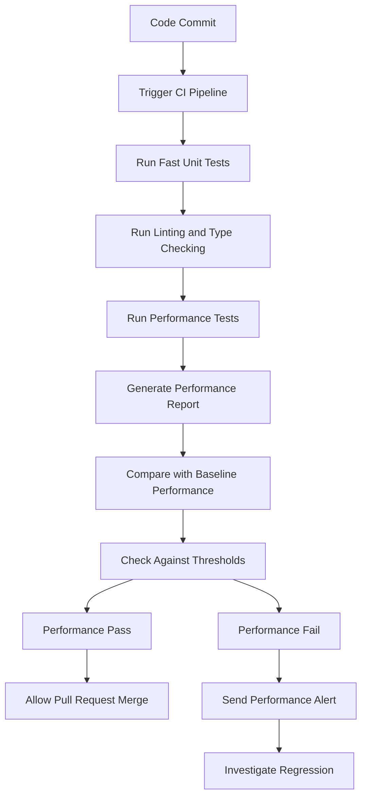
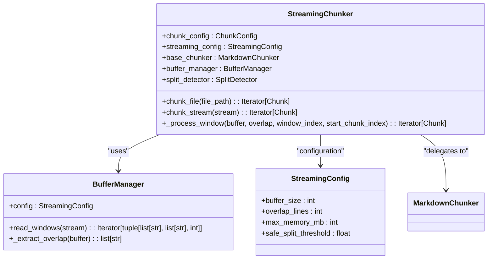

# Performance Regression Testing

<cite>
**Referenced Files in This Document**   
- [test_performance_regression.py](file://tests/performance/test_performance_regression.py)
- [large_tables.md](file://tests/baseline/fixtures/large_tables.md)
- [code_heavy.md](file://tests/baseline/fixtures/code_heavy.md)
- [headers_deep.md](file://tests/baseline/fixtures/headers_deep.md)
- [streaming_chunker.py](file://src/chunkana/streaming/streaming_chunker.py)
- [buffer_manager.py](file://src/chunkana/streaming/buffer_manager.py)
- [config.py](file://src/chunkana/streaming/config.py)
- [chunker.py](file://src/chunkana/chunker.py)
- [config.py](file://src/chunkana/config.py)
- [Makefile](file://Makefile)
- [pyproject.toml](file://pyproject.toml)
</cite>

## Table of Contents
1. [Introduction](#introduction)
2. [Performance Monitoring Metrics](#performance-monitoring-metrics)
3. [Representative Test Fixtures](#representative-test-fixtures)
4. [Benchmarking Methodology](#benchmarking-methodology)
5. [Regression Detection and Thresholds](#regression-detection-and-thresholds)
6. [CI/CD Integration and Alerting](#cicd-integration-and-alerting)
7. [Optimization Techniques](#optimization-techniques)
8. [Contributor Guidance](#contributor-guidance)
9. [Conclusion](#conclusion)

## Introduction

Performance regression testing in Chunkana ensures that quality improvements do not significantly impact execution performance. The system monitors key metrics such as execution time, memory usage, and throughput for chunking operations on large documents. The test suite uses representative fixtures to simulate real-world workloads and employs statistical sampling with threshold-based failure criteria to detect performance degradations across commits. This documentation details the complete performance testing framework, including benchmarking methodologies, optimization techniques, and integration with CI/CD pipelines.

**Section sources**
- [test_performance_regression.py](file://tests/performance/test_performance_regression.py#L1-L15)

## Performance Monitoring Metrics

Chunkana's performance regression tests monitor several key metrics to ensure optimal execution characteristics. The primary metrics tracked include execution time, memory consumption, and throughput measured in chunks per second. The `measure_operation` function in `test_performance_regression.py` captures comprehensive timing data across multiple iterations, calculating minimum, maximum, mean, median, and standard deviation values for statistical analysis.

The system evaluates performance across different document sizes, from small to large, with specific thresholds for each category. For small documents, chunking should complete in under 50ms; medium documents under 200ms; and large documents under 1 second. Hierarchical chunking operations have slightly higher thresholds, with large document processing expected to complete under 2 seconds. Navigation operations such as `get_chunk`, `get_children`, and `get_flat_chunks` are expected to perform in under 1ms per operation, ensuring O(1) access characteristics.

Memory usage is monitored through chunk count validation, ensuring the number of generated chunks remains reasonable relative to document size. Small documents should produce fewer than 20 chunks, medium documents fewer than 100, and large documents fewer than 500. These limits prevent excessive memory consumption while maintaining chunk quality.

**Section sources**
- [test_performance_regression.py](file://tests/performance/test_performance_regression.py#L190-L210)
- [test_performance_regression.py](file://tests/performance/test_performance_regression.py#L236-L267)
- [test_performance_regression.py](file://tests/performance/test_performance_regression.py#L417-L436)

## Representative Test Fixtures

Chunkana employs a suite of representative fixtures to simulate diverse real-world workloads and stress-test the chunking system under various conditions. These fixtures are located in the `tests/baseline/fixtures/` directory and include specialized documents designed to test specific aspects of the chunking algorithm.

The `large_tables.md` fixture contains various table structures, including simple, wide, tall, and multiple related tables. This fixture tests the system's ability to handle tabular data while keeping tables atomic during chunking operations. The document includes alignment specifications and demonstrates how tables should be preserved as single units to maintain data integrity.

The `code_heavy.md` fixture contains extensive code blocks in multiple programming languages, including Python, JavaScript, and SQL. This fixture evaluates the system's capability to handle code-focused documents, ensuring that code blocks are kept together when possible and processed efficiently. The fixture tests syntax highlighting preservation and code context binding features.

The `headers_deep.md` fixture features deeply nested header hierarchies, testing structural chunking with up to six levels of nesting. This document validates the system's ability to track header paths through complex hierarchies and maintain proper section relationships in the output chunks. The fixture ensures that the chunking algorithm can handle deeply structured documents without performance degradation.

These fixtures, along with others in the suite, provide comprehensive coverage of typical document types encountered in real-world usage, ensuring the chunking system performs well across diverse content patterns.

**Section sources**
- [large_tables.md](file://tests/baseline/fixtures/large_tables.md#L1-L68)
- [code_heavy.md](file://tests/baseline/fixtures/code_heavy.md#L1-L74)
- [headers_deep.md](file://tests/baseline/fixtures/headers_deep.md#L1-L66)

## Benchmarking Methodology

Chunkana's benchmarking methodology employs a comprehensive approach to performance evaluation, combining warm-up runs, statistical sampling, and linear scalability testing. The framework uses the `measure_operation` function to execute operations multiple times and collect statistical data, ensuring reliable and reproducible results.

The testing framework implements warm-up runs implicitly through multiple iterations, allowing the Python interpreter and system caches to stabilize before collecting performance metrics. Each test case executes the target operation multiple times (typically 3-10 iterations depending on document size) and calculates statistical measures including mean, median, standard deviation, and extremes. This approach provides a robust understanding of performance characteristics beyond simple average measurements.

The system tests linear scalability by creating documents of increasing size and verifying that processing time grows roughly linearly with document size. The `test_linear_scaling` method multiplies a base document by factors of 1, 2, 4, and 8, measuring processing time at each step. The test ensures that time complexity does not exceed O(n log n) by allowing a 50% margin above linear growth, accommodating algorithmic overhead while preventing quadratic or worse performance.

Statistical sampling is used to establish confidence in performance measurements. The framework calculates standard deviation across iterations to quantify performance variability and ensure consistent execution characteristics. This approach helps identify performance outliers and ensures that optimizations do not introduce unpredictable behavior.

**Diagram sources**
- [test_performance_regression.py](file://tests/performance/test_performance_regression.py#L190-L210)
- [test_performance_regression.py](file://tests/performance/test_performance_regression.py#L377-L403)

**Section sources**
- [test_performance_regression.py](file://tests/performance/test_performance_regression.py#L190-L210)
- [test_performance_regression.py](file://tests/performance/test_performance_regression.py#L377-L403)

## Regression Detection and Thresholds

Chunkana's performance regression detection system uses threshold-based criteria to identify significant performance degradations. The framework is designed to allow up to 20% degradation from baseline performance while flagging larger regressions as test failures. This threshold balances the need for performance stability with reasonable flexibility for code improvements that may have minor performance impacts.

The system employs multiple detection mechanisms for different aspects of performance. For execution time, each document size category has specific thresholds: small documents must chunk in under 50ms, medium documents under 200ms, and large documents under 1 second. Hierarchical chunking has corresponding thresholds of 100ms, 300ms, and 2 seconds respectively. These thresholds ensure that performance remains acceptable across different use cases.

Validation overhead is specifically monitored to ensure that quality checks do not introduce excessive performance costs. The `test_validation_overhead` method compares processing time with and without validation enabled, requiring that validation overhead remain below 20% of total processing time. This ensures that the benefits of validation do not come at an unacceptable performance cost.

Memory usage is monitored through chunk count validation, preventing excessive memory consumption. The system verifies that the number of chunks produced remains within reasonable bounds relative to document size, with limits of 20 chunks for small documents, 100 for medium, and 500 for large documents. These limits prevent memory bloat while maintaining chunk quality.

The regression detection system also includes navigation performance tests that verify O(1) access characteristics for hierarchical operations. Methods like `get_chunk`, `get_children`, and `get_flat_chunks` must complete in under 1ms per operation, ensuring that navigation through large document hierarchies remains efficient.

**Section sources**
- [test_performance_regression.py](file://tests/performance/test_performance_regression.py#L236-L267)
- [test_performance_regression.py](file://tests/performance/test_performance_regression.py#L269-L290)
- [test_performance_regression.py](file://tests/performance/test_performance_regression.py#L417-L436)

## CI/CD Integration and Alerting

Chunkana integrates performance tests into its CI/CD pipeline through configuration in the `pyproject.toml` and `Makefile`. The system uses pytest markers to categorize performance tests, allowing selective execution based on environment and requirements. The `performance` marker identifies tests that may be slow, while the `slow` marker further categorizes particularly time-consuming tests.

The `Makefile` provides targets for running different test suites, including a comprehensive `check` target that runs linting, type checking, and tests. The `test` target executes all tests, while `test-cov` includes coverage reporting. This integration ensures that performance tests are executed as part of the standard development workflow, catching regressions early in the development cycle.

Performance tests are configured in `pyproject.toml` with specific markers that allow selective execution in different environments. This enables running fast unit tests in pull request checks while reserving comprehensive performance testing for scheduled builds or release candidates. The configuration ensures that performance testing does not unduly slow down the development feedback loop while still providing comprehensive coverage.

The system generates detailed performance reports that can be used for alerting and monitoring. The `run_benchmarks` function provides a manual testing interface that prints comprehensive performance metrics, which can be integrated into automated reporting systems. These reports include mean execution times with standard deviation, allowing teams to track performance trends over time and identify gradual degradation.

**Diagram sources**
- [pyproject.toml](file://pyproject.toml#L74-L82)
- [Makefile](file://Makefile#L56-L63)

**Section sources**
- [pyproject.toml](file://pyproject.toml#L74-L82)
- [Makefile](file://Makefile#L56-L63)

## Optimization Techniques

Chunkana implements several optimization techniques to maintain high performance, particularly for large documents exceeding 10MB. The primary optimization is streaming processing through the `StreamingChunker` class, which processes files in buffer windows to limit memory usage. This approach allows the system to handle arbitrarily large documents without loading the entire file into memory.

The streaming architecture uses a configurable buffer manager that reads files in chunks defined by the `buffer_size` parameter (default: 100KB). The system maintains overlap between buffers using the `overlap_lines` parameter (default: 20 lines) to preserve context across buffer boundaries. This ensures that chunks are not artificially split at buffer boundaries, maintaining content coherence while enabling memory-efficient processing.

Efficient buffer management is achieved through the `BufferManager` class, which handles file reading and window management. The manager extracts overlap lines from the end of each buffer and carries them forward to the next window, ensuring seamless processing across buffer boundaries. This approach minimizes memory overhead while maintaining processing efficiency.

Algorithmic improvements in strategy selection contribute significantly to performance optimization. The system uses content analysis to select the most appropriate chunking strategy based on document characteristics. For code-heavy documents, the `CodeAwareStrategy` is selected, while structured documents with multiple headers use the `StructuralStrategy`. This adaptive approach ensures optimal performance for different content types.

The chunking pipeline has been simplified to a linear sequence of operations: parse, select strategy, apply strategy, apply overlap, validate, and return. This streamlined pipeline reduces complexity and improves performance by eliminating redundant processing steps. The system also implements efficient overlap application using metadata-only context, storing preview and follow-up text from adjacent chunks in metadata fields without duplicating content in the chunk text.

**Diagram sources**
- [streaming_chunker.py](file://src/chunkana/streaming/streaming_chunker.py#L18-L99)
- [buffer_manager.py](file://src/chunkana/streaming/buffer_manager.py#L13-L62)
- [config.py](file://src/chunkana/streaming/config.py#L8-L24)

**Section sources**
- [streaming_chunker.py](file://src/chunkana/streaming/streaming_chunker.py#L18-L99)
- [buffer_manager.py](file://src/chunkana/streaming/buffer_manager.py#L13-L62)
- [config.py](file://src/chunkana/streaming/config.py#L8-L24)

## Contributor Guidance

Contributors to Chunkana should follow specific guidelines when adding new performance tests for critical code paths and interpreting performance test results. When adding new functionality that may impact performance, contributors should create corresponding performance tests in the `tests/performance/` directory, following the patterns established in `test_performance_regression.py`.

New performance tests should use representative fixtures that simulate real-world usage patterns. For document processing features, contributors should create fixtures that reflect typical document structures and content types. Tests should cover various document sizes and complexity levels to ensure comprehensive performance coverage.

When interpreting performance test results, contributors should focus on statistical measures rather than individual execution times. The mean execution time provides the primary performance indicator, while the standard deviation reveals consistency across runs. A high standard deviation may indicate performance instability that should be investigated even if the mean remains within thresholds.

Contributors should be aware of the 20% degradation threshold for performance changes. While minor performance impacts may be acceptable for significant quality improvements, larger regressions should be addressed. When performance degradation is detected, contributors should use profiling tools to identify bottlenecks and consider optimization strategies such as algorithmic improvements, caching, or streaming processing.

For features that process large documents, contributors should implement streaming interfaces similar to the `chunk_file_streaming` and `chunk_stream` methods in `MarkdownChunker`. These interfaces should process data in chunks to limit memory usage and maintain performance characteristics for large inputs.

When modifying existing performance tests, contributors should ensure that threshold values remain appropriate for the current system capabilities. As hardware and Python versions evolve, baseline performance may improve, potentially allowing for stricter thresholds. Conversely, new features may necessitate adjustments to thresholds to reflect legitimate performance trade-offs.

**Section sources**
- [test_performance_regression.py](file://tests/performance/test_performance_regression.py#L190-L210)
- [chunker.py](file://src/chunkana/chunker.py#L249-L299)

## Conclusion

Chunkana's performance regression testing framework provides comprehensive monitoring of execution time, memory usage, and throughput for chunking operations. The system uses representative fixtures like `large_tables.md`, `code_heavy.md`, and `headers_deep.md` to simulate real-world workloads and employs statistical sampling with threshold-based failure criteria to detect performance degradations. The integration with CI/CD pipelines ensures that performance regressions are caught early, while optimization techniques like streaming processing and efficient buffer management maintain high performance for large documents. Contributors can extend this framework by adding new performance tests for critical code paths and following the established patterns for performance monitoring and optimization.