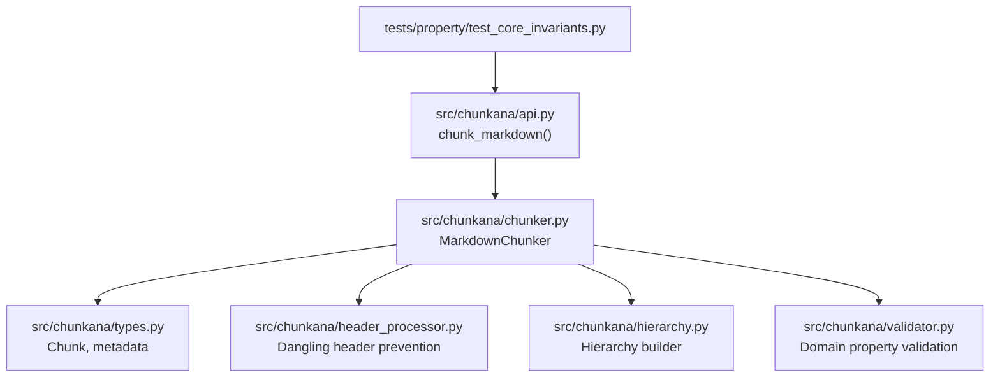
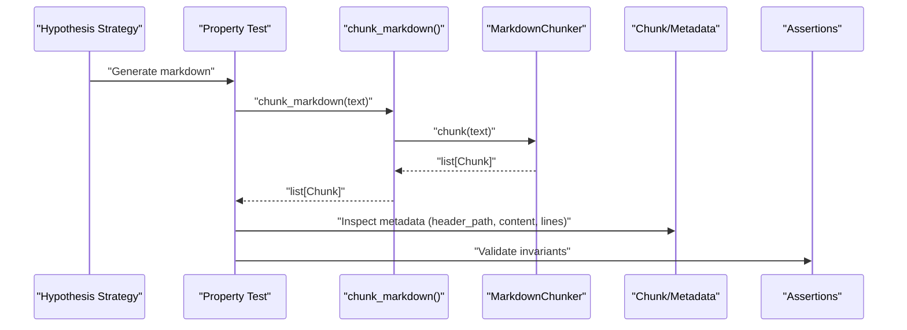
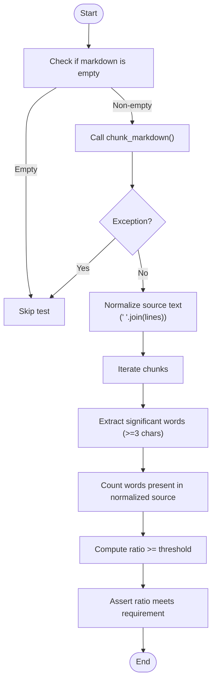
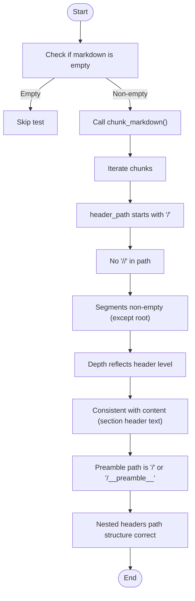
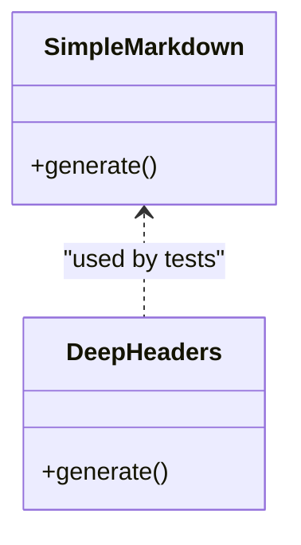
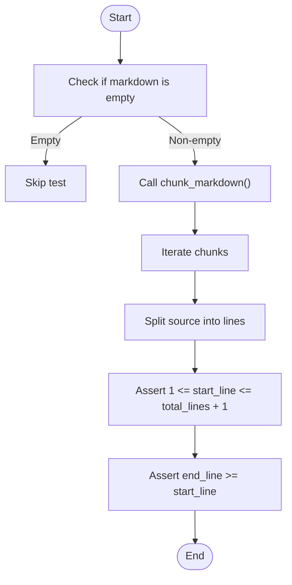
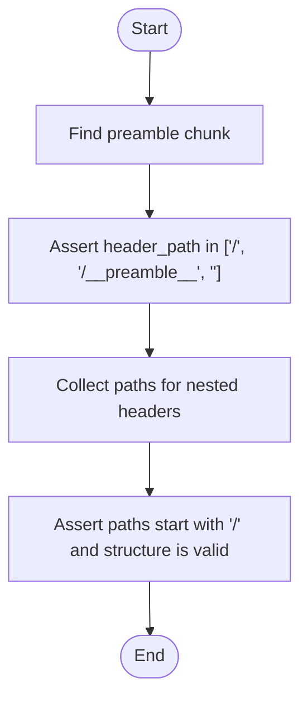
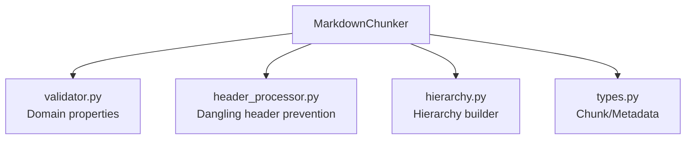
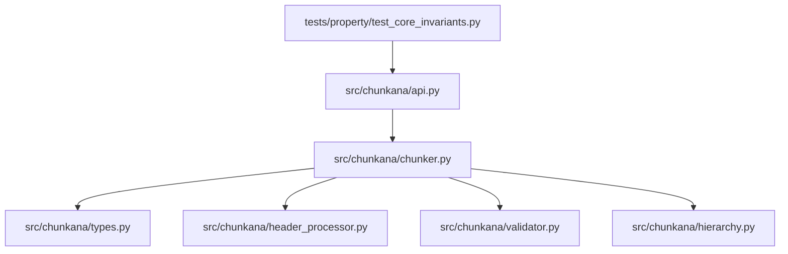

# Core Invariants

<cite>
**Referenced Files in This Document**
- [test_core_invariants.py](file://tests/property/test_core_invariants.py)
- [api.py](file://src/chunkana/api.py)
- [chunker.py](file://src/chunkana/chunker.py)
- [types.py](file://src/chunkana/types.py)
- [validator.py](file://src/chunkana/validator.py)
- [header_processor.py](file://src/chunkana/header_processor.py)
- [hierarchy.py](file://src/chunkana/hierarchy.py)
</cite>

## Table of Contents
1. [Introduction](#introduction)
2. [Project Structure](#project-structure)
3. [Core Components](#core-components)
4. [Architecture Overview](#architecture-overview)
5. [Detailed Component Analysis](#detailed-component-analysis)
6. [Dependency Analysis](#dependency-analysis)
7. [Performance Considerations](#performance-considerations)
8. [Troubleshooting Guide](#troubleshooting-guide)
9. [Conclusion](#conclusion)

## Introduction
This document explains the core invariants validated by Chunkana’s property-based tests. It focuses on:
- Ensuring chunk content is a valid substring of the original source document by checking significant words against normalized source text.
- Enforcing header_path format rules: starting with “/”, using single separators, containing no empty segments, and reflecting document hierarchy.
- Demonstrating how custom Hypothesis strategies generate realistic test cases with varying header levels and text content.
- Providing concrete examples from the test suite for validating start_line and end_line boundaries.
- Addressing edge cases such as preamble chunks and nested headers.
- Discussing whitespace normalization effects, empty documents, and performance implications during invariant checks.
- Offering best practices for extending invariants with additional formatting rules or custom validation logic.

## Project Structure
The relevant components for core invariants are spread across:
- Property tests that define and validate invariants.
- Public API entry points that produce chunks for testing.
- The chunker pipeline that generates chunks and metadata.
- Types that define the Chunk structure and metadata fields.
- Validators and processors that enforce and maintain invariants.

**Diagram sources**
- [test_core_invariants.py](file://tests/property/test_core_invariants.py#L1-L347)
- [api.py](file://src/chunkana/api.py#L1-L120)
- [chunker.py](file://src/chunkana/chunker.py#L80-L210)
- [types.py](file://src/chunkana/types.py#L240-L370)
- [header_processor.py](file://src/chunkana/header_processor.py#L1-L120)
- [hierarchy.py](file://src/chunkana/hierarchy.py#L370-L470)
- [validator.py](file://src/chunkana/validator.py#L1-L120)

**Section sources**
- [test_core_invariants.py](file://tests/property/test_core_invariants.py#L1-L347)
- [api.py](file://src/chunkana/api.py#L1-L120)
- [chunker.py](file://src/chunkana/chunker.py#L80-L210)
- [types.py](file://src/chunkana/types.py#L240-L370)

## Core Components
- Property tests define strategies and assertions for:
  - Chunk content substring validation using significant words and normalized source text.
  - start_line and end_line boundary checks against source line counts.
  - header_path format enforcement: root-starting, single-separator, non-empty segments, and hierarchy reflection.
- The public API exposes chunk_markdown() to generate chunks for testing.
- The chunker pipeline applies strategies, prevents dangling headers, merges small chunks, applies overlap, recalculates metadata, and validates domain properties.
- Types define the Chunk structure and metadata fields used by invariants (e.g., header_path, header_level, content_type).
- Validators and processors enforce and maintain invariants (e.g., dangling header detection/movement, hierarchy building).

**Section sources**
- [test_core_invariants.py](file://tests/property/test_core_invariants.py#L1-L347)
- [api.py](file://src/chunkana/api.py#L18-L41)
- [chunker.py](file://src/chunkana/chunker.py#L431-L470)
- [types.py](file://src/chunkana/types.py#L240-L370)
- [header_processor.py](file://src/chunkana/header_processor.py#L1-L120)
- [hierarchy.py](file://src/chunkana/hierarchy.py#L370-L470)
- [validator.py](file://src/chunkana/validator.py#L1-L120)

## Architecture Overview
The property-based invariant tests rely on a simple pipeline:
- Generate synthetic markdown via Hypothesis strategies.
- Call chunk_markdown() to produce chunks.
- Assert invariants on each chunk and across the full set.

**Diagram sources**
- [test_core_invariants.py](file://tests/property/test_core_invariants.py#L72-L160)
- [api.py](file://src/chunkana/api.py#L18-L41)
- [chunker.py](file://src/chunkana/chunker.py#L85-L176)
- [types.py](file://src/chunkana/types.py#L240-L370)

## Detailed Component Analysis

### Chunk Content Substring Validation
This invariant ensures that each chunk’s content is a valid substring of the original source document. Because whitespace normalization can alter exact substring matches, the test extracts significant words (three or more characters) from chunk content and verifies that a high proportion appear in the normalized source text.

Key behaviors:
- Empty or whitespace-only inputs are skipped.
- Exceptions during chunking are caught and ignored to avoid false negatives.
- Significant words are extracted from chunk content.
- Source text is normalized by collapsing whitespace for comparison.
- A ratio threshold enforces that most significant words are present.

Concrete examples from the test suite:
- Normalization and significant-word filtering are used to compare chunk content against normalized source text.
- start_line and end_line boundaries are validated against the source line count.

**Diagram sources**
- [test_core_invariants.py](file://tests/property/test_core_invariants.py#L96-L127)
- [test_core_invariants.py](file://tests/property/test_core_invariants.py#L130-L159)

**Section sources**
- [test_core_invariants.py](file://tests/property/test_core_invariants.py#L96-L159)
- [api.py](file://src/chunkana/api.py#L18-L41)

### Header Path Format Validation
This invariant enforces the format and semantics of header_path metadata:
- header_path must start with “/”.
- header_path must not contain double slashes.
- header_path segments must not be empty (except the root “/”).
- header_path should reflect document hierarchy (depth roughly corresponds to header level).
- header_path should be consistent with chunk content (e.g., for section chunks, last segment should match header text).
- Edge cases:
  - Preamble chunks should have appropriate header_path values (e.g., “/”, “/__preamble__”, or empty).
  - Nested headers should produce paths that reflect nesting.

**Diagram sources**
- [test_core_invariants.py](file://tests/property/test_core_invariants.py#L177-L347)

**Section sources**
- [test_core_invariants.py](file://tests/property/test_core_invariants.py#L177-L347)

### Custom Hypothesis Strategies for Test Cases
The test suite defines custom strategies to generate realistic markdown inputs:
- simple_markdown(): Generates markdown with headers of levels 1–3 and random text content.
- markdown_with_deep_headers(): Generates markdown with deeper nesting (H1, H2, H3, H4) to exercise hierarchy logic.

These strategies drive property tests by varying:
- Number of sections.
- Header levels.
- Text content characteristics.
- Depth of nesting.

**Diagram sources**
- [test_core_invariants.py](file://tests/property/test_core_invariants.py#L21-L69)
- [test_core_invariants.py](file://tests/property/test_core_invariants.py#L46-L69)

**Section sources**
- [test_core_invariants.py](file://tests/property/test_core_invariants.py#L21-L69)

### Concrete Examples: start_line and end_line Boundaries
The tests validate that:
- start_line is within [1, total_lines + 1].
- end_line >= start_line.
- These constraints hold across all generated documents.

**Diagram sources**
- [test_core_invariants.py](file://tests/property/test_core_invariants.py#L130-L159)

**Section sources**
- [test_core_invariants.py](file://tests/property/test_core_invariants.py#L130-L159)

### Edge Cases: Preamble and Nested Headers
- Preamble chunks:
  - Expected header_path values include “/”, “/__preamble__”, or empty.
  - The test locates the preamble chunk and asserts its header_path is one of the allowed values.
- Nested headers:
  - Paths should reflect nesting (e.g., “/Main”, “/Main/Sub”, “/Main/Sub/SubSub”).
  - The test verifies that paths start with “/” and follow the expected structure.

**Diagram sources**
- [test_core_invariants.py](file://tests/property/test_core_invariants.py#L307-L347)

**Section sources**
- [test_core_invariants.py](file://tests/property/test_core_invariants.py#L307-L347)

### Relationship Between Chunker and Invariants
The chunker pipeline contributes to invariants indirectly:
- Validates domain properties (size bounds, monotonic ordering, empty chunks, valid line numbers) during chunking.
- Prevents dangling headers to maintain content continuity.
- Applies overlap and metadata recalculations that can influence header_path and content relationships.

**Diagram sources**
- [chunker.py](file://src/chunkana/chunker.py#L431-L470)
- [validator.py](file://src/chunkana/validator.py#L1-L120)
- [header_processor.py](file://src/chunkana/header_processor.py#L1-L120)
- [hierarchy.py](file://src/chunkana/hierarchy.py#L370-L470)
- [types.py](file://src/chunkana/types.py#L240-L370)

**Section sources**
- [chunker.py](file://src/chunkana/chunker.py#L431-L470)
- [validator.py](file://src/chunkana/validator.py#L1-L120)
- [header_processor.py](file://src/chunkana/header_processor.py#L1-L120)
- [hierarchy.py](file://src/chunkana/hierarchy.py#L370-L470)
- [types.py](file://src/chunkana/types.py#L240-L370)

## Dependency Analysis
- Property tests depend on:
  - chunk_markdown() to produce chunks.
  - Chunk metadata (header_path, header_level, content_type) to validate format and hierarchy.
- The chunker pipeline depends on:
  - Strategy selection and application.
  - Header processing to prevent dangling headers.
  - Validation to enforce domain properties.
- Types define the contract for Chunk and metadata fields used by invariants.

**Diagram sources**
- [test_core_invariants.py](file://tests/property/test_core_invariants.py#L1-L347)
- [api.py](file://src/chunkana/api.py#L18-L41)
- [chunker.py](file://src/chunkana/chunker.py#L85-L176)
- [types.py](file://src/chunkana/types.py#L240-L370)
- [header_processor.py](file://src/chunkana/header_processor.py#L1-L120)
- [validator.py](file://src/chunkana/validator.py#L1-L120)
- [hierarchy.py](file://src/chunkana/hierarchy.py#L370-L470)

**Section sources**
- [test_core_invariants.py](file://tests/property/test_core_invariants.py#L1-L347)
- [api.py](file://src/chunkana/api.py#L18-L41)
- [chunker.py](file://src/chunkana/chunker.py#L85-L176)
- [types.py](file://src/chunkana/types.py#L240-L370)
- [header_processor.py](file://src/chunkana/header_processor.py#L1-L120)
- [validator.py](file://src/chunkana/validator.py#L1-L120)
- [hierarchy.py](file://src/chunkana/hierarchy.py#L370-L470)

## Performance Considerations
- Whitespace normalization:
  - Normalizing source text by collapsing whitespace reduces false negatives in substring matching but still requires scanning and string operations.
- Significant word extraction:
  - Extracting words and computing ratios is linear in chunk content size; however, repeated normalization and ratio checks across many chunks can add overhead.
- Empty documents:
  - Tests skip empty inputs to avoid unnecessary computation.
- Overlap and metadata:
  - Applying overlap and recalculating metadata adds processing time; however, these steps occur before invariant checks in the chunker pipeline and do not affect property tests directly.
- Strategy-driven generation:
  - Using Hypothesis strategies to generate varied inputs increases coverage but also increases test runtime; settings limit example counts and deadlines to manage performance.

[No sources needed since this section provides general guidance]

## Troubleshooting Guide
Common issues and resolutions:
- Whitespace normalization affecting substring matching:
  - Use significant-word filtering and ratio thresholds rather than exact substring checks.
- Empty documents:
  - Tests explicitly skip empty inputs; ensure inputs are non-empty or adjust assumptions.
- Exceptions during chunking:
  - Tests catch exceptions and skip; if failures persist, inspect the underlying chunker pipeline for errors.
- Header_path anomalies:
  - Validate root-starting, single-separator, and non-empty segment rules.
  - For preamble chunks, confirm header_path is “/”, “/__preamble__”, or empty.
  - For nested headers, ensure paths reflect nesting and start with “/”.

**Section sources**
- [test_core_invariants.py](file://tests/property/test_core_invariants.py#L96-L159)
- [test_core_invariants.py](file://tests/property/test_core_invariants.py#L177-L347)

## Conclusion
Chunkana’s property-based tests rigorously validate core invariants:
- Chunk content is a valid substring of the source via significant-word matching against normalized text.
- header_path format is enforced with strict rules and edge-case handling.
- Custom Hypothesis strategies generate diverse inputs to stress-test these invariants.
- The chunker pipeline enforces domain properties and prevents dangling headers, supporting robust chunking behavior.
Extending these invariants involves adding new strategies and assertions while considering performance and edge cases.