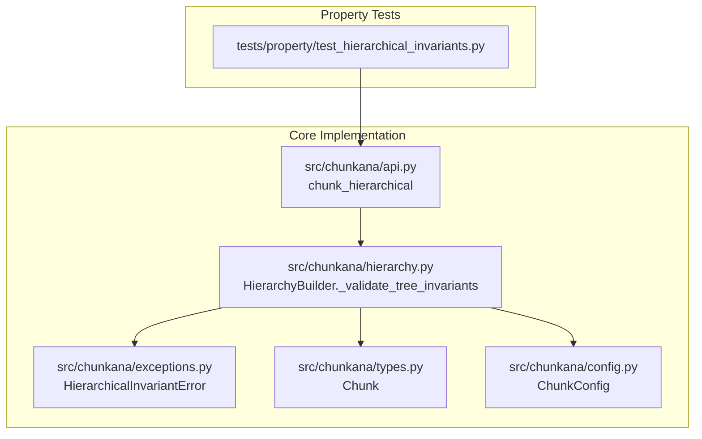
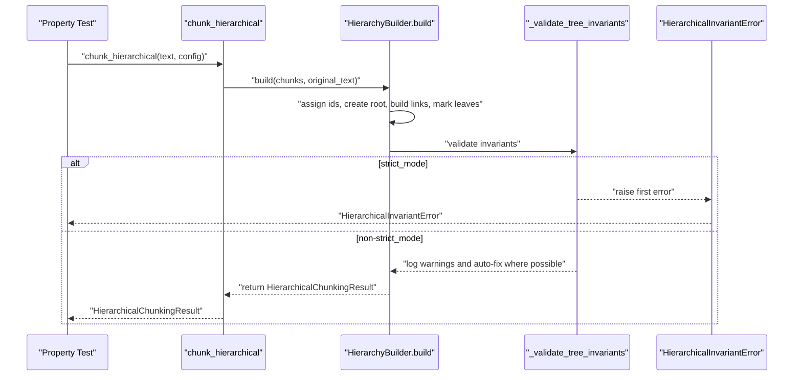
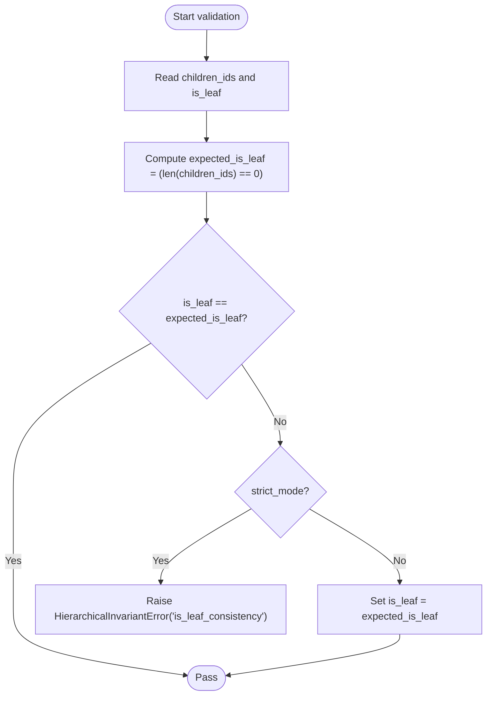
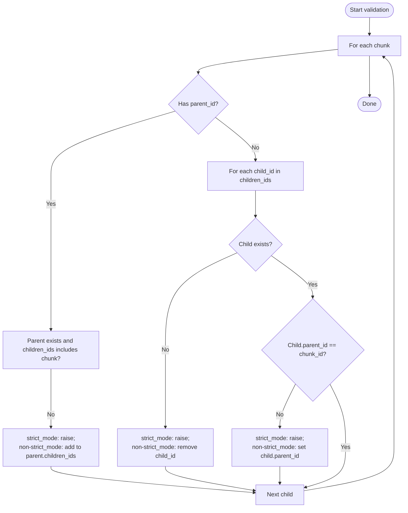
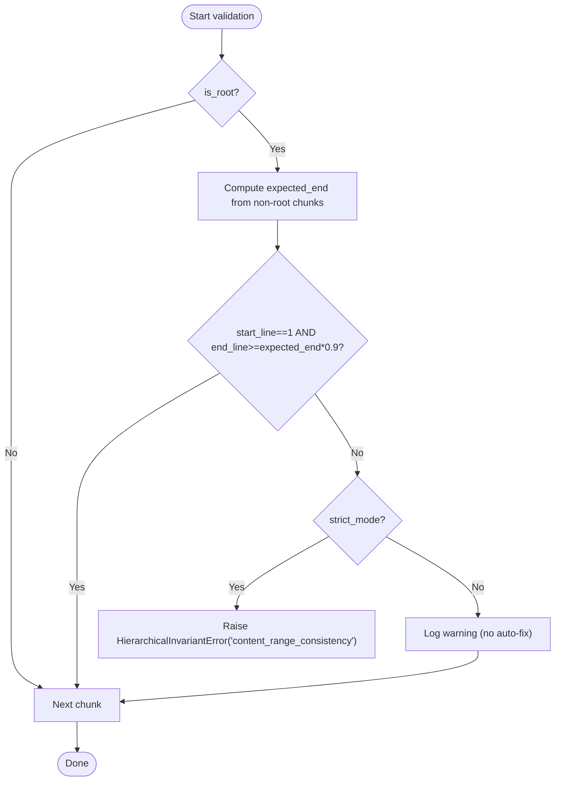
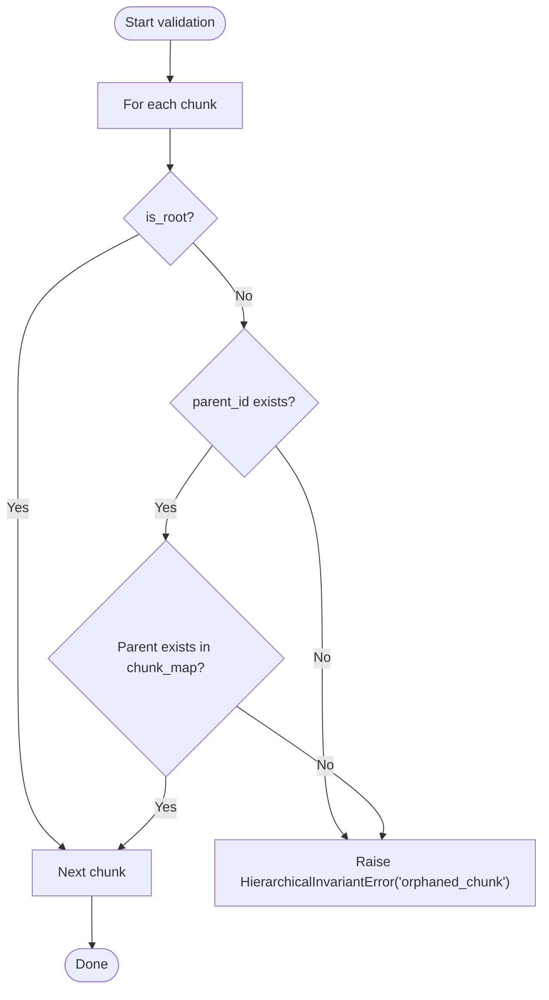
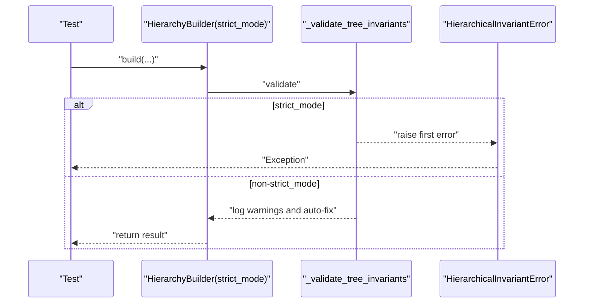
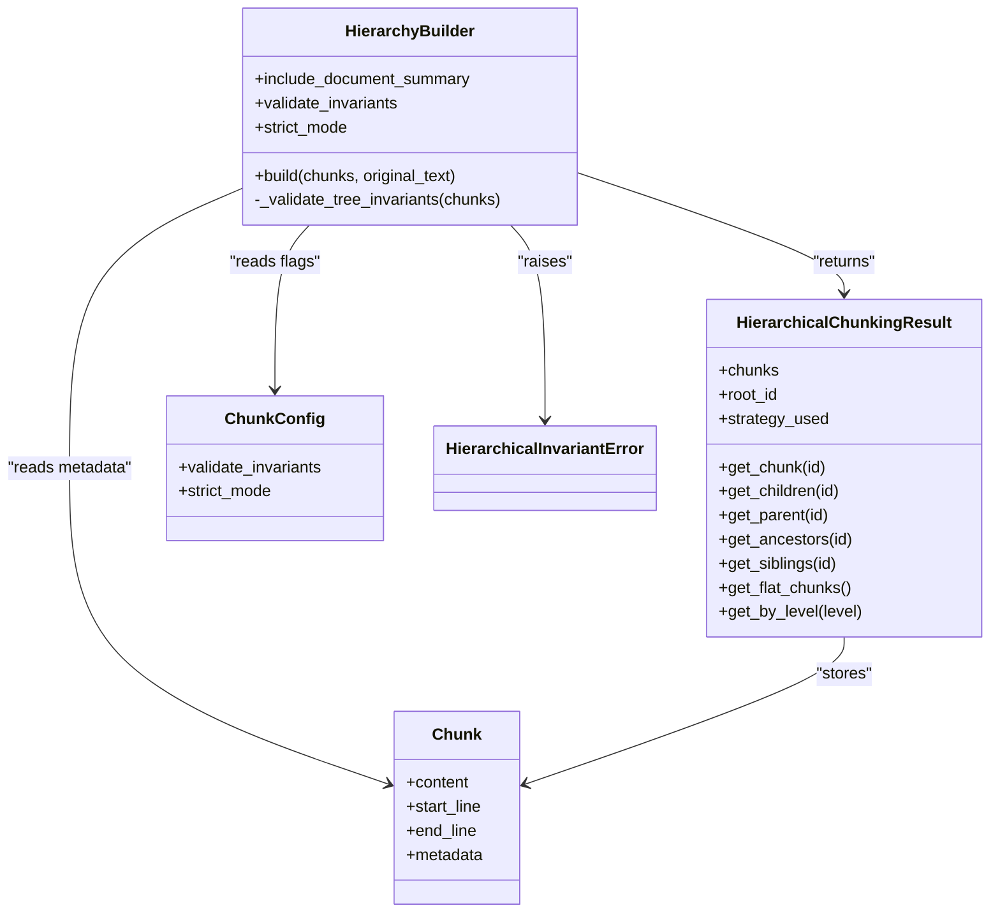

# Hierarchical Invariants

<cite>
**Referenced Files in This Document**
- [test_hierarchical_invariants.py](file://tests/property/test_hierarchical_invariants.py)
- [hierarchy.py](file://src/chunkana/hierarchy.py)
- [exceptions.py](file://src/chunkana/exceptions.py)
- [types.py](file://src/chunkana/types.py)
- [config.py](file://src/chunkana/config.py)
- [api.py](file://src/chunkana/api.py)
</cite>

## Table of Contents
1. [Introduction](#introduction)
2. [Project Structure](#project-structure)
3. [Core Components](#core-components)
4. [Architecture Overview](#architecture-overview)
5. [Detailed Component Analysis](#detailed-component-analysis)
6. [Dependency Analysis](#dependency-analysis)
7. [Performance Considerations](#performance-considerations)
8. [Troubleshooting Guide](#troubleshooting-guide)
9. [Conclusion](#conclusion)

## Introduction
This document explains hierarchical invariants in Chunkana’s property-based testing framework. It focuses on ensuring tree structure integrity for hierarchical chunking results, including:
- is_leaf consistency
- parent-child bidirectionality
- content range consistency for root chunks
- absence of orphaned chunks

It also documents how property tests use a markdown document strategy to generate complex documents with mixed headers and paragraphs, and how a configuration strategy generates valid configuration permutations. Finally, it covers behavior differences between strict_mode (raises exceptions) and non-strict_mode (auto-fixes inconsistencies), with examples from the test suite.

## Project Structure
The hierarchical invariants are validated in two places:
- Property-based tests that generate random markdown documents and validate invariants across many runs
- A dedicated HierarchyBuilder that validates and auto-fixes invariants during hierarchical chunking

**Diagram sources**
- [test_hierarchical_invariants.py](file://tests/property/test_hierarchical_invariants.py#L1-L299)
- [hierarchy.py](file://src/chunkana/hierarchy.py#L233-L966)
- [exceptions.py](file://src/chunkana/exceptions.py#L34-L101)
- [types.py](file://src/chunkana/types.py#L240-L375)
- [config.py](file://src/chunkana/config.py#L17-L123)
- [api.py](file://src/chunkana/api.py#L273-L304)

**Section sources**
- [test_hierarchical_invariants.py](file://tests/property/test_hierarchical_invariants.py#L1-L299)
- [hierarchy.py](file://src/chunkana/hierarchy.py#L233-L966)
- [exceptions.py](file://src/chunkana/exceptions.py#L34-L101)
- [types.py](file://src/chunkana/types.py#L240-L375)
- [config.py](file://src/chunkana/config.py#L17-L123)
- [api.py](file://src/chunkana/api.py#L273-L304)

## Core Components
- HierarchicalChunkingResult: Holds flat chunks plus navigation helpers and a root_id. It provides O(1) lookup by chunk_id and navigation methods (get_children, get_parent, get_ancestors, get_siblings, get_flat_chunks, get_by_level).
- HierarchyBuilder: Orchestrates building parent-child-sibling relationships from flat chunks and validates invariants. It supports strict_mode and non-strict_mode behavior.
- HierarchicalInvariantError: Exception type used to report invariant violations with details and suggested fixes.
- Chunk: The data structure carrying content, line ranges, and metadata including chunk_id, parent_id, children_ids, is_leaf, is_root, hierarchy_level, header_path, etc.
- ChunkConfig: Configuration that controls hierarchical chunking behavior, including validate_invariants and strict_mode.

Key invariant coverage:
- is_leaf consistency: is_leaf equals (children_ids is empty)
- parent-child bidirectionality: parent references children and children reference parents
- content range consistency: root chunk spans appropriate line ranges
- absence of orphaned chunks: all non-root chunks have valid parent references

**Section sources**
- [hierarchy.py](file://src/chunkana/hierarchy.py#L16-L120)
- [hierarchy.py](file://src/chunkana/hierarchy.py#L233-L308)
- [hierarchy.py](file://src/chunkana/hierarchy.py#L812-L966)
- [exceptions.py](file://src/chunkana/exceptions.py#L34-L101)
- [types.py](file://src/chunkana/types.py#L240-L375)
- [config.py](file://src/chunkana/config.py#L17-L123)

## Architecture Overview
The hierarchical validation pipeline:
- Property tests generate random markdown documents and valid configurations
- chunk_hierarchical produces a flat list of chunks and builds a hierarchical result
- HierarchyBuilder assigns IDs, creates root if enabled, builds parent-child and sibling links, marks leaves, and validates invariants
- In strict_mode, violations raise HierarchicalInvariantError; in non-strict_mode, violations are logged and auto-fixed where possible

**Diagram sources**
- [api.py](file://src/chunkana/api.py#L273-L304)
- [hierarchy.py](file://src/chunkana/hierarchy.py#L260-L308)
- [hierarchy.py](file://src/chunkana/hierarchy.py#L812-L966)
- [exceptions.py](file://src/chunkana/exceptions.py#L34-L101)

## Detailed Component Analysis

### Is-Leaf Consistency Property
- Definition: A chunk’s is_leaf flag must match whether it has children_ids. If children_ids is empty, is_leaf must be True; otherwise, is_leaf must be False.
- Validation: The validator computes expected_is_leaf = (len(children_ids) == 0) and compares with actual is_leaf.
- Failure behavior:
  - strict_mode: raises HierarchicalInvariantError with invariant name "is_leaf_consistency"
  - non-strict_mode: logs a warning and auto-fixes is_leaf to match children_ids state

**Diagram sources**
- [hierarchy.py](file://src/chunkana/hierarchy.py#L836-L858)
- [exceptions.py](file://src/chunkana/exceptions.py#L34-L101)

**Section sources**
- [test_hierarchical_invariants.py](file://tests/property/test_hierarchical_invariants.py#L81-L104)
- [hierarchy.py](file://src/chunkana/hierarchy.py#L836-L858)
- [exceptions.py](file://src/chunkana/exceptions.py#L34-L101)

### Parent-Child Bidirectionality Testing
- Definition: Parent-child relationships must be bidirectional:
  - If chunk has parent_id, the parent must exist and must list the chunk in its children_ids
  - If chunk has children_ids, each child must exist and must point back to this chunk as parent_id
- Validation: The validator checks both directions and records missing parents, missing child references, and mismatched parent_id on children.
- Failure behavior:
  - strict_mode: raises HierarchicalInvariantError with invariant name "parent_child_bidirectionality" or "orphaned_chunk"/"orphaned_child"
  - non-strict_mode: logs warnings and auto-fixes by adding missing child references or correcting parent_id

**Diagram sources**
- [hierarchy.py](file://src/chunkana/hierarchy.py#L859-L926)
- [exceptions.py](file://src/chunkana/exceptions.py#L34-L101)

**Section sources**
- [test_hierarchical_invariants.py](file://tests/property/test_hierarchical_invariants.py#L105-L151)
- [hierarchy.py](file://src/chunkana/hierarchy.py#L859-L926)
- [exceptions.py](file://src/chunkana/exceptions.py#L34-L101)

### Content Range Consistency for Root Chunks
- Definition: Root chunks should:
  - start_line == 1
  - end_line be sufficiently large compared to the maximum end_line among non-root chunks (with a tolerance)
- Validation: The validator computes expected_start and expected_end and compares with actual values.
- Failure behavior:
  - strict_mode: raises HierarchicalInvariantError with invariant name "content_range_consistency"
  - non-strict_mode: logs a warning (no auto-fix in this case)

**Diagram sources**
- [hierarchy.py](file://src/chunkana/hierarchy.py#L927-L948)
- [exceptions.py](file://src/chunkana/exceptions.py#L34-L101)

**Section sources**
- [test_hierarchical_invariants.py](file://tests/property/test_hierarchical_invariants.py#L152-L183)
- [hierarchy.py](file://src/chunkana/hierarchy.py#L927-L948)
- [exceptions.py](file://src/chunkana/exceptions.py#L34-L101)

### Absence of Orphaned Chunks
- Definition: All non-root chunks must have a valid parent_id that references an existing chunk.
- Validation: The validator checks that non-root chunks either have no parent_id (root) or that parent_id exists in the chunk map.
- Failure behavior:
  - strict_mode: raises HierarchicalInvariantError with invariant name "orphaned_chunk"
  - non-strict_mode: logs a warning (no auto-fix in this case)

**Diagram sources**
- [hierarchy.py](file://src/chunkana/hierarchy.py#L949-L966)
- [exceptions.py](file://src/chunkana/exceptions.py#L34-L101)

**Section sources**
- [test_hierarchical_invariants.py](file://tests/property/test_hierarchical_invariants.py#L184-L215)
- [hierarchy.py](file://src/chunkana/hierarchy.py#L949-L966)
- [exceptions.py](file://src/chunkana/exceptions.py#L34-L101)

### Strict Mode vs Non-Strict Mode
- strict_mode=True:
  - _validate_tree_invariants raises the first encountered HierarchicalInvariantError immediately
  - Tests demonstrate raising exceptions for is_leaf consistency violations
- strict_mode=False:
  - _validate_tree_invariants logs warnings and auto-fixes where possible:
    - sets is_leaf to match children_ids state
    - adds missing child references to parent.children_ids
    - removes missing child_id entries
    - sets child.parent_id to point back to parent
  - Tests demonstrate auto-fix behavior and verification

**Diagram sources**
- [hierarchy.py](file://src/chunkana/hierarchy.py#L812-L966)
- [exceptions.py](file://src/chunkana/exceptions.py#L34-L101)
- [test_hierarchical_invariants.py](file://tests/property/test_hierarchical_invariants.py#L216-L299)

**Section sources**
- [test_hierarchical_invariants.py](file://tests/property/test_hierarchical_invariants.py#L216-L299)
- [hierarchy.py](file://src/chunkana/hierarchy.py#L812-L966)
- [exceptions.py](file://src/chunkana/exceptions.py#L34-L101)

### How Property Tests Generate Documents and Configurations
- markdown_document strategy:
  - Generates headers (H1–H3) with randomized counts and text
  - Generates paragraphs with randomized counts and text
  - Shuffles content parts and joins with double newlines
  - Uses assume() to ensure the generated document is not empty
- chunk_config strategy:
  - Generates valid max_chunk_size, min_chunk_size, overlap_size
  - Returns a ChunkConfig with validate_invariants=True and strict_mode=False by default

These strategies ensure property tests exercise a wide variety of hierarchical structures and configurations.

**Section sources**
- [test_hierarchical_invariants.py](file://tests/property/test_hierarchical_invariants.py#L16-L74)

## Dependency Analysis
- HierarchicalChunkingResult depends on Chunk metadata fields (chunk_id, parent_id, children_ids, is_leaf, is_root, hierarchy_level) to provide navigation methods.
- HierarchyBuilder depends on:
  - Chunk metadata to construct parent-child and sibling relationships
  - ChunkConfig for hierarchical behavior flags (validate_invariants, strict_mode)
  - HierarchicalInvariantError for reporting violations
- chunk_hierarchical orchestrates the flow from flat chunks to hierarchical result.

**Diagram sources**
- [hierarchy.py](file://src/chunkana/hierarchy.py#L16-L120)
- [hierarchy.py](file://src/chunkana/hierarchy.py#L233-L308)
- [hierarchy.py](file://src/chunkana/hierarchy.py#L812-L966)
- [types.py](file://src/chunkana/types.py#L240-L375)
- [config.py](file://src/chunkana/config.py#L17-L123)
- [exceptions.py](file://src/chunkana/exceptions.py#L34-L101)

**Section sources**
- [hierarchy.py](file://src/chunkana/hierarchy.py#L16-L120)
- [hierarchy.py](file://src/chunkana/hierarchy.py#L233-L308)
- [hierarchy.py](file://src/chunkana/hierarchy.py#L812-L966)
- [types.py](file://src/chunkana/types.py#L240-L375)
- [config.py](file://src/chunkana/config.py#L17-L123)
- [exceptions.py](file://src/chunkana/exceptions.py#L34-L101)

## Performance Considerations
- Deadline settings: Property tests use settings(max_examples=...) and deadline=... to bound runtime and ensure property tests remain fast.
- Empty document handling: The markdown_document strategy uses assume() to avoid empty documents, preventing trivial edge cases and reducing noise in validation.
- Best practices for robust validators:
  - Prefer O(1) lookups via chunk_id indexing when validating relationships
  - Validate bidirectionality in a single pass over chunks
  - Avoid expensive operations in hot paths; keep validation linear in the number of chunks
  - Use strict_mode in CI to catch regressions early; use non-strict_mode in development for iterative fixes

**Section sources**
- [test_hierarchical_invariants.py](file://tests/property/test_hierarchical_invariants.py#L75-L84)
- [test_hierarchical_invariants.py](file://tests/property/test_hierarchical_invariants.py#L55-L57)

## Troubleshooting Guide
- Symptom: HierarchicalInvariantError “is_leaf_consistency”
  - Cause: is_leaf does not match children_ids emptiness
  - Resolution: Ensure is_leaf equals (children_ids is empty); in non-strict_mode, the validator auto-fixes this
- Symptom: HierarchicalInvariantError “parent_child_bidirectionality” or “orphaned_chunk”/“orphaned_child”
  - Cause: Missing parent references or mismatched parent_id on children
  - Resolution: Add missing child references to parent.children_ids; set child.parent_id to point to parent; remove missing child_id entries
- Symptom: HierarchicalInvariantError “content_range_consistency”
  - Cause: Root chunk start_line or end_line not aligned with document expectations
  - Resolution: Adjust root chunk line ranges to match document span; note that non-strict_mode logs but does not auto-fix this
- Debugging tips:
  - Enable strict_mode in CI to surface issues early
  - Inspect chunk metadata (chunk_id, parent_id, children_ids, is_leaf, is_root, hierarchy_level)
  - Use HierarchicalChunkingResult navigation methods to inspect parent/children/siblings relationships

**Section sources**
- [hierarchy.py](file://src/chunkana/hierarchy.py#L812-L966)
- [exceptions.py](file://src/chunkana/exceptions.py#L34-L101)
- [test_hierarchical_invariants.py](file://tests/property/test_hierarchical_invariants.py#L216-L299)

## Conclusion
Hierarchical invariants are essential for maintaining tree integrity in Chunkana’s hierarchical chunking. The property-based tests and HierarchyBuilder together ensure:
- is_leaf consistency
- parent-child bidirectionality
- content range consistency for roots
- absence of orphaned chunks

With strict_mode for CI and non-strict_mode for development, the system balances correctness with usability, auto-fixing where safe and raising clear exceptions where not.