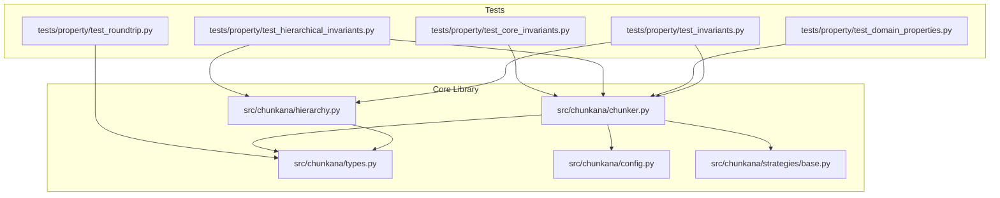
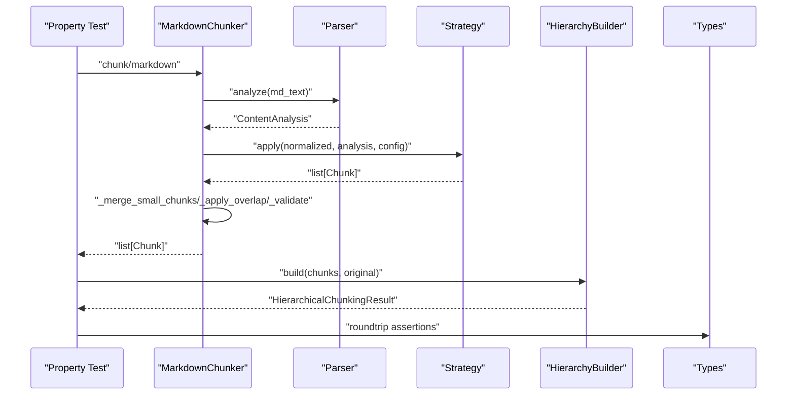
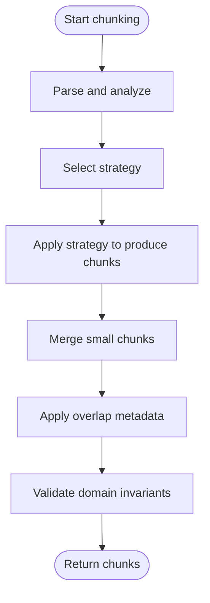
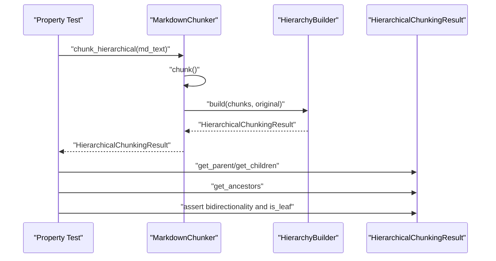
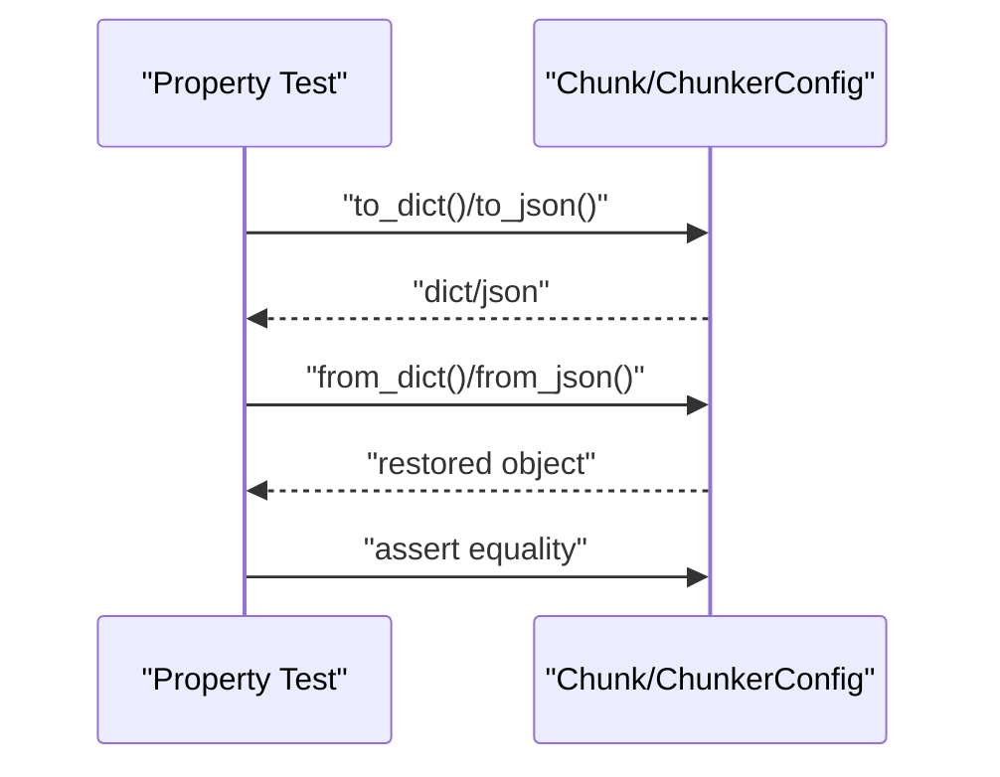
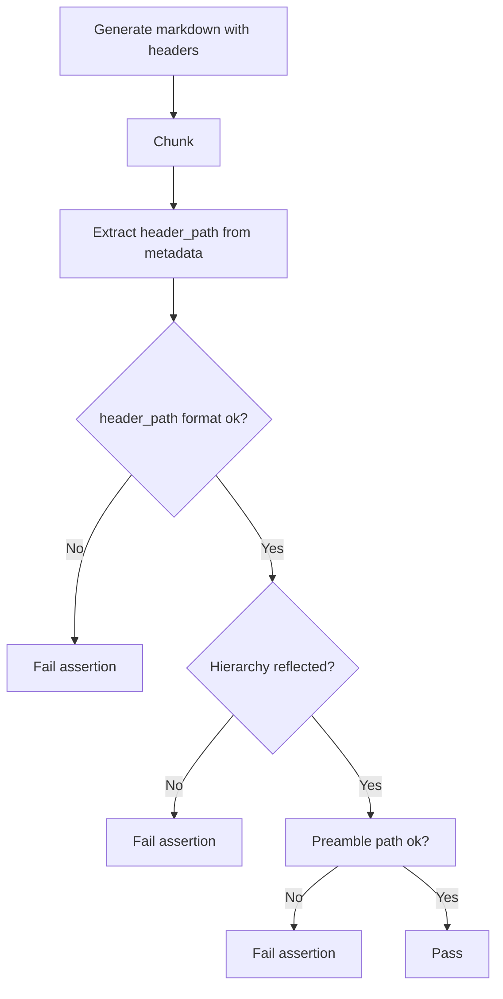
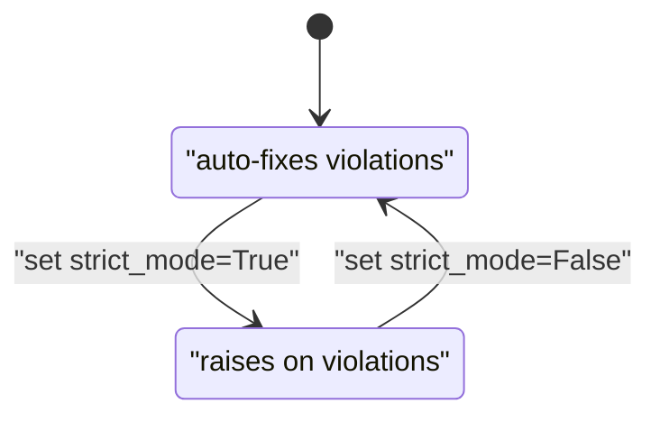
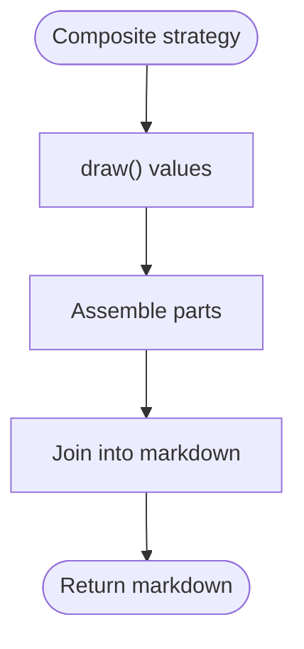
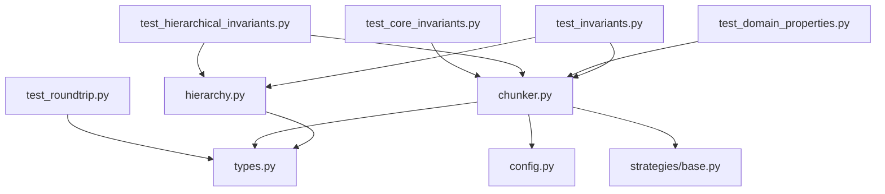

# Property-Based Testing

<cite>
**Referenced Files in This Document**
- [test_core_invariants.py](file://tests/property/test_core_invariants.py)
- [test_hierarchical_invariants.py](file://tests/property/test_hierarchical_invariants.py)
- [test_roundtrip.py](file://tests/property/test_roundtrip.py)
- [test_domain_properties.py](file://tests/property/test_domain_properties.py)
- [test_invariants.py](file://tests/property/test_invariants.py)
- [types.py](file://src/chunkana/types.py)
- [chunker.py](file://src/chunkana/chunker.py)
- [hierarchy.py](file://src/chunkana/hierarchy.py)
- [config.py](file://src/chunkana/config.py)
- [base.py](file://src/chunkana/strategies/base.py)
</cite>

## Table of Contents
1. [Introduction](#introduction)
2. [Project Structure](#project-structure)
3. [Core Components](#core-components)
4. [Architecture Overview](#architecture-overview)
5. [Detailed Component Analysis](#detailed-component-analysis)
6. [Dependency Analysis](#dependency-analysis)
7. [Performance Considerations](#performance-considerations)
8. [Troubleshooting Guide](#troubleshooting-guide)
9. [Conclusion](#conclusion)
10. [Appendices](#appendices)

## Introduction
This document explains how Chunkana employs property-based testing with Hypothesis to validate correctness across domain invariants, hierarchical integrity, and roundtrip consistency. It focuses on:
- Domain invariants: content preservation, size bounds, monotonic ordering, atomic block integrity, and overlap behavior.
- Hierarchical invariants: parent-child bidirectionality, is_leaf consistency, content range alignment, and orphan prevention.
- Roundtrip invariants: serialization/deserialization correctness for core types.
- Header path format validation and preamble handling.
- Strict vs non-strict mode behavior for invariant enforcement.
- Performance implications and best practices for writing robust property tests.

## Project Structure
The property-based tests live under tests/property and exercise the core chunking pipeline and data models. They rely on Hypothesis strategies to generate realistic markdown inputs and configurations, then assert invariants across the resulting chunks and hierarchical structures.

**Diagram sources**
- [test_core_invariants.py](file://tests/property/test_core_invariants.py#L1-L347)
- [test_hierarchical_invariants.py](file://tests/property/test_hierarchical_invariants.py#L1-L299)
- [test_roundtrip.py](file://tests/property/test_roundtrip.py#L1-L409)
- [test_domain_properties.py](file://tests/property/test_domain_properties.py#L1-L406)
- [test_invariants.py](file://tests/property/test_invariants.py#L1-L741)
- [chunker.py](file://src/chunkana/chunker.py#L1-L923)
- [hierarchy.py](file://src/chunkana/hierarchy.py#L1-L966)
- [types.py](file://src/chunkana/types.py#L1-L478)
- [config.py](file://src/chunkana/config.py#L1-L507)
- [base.py](file://src/chunkana/strategies/base.py#L1-L361)

**Section sources**
- [test_core_invariants.py](file://tests/property/test_core_invariants.py#L1-L347)
- [test_hierarchical_invariants.py](file://tests/property/test_hierarchical_invariants.py#L1-L299)
- [test_roundtrip.py](file://tests/property/test_roundtrip.py#L1-L409)
- [test_domain_properties.py](file://tests/property/test_domain_properties.py#L1-L406)
- [test_invariants.py](file://tests/property/test_invariants.py#L1-L741)
- [chunker.py](file://src/chunkana/chunker.py#L1-L923)
- [hierarchy.py](file://src/chunkana/hierarchy.py#L1-L966)
- [types.py](file://src/chunkana/types.py#L1-L478)
- [config.py](file://src/chunkana/config.py#L1-L507)
- [base.py](file://src/chunkana/strategies/base.py#L1-L361)

## Core Components
- Domain invariants: validated by property tests that check content preservation, size bounds, monotonic ordering, atomic block integrity, and overlap behavior.
- Hierarchical invariants: validated by property tests that enforce parent-child bidirectionality, is_leaf consistency, content range alignment, and absence of orphans.
- Roundtrip invariants: validated by property tests that ensure serialization/deserialization preserves Chunk and ChunkerConfig fields.
- Header path format: validated by property tests that enforce leading slash, no double slashes, non-empty segments, and hierarchy reflection.
- Strict vs non-strict mode: validated by property tests that demonstrate exception raising in strict mode and auto-fixing in non-strict mode.

**Section sources**
- [test_domain_properties.py](file://tests/property/test_domain_properties.py#L1-L406)
- [test_hierarchical_invariants.py](file://tests/property/test_hierarchical_invariants.py#L1-L299)
- [test_roundtrip.py](file://tests/property/test_roundtrip.py#L1-L409)
- [test_core_invariants.py](file://tests/property/test_core_invariants.py#L1-L347)

## Architecture Overview
The property tests drive the chunking pipeline and validate invariants at multiple layers:
- MarkdownChunker orchestrates parsing, strategy selection, chunking, overlap, metadata enrichment, and validation.
- HierarchicalChunkingResult and HierarchyBuilder construct and validate parent-child relationships from header_path metadata.
- Types define the Chunk and related structures used across tests.
- Config controls chunking behavior and validation modes.

**Diagram sources**
- [chunker.py](file://src/chunkana/chunker.py#L1-L923)
- [hierarchy.py](file://src/chunkana/hierarchy.py#L1-L966)
- [types.py](file://src/chunkana/types.py#L1-L478)
- [test_domain_properties.py](file://tests/property/test_domain_properties.py#L1-L406)
- [test_hierarchical_invariants.py](file://tests/property/test_hierarchical_invariants.py#L1-L299)
- [test_roundtrip.py](file://tests/property/test_roundtrip.py#L1-L409)

## Detailed Component Analysis

### Domain Invariants (Content Preservation, Size Bounds, Ordering, Atomic Integrity)
- Content preservation: Property tests ensure that non-whitespace characters are preserved across chunks.
- Size bounds: Chunks respect max_chunk_size unless intentionally oversized for atomic integrity reasons.
- Monotonic ordering: start_line values are non-decreasing.
- Atomic block integrity: Code fences and tables remain intact; partial atomic blocks are prevented.
- Overlap behavior: Overlap context is stored in metadata fields and not duplicated in chunk content.

**Diagram sources**
- [chunker.py](file://src/chunkana/chunker.py#L1-L923)
- [test_domain_properties.py](file://tests/property/test_domain_properties.py#L1-L406)
- [test_invariants.py](file://tests/property/test_invariants.py#L1-L741)

**Section sources**
- [test_domain_properties.py](file://tests/property/test_domain_properties.py#L109-L215)
- [test_domain_properties.py](file://tests/property/test_domain_properties.py#L217-L291)
- [test_domain_properties.py](file://tests/property/test_domain_properties.py#L217-L291)
- [test_domain_properties.py](file://tests/property/test_domain_properties.py#L297-L406)
- [test_invariants.py](file://tests/property/test_invariants.py#L184-L253)
- [test_invariants.py](file://tests/property/test_invariants.py#L370-L502)

### Hierarchical Integrity (Parent-Child Bidirectionality, is_leaf Consistency)
- Parent-child bidirectionality: For each chunk, parent_id references a real parent whose children_ids includes the chunk; similarly, each child’s parent_id equals the chunk’s chunk_id.
- is_leaf consistency: is_leaf equals true if and only if children_ids is empty.
- Content range consistency: Root chunk’s start_line is 1 and end_line is near the document end.
- Orphan prevention: Non-root chunks must have a parent; roots have no parent.

**Diagram sources**
- [test_hierarchical_invariants.py](file://tests/property/test_hierarchical_invariants.py#L76-L216)
- [test_hierarchical_invariants.py](file://tests/property/test_hierarchical_invariants.py#L216-L299)
- [hierarchy.py](file://src/chunkana/hierarchy.py#L1-L966)

**Section sources**
- [test_hierarchical_invariants.py](file://tests/property/test_hierarchical_invariants.py#L76-L216)
- [test_hierarchical_invariants.py](file://tests/property/test_hierarchical_invariants.py#L216-L299)
- [hierarchy.py](file://src/chunkana/hierarchy.py#L1-L966)

### Roundtrip Consistency Guarantees
- Chunk roundtrip: to_dict()/from_dict() and to_json()/from_json() preserve content, line numbers, and metadata.
- ChunkerConfig roundtrip: to_dict()/from_dict() preserves all parameters, including nested configs and unknown fields are ignored for forward compatibility.
- Validation errors: Invalid configurations raise descriptive ValueError messages.

**Diagram sources**
- [test_roundtrip.py](file://tests/property/test_roundtrip.py#L156-L315)
- [test_roundtrip.py](file://tests/property/test_roundtrip.py#L316-L409)
- [types.py](file://src/chunkana/types.py#L240-L375)
- [config.py](file://src/chunkana/config.py#L408-L503)

**Section sources**
- [test_roundtrip.py](file://tests/property/test_roundtrip.py#L156-L315)
- [test_roundtrip.py](file://tests/property/test_roundtrip.py#L316-L409)
- [types.py](file://src/chunkana/types.py#L240-L375)
- [config.py](file://src/chunkana/config.py#L408-L503)

### Header Path Format and Preamble Handling
- Header path format: header_path must start with "/", use "/" as separator, and contain non-empty segments (except root).
- Hierarchy reflection: header_path depth roughly corresponds to header level; higher-level headers have shorter paths.
- Preamble handling: preamble chunks should have appropriate header_path values (e.g., root or special preamble path).
- Edge cases: nested headers should form correct path prefixes.

**Diagram sources**
- [test_core_invariants.py](file://tests/property/test_core_invariants.py#L165-L347)
- [types.py](file://src/chunkana/types.py#L240-L318)

**Section sources**
- [test_core_invariants.py](file://tests/property/test_core_invariants.py#L165-L347)
- [types.py](file://src/chunkana/types.py#L240-L318)

### Strict vs Non-Strict Modes and Auto-Fixing
- Strict mode: Raises exceptions for invariant violations (e.g., is_leaf inconsistency).
- Non-strict mode: Auto-fixes violations (e.g., recalculates is_leaf) without raising.

**Diagram sources**
- [test_hierarchical_invariants.py](file://tests/property/test_hierarchical_invariants.py#L216-L299)
- [hierarchy.py](file://src/chunkana/hierarchy.py#L233-L308)

**Section sources**
- [test_hierarchical_invariants.py](file://tests/property/test_hierarchical_invariants.py#L216-L299)
- [hierarchy.py](file://src/chunkana/hierarchy.py#L233-L308)

### Custom Strategies for Valid Inputs
- simple_markdown(): Generates markdown with headers and text, controlling section count and header levels.
- markdown_with_deep_headers(): Generates markdown with deep header nesting (H1–H4) to stress path logic.
- Additional strategies in other test files generate code blocks, tables, and arbitrary markdown text.

**Diagram sources**
- [test_core_invariants.py](file://tests/property/test_core_invariants.py#L21-L70)
- [test_invariants.py](file://tests/property/test_invariants.py#L95-L118)
- [test_domain_properties.py](file://tests/property/test_domain_properties.py#L19-L54)

**Section sources**
- [test_core_invariants.py](file://tests/property/test_core_invariants.py#L21-L70)
- [test_invariants.py](file://tests/property/test_invariants.py#L95-L118)
- [test_domain_properties.py](file://tests/property/test_domain_properties.py#L19-L54)

## Dependency Analysis
- Tests depend on the chunking pipeline and data models.
- MarkdownChunker depends on strategies, parsers, and validators.
- HierarchicalChunkingResult depends on Chunk metadata and navigation helpers.
- Config governs validation and behavior toggles.

**Diagram sources**
- [test_core_invariants.py](file://tests/property/test_core_invariants.py#L1-L347)
- [test_hierarchical_invariants.py](file://tests/property/test_hierarchical_invariants.py#L1-L299)
- [test_roundtrip.py](file://tests/property/test_roundtrip.py#L1-L409)
- [test_domain_properties.py](file://tests/property/test_domain_properties.py#L1-L406)
- [test_invariants.py](file://tests/property/test_invariants.py#L1-L741)
- [chunker.py](file://src/chunkana/chunker.py#L1-L923)
- [hierarchy.py](file://src/chunkana/hierarchy.py#L1-L966)
- [types.py](file://src/chunkana/types.py#L1-L478)
- [config.py](file://src/chunkana/config.py#L1-L507)
- [base.py](file://src/chunkana/strategies/base.py#L1-L361)

**Section sources**
- [chunker.py](file://src/chunkana/chunker.py#L1-L923)
- [hierarchy.py](file://src/chunkana/hierarchy.py#L1-L966)
- [types.py](file://src/chunkana/types.py#L1-L478)
- [config.py](file://src/chunkana/config.py#L1-L507)
- [base.py](file://src/chunkana/strategies/base.py#L1-L361)

## Performance Considerations
- Use settings to cap max_examples and deadlines for long-running tests.
- Prefer targeted strategies that generate realistic inputs to reduce flakiness.
- Validate invariants in non-strict mode during property tests to allow auto-fixing; switch to strict mode when asserting correctness.
- Limit overlap and chunk sizes to manageable ranges for property tests to avoid excessive runtime.

[No sources needed since this section provides general guidance]

## Troubleshooting Guide
Common issues and resolutions:
- Invariant violations in strict vs non-strict modes:
  - Strict mode raises exceptions; use non-strict mode for property tests that intentionally stress edge cases.
- Auto-fixing of metadata inconsistencies:
  - is_leaf recalculated to match children_ids; verify that manual corruption is expected in tests.
- Navigation method correctness:
  - Ensure parent_id and children_ids are consistent; use get_parent/get_children assertions to detect mismatches.
- Overlap metadata correctness:
  - Overlap should be in metadata fields, not embedded in chunk.content; verify previous_content/next_content behavior.
- Header path validation:
  - Enforce leading slash, no double slashes, and non-empty segments; verify hierarchy reflection.

**Section sources**
- [test_hierarchical_invariants.py](file://tests/property/test_hierarchical_invariants.py#L216-L299)
- [test_invariants.py](file://tests/property/test_invariants.py#L370-L502)
- [test_core_invariants.py](file://tests/property/test_core_invariants.py#L165-L347)

## Conclusion
Chunkana’s property-based tests comprehensively validate domain correctness, hierarchical integrity, and serialization roundtrips. By leveraging Hypothesis strategies and targeted assertions, the suite catches edge cases in chunking logic, enforces strict invariants in strict mode, and demonstrates auto-fixing behavior in non-strict mode. These practices improve confidence in chunking quality and guide future enhancements.

[No sources needed since this section summarizes without analyzing specific files]

## Appendices

### Best Practices for Writing Effective Property Tests
- Use composite strategies to generate realistic markdown inputs.
- Keep max_examples and deadlines reasonable to prevent timeouts.
- Separate strict-mode assertions from non-strict-mode exploration.
- Validate both positive and negative properties (e.g., presence and absence of metadata).
- Assert roundtrip correctness for all serializable types.

[No sources needed since this section provides general guidance]