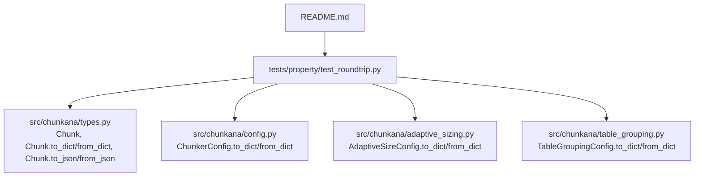
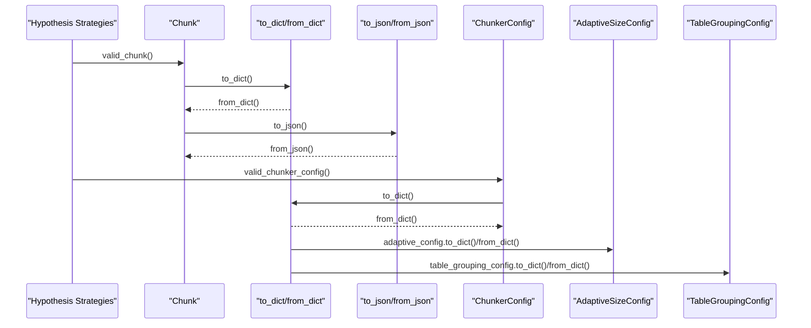
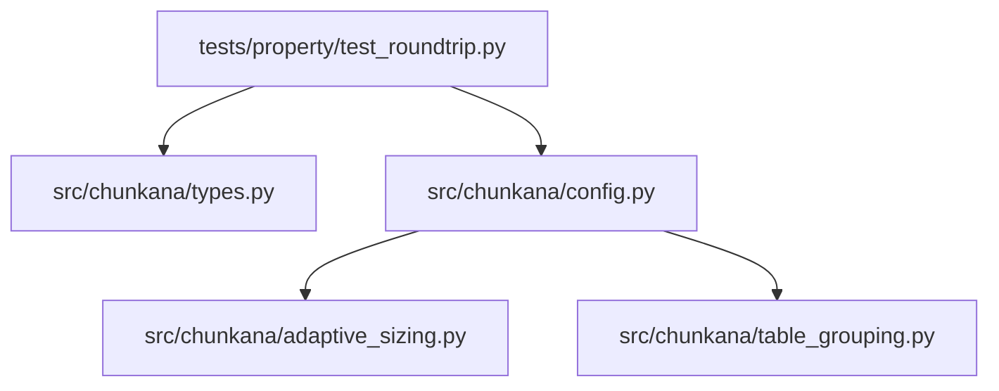

# Roundtrip Serialization

<cite>
**Referenced Files in This Document**
- [test_roundtrip.py](file://tests/property/test_roundtrip.py)
- [types.py](file://src/chunkana/types.py)
- [config.py](file://src/chunkana/config.py)
- [adaptive_sizing.py](file://src/chunkana/adaptive_sizing.py)
- [table_grouping.py](file://src/chunkana/table_grouping.py)
- [README.md](file://README.md)
</cite>

## Table of Contents
1. [Introduction](#introduction)
2. [Project Structure](#project-structure)
3. [Core Components](#core-components)
4. [Architecture Overview](#architecture-overview)
5. [Detailed Component Analysis](#detailed-component-analysis)
6. [Dependency Analysis](#dependency-analysis)
7. [Performance Considerations](#performance-considerations)
8. [Troubleshooting Guide](#troubleshooting-guide)
9. [Conclusion](#conclusion)

## Introduction
This document explains Chunkana’s roundtrip serialization guarantees for property-based testing. It details how data integrity is verified through serialization and deserialization cycles for Chunk and ChunkerConfig objects, including nested configurations. It also documents how Hypothesis strategies generate comprehensive test cases covering edge conditions, and how forward compatibility is ensured by ignoring unknown fields during deserialization. Finally, it outlines validation constraints for configuration parameters and best practices for extending serialization with custom types while preserving roundtrip integrity and backward compatibility.

## Project Structure
The roundtrip testing is implemented in a dedicated property test module that generates valid instances of Chunk and ChunkerConfig using Hypothesis strategies, then asserts that to_dict() and from_dict() preserve all fields, and that to_json() and from_json() preserve content, line numbers, and metadata.

**Diagram sources**
- [test_roundtrip.py](file://tests/property/test_roundtrip.py#L1-L409)
- [types.py](file://src/chunkana/types.py#L240-L378)
- [config.py](file://src/chunkana/config.py#L408-L506)
- [adaptive_sizing.py](file://src/chunkana/adaptive_sizing.py#L77-L101)
- [table_grouping.py](file://src/chunkana/table_grouping.py#L48-L66)
- [README.md](file://README.md#L1-L179)

**Section sources**
- [test_roundtrip.py](file://tests/property/test_roundtrip.py#L1-L409)
- [types.py](file://src/chunkana/types.py#L240-L378)
- [config.py](file://src/chunkana/config.py#L408-L506)
- [adaptive_sizing.py](file://src/chunkana/adaptive_sizing.py#L77-L101)
- [table_grouping.py](file://src/chunkana/table_grouping.py#L48-L66)
- [README.md](file://README.md#L1-L179)

## Core Components
- Chunk: A dataclass representing a chunk of content with content, start_line, end_line, and metadata. It provides to_dict(), from_dict(), to_json(), and from_json() for serialization and deserialization.
- ChunkerConfig: A dataclass encapsulating chunking configuration, including size parameters, strategy thresholds, overlap controls, and optional nested configurations (AdaptiveSizeConfig and TableGroupingConfig). It provides to_dict() and from_dict() with robust validation and forward compatibility.
- Nested configs: AdaptiveSizeConfig and TableGroupingConfig each provide to_dict() and from_dict() to support nested serialization.

Key roundtrip assertions:
- Chunk roundtrip (dict): to_dict() -> from_dict() preserves content, start_line, end_line, and metadata.
- Chunk roundtrip (JSON): to_json() -> from_json() preserves content, start_line, end_line, and metadata; also verifies valid JSON output.
- ChunkerConfig roundtrip (dict): to_dict() -> from_dict() preserves all core and extension parameters, including nested configs.
- Forward compatibility: Unknown fields in from_dict() are ignored; core fields remain correct.

**Section sources**
- [types.py](file://src/chunkana/types.py#L240-L378)
- [config.py](file://src/chunkana/config.py#L408-L506)
- [adaptive_sizing.py](file://src/chunkana/adaptive_sizing.py#L77-L101)
- [table_grouping.py](file://src/chunkana/table_grouping.py#L48-L66)
- [test_roundtrip.py](file://tests/property/test_roundtrip.py#L156-L315)

## Architecture Overview
The roundtrip architecture centers on property-based tests that generate valid instances of Chunk and ChunkerConfig, serialize them, and then deserialize them back. The tests assert equality across all fields and also validate JSON validity and forward compatibility.

**Diagram sources**
- [test_roundtrip.py](file://tests/property/test_roundtrip.py#L156-L315)
- [types.py](file://src/chunkana/types.py#L240-L378)
- [config.py](file://src/chunkana/config.py#L408-L506)
- [adaptive_sizing.py](file://src/chunkana/adaptive_sizing.py#L77-L101)
- [table_grouping.py](file://src/chunkana/table_grouping.py#L48-L66)

## Detailed Component Analysis

### Chunk Roundtrip (Dict and JSON)
- Dict roundtrip: The test serializes a Chunk to a dictionary and restores it via from_dict(). Assertions verify that content, start_line, end_line, and metadata are preserved exactly.
- JSON roundtrip: The test serializes a Chunk to a JSON string and restores it via from_json(). Assertions verify that content, start_line, end_line, and metadata are preserved exactly. It also validates that the JSON string parses to a dict.

Edge conditions covered by strategies:
- Content is non-empty and not purely whitespace.
- start_line is positive and end_line is greater than or equal to start_line.
- metadata is a dictionary with identifiers as keys and values of supported types (text, integers, floats, booleans, None).

Floating-point precision and JSON:
- JSON serialization uses ensure_ascii=False to preserve Unicode. Tests validate that parsing back yields the same structure and values.

Forward compatibility:
- Not applicable for Chunk since it does not accept unknown fields; the test validates that the roundtrip preserves all fields.

Type safety:
- from_dict() checks for required fields and raises descriptive errors if missing or of wrong type.

**Section sources**
- [test_roundtrip.py](file://tests/property/test_roundtrip.py#L156-L223)
- [types.py](file://src/chunkana/types.py#L240-L378)

### ChunkerConfig Roundtrip (Dict)
- Dict roundtrip: The test serializes a ChunkerConfig to a dictionary and restores it via from_dict(). Assertions verify that all core parameters (size bounds, overlap, strategy thresholds, code-context binding parameters, and computed properties) are preserved.
- Extension fields: The test verifies that Chunkana extension fields (e.g., overlap_cap_ratio, use_adaptive_sizing, include_document_summary, strip_obsidian_block_ids, preserve_latex_blocks, latex_display_only, latex_max_context_chars, group_related_tables) are preserved.
- Nested configs: When adaptive_config or table_grouping_config is present, the test verifies that nested fields are preserved; when None, it verifies that the restored config also has None.

Unknown fields:
- The test adds unknown fields to the serialized dict and verifies that deserialization succeeds without raising and that core fields remain correct.

Forward compatibility:
- from_dict() filters to only known fields, ignoring unknown keys. This ensures that future additions to the config schema do not break older consumers.

Validation constraints:
- The test suite also includes explicit validation tests that assert ValueError is raised for invalid values (e.g., non-positive sizes, negative overlap_size, out-of-range thresholds, invalid strategy_override, invalid overlap_cap_ratio).

**Section sources**
- [test_roundtrip.py](file://tests/property/test_roundtrip.py#L224-L315)
- [config.py](file://src/chunkana/config.py#L408-L506)
- [adaptive_sizing.py](file://src/chunkana/adaptive_sizing.py#L77-L101)
- [table_grouping.py](file://src/chunkana/table_grouping.py#L48-L66)

### Hypothesis Strategies for Comprehensive Coverage
- valid_chunk_content: Generates non-empty content with at least one non-whitespace character and avoids all-whitespace strings.
- valid_metadata: Generates metadata dictionaries with identifier keys and values from a set of supported types (text, integers, floats, booleans, None).
- valid_chunk: Builds a Chunk with content, start_line, end_line, and metadata using the above strategies.
- valid_adaptive_config: Generates AdaptiveSizeConfig with weights constrained to sum approximately to 1.0 and non-negative values, and with reasonable ranges for base_size, min_scale, and max_scale.
- valid_table_grouping_config: Generates TableGroupingConfig with non-negative max_distance_lines, positive max_grouped_tables, and sufficiently large max_group_size.
- valid_chunker_config: Generates a full ChunkerConfig with:
  - Positive max_chunk_size and min_chunk_size (with min_chunk_size adjusted if needed).
  - Non-negative overlap_size and overlap_size < max_chunk_size.
  - Valid code_threshold and list_ratio_threshold in [0, 1].
  - Valid structure_threshold >= 1.
  - strategy_override from a fixed set or None.
  - Optional nested configs generated by valid_adaptive_config and valid_table_grouping_config.

These strategies ensure that the property tests exercise realistic and edge-case scenarios across the entire parameter space.

**Section sources**
- [test_roundtrip.py](file://tests/property/test_roundtrip.py#L16-L155)
- [config.py](file://src/chunkana/config.py#L127-L229)

### Validation of Configuration Parameters
The configuration validation logic enforces constraints:
- Size parameters: max_chunk_size > 0, min_chunk_size > 0, min_chunk_size ≤ max_chunk_size, overlap_size ≥ 0, overlap_size < max_chunk_size.
- Thresholds: 0 ≤ code_threshold ≤ 1, structure_threshold ≥ 1, 0 ≤ list_ratio_threshold ≤ 1, list_count_threshold ≥ 1.
- Strategy override: Must be one of the allowed values or None.
- Code-context binding parameters: max_context_chars_before ≥ 0, max_context_chars_after ≥ 0, related_block_max_gap ≥ 1.
- Adaptive sizing parameters: Auto-create default config when enabled.
- LaTeX parameters: latex_max_context_chars ≥ 0.
- Table grouping parameters: Delegated to TableGroupingConfig validation.
- Overlap cap ratio: 0 < overlap_cap_ratio ≤ 1.

The property tests complement these validations by asserting that invalid values raise ValueError with descriptive messages.

**Section sources**
- [config.py](file://src/chunkana/config.py#L127-L229)
- [test_roundtrip.py](file://tests/property/test_roundtrip.py#L316-L409)

### Forward Compatibility Testing
- Unknown fields in from_dict(): The test injects unknown fields into the serialized dictionary and asserts that deserialization succeeds without raising and that core fields remain correct. This demonstrates that the deserializer ignores unknown keys, enabling forward compatibility.

**Section sources**
- [test_roundtrip.py](file://tests/property/test_roundtrip.py#L297-L315)
- [config.py](file://src/chunkana/config.py#L451-L503)

### Floating-Point Precision and JSON Handling
- JSON serialization uses ensure_ascii=False to preserve Unicode content.
- Tests verify that to_json() produces valid JSON and that parsing back yields the expected structure and values.
- For numeric fields, the tests rely on Python’s JSON encoder/decoder behavior and the fact that from_dict() converts values using appropriate types (int/float), ensuring roundtrip preservation.

**Section sources**
- [types.py](file://src/chunkana/types.py#L359-L378)
- [test_roundtrip.py](file://tests/property/test_roundtrip.py#L196-L223)

### Handling Optional Nested Configurations
- AdaptiveSizeConfig and TableGroupingConfig are optional in ChunkerConfig. The property tests verify that when these are None, the restored config also has None; when present, all nested fields are preserved.
- from_dict() reconstructs nested configs by calling their respective from_dict() methods.

**Section sources**
- [test_roundtrip.py](file://tests/property/test_roundtrip.py#L274-L296)
- [config.py](file://src/chunkana/config.py#L451-L503)
- [adaptive_sizing.py](file://src/chunkana/adaptive_sizing.py#L89-L101)
- [table_grouping.py](file://src/chunkana/table_grouping.py#L57-L66)

### Best Practices for Extending Serialization with Custom Types
- Preserve roundtrip integrity:
  - Ensure to_dict() includes all fields needed to reconstruct the object.
  - Ensure from_dict() accepts missing keys with sensible defaults and validates required fields.
  - For nested objects, delegate to their own to_dict()/from_dict() methods.
- Maintain backward compatibility:
  - Ignore unknown fields in from_dict() to allow schema evolution.
  - Provide default values for new optional fields so older consumers can still deserialize successfully.
- Enforce type safety:
  - Validate types and ranges in from_dict() and raise descriptive errors for invalid inputs.
  - Consider using type conversion helpers (e.g., int(), float()) with safe defaults.
- JSON compatibility:
  - Use ensure_ascii=False for Unicode content.
  - Avoid NaN/Infinity in serialized values if they are not JSON-safe; convert to None or strings as appropriate.
- Property-based testing:
  - Add Hypothesis strategies to generate valid instances of new types and integrate them into roundtrip tests.
  - Cover edge cases such as empty values, boundary conditions, and optional fields.

[No sources needed since this section provides general guidance]

## Dependency Analysis
The roundtrip tests depend on:
- Chunk serialization/deserialization in types.py.
- ChunkerConfig serialization/deserialization in config.py, including nested AdaptiveSizeConfig and TableGroupingConfig.
- Hypothesis strategies that generate valid instances across the parameter space.

**Diagram sources**
- [test_roundtrip.py](file://tests/property/test_roundtrip.py#L1-L409)
- [types.py](file://src/chunkana/types.py#L240-L378)
- [config.py](file://src/chunkana/config.py#L408-L506)
- [adaptive_sizing.py](file://src/chunkana/adaptive_sizing.py#L77-L101)
- [table_grouping.py](file://src/chunkana/table_grouping.py#L48-L66)

**Section sources**
- [test_roundtrip.py](file://tests/property/test_roundtrip.py#L1-L409)
- [types.py](file://src/chunkana/types.py#L240-L378)
- [config.py](file://src/chunkana/config.py#L408-L506)
- [adaptive_sizing.py](file://src/chunkana/adaptive_sizing.py#L77-L101)
- [table_grouping.py](file://src/chunkana/table_grouping.py#L48-L66)

## Performance Considerations
- Serialization overhead is minimal compared to chunking operations; roundtrip tests use moderate example counts to balance coverage and runtime.
- JSON encoding/decoding is straightforward; ensure not to serialize excessively large metadata payloads unnecessarily.
- When extending serialization, prefer compact representations and avoid redundant fields.

[No sources needed since this section provides general guidance]

## Troubleshooting Guide
Common issues and resolutions:
- Missing required fields in from_dict():
  - Symptom: ValueError indicating missing required field.
  - Resolution: Ensure to_dict() always includes required fields and that from_dict() handles missing keys gracefully with defaults.
- Invalid configuration values:
  - Symptom: ValueError with descriptive message for invalid size, threshold, or ratio values.
  - Resolution: Adjust inputs to satisfy constraints or update validation logic accordingly.
- Unknown fields causing failure:
  - Symptom: Unexpected KeyError or deserialization failure.
  - Resolution: Ensure from_dict() filters to known fields and ignores unknown keys for forward compatibility.
- JSON decoding errors:
  - Symptom: ValueError on from_json().
  - Resolution: Verify to_json() produces valid JSON and that from_json() catches and surfaces JSONDecodeError with context.

**Section sources**
- [types.py](file://src/chunkana/types.py#L340-L378)
- [config.py](file://src/chunkana/config.py#L451-L506)
- [test_roundtrip.py](file://tests/property/test_roundtrip.py#L316-L409)

## Conclusion
Chunkana’s property-based roundtrip tests rigorously validate serialization and deserialization for Chunk and ChunkerConfig, including nested configurations. Hypothesis strategies comprehensively cover edge cases, and forward compatibility is ensured by ignoring unknown fields. Validation constraints protect configuration integrity, and best practices guide extending serialization with custom types while preserving roundtrip correctness and backward compatibility.