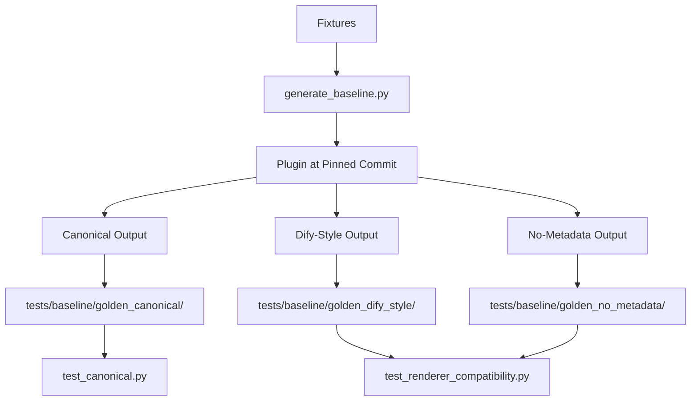
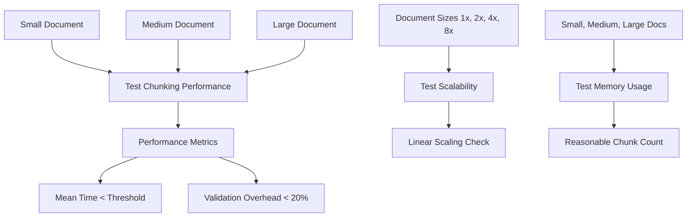

# Testing and Validation

<cite>
**Referenced Files in This Document**   
- [conftest.py](file://tests/conftest.py)
- [test_canonical.py](file://tests/baseline/test_canonical.py)
- [test_renderer_compatibility.py](file://tests/baseline/test_renderer_compatibility.py)
- [test_core_invariants.py](file://tests/property/test_core_invariants.py)
- [test_domain_properties.py](file://tests/property/test_domain_properties.py)
- [test_hierarchical_invariants.py](file://tests/property/test_hierarchical_invariants.py)
- [test_validator.py](file://tests/unit/test_validator.py)
- [test_performance_regression.py](file://tests/performance/test_performance_regression.py)
- [generate_baseline.py](file://scripts/generate_baseline.py)
- [regenerate_goldens.py](file://scripts/regenerate_goldens.py)
- [BASELINE.md](file://BASELINE.md)
</cite>

## Table of Contents
1. [Introduction](#introduction)
2. [Multi-Layered Testing Strategy](#multi-layered-testing-strategy)
3. [Golden File Testing Approach](#golden-file-testing-approach)
4. [Property-Based Testing](#property-based-testing)
5. [Performance Regression Tests](#performance-regression-tests)
6. [Validation System](#validation-system)
7. [Running the Test Suite](#running-the-test-suite)
8. [Writing and Extending Tests](#writing-and-extending-tests)
9. [Contributor Guidance](#contributor-guidance)
10. [Conclusion](#conclusion)

## Introduction

Chunkana employs a comprehensive testing and validation framework to ensure the reliability, correctness, and performance of its Markdown chunking capabilities. The system is designed to maintain compatibility with the dify-markdown-chunker v2 plugin while introducing enhanced features and quality improvements. This documentation details the multi-layered testing strategy, including unit tests, property-based testing, baseline comparisons, and performance regression tests. It also covers the golden file testing approach, domain invariant verification, and the validation system that ensures chunk integrity, tree structure, and metadata correctness.

**Section sources**
- [README.md](file://README.md#L1-L179)
- [CONTRIBUTING.md](file://CONTRIBUTING.md#L1-L90)

## Multi-Layered Testing Strategy

Chunkana implements a multi-layered testing strategy that combines different testing methodologies to ensure comprehensive coverage and robustness. The strategy includes unit tests, property-based testing, baseline compatibility tests, and performance regression tests.

The unit tests in the `tests/unit/` directory focus on individual components and functions, ensuring that each part of the system works correctly in isolation. These tests cover core functionality such as chunk validation, configuration handling, and parsing logic. For example, the validator module is thoroughly tested to ensure it can detect content loss, ordering issues, and other potential problems.

Property-based testing, implemented in the `tests/property/` directory, uses the Hypothesis library to generate randomized inputs and verify domain invariants. This approach tests the system against a wide range of inputs, including edge cases that might be difficult to anticipate manually. The property tests verify fundamental invariants such as content preservation, size bounds, monotonic ordering, and code block integrity.

Baseline compatibility tests in the `tests/baseline/` directory ensure that Chunkana maintains compatibility with the dify-markdown-chunker v2 plugin. These tests use golden file comparisons to verify that Chunkana's output matches the plugin's output byte-for-byte for a set of predefined fixtures. This approach provides a strong guarantee of compatibility while allowing for internal implementation improvements.

Performance regression tests in the `tests/performance/` directory monitor the system's performance characteristics over time. These tests measure chunking time for documents of various sizes and ensure that quality improvements do not significantly impact performance. The tests establish performance baselines and detect any degradation that exceeds acceptable thresholds.

**Section sources**
- [CONTRIBUTING.md](file://CONTRIBUTING.md#L58-L62)
- [test_domain_properties.py](file://tests/property/test_domain_properties.py#L1-L406)
- [test_performance_regression.py](file://tests/performance/test_performance_regression.py#L1-L485)

## Golden File Testing Approach

Chunkana employs a sophisticated golden file testing approach to ensure compatibility with the dify-markdown-chunker v2 plugin. This approach uses canonical and platform-specific formats to validate both the internal chunk structure and the rendered output.

The golden file tests are organized in the `tests/baseline/` directory, which contains three subdirectories for different output formats: `golden_canonical/`, `golden_dify_style/`, and `golden_no_metadata/`. Each directory contains JSONL files with expected outputs for various test fixtures.

The `golden_canonical/` directory contains the canonical representation of chunks as serialized Chunk objects. These files serve as the source of truth for the internal structure of chunks, including content, line numbers, and metadata. The test `test_canonical.py` verifies that Chunkana's output matches these canonical outputs byte-for-byte, ensuring that the fundamental chunking behavior is correct.

The `golden_dify_style/` directory contains outputs formatted for compatibility with the Dify platform when `include_metadata=True`. These outputs include metadata in a `<metadata>` block followed by the chunk content. The test `test_renderer_compatibility.py` verifies that Chunkana's `render_dify_style()` function produces output that matches these golden files exactly.

The `golden_no_metadata/` directory contains outputs for the case when `include_metadata=False`, which uses bidirectional overlap embedding (previous content + current content + next content). This format is tested to ensure compatibility with systems that expect this specific rendering style.

The golden files are generated from the dify-markdown-chunker plugin at a specific pinned commit, as documented in `BASELINE.md`. This ensures that the tests are based on a stable, reproducible reference point. The `generate_baseline.py` script automates the generation of these golden files from the plugin, while `regenerate_goldens.py` can regenerate them based on Chunkana's current behavior when appropriate.

**Diagram sources **
- [BASELINE.md](file://BASELINE.md#L1-L115)
- [generate_baseline.py](file://scripts/generate_baseline.py#L1-L276)
- [test_canonical.py](file://tests/baseline/test_canonical.py#L1-L158)
- [test_renderer_compatibility.py](file://tests/baseline/test_renderer_compatibility.py#L1-L157)

## Property-Based Testing

Chunkana uses property-based testing with the Hypothesis library to verify domain invariants across a wide range of randomized inputs. This approach complements traditional unit testing by automatically generating test cases that cover edge conditions and unexpected inputs.

The property tests are organized in the `tests/property/` directory and verify several key invariants. The `test_domain_properties.py` module tests fundamental properties such as content preservation (no content loss), size bounds (chunks respect max_chunk_size), monotonic ordering (chunk start lines are non-decreasing), and code block integrity (code blocks are not split across chunks).

The `test_core_invariants.py` module focuses on specific invariants related to chunk content and metadata. It verifies that chunk content is a substring of the source document and that header_path metadata follows the correct format (starts with "/", uses "/" as separator, and has no empty segments). These tests use Hypothesis strategies to generate various types of Markdown content, including simple text, deep headers, and code-heavy documents.

For hierarchical chunking, the `test_hierarchical_invariants.py` module verifies tree structure invariants. It tests properties such as is_leaf consistency (a chunk's is_leaf status matches whether it has children), parent-child bidirectionality (parent-child relationships are symmetric), and the absence of orphaned chunks (all chunks are reachable from the root). These tests use Hypothesis to generate random Markdown documents and chunk configurations, ensuring that the hierarchical structure remains valid across diverse inputs.

The property tests also include edge case scenarios and specific validation requirements. For example, they verify that preamble chunks have appropriate header_path values and that nested headers produce correct path structures. The tests use the `@given` decorator from Hypothesis to specify input strategies and the `@settings` decorator to control test parameters such as the number of examples and execution time.

This property-based approach provides strong guarantees about the system's correctness by testing invariants across a broad spectrum of inputs, rather than relying solely on manually crafted test cases. It helps identify subtle bugs and edge cases that might be missed by traditional testing methods.

**Section sources**
- [test_domain_properties.py](file://tests/property/test_domain_properties.py#L1-L406)
- [test_core_invariants.py](file://tests/property/test_core_invariants.py#L1-L347)
- [test_hierarchical_invariants.py](file://tests/property/test_hierarchical_invariants.py#L1-L299)

## Performance Regression Tests

Chunkana includes comprehensive performance regression tests to ensure that quality improvements do not significantly impact performance. These tests are located in the `tests/performance/` directory and use a combination of timing measurements and scalability analysis.

The performance tests measure chunking time for documents of various sizes: small, medium, and large. The small document test verifies that chunking completes in under 50ms, the medium document test checks for completion in under 200ms, and the large document test ensures completion in under 1 second. These thresholds provide a baseline for acceptable performance across different document sizes.

The tests also measure the overhead of validation by comparing chunking times with and without invariant validation enabled. The validation overhead should be less than 20% of the total chunking time, ensuring that the additional safety checks do not significantly impact performance.

Scalability is tested by measuring chunking time for documents of increasing size. The tests verify that performance scales roughly linearly with document size, allowing for some margin for O(n log n) behavior. This ensures that the system remains performant even with very large documents.

Memory usage is also monitored to ensure that the number of chunks produced is reasonable for the document size. The tests check that small documents produce fewer than 20 chunks, medium documents fewer than 100, and large documents fewer than 500. This prevents excessive fragmentation and ensures efficient memory usage.

The performance tests use a `PerformanceTimer` context manager to measure execution time and the `measure_operation` function to collect statistics over multiple iterations. This approach provides reliable performance measurements by averaging over several runs and calculating metrics such as mean, median, and standard deviation.

**Diagram sources **
- [test_performance_regression.py](file://tests/performance/test_performance_regression.py#L1-L485)

## Validation System

Chunkana's validation system ensures the integrity of chunks, the correctness of tree structure, and the accuracy of metadata. The system is implemented in the `validator.py` module and is used throughout the chunking process to detect and prevent various types of errors.

The validation system checks several key aspects of chunk integrity. It verifies that chunks are not empty or whitespace-only, that start_line is at least 1, and that end_line is greater than or equal to start_line. It also checks for content loss by ensuring that all non-whitespace characters from the source document are present in the chunks.

For hierarchical chunking, the validation system enforces tree structure invariants. It checks that the is_leaf status of each chunk matches whether it has children, that parent-child relationships are bidirectional, and that there are no orphaned chunks (all chunks are reachable from the root). The system can operate in strict mode, where invariant violations raise exceptions, or non-strict mode, where violations are auto-fixed and warnings are logged.

Metadata correctness is verified by checking that required metadata keys are present and have valid values. For example, the header_path must start with "/", use "/" as a separator, and not contain empty segments. The validation system also checks that overlap metadata (previous_content and next_content) is consistent with adjacent chunks.

The validation system is integrated into the chunking process and can be configured via the ChunkConfig object. The validate_invariants parameter controls whether tree invariants are checked, and the strict_mode parameter determines how violations are handled. The system provides detailed error messages and suggested fixes for invariant violations, making it easier to diagnose and resolve issues.

Unit tests in `test_validator.py` verify the validation system's functionality, including its ability to detect content loss, ordering issues, and other potential problems. These tests ensure that the validation system correctly identifies and handles various error conditions.

**Section sources**
- [test_validator.py](file://tests/unit/test_validator.py#L1-L262)
- [README.md](file://README.md#L138-L144)

## Running the Test Suite

The Chunkana test suite can be run using pytest from the project root directory. The basic command to run all tests is `pytest`, which executes all test files in the `tests/` directory. For more detailed output, including coverage information, use `pytest --cov=chunkana`.

To run specific categories of tests, use pytest's directory filtering. For example, `pytest tests/unit/` runs only the unit tests, `pytest tests/property/` runs the property-based tests, and `pytest tests/baseline/` runs the baseline compatibility tests. Performance tests can be run with `pytest tests/performance/`, though they may be marked as slow and require additional flags to execute.

The test suite includes several fixtures defined in `conftest.py` that provide common test data and utilities. These include sample Markdown documents of various types (simple, code-heavy, list-heavy) and paths to test directories. The fixtures are automatically available to all test functions and help reduce code duplication.

When running the baseline tests, ensure that the golden files are up to date. If changes to Chunkana's behavior are intentional and correct, the golden files can be regenerated using the `regenerate_goldens.py` script. This script processes the fixtures in `tests/baseline/fixtures/` and generates new golden files based on Chunkana's current behavior.

For development, it's recommended to run tests frequently and use tools like ruff and mypy for linting and type checking. The CONTRIBUTING.md file provides detailed instructions for setting up the development environment and running the full test suite.

**Section sources**
- [CONTRIBUTING.md](file://CONTRIBUTING.md#L45-L73)
- [conftest.py](file://tests/conftest.py#L1-L113)

## Writing and Extending Tests

When writing new tests for Chunkana, follow the established patterns and organization of the existing test suite. Tests should be placed in the appropriate directory based on their type: unit tests in `tests/unit/`, property-based tests in `tests/property/`, and compatibility tests in `tests/baseline/`.

For unit tests, create a new test file or add to an existing one based on the component being tested. Use descriptive test function names and include clear assertions that verify the expected behavior. When testing edge cases, consider using pytest's parametrize decorator to test multiple scenarios with a single test function.

Property-based tests should use the Hypothesis library to generate randomized inputs and verify domain invariants. Define appropriate strategies for generating test data, such as the `markdown_text`, `markdown_with_headers`, and `markdown_with_code` strategies in `test_domain_properties.py`. Use the `@given` decorator to specify the input strategy and the `@settings` decorator to control test parameters.

When extending the baseline fixtures, add new Markdown files to the `tests/baseline/fixtures/` directory that represent challenging or representative use cases. After adding new fixtures, regenerate the golden files using the `regenerate_goldens.py` script to establish the expected output. Ensure that new fixtures cover a diverse range of Markdown features and edge cases.

For performance tests, follow the pattern in `test_performance_regression.py` by defining test documents of various sizes and measuring chunking time. Use the `PerformanceTimer` context manager and `measure_operation` function to collect reliable performance metrics. When adding new performance tests, ensure they have appropriate thresholds and provide meaningful insights into the system's performance characteristics.

All tests should include clear documentation that explains what is being tested and why. Use docstrings to describe test classes and functions, and include comments for complex test logic. When fixing bugs, add regression tests that specifically target the fixed issue to prevent future regressions.

**Section sources**
- [test_domain_properties.py](file://tests/property/test_domain_properties.py#L19-L32)
- [test_performance_regression.py](file://tests/performance/test_performance_regression.py#L176-L188)
- [regenerate_goldens.py](file://scripts/regenerate_goldens.py#L1-L103)

## Contributor Guidance

Contributors to Chunkana should follow the guidelines in CONTRIBUTING.md for setting up the development environment and running tests. Create a virtual environment and install development dependencies using `pip install -e ".[dev]"`. Run tests with `pytest` and check code style with `ruff check src/chunkana` and `mypy src/chunkana`.

When adding new features or fixing bugs, ensure that test coverage is maintained or improved. Write unit tests for new functionality and property-based tests for domain invariants. If the change affects chunking behavior, consider whether the golden files need to be updated and use `regenerate_goldens.py` if appropriate.

For pull requests, include a clear description of the changes and the motivation behind them. Reference any relevant issues and include tests that verify the changes. Run the full test suite and linting checks before submitting to ensure the code meets quality standards.

When reporting issues, provide a minimal reproducible example, the expected behavior, and the actual behavior. Include the Python version, Chunkana version, and any relevant configuration settings. This information helps maintainers diagnose and resolve issues more efficiently.

The project values comprehensive testing and validation, so contributors are encouraged to think about edge cases and potential failure modes when implementing changes. Consider how new features might affect performance, memory usage, and compatibility with existing systems.

**Section sources**
- [CONTRIBUTING.md](file://CONTRIBUTING.md#L1-L90)

## Conclusion

Chunkana's testing and validation framework provides a comprehensive approach to ensuring the reliability and correctness of its Markdown chunking capabilities. The multi-layered testing strategy combines unit tests, property-based testing, baseline comparisons, and performance regression tests to cover all aspects of the system. The golden file testing approach ensures compatibility with the dify-markdown-chunker v2 plugin, while property-based testing verifies domain invariants across a wide range of inputs. The validation system checks chunk integrity, tree structure, and metadata correctness, providing strong guarantees about the quality of the output. Contributors are encouraged to maintain high test coverage and follow the established patterns when adding new tests or extending existing ones.