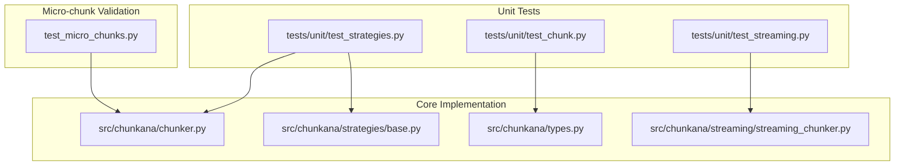
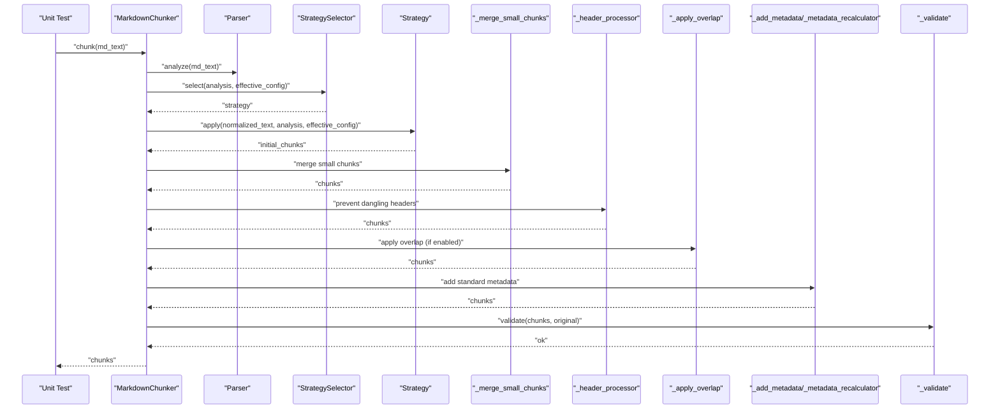
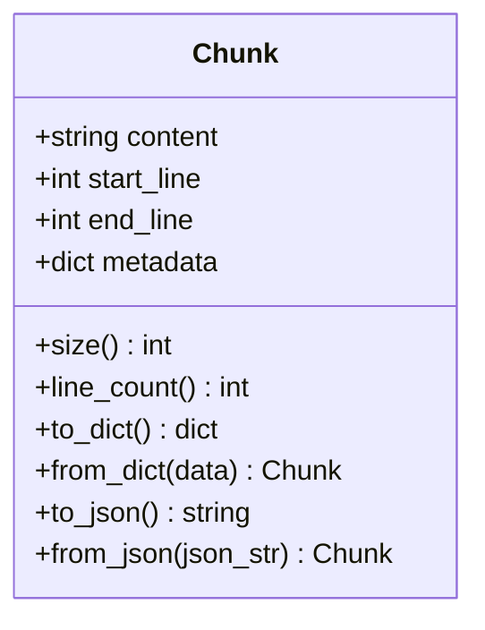
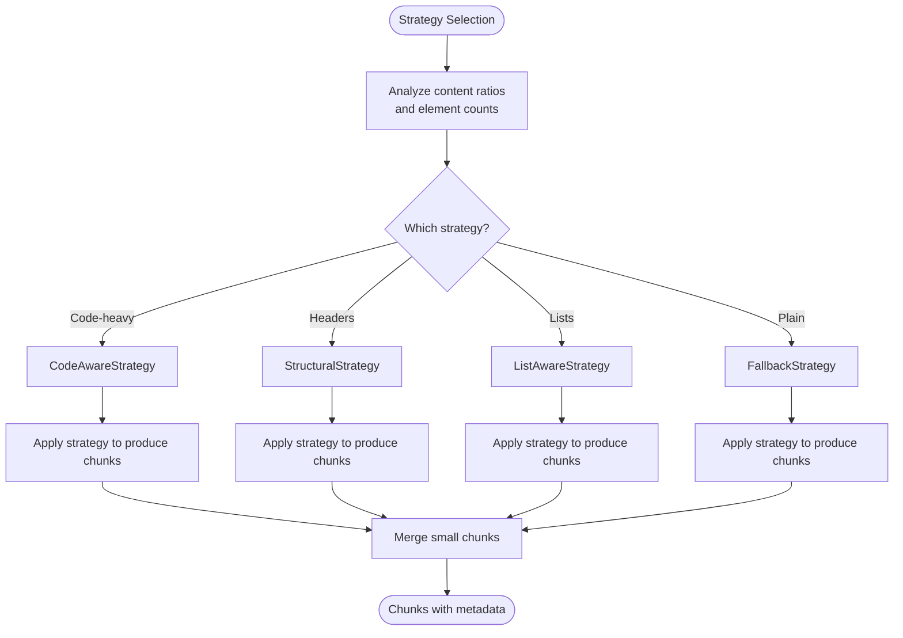
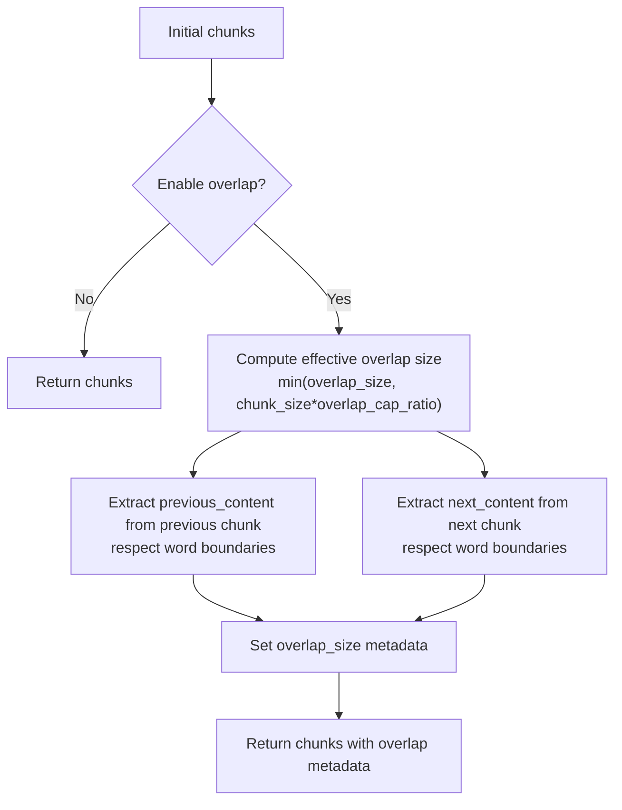
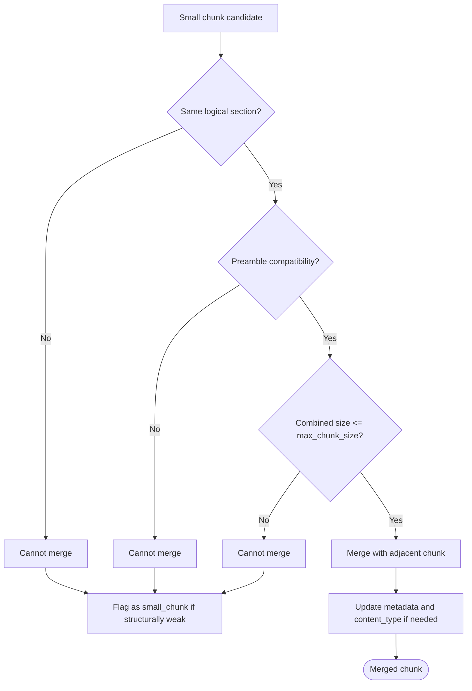
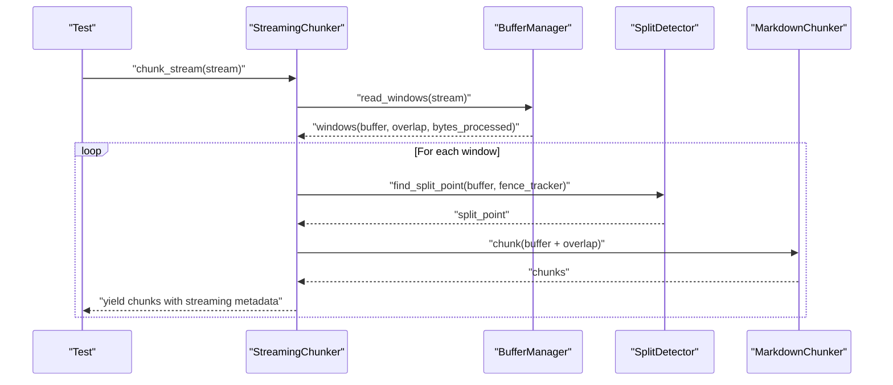
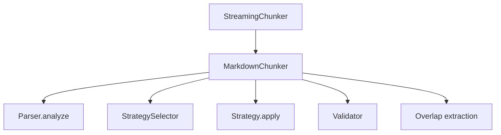

# Chunk Unit Testing

<cite>
**Referenced Files in This Document**
- [test_chunk.py](file://tests/unit/test_chunk.py)
- [chunker.py](file://src/chunkana/chunker.py)
- [types.py](file://src/chunkana/types.py)
- [base.py](file://src/chunkana/strategies/base.py)
- [test_strategies.py](file://tests/unit/test_strategies.py)
- [test_streaming.py](file://tests/unit/test_streaming.py)
- [streaming_chunker.py](file://src/chunkana/streaming/streaming_chunker.py)
- [test_micro_chunks.py](file://test_micro_chunks.py)
- [simple_text.md](file://tests/baseline/fixtures/simple_text.md)
- [code_heavy.md](file://tests/baseline/fixtures/code_heavy.md)
- [headers_deep.md](file://tests/baseline/fixtures/headers_deep.md)
</cite>

## Table of Contents
1. [Introduction](#introduction)
2. [Project Structure](#project-structure)
3. [Core Components](#core-components)
4. [Architecture Overview](#architecture-overview)
5. [Detailed Component Analysis](#detailed-component-analysis)
6. [Dependency Analysis](#dependency-analysis)
7. [Performance Considerations](#performance-considerations)
8. [Troubleshooting Guide](#troubleshooting-guide)
9. [Conclusion](#conclusion)
10. [Appendices](#appendices)

## Introduction
This document focuses on the unit tests for chunking behavior in the repository, specifically analyzing how the test suite validates the core chunking logic and behavior across various Markdown input conditions. It explains how tests validate correct splitting of Markdown content, preservation of atomic blocks, and handling of edge cases such as minimal input or extreme formatting. It also documents how chunk boundary detection, overlap application, and merge logic for small chunks are exercised, and how test inputs map to expected outputs. Finally, it provides best practices for writing new test cases for chunking behavior.

## Project Structure
The chunking pipeline and its unit tests are organized as follows:
- Core chunking logic resides in the main chunker class and strategies.
- Unit tests for the Chunk dataclass and serialization are located in the unit test suite.
- Strategy selection and behavior are validated in dedicated strategy tests.
- Streaming chunking behavior is validated in streaming tests.
- Micro-chunk handling and small-chunk merge logic are validated in a dedicated test script.

**Diagram sources**
- [test_chunk.py](file://tests/unit/test_chunk.py#L1-L166)
- [chunker.py](file://src/chunkana/chunker.py#L85-L176)
- [base.py](file://src/chunkana/strategies/base.py#L1-L120)
- [types.py](file://src/chunkana/types.py#L240-L376)
- [streaming_chunker.py](file://src/chunkana/streaming/streaming_chunker.py#L1-L99)
- [test_micro_chunks.py](file://test_micro_chunks.py#L1-L329)

**Section sources**
- [test_chunk.py](file://tests/unit/test_chunk.py#L1-L166)
- [chunker.py](file://src/chunkana/chunker.py#L85-L176)
- [base.py](file://src/chunkana/strategies/base.py#L1-L120)
- [types.py](file://src/chunkana/types.py#L240-L376)
- [streaming_chunker.py](file://src/chunkana/streaming/streaming_chunker.py#L1-L99)
- [test_micro_chunks.py](file://test_micro_chunks.py#L1-L329)

## Core Components
This section outlines the core components relevant to chunking unit tests:
- Chunk dataclass and validation: Ensures correct construction, indexing semantics, and serialization.
- MarkdownChunker pipeline: Orchestrates parsing, strategy selection, chunk generation, merging small chunks, overlap application, metadata enrichment, and validation.
- Strategies: Provide boundary detection and chunk creation logic, including atomic block preservation and oversize handling.
- Streaming chunker: Validates chunking behavior for large inputs with windowed processing and overlap.

Key responsibilities:
- Chunk validation ensures 1-indexed line numbers and non-empty content.
- Serialization tests confirm round-trip fidelity for dictionaries and JSON.
- Strategy tests validate boundary detection for headers, code blocks, and lists.
- Streaming tests validate overlap extraction and metadata consistency.

**Section sources**
- [types.py](file://src/chunkana/types.py#L240-L376)
- [chunker.py](file://src/chunkana/chunker.py#L85-L176)
- [base.py](file://src/chunkana/strategies/base.py#L1-L120)
- [test_strategies.py](file://tests/unit/test_strategies.py#L1-L364)
- [test_streaming.py](file://tests/unit/test_streaming.py#L1-L363)

## Architecture Overview
The chunking pipeline applies a linear sequence of steps: parse, select strategy, apply strategy, merge small chunks, prevent dangling headers, apply overlap, add metadata, recalculate derived metadata, enrich with adaptive sizing metadata, and validate.

**Diagram sources**
- [chunker.py](file://src/chunkana/chunker.py#L85-L176)
- [chunker.py](file://src/chunkana/chunker.py#L301-L470)
- [base.py](file://src/chunkana/strategies/base.py#L52-L89)

## Detailed Component Analysis

### Chunk Dataclass and Validation Tests
These tests validate:
- Creation of valid chunks with correct content, start_line, end_line, and size.
- Error conditions for invalid indices and empty content.
- Serialization to/from dictionary and JSON, including Unicode preservation.

Behavior under test:
- Indexing is 1-based and monotonic.
- Empty or whitespace-only content raises an error.
- Serialization preserves content and metadata.

**Diagram sources**
- [types.py](file://src/chunkana/types.py#L240-L376)

**Section sources**
- [test_chunk.py](file://tests/unit/test_chunk.py#L13-L166)
- [types.py](file://src/chunkana/types.py#L240-L376)

### Strategy Boundary Detection and Atomic Block Preservation
Strategy tests validate:
- Strategy selection for code-heavy, table-heavy, header-heavy, list-heavy, and plain-text documents.
- Preservation of atomic blocks (code and tables) during chunking.
- Structural splitting on headers and hierarchy metadata preservation.
- List item preservation across chunk boundaries.

**Diagram sources**
- [test_strategies.py](file://tests/unit/test_strategies.py#L1-L364)
- [base.py](file://src/chunkana/strategies/base.py#L1-L120)

**Section sources**
- [test_strategies.py](file://tests/unit/test_strategies.py#L1-L364)
- [base.py](file://src/chunkana/strategies/base.py#L1-L120)

### Overlap Application and Metadata Extraction
Overlap tests validate:
- Metadata-only overlap extraction respecting word boundaries.
- Adaptive overlap caps based on chunk size.
- Consistent metadata fields across chunks.

**Diagram sources**
- [chunker.py](file://src/chunkana/chunker.py#L301-L429)

**Section sources**
- [chunker.py](file://src/chunkana/chunker.py#L301-L429)

### Merge Logic for Small Chunks and Micro-chunk Minimization
Micro-chunk tests validate:
- Flagging of small chunks that cannot be merged without exceeding size limits and are structurally weak.
- Preference for merging within the same logical section.
- Prevention of merging preamble with structural content.
- Metadata correctness after merges.

**Diagram sources**
- [chunker.py](file://src/chunkana/chunker.py#L471-L800)
- [test_micro_chunks.py](file://test_micro_chunks.py#L1-L329)

**Section sources**
- [chunker.py](file://src/chunkana/chunker.py#L471-L800)
- [test_micro_chunks.py](file://test_micro_chunks.py#L1-L329)

### Streaming Chunking Behavior
Streaming tests validate:
- Windowed processing with overlap extraction.
- Preservation of atomic blocks across windows.
- Metadata consistency across windows and chunk indices.

**Diagram sources**
- [test_streaming.py](file://tests/unit/test_streaming.py#L1-L363)
- [streaming_chunker.py](file://src/chunkana/streaming/streaming_chunker.py#L1-L99)

**Section sources**
- [test_streaming.py](file://tests/unit/test_streaming.py#L1-L363)
- [streaming_chunker.py](file://src/chunkana/streaming/streaming_chunker.py#L1-L99)

## Dependency Analysis
The chunking pipeline depends on:
- Parser for content analysis and normalized text.
- StrategySelector for strategy selection.
- Strategies for boundary detection and chunk creation.
- Validator for domain properties and content loss checks.
- Streaming components for large-file processing.

**Diagram sources**
- [chunker.py](file://src/chunkana/chunker.py#L85-L176)
- [test_streaming.py](file://tests/unit/test_streaming.py#L1-L363)
- [streaming_chunker.py](file://src/chunkana/streaming/streaming_chunker.py#L1-L99)

**Section sources**
- [chunker.py](file://src/chunkana/chunker.py#L85-L176)
- [test_streaming.py](file://tests/unit/test_streaming.py#L1-L363)
- [streaming_chunker.py](file://src/chunkana/streaming/streaming_chunker.py#L1-L99)

## Performance Considerations
- Overlap computation is linear in the number of chunks and chunk sizes.
- Strategy selection and application depend on content analysis and element counts.
- Streaming reduces memory usage by processing fixed-size windows with overlap.
- Micro-chunk minimization avoids excessive fragmentation by merging small chunks within logical sections.

[No sources needed since this section provides general guidance]

## Troubleshooting Guide
Common issues and how tests catch them:
- Incorrect chunk sizing: Oversized chunks are flagged with metadata indicating reasons such as code block integrity or table integrity.
- Lost content segments: Validator checks for near-complete content recovery; tests ensure combined output covers the original text within tolerance.
- Misplaced overlap: Tests verify overlap metadata presence and word-boundary respect.
- Micro-chunks: Tests flag small chunks that cannot be merged without violating size limits and are structurally weak.

Best practices for writing new test cases:
- Cover strategy selection for different content profiles (code-heavy, header-heavy, list-heavy).
- Validate atomic block preservation for code and tables.
- Exercise overlap behavior with varied chunk sizes and word boundaries.
- Test micro-chunk scenarios: small header-only chunks, preamble isolation, and section boundary merging preferences.
- Validate streaming behavior with large inputs and window transitions.

**Section sources**
- [chunker.py](file://src/chunkana/chunker.py#L431-L470)
- [base.py](file://src/chunkana/strategies/base.py#L118-L167)
- [test_strategies.py](file://tests/unit/test_strategies.py#L165-L220)
- [test_micro_chunks.py](file://test_micro_chunks.py#L1-L329)

## Conclusion
The unit tests comprehensively validate the chunking pipeline’s correctness across Markdown elements and edge cases. They ensure atomic block preservation, proper boundary detection, overlap application, and micro-chunk minimization. Strategy tests confirm that the correct splitting logic is applied depending on document characteristics, while streaming tests validate memory-efficient processing for large inputs. These tests collectively provide confidence that chunking behaves as intended under diverse conditions.

[No sources needed since this section summarizes without analyzing specific files]

## Appendices

### Test Inputs and Expected Outputs Mapping
- Simple text fixture demonstrates straightforward chunking behavior with headers and paragraphs.
- Code-heavy fixture exercises code block preservation and oversize handling.
- Headers-deep fixture verifies deep header hierarchy and metadata propagation.

**Section sources**
- [simple_text.md](file://tests/baseline/fixtures/simple_text.md#L1-L26)
- [code_heavy.md](file://tests/baseline/fixtures/code_heavy.md#L1-L74)
- [headers_deep.md](file://tests/baseline/fixtures/headers_deep.md#L1-L66)