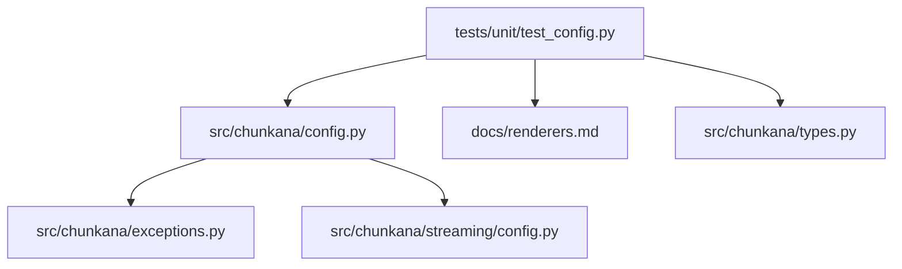
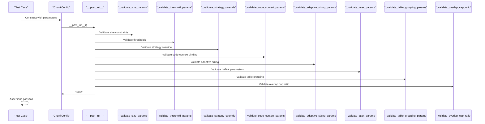
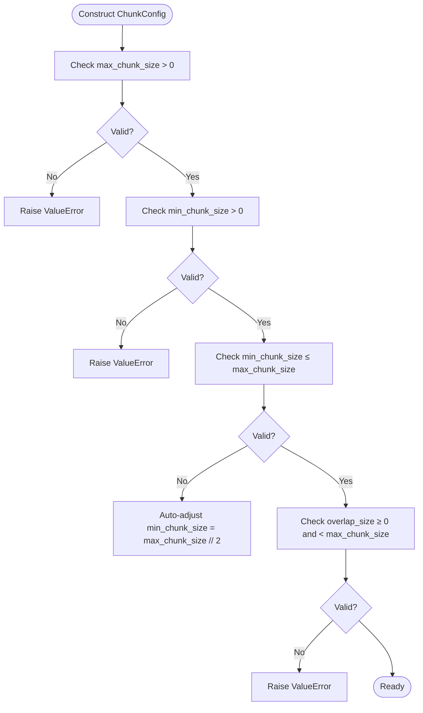
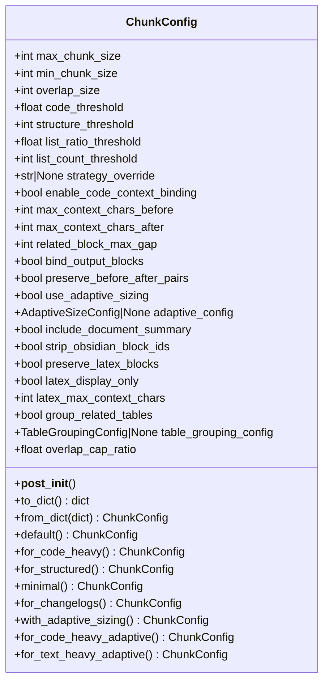
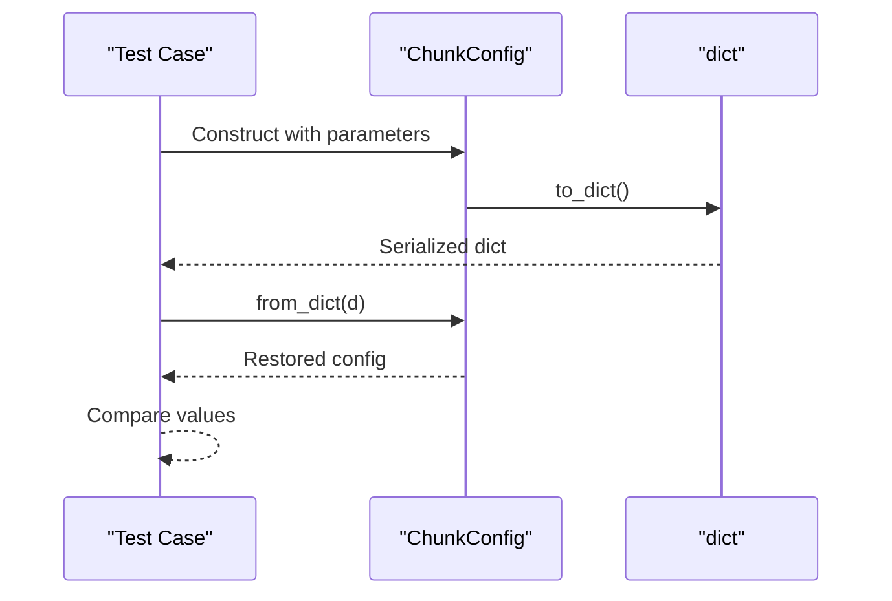
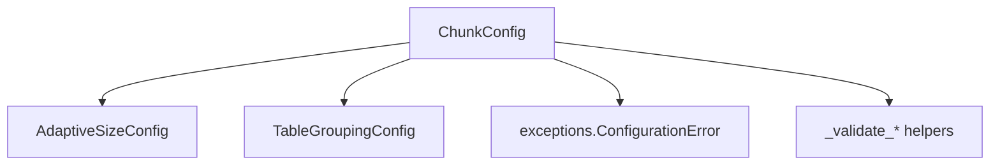

# Configuration Unit Testing

<cite>
**Referenced Files in This Document**
- [test_config.py](file://tests/unit/test_config.py)
- [config.py](file://src/chunkana/config.py)
- [exceptions.py](file://src/chunkana/exceptions.py)
- [renderers.md](file://docs/renderers.md)
- [types.py](file://src/chunkana/types.py)
- [streaming_config.py](file://src/chunkana/streaming/config.py)
</cite>

## Table of Contents
1. [Introduction](#introduction)
2. [Project Structure](#project-structure)
3. [Core Components](#core-components)
4. [Architecture Overview](#architecture-overview)
5. [Detailed Component Analysis](#detailed-component-analysis)
6. [Dependency Analysis](#dependency-analysis)
7. [Performance Considerations](#performance-considerations)
8. [Troubleshooting Guide](#troubleshooting-guide)
9. [Conclusion](#conclusion)
10. [Appendices](#appendices)

## Introduction
This document explains how the unit tests in tests/unit/test_config.py validate configuration object creation, parameter validation, and default value handling for the ChunkConfig class. It focuses on:
- Correct parsing of configuration parameters
- Type safety and schema compliance
- Validation of chunk size limits, strategy selection settings, and renderer-related configuration
- Handling of invalid configurations and error propagation
- Coverage of ChunkConfig attributes and how tests verify them
- Guidance for adding tests for new configuration parameters

## Project Structure
The configuration unit tests reside under tests/unit/test_config.py and exercise the ChunkConfig class defined in src/chunkana/config.py. Supporting documentation for renderers is in docs/renderers.md, while streaming configuration is in src/chunkana/streaming/config.py. The exceptions module defines error types used by the system.

**Diagram sources**
- [test_config.py](file://tests/unit/test_config.py#L1-L226)
- [config.py](file://src/chunkana/config.py#L1-L507)
- [exceptions.py](file://src/chunkana/exceptions.py#L1-L200)
- [streaming_config.py](file://src/chunkana/streaming/config.py#L1-L24)
- [renderers.md](file://docs/renderers.md#L1-L136)
- [types.py](file://src/chunkana/types.py#L1-L478)

**Section sources**
- [test_config.py](file://tests/unit/test_config.py#L1-L226)
- [config.py](file://src/chunkana/config.py#L1-L507)

## Core Components
- ChunkConfig: Central configuration dataclass with validated defaults and comprehensive validation logic in __post_init__ and dedicated validation helpers.
- Factory methods: default(), for_code_heavy(), for_structured(), minimal(), for_changelogs(), with_adaptive_sizing(), for_code_heavy_adaptive(), for_text_heavy_adaptive().
- Serialization: to_dict() and from_dict() for schema-compliant persistence and round-tripping.
- Validation: strict checks for numeric bounds, ratio ranges, strategy overrides, and inter-parameter constraints.
- Renderer selection: documented in renderers.md; renderer options are not part of ChunkConfig but influence downstream rendering behavior.

Key validation areas covered by tests:
- Size limits: max_chunk_size, min_chunk_size, overlap_size
- Ratio bounds: code_threshold, structure_threshold, list_ratio_threshold, overlap_cap_ratio
- Strategy selection: strategy_override
- Code-context binding: enable_code_context_binding and related parameters
- Serialization: to_dict() and from_dict() round-trips

**Section sources**
- [config.py](file://src/chunkana/config.py#L17-L126)
- [config.py](file://src/chunkana/config.py#L127-L229)
- [config.py](file://src/chunkana/config.py#L310-L407)
- [config.py](file://src/chunkana/config.py#L408-L503)
- [test_config.py](file://tests/unit/test_config.py#L13-L226)

## Architecture Overview
The configuration validation pipeline is centralized in ChunkConfig.__post_init__ and invoked during construction. Tests validate:
- Default construction correctness
- Factory method outputs
- Serialization round-trips
- Alias behavior (ChunkerConfig is an alias of ChunkConfig)
- Code-context binding parameters
- Overlap cap ratio constraints

**Diagram sources**
- [config.py](file://src/chunkana/config.py#L127-L229)

## Detailed Component Analysis

### Configuration Validation Tests
These tests verify that default and constructed configurations satisfy basic invariants and that invalid values raise appropriate errors.

- Default configuration validity: Ensures positive sizes, non-negative overlap, and min_chunk_size ≤ max_chunk_size.
- Invalid max_chunk_size: Zero and negative values raise ValueError.
- Invalid min_chunk_size: Negative values raise ValueError.
- min > max adjustment: Tests that min is auto-adjusted to half of max when violated.
- Invalid overlap_size: Negative and overlap ≥ max raise ValueError.
- Overlap vs max constraint: overlap_size > max_chunk_size raises ValueError.

**Diagram sources**
- [config.py](file://src/chunkana/config.py#L138-L157)
- [test_config.py](file://tests/unit/test_config.py#L16-L53)

**Section sources**
- [test_config.py](file://tests/unit/test_config.py#L16-L53)
- [config.py](file://src/chunkana/config.py#L138-L157)

### Factory Methods and Defaults
Factory methods provide pre-configured profiles. Tests confirm:
- default(): Returns sensible defaults aligned with class defaults.
- for_code_heavy(): Larger chunks and lower code_threshold.
- Other factory profiles: for_structured(), minimal(), for_changelogs(), with_adaptive_sizing(), for_code_heavy_adaptive(), for_text_heavy_adaptive().

**Diagram sources**
- [config.py](file://src/chunkana/config.py#L17-L126)
- [config.py](file://src/chunkana/config.py#L310-L407)

**Section sources**
- [test_config.py](file://tests/unit/test_config.py#L55-L73)
- [config.py](file://src/chunkana/config.py#L310-L407)

### Serialization and Round-Trip Tests
Tests verify:
- to_dict() includes all relevant fields (core, strategy thresholds, code-context binding, overlap, extensions).
- from_dict() creates a valid configuration from a subset of fields.
- Round-trip preserves values, including code-context binding parameters and overlap_cap_ratio.

**Diagram sources**
- [config.py](file://src/chunkana/config.py#L408-L503)
- [test_config.py](file://tests/unit/test_config.py#L74-L126)

**Section sources**
- [test_config.py](file://tests/unit/test_config.py#L74-L126)
- [config.py](file://src/chunkana/config.py#L408-L503)

### Alias Behavior Tests
ChunkerConfig is an alias for ChunkConfig. Tests ensure both names behave identically.

**Section sources**
- [test_config.py](file://tests/unit/test_config.py#L128-L142)
- [config.py](file://src/chunkana/config.py#L505-L507)

### Code-Context Binding Configuration Tests
Tests cover:
- Default enablement and sensible defaults for related parameters.
- Disabling code-context binding.
- Preservation of parameters across serialization and restoration.

**Section sources**
- [test_config.py](file://tests/unit/test_config.py#L144-L181)
- [config.py](file://src/chunkana/config.py#L185-L202)

### Overlap Cap Ratio Configuration Tests
Tests cover:
- Default value and custom values.
- Bounds validation: zero (exclusive), negative, greater than one.
- Preservation in serialization.

**Section sources**
- [test_config.py](file://tests/unit/test_config.py#L183-L226)
- [config.py](file://src/chunkana/config.py#L222-L228)

### Strategy Selection Settings
The strategy_override parameter is validated to ensure it is one of the supported strategies. Tests verify:
- Allowed values trigger no error.
- Invalid values raise ValueError.

**Section sources**
- [config.py](file://src/chunkana/config.py#L175-L184)
- [test_config.py](file://tests/unit/test_config.py#L1-L226)

### Renderer Options and Schema Compliance
Renderer selection is documented in docs/renderers.md and is not part of ChunkConfig. Tests in test_config.py do not directly instantiate renderers; however, the configuration schema includes fields that influence downstream rendering behavior (e.g., enable_overlap, which is derived from overlap_size > 0). Tests verify that to_dict() includes computed properties and extension fields, ensuring compatibility with plugin expectations.

**Section sources**
- [renderers.md](file://docs/renderers.md#L1-L136)
- [config.py](file://src/chunkana/config.py#L408-L449)
- [test_config.py](file://tests/unit/test_config.py#L74-L126)

## Dependency Analysis
- ChunkConfig depends on AdaptiveSizeConfig (when adaptive sizing is enabled) and TableGroupingConfig (when table grouping is enabled).
- Validation logic is centralized in __post_init__ and helper methods, reducing duplication and ensuring consistent enforcement.
- Exceptions module provides error types used by validators and higher-level components.

**Diagram sources**
- [config.py](file://src/chunkana/config.py#L127-L229)
- [exceptions.py](file://src/chunkana/exceptions.py#L155-L197)

**Section sources**
- [config.py](file://src/chunkana/config.py#L127-L229)
- [exceptions.py](file://src/chunkana/exceptions.py#L155-L197)

## Performance Considerations
- Validation occurs during construction; keep parameter sets minimal to reduce overhead.
- Factory methods encapsulate known-good configurations, minimizing repeated validation costs.
- Serialization is straightforward and efficient; avoid unnecessary round-trips.

[No sources needed since this section provides general guidance]

## Troubleshooting Guide
Common configuration errors and how tests prevent them:
- Out-of-range values:
  - max_chunk_size must be positive; negative or zero raises ValueError.
  - min_chunk_size must be positive; negative raises ValueError.
  - overlap_size must be non-negative and less than max_chunk_size; negative or equal/greater raises ValueError.
  - overlap_cap_ratio must be in (0, 1]; zero or negative or greater than one raises ValueError.
- Ratio bounds:
  - code_threshold, list_ratio_threshold must be in [0, 1]; out-of-bounds raises ValueError.
  - structure_threshold and list_count_threshold must be ≥ 1; less than one raises ValueError.
- Strategy selection:
  - strategy_override must be one of supported values; invalid raises ValueError.
- Inter-parameter constraints:
  - If min_chunk_size > max_chunk_size, it is auto-adjusted to half of max_chunk_size.
- Serialization pitfalls:
  - Unknown fields are ignored for forward compatibility; ensure only valid keys are serialized.
  - Legacy enable_overlap is mapped to overlap_size; ensure consistent behavior.

How to add tests for new configuration parameters:
- Add a validation helper in ChunkConfig.__post_init__ and call it from __post_init__.
- Add a test case in tests/unit/test_config.py covering:
  - Default value correctness
  - Positive/negative/zero boundary tests
  - Range boundary tests (including exclusive/exclusive boundaries)
  - Serialization round-trip preservation
  - Alias behavior if applicable
- If the parameter affects downstream behavior (e.g., adaptive sizing), add tests for from_dict() and nested config handling.

**Section sources**
- [config.py](file://src/chunkana/config.py#L138-L229)
- [test_config.py](file://tests/unit/test_config.py#L16-L226)

## Conclusion
The configuration unit tests comprehensively validate ChunkConfig creation, defaults, and schema compliance. They enforce strict parameter bounds, ensure inter-parameter consistency, and verify serialization round-trips. The tests also cover factory methods, alias behavior, code-context binding, and overlap cap ratio constraints. By following the established patterns, contributors can reliably add tests for new configuration parameters while maintaining system stability and predictable behavior.

[No sources needed since this section summarizes without analyzing specific files]

## Appendices

### Appendix A: Relationship Between ChunkConfig Attributes and Test Coverage
- Size parameters: max_chunk_size, min_chunk_size, overlap_size
  - Covered by default validity and invalid value tests.
- Strategy thresholds: code_threshold, structure_threshold, list_ratio_threshold, list_count_threshold
  - Covered by ratio bounds and threshold tests.
- Strategy override: strategy_override
  - Covered by allowed values and invalid values tests.
- Code-context binding: enable_code_context_binding, max_context_chars_before, max_context_chars_after, related_block_max_gap, bind_output_blocks, preserve_before_after_pairs
  - Covered by defaults, disable tests, and serialization preservation tests.
- Overlap cap ratio: overlap_cap_ratio
  - Covered by default, custom value, boundary, and serialization tests.
- Serialization: to_dict(), from_dict()
  - Covered by field inclusion, round-trip, and legacy mapping tests.

**Section sources**
- [test_config.py](file://tests/unit/test_config.py#L16-L226)
- [config.py](file://src/chunkana/config.py#L17-L126)
- [config.py](file://src/chunkana/config.py#L408-L503)