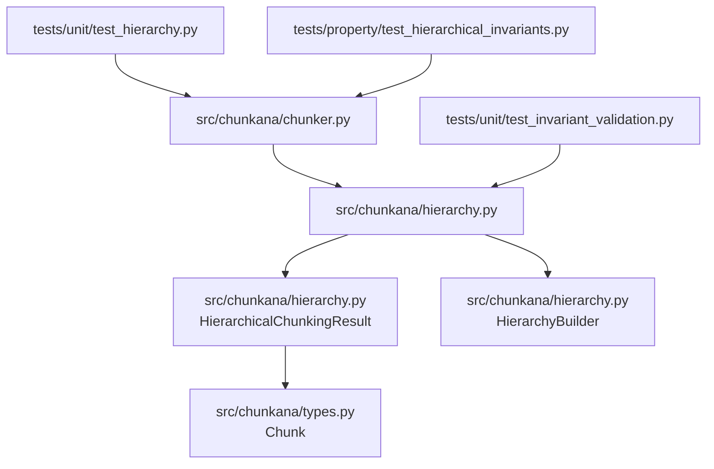
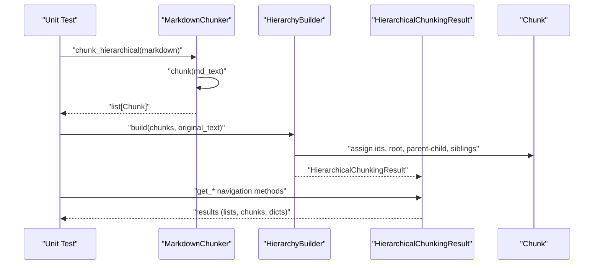
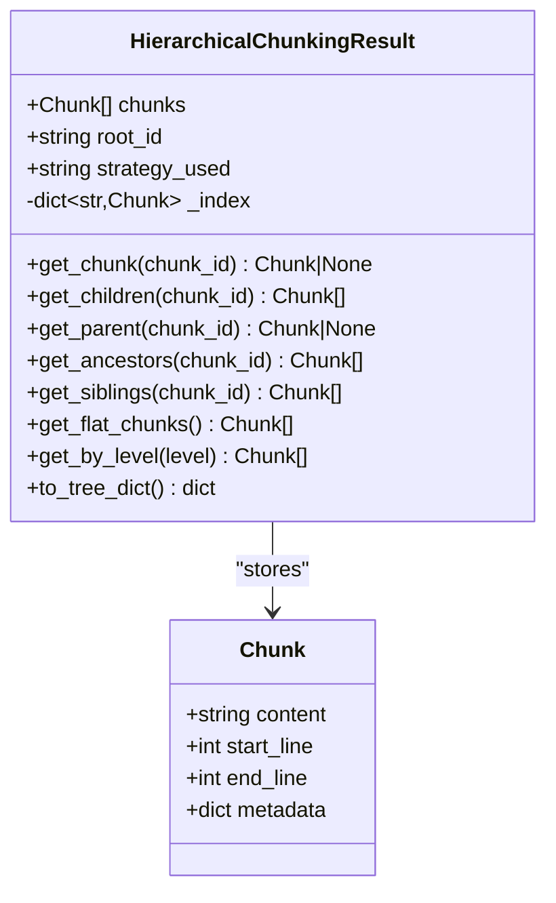
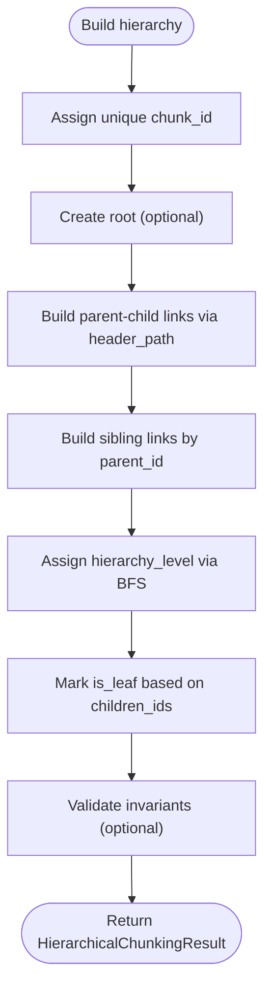
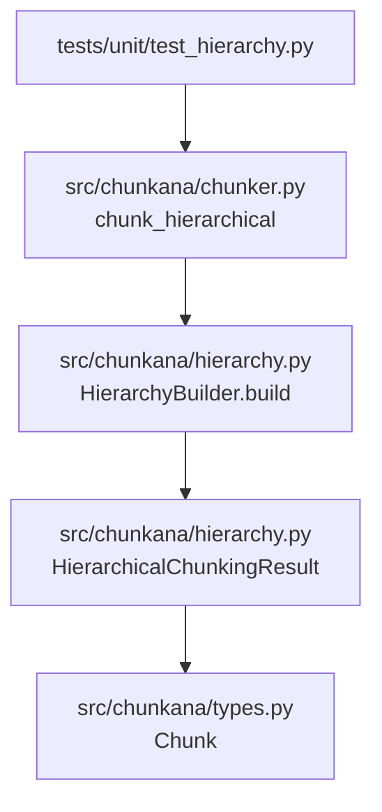

# Hierarchy Unit Testing

<cite>
**Referenced Files in This Document**
- [test_hierarchy.py](file://tests/unit/test_hierarchy.py)
- [hierarchy.py](file://src/chunkana/hierarchy.py)
- [types.py](file://src/chunkana/types.py)
- [chunker.py](file://src/chunkana/chunker.py)
- [test_hierarchical_invariants.py](file://tests/property/test_hierarchical_invariants.py)
- [test_invariant_validation.py](file://tests/unit/test_invariant_validation.py)
</cite>

## Table of Contents
1. [Introduction](#introduction)
2. [Project Structure](#project-structure)
3. [Core Components](#core-components)
4. [Architecture Overview](#architecture-overview)
5. [Detailed Component Analysis](#detailed-component-analysis)
6. [Dependency Analysis](#dependency-analysis)
7. [Performance Considerations](#performance-considerations)
8. [Troubleshooting Guide](#troubleshooting-guide)
9. [Conclusion](#conclusion)

## Introduction
This document explains the unit tests for hierarchical chunk structure creation and navigation in the repository. It focuses on how tests validate correct tree construction, parent-child relationships, ancestor tracking, and path calculation. It also covers hierarchical metadata coverage (including level indicators), navigation capabilities of HierarchicalChunkingResult, edge cases (flat structures, deep nesting), and best practices for testing hierarchical invariants.

## Project Structure
The hierarchical testing spans unit tests and supporting implementation in the hierarchy module, plus property-based tests that validate invariants across many inputs.

**Diagram sources**
- [test_hierarchy.py](file://tests/unit/test_hierarchy.py#L1-L268)
- [chunker.py](file://src/chunkana/chunker.py#L217-L248)
- [hierarchy.py](file://src/chunkana/hierarchy.py#L16-L231)
- [types.py](file://src/chunkana/types.py#L240-L376)

**Section sources**
- [test_hierarchy.py](file://tests/unit/test_hierarchy.py#L1-L268)
- [chunker.py](file://src/chunkana/chunker.py#L217-L248)
- [hierarchy.py](file://src/chunkana/hierarchy.py#L16-L231)
- [types.py](file://src/chunkana/types.py#L240-L376)

## Core Components
- HierarchicalChunkingResult: Navigation API over flat chunks with parent-child-sibling metadata. Provides O(1) lookup by ID and methods to traverse up and down the tree.
- HierarchyBuilder: Post-processes flat chunks to establish parent-child relationships using header_path metadata, assigns hierarchy levels, marks leaves, and validates invariants.
- Chunk: The basic unit with metadata including chunk_id, parent_id, children_ids, header_path, header_level, hierarchy_level, is_root, is_leaf, and more.

Key navigation methods validated by unit tests:
- get_chunk(chunk_id)
- get_children(chunk_id)
- get_parent(chunk_id)
- get_ancestors(chunk_id)
- get_siblings(chunk_id)
- get_flat_chunks()
- get_by_level(level)
- to_tree_dict()

**Section sources**
- [hierarchy.py](file://src/chunkana/hierarchy.py#L16-L231)
- [types.py](file://src/chunkana/types.py#L240-L376)

## Architecture Overview
The hierarchical chunking pipeline:
1. MarkdownChunker.chunk produces flat chunks with header_path and related metadata.
2. MarkdownChunker.chunk_hierarchical calls HierarchyBuilder.build to add parent-child relationships, hierarchy levels, and leaf marking.
3. HierarchyBuilder returns a HierarchicalChunkingResult with navigation methods.

**Diagram sources**
- [chunker.py](file://src/chunkana/chunker.py#L217-L248)
- [hierarchy.py](file://src/chunkana/hierarchy.py#L260-L308)
- [hierarchy.py](file://src/chunkana/hierarchy.py#L374-L421)

## Detailed Component Analysis

### Test Suite: Hierarchical Navigation and Tree Construction
The unit tests validate:
- That chunk_hierarchical returns a HierarchicalChunkingResult with required attributes.
- get_chunk, get_children, get_parent, get_ancestors, get_siblings, get_flat_chunks, get_by_level behave as documented.
- Ancestor chains form a valid path to root.
- Parent-child relationships are bidirectional.
- to_tree_dict serializes a tree with required fields.

Examples of validations:
- Existence checks for chunks, children, parents, ancestors, and siblings.
- Structural assertions: roots are not in flat results; flat results include leaves or significant-content non-leaves.
- Level filtering returns chunks at the expected hierarchy level.

Edge cases covered:
- Empty document.
- Single paragraph.
- No headers.
- Deep nesting (levels 1–6).

**Section sources**
- [test_hierarchy.py](file://tests/unit/test_hierarchy.py#L48-L268)

### HierarchicalChunkingResult Navigation Methods
The navigation methods are implemented to operate on flat chunks with metadata-only relationships. They rely on:
- O(1) lookup via an internal index keyed by chunk_id.
- parent_id and children_ids metadata for traversal.
- header_path and hierarchy_level metadata for path and level queries.

Important behaviors:
- get_parent/get_children resolve via metadata; they return None for root or missing IDs.
- get_ancestors returns a list ordered from immediate parent toward root.
- get_siblings includes the chunk itself and is ordered by start_line within a parent group.
- get_flat_chunks includes leaves and non-leaf chunks with significant content (threshold logic is implemented in the result).
- get_by_level filters by hierarchy_level.
- to_tree_dict serializes a tree using IDs and metadata for safe JSON export.

**Diagram sources**
- [hierarchy.py](file://src/chunkana/hierarchy.py#L16-L231)
- [types.py](file://src/chunkana/types.py#L240-L376)

**Section sources**
- [hierarchy.py](file://src/chunkana/hierarchy.py#L44-L231)
- [types.py](file://src/chunkana/types.py#L240-L376)

### HierarchyBuilder: Parent-Child Relationships and Level Assignment
HierarchyBuilder constructs the tree from flat chunks using header_path metadata:
- Assigns unique chunk_id to each chunk.
- Optionally creates a root document chunk with header_path "/".
- Builds parent-child links by walking up header_path segments; orphans link to root.
- Builds sibling links ordered by start_line within each parent group.
- Assigns hierarchy_level using BFS from root.
- Marks leaves based on children_ids.
- Validates invariants (is_leaf consistency, parent-child bidirectionality, sibling chain integrity) and can auto-fix or raise exceptions depending on strict_mode.

**Diagram sources**
- [hierarchy.py](file://src/chunkana/hierarchy.py#L260-L308)
- [hierarchy.py](file://src/chunkana/hierarchy.py#L374-L421)
- [hierarchy.py](file://src/chunkana/hierarchy.py#L445-L511)
- [hierarchy.py](file://src/chunkana/hierarchy.py#L512-L548)
- [hierarchy.py](file://src/chunkana/hierarchy.py#L812-L925)

**Section sources**
- [hierarchy.py](file://src/chunkana/hierarchy.py#L260-L308)
- [hierarchy.py](file://src/chunkana/hierarchy.py#L374-L421)
- [hierarchy.py](file://src/chunkana/hierarchy.py#L445-L511)
- [hierarchy.py](file://src/chunkana/hierarchy.py#L512-L548)
- [hierarchy.py](file://src/chunkana/hierarchy.py#L812-L925)

### Hierarchical Metadata Coverage and Structural Integrity
Metadata fields used for hierarchy:
- chunk_id: unique identifier for O(1) lookup.
- parent_id: ID of the parent chunk or None for root.
- children_ids: list of child IDs.
- header_path: path-like string derived from headers in the chunk; used to infer parent.
- header_level: level of the first header in the chunk (legacy concept).
- hierarchy_level: computed tree depth level (0=root, 1=sections, 2=subsections, 3+=paragraphs).
- is_root: whether the chunk is the document-level root.
- is_leaf: whether the chunk has no children.

Validation and coverage:
- Unit tests verify presence of required fields and correct behavior of navigation methods.
- Property tests enforce structural invariants across many generated documents.
- Strict/non-strict modes demonstrate detection and auto-fix behavior for broken relationships.

**Section sources**
- [types.py](file://src/chunkana/types.py#L240-L376)
- [test_hierarchy.py](file://tests/unit/test_hierarchy.py#L48-L268)
- [test_hierarchical_invariants.py](file://tests/property/test_hierarchical_invariants.py#L76-L299)

### Edge Cases and Examples
- Flat structures: Documents without headers still produce a valid hierarchy; preamble chunks become children of root.
- Deep nesting: Very deep header chains are supported; hierarchy_level increases with depth.
- Empty document: Returns empty result with no chunks.
- Single paragraph: Works as expected; may be included as a leaf or part of a flat result depending on content.

These behaviors are exercised by dedicated edge-case tests.

**Section sources**
- [test_hierarchy.py](file://tests/unit/test_hierarchy.py#L228-L268)

### How Tests Validate Correct Tree Construction and Header Nesting
- Parent-child bidirectionality: For each chunk, if it has a parent, that parent’s children include it; and if it has children, each child’s parent is this chunk.
- Ancestor path correctness: get_ancestors forms a chain where each ancestor’s parent is the next element in the list.
- Level filtering: get_by_level returns only chunks at the specified hierarchy level.
- Serialization: to_tree_dict produces a dictionary with required fields and preserves header_path and hierarchy_level.

**Section sources**
- [test_hierarchy.py](file://tests/unit/test_hierarchy.py#L164-L227)
- [hierarchy.py](file://src/chunkana/hierarchy.py#L188-L231)

### How Tests Verify HierarchicalChunkingResult Navigation Capabilities
- get_chunk: O(1) lookup by ID.
- get_children/get_parent: Resolve via metadata; return lists or None appropriately.
- get_ancestors: Ordered list from parent to root.
- get_siblings: Includes the chunk itself; ordered by start_line within a parent group.
- get_flat_chunks: Ensures no content is lost by including leaves and non-leaf chunks with significant content.
- get_by_level: Filters by hierarchy_level.
- to_tree_dict: Produces a safe, serializable tree representation.

**Section sources**
- [hierarchy.py](file://src/chunkana/hierarchy.py#L44-L231)
- [test_hierarchy.py](file://tests/unit/test_hierarchy.py#L48-L227)

### Common Issues and How Tests Detect Them
- Incorrect parent assignment: Tests check that parent-child relationships are bidirectional and that orphans link to root when appropriate.
- Broken tree paths: Ancestor chains are validated to ensure continuity.
- Invariant violations: Property tests and unit tests exercise strict/non-strict validation modes to surface issues like mismatched is_leaf and children_ids, wrong parent_id, or missing children references.

**Section sources**
- [test_hierarchy.py](file://tests/unit/test_hierarchy.py#L164-L227)
- [test_hierarchical_invariants.py](file://tests/property/test_hierarchical_invariants.py#L76-L299)
- [test_invariant_validation.py](file://tests/unit/test_invariant_validation.py#L72-L112)
- [hierarchy.py](file://src/chunkana/hierarchy.py#L812-L925)

### Best Practices for Testing Hierarchical Invariants
- Use property-based tests to generate diverse markdown inputs and validate invariants across many scenarios.
- Enable strict_mode during targeted tests to ensure violations raise exceptions.
- Use non-strict mode to verify auto-fix behavior and confirm invariants are restored.
- Validate bidirectionality of parent-child relationships and sibling chains.
- Ensure ancestor chains are consistent and that hierarchy_level reflects true tree depth.
- Cover edge cases: empty documents, single paragraphs, no headers, deep nesting.

**Section sources**
- [test_hierarchical_invariants.py](file://tests/property/test_hierarchical_invariants.py#L76-L299)
- [test_invariant_validation.py](file://tests/unit/test_invariant_validation.py#L72-L112)
- [hierarchy.py](file://src/chunkana/hierarchy.py#L812-L925)

## Dependency Analysis
The unit tests depend on:
- MarkdownChunker.chunk_hierarchical to produce HierarchicalChunkingResult instances.
- HierarchicalChunkingResult navigation methods to validate tree structure.
- HierarchyBuilder for constructing and validating the tree.

**Diagram sources**
- [test_hierarchy.py](file://tests/unit/test_hierarchy.py#L48-L268)
- [chunker.py](file://src/chunkana/chunker.py#L217-L248)
- [hierarchy.py](file://src/chunkana/hierarchy.py#L260-L308)
- [types.py](file://src/chunkana/types.py#L240-L376)

**Section sources**
- [test_hierarchy.py](file://tests/unit/test_hierarchy.py#L48-L268)
- [chunker.py](file://src/chunkana/chunker.py#L217-L248)
- [hierarchy.py](file://src/chunkana/hierarchy.py#L260-L308)
- [types.py](file://src/chunkana/types.py#L240-L376)

## Performance Considerations
- O(1) navigation via chunk_id index minimizes lookup overhead.
- Parent-child and sibling relationships are built in linear passes over chunks with metadata lookups.
- to_tree_dict avoids circular references by using IDs and metadata, enabling safe JSON serialization.

[No sources needed since this section provides general guidance]

## Troubleshooting Guide
Common issues and how tests help detect them:
- Orphaned chunks: Property tests assert that non-root chunks must have a parent and that parent references are valid.
- Mismatched is_leaf: Property tests enforce is_leaf consistency with children_ids.
- Broken parent-child links: Unit tests verify bidirectionality; strict/non-strict validation demonstrates detection and auto-fix behavior.
- Incorrect hierarchy_level: Tests rely on BFS-assigned levels; mismatches indicate problems in parent-child construction.

Recommended steps:
- Run property-based tests to catch edge cases.
- Temporarily enable strict_mode to surface hidden inconsistencies.
- Inspect header_path and children_ids to confirm parent-child linkage.
- Use get_ancestors to verify path continuity.

**Section sources**
- [test_hierarchical_invariants.py](file://tests/property/test_hierarchical_invariants.py#L76-L299)
- [test_invariant_validation.py](file://tests/unit/test_invariant_validation.py#L72-L112)
- [hierarchy.py](file://src/chunkana/hierarchy.py#L812-L925)

## Conclusion
The unit tests comprehensively validate hierarchical chunk structure creation and navigation. They ensure correct parent-child relationships, ancestor path integrity, and level-based filtering, while covering edge cases and enforcing structural invariants. By combining unit tests with property-based validation and strict/non-strict modes, the suite provides robust coverage for hierarchical metadata and navigation capabilities.