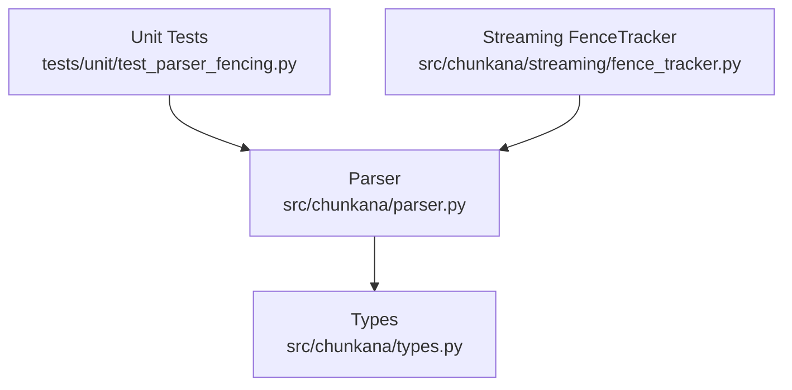
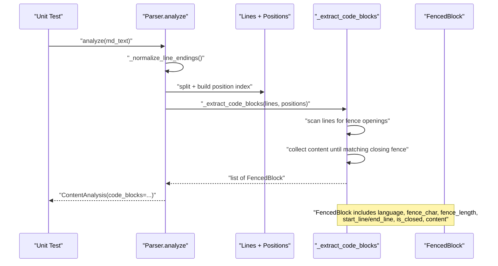
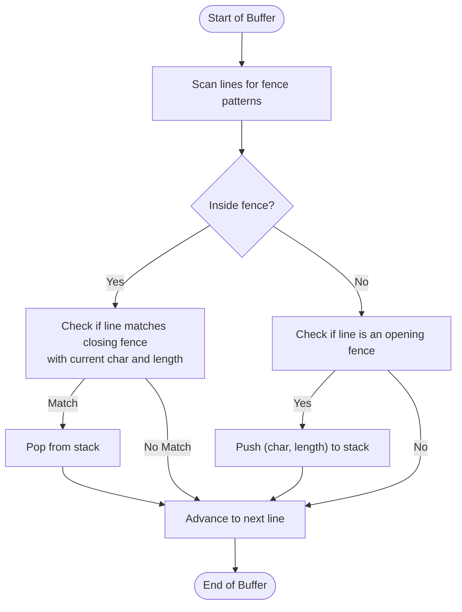
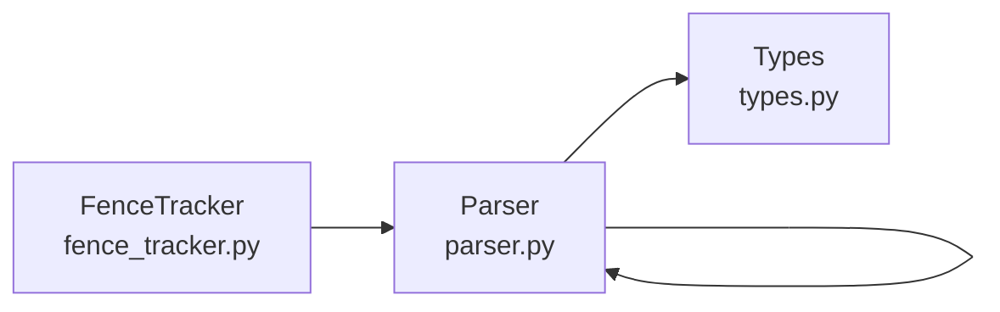

# Parser Fencing Unit Testing

<cite>
**Referenced Files in This Document**
- [test_parser_fencing.py](file://tests/unit/test_parser_fencing.py)
- [parser.py](file://src/chunkana/parser.py)
- [fence_tracker.py](file://src/chunkana/streaming/fence_tracker.py)
- [types.py](file://src/chunkana/types.py)
- [nested_fences.md](file://tests/baseline/fixtures/nested_fences.md)
</cite>

## Table of Contents
1. [Introduction](#introduction)
2. [Project Structure](#project-structure)
3. [Core Components](#core-components)
4. [Architecture Overview](#architecture-overview)
5. [Detailed Component Analysis](#detailed-component-analysis)
6. [Dependency Analysis](#dependency-analysis)
7. [Performance Considerations](#performance-considerations)
8. [Troubleshooting Guide](#troubleshooting-guide)
9. [Conclusion](#conclusion)
10. [Appendices](#appendices)

## Introduction
This document explains the unit tests for Markdown fence parsing and code block detection, focusing on how the parser identifies code fences, language tags, and nested fence scenarios. It documents test coverage for fence tracking across chunk boundaries and streaming processing, and provides guidance for extending test cases to address edge cases such as incomplete fences, indentation handling, and escaped characters.

## Project Structure
The fencing tests reside under the unit test suite and exercise the parser’s code block extraction logic. The parser implements the core fence detection and nested fence handling, while the streaming fence tracker maintains state across buffer windows to prevent splitting code blocks.

**Diagram sources**
- [test_parser_fencing.py](file://tests/unit/test_parser_fencing.py#L1-L377)
- [parser.py](file://src/chunkana/parser.py#L1-L200)
- [fence_tracker.py](file://src/chunkana/streaming/fence_tracker.py#L1-L65)
- [types.py](file://src/chunkana/types.py#L80-L120)

**Section sources**
- [test_parser_fencing.py](file://tests/unit/test_parser_fencing.py#L1-L377)
- [parser.py](file://src/chunkana/parser.py#L1-L200)
- [fence_tracker.py](file://src/chunkana/streaming/fence_tracker.py#L1-L65)
- [types.py](file://src/chunkana/types.py#L80-L120)

## Core Components
- Parser: Implements fenced code block detection, nested fence support, and metadata extraction (language, fence_char, fence_length, is_closed, start_line/end_line).
- FenceTracker: Tracks fence state across streaming buffers to prevent mid-block splits.
- Types: Defines FencedBlock and ContentAnalysis data structures used by the parser and tests.

Key responsibilities:
- Detect opening and closing fences with backticks and tildes.
- Preserve content exactly, including nested fences and whitespace.
- Handle unclosed fences and trailing spaces on closing fences.
- Maintain accurate line and position metadata for atomic code blocks.

**Section sources**
- [parser.py](file://src/chunkana/parser.py#L168-L292)
- [fence_tracker.py](file://src/chunkana/streaming/fence_tracker.py#L10-L65)
- [types.py](file://src/chunkana/types.py#L80-L120)

## Architecture Overview
The parser’s code block extraction iterates lines, recognizes fence openings, collects content until a matching closing fence, and records metadata. The streaming FenceTracker mirrors this logic to maintain state across chunk boundaries.

**Diagram sources**
- [parser.py](file://src/chunkana/parser.py#L44-L121)
- [parser.py](file://src/chunkana/parser.py#L228-L292)
- [types.py](file://src/chunkana/types.py#L80-L120)

## Detailed Component Analysis

### Backtick Fence Detection and Language Tags
- Triple backticks with language tag are parsed as a single fenced block.
- Triple backticks without language are supported.
- Multiple non-nested blocks are handled correctly.

Validation points:
- Language tag presence and correctness.
- Fence character and length recorded.
- is_closed flag reflects whether a matching closing fence was found.

**Section sources**
- [test_parser_fencing.py](file://tests/unit/test_parser_fencing.py#L14-L61)
- [parser.py](file://src/chunkana/parser.py#L168-L206)
- [parser.py](file://src/chunkana/parser.py#L228-L292)

### Quadruple Backticks and Nested Fences
- Outer quadruple backticks with inner triple backticks are treated as a single block.
- Inner fence syntax is preserved exactly, including multiple occurrences of inner fences.

Validation points:
- Outer fence length recorded as 4.
- Inner fences remain intact in content.
- Content count of inner fences validated.

**Section sources**
- [test_parser_fencing.py](file://tests/unit/test_parser_fencing.py#L63-L118)
- [parser.py](file://src/chunkana/parser.py#L228-L292)

### Tilde Fence Support
- Triple and quadruple tilde fences are supported.
- Mixed nesting between backticks and tildes is verified.

Validation points:
- Fence character recorded as "~".
- Fence length recorded as 3 or 4.
- Inner fence content preserved.

**Section sources**
- [test_parser_fencing.py](file://tests/unit/test_parser_fencing.py#L120-L154)
- [test_parser_fencing.py](file://tests/unit/test_parser_fencing.py#L156-L188)
- [parser.py](file://src/chunkana/parser.py#L168-L206)

### Mixed Fence Types
- Backtick fences can contain tilde fences and vice versa.
- Alternating fence types in a document are parsed as separate blocks.

Validation points:
- Each block’s fence_char reflects its outer fence type.
- Content includes the inner fence syntax.

**Section sources**
- [test_parser_fencing.py](file://tests/unit/test_parser_fencing.py#L156-L188)
- [test_parser_fencing.py](file://tests/unit/test_parser_fencing.py#L355-L376)

### Edge Cases: Unclosed Fences and Trailing Spaces
- Unclosed fences extend to the end of the document and are marked is_closed=False.
- Closing fences with trailing spaces are recognized.

Validation points:
- is_closed=False for unclosed fences.
- Trailing spaces on closing fences do not prevent recognition.

**Section sources**
- [test_parser_fencing.py](file://tests/unit/test_parser_fencing.py#L190-L216)
- [test_parser_fencing.py](file://tests/unit/test_parser_fencing.py#L217-L227)
- [parser.py](file://src/chunkana/parser.py#L199-L227)

### Content Preservation Guarantees
- Leading and trailing whitespace within fences is preserved.
- Empty lines within fences are preserved.

Validation points:
- Content lines retain original spacing.
- Double newline sequences preserved.

**Section sources**
- [test_parser_fencing.py](file://tests/unit/test_parser_fencing.py#L241-L274)

### Metadata Validation
- fence_char and fence_length are validated for lengths 3 through 6.
- start_line and end_line are correct relative to document lines.

Validation points:
- fence_char set to "`" or "~".
- fence_length equals the number of fence characters.
- Line numbers reflect 1-indexed positions.

**Section sources**
- [test_parser_fencing.py](file://tests/unit/test_parser_fencing.py#L276-L324)
- [parser.py](file://src/chunkana/parser.py#L168-L206)
- [parser.py](file://src/chunkana/parser.py#L228-L292)

### Complex Scenarios: Multiple Nested Blocks and Alternating Types
- Multiple nested blocks are parsed correctly.
- Alternating backtick and tilde fences produce multiple distinct blocks.

Validation points:
- Multiple blocks with correct fence_char and content.
- Nested content preserved exactly.

**Section sources**
- [test_parser_fencing.py](file://tests/unit/test_parser_fencing.py#L326-L376)
- [nested_fences.md](file://tests/baseline/fixtures/nested_fences.md#L1-L15)

### Streaming Fence Tracking Across Chunk Boundaries
The streaming FenceTracker mirrors the parser’s logic to maintain fence state across buffer windows:
- Opening fences push (fence_char, fence_length) onto a stack.
- Closing fences pop from the stack when the current fence matches.
- is_inside_fence and get_fence_info expose state for safe split decisions.

**Diagram sources**
- [fence_tracker.py](file://src/chunkana/streaming/fence_tracker.py#L22-L65)
- [parser.py](file://src/chunkana/parser.py#L168-L227)

**Section sources**
- [fence_tracker.py](file://src/chunkana/streaming/fence_tracker.py#L10-L65)
- [parser.py](file://src/chunkana/parser.py#L168-L227)

### How Tests Validate Atomic Code Blocks
- Tests assert that content is preserved exactly, including nested fences and whitespace.
- Tests assert is_closed flags for completeness.
- Tests assert line and position metadata for accurate chunking.

**Section sources**
- [test_parser_fencing.py](file://tests/unit/test_parser_fencing.py#L100-L118)
- [test_parser_fencing.py](file://tests/unit/test_parser_fencing.py#L241-L274)
- [test_parser_fencing.py](file://tests/unit/test_parser_fencing.py#L276-L324)

### Escaped Characters and Misidentified Fences
- The parser’s closing fence detection requires equal or greater length and identical fence character, preventing misidentification.
- Trailing spaces on closing fences are allowed and recognized.
- Unclosed fences are treated as open-ended blocks.

Guidance:
- Extend tests to include escaped backticks/tildes within code content to ensure they do not trigger new fences.
- Add tests for malformed fences (e.g., mismatched characters or lengths) to confirm robustness.

**Section sources**
- [parser.py](file://src/chunkana/parser.py#L199-L227)
- [test_parser_fencing.py](file://tests/unit/test_parser_fencing.py#L190-L227)

## Dependency Analysis
- Parser depends on compiled regex patterns for efficient fence detection.
- Parser constructs FencedBlock instances with metadata for downstream strategies.
- Streaming FenceTracker depends on the same regex patterns to mirror parser behavior.

**Diagram sources**
- [parser.py](file://src/chunkana/parser.py#L31-L43)
- [fence_tracker.py](file://src/chunkana/streaming/fence_tracker.py#L17-L21)
- [types.py](file://src/chunkana/types.py#L80-L120)

**Section sources**
- [parser.py](file://src/chunkana/parser.py#L31-L43)
- [fence_tracker.py](file://src/chunkana/streaming/fence_tracker.py#L17-L21)
- [types.py](file://src/chunkana/types.py#L80-L120)

## Performance Considerations
- Pre-compiled regex patterns minimize overhead during fence detection.
- Single-pass line scanning and position index enable O(1) position lookups.
- Early exit on closing fences reduces unnecessary scanning.

Recommendations:
- Keep regex patterns static and reuse them across scans.
- Avoid repeated string concatenations; collect content in a list and join once.

**Section sources**
- [parser.py](file://src/chunkana/parser.py#L31-L43)
- [parser.py](file://src/chunkana/parser.py#L143-L167)
- [parser.py](file://src/chunkana/parser.py#L228-L292)

## Troubleshooting Guide
Common issues and how tests catch them:
- Misidentified fences: Closing fences require matching fence_char and minimum fence_length.
- Unclosed fences: Detected and marked is_closed=False; content extends to end.
- Trailing spaces on closing fences: Recognized and accepted.
- Nested fences: Exact preservation ensures inner fences remain intact.
- Whitespace preservation: Leading/trailing spaces and empty lines maintained.

Where to look in tests:
- Unclosed fence behavior and flags.
- Trailing spaces on closing fences.
- Content preservation for whitespace and empty lines.
- Mixed and nested fence scenarios.

**Section sources**
- [test_parser_fencing.py](file://tests/unit/test_parser_fencing.py#L190-L227)
- [test_parser_fencing.py](file://tests/unit/test_parser_fencing.py#L241-L274)
- [test_parser_fencing.py](file://tests/unit/test_parser_fencing.py#L63-L118)

## Conclusion
The unit tests comprehensively validate fenced code block parsing across multiple fence styles, nested scenarios, and edge cases. They ensure the parser preserves content exactly, tracks fence state accurately, and produces reliable metadata for chunking and streaming. Extending tests to cover escaped characters and malformed fences will further strengthen robustness.

## Appendices

### Guidance for Extending Fence-Related Test Cases
- Add tests for escaped backticks/tildes within code content to prevent false positives.
- Add tests for mismatched fence characters and lengths to verify robust closing detection.
- Add tests for extremely long fence sequences (e.g., 7+ characters) to validate length handling.
- Add tests for indented fences to validate that indentation does not interfere with detection.
- Add tests for interleaved fences (e.g., alternating backticks and tildes) to ensure correct separation.

[No sources needed since this section provides general guidance]