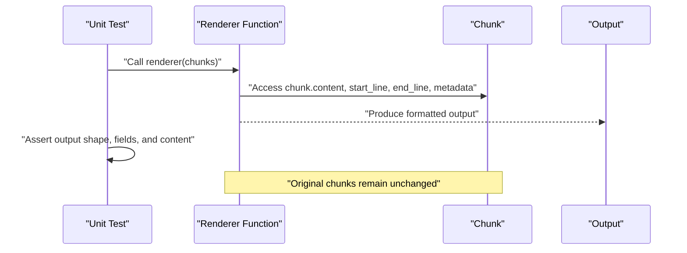
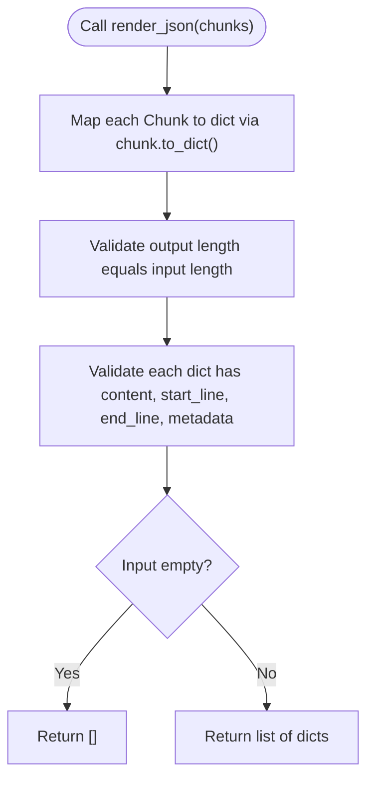
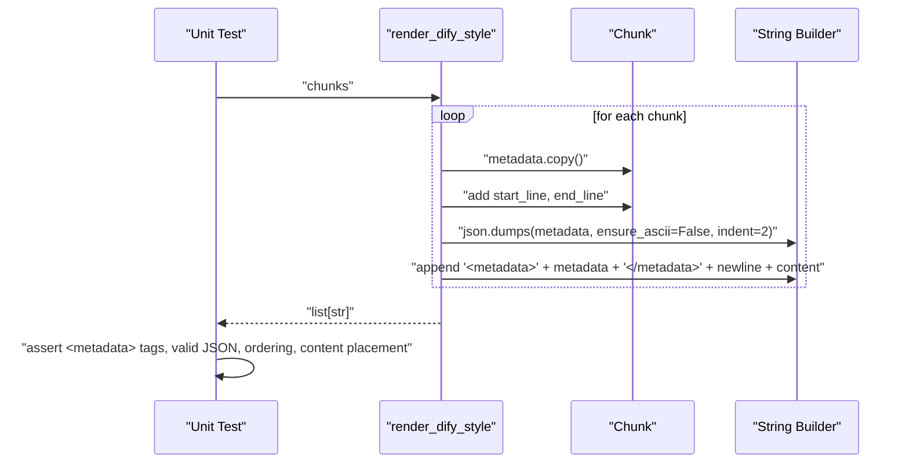
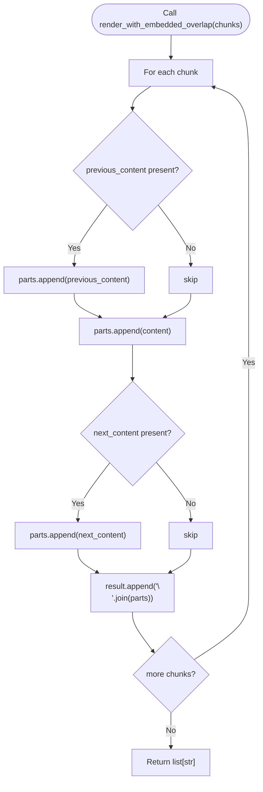
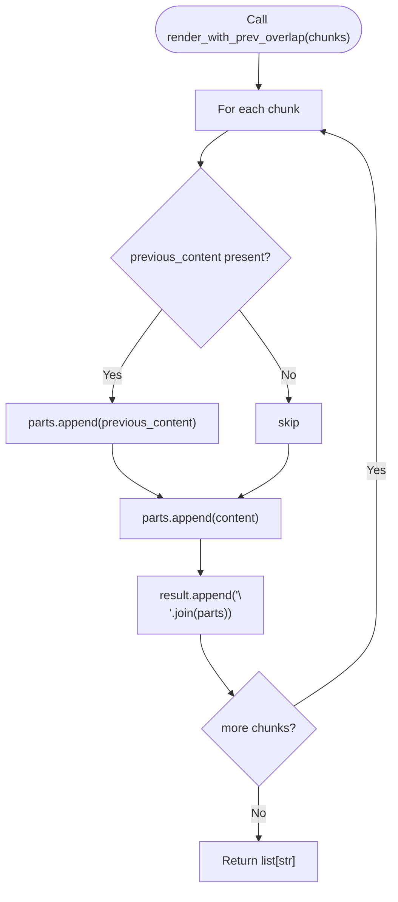
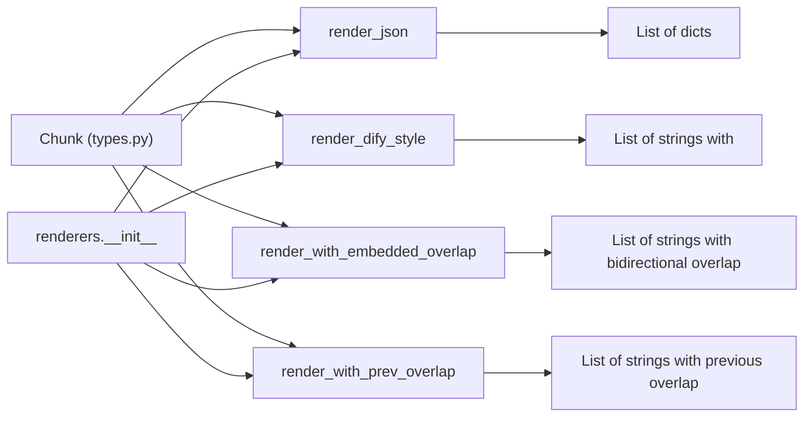

# Renderers Unit Testing

<cite>
**Referenced Files in This Document**
- [test_renderers.py](file://tests/unit/test_renderers.py)
- [formatters.py](file://src/chunkana/renderers/formatters.py)
- [types.py](file://src/chunkana/types.py)
- [test_renderer_compatibility.py](file://tests/baseline/test_renderer_compatibility.py)
- [renderers.md](file://docs/renderers.md)
- [golden_dify_style/simple_text.jsonl](file://tests/baseline/golden_dify_style/simple_text.jsonl)
- [golden_no_metadata/simple_text.jsonl](file://tests/baseline/golden_no_metadata/simple_text.jsonl)
- [__init__.py (renderers)](file://src/chunkana/renderers/__init__.py)
- [test_renderers.py (property)](file://tests/property/test_renderers.py)
</cite>

## Table of Contents
1. [Introduction](#introduction)
2. [Project Structure](#project-structure)
3. [Core Components](#core-components)
4. [Architecture Overview](#architecture-overview)
5. [Detailed Component Analysis](#detailed-component-analysis)
6. [Dependency Analysis](#dependency-analysis)
7. [Performance Considerations](#performance-considerations)
8. [Troubleshooting Guide](#troubleshooting-guide)
9. [Conclusion](#conclusion)
10. [Appendices](#appendices)

## Introduction
This document explains the unit tests for renderers in test_renderers.py, focusing on how they validate output format generation, JSON serialization, and renderer-specific formatting rules. It covers how tests ensure correct transformation of chunk objects into canonical JSON and Dify-compatible structures, demonstrates metadata inclusion, content escaping, and field naming conventions, and documents test coverage for different renderer configurations and edge cases such as empty chunks and special characters. It also explains how tests verify consistency between input chunks and rendered output, addresses common rendering issues, and provides best practices for testing custom renderer implementations.

## Project Structure
The renderer-related tests are organized under:
- Unit tests: tests/unit/test_renderers.py
- Property-based tests: tests/property/test_renderers.py
- Baseline compatibility tests: tests/baseline/test_renderer_compatibility.py
- Renderer implementations: src/chunkana/renderers/formatters.py
- Public API exports: src/chunkana/renderers/__init__.py
- Types and Chunk model: src/chunkana/types.py
- Renderer documentation: docs/renderers.md
- Baseline golden outputs: tests/baseline/golden_dify_style/*.jsonl and tests/baseline/golden_no_metadata/*.jsonl

```mermaid
graph TB
subgraph "Tests"
TUnit["tests/unit/test_renderers.py"]
TProp["tests/property/test_renderers.py"]
TBase["tests/baseline/test_renderer_compatibility.py"]
end
subgraph "Renderers"
Fmt["src/chunkana/renderers/formatters.py"]
API["src/chunkana/renderers/__init__.py"]
end
subgraph "Types"
Types["src/chunkana/types.py"]
end
subgraph "Docs"
Docs["docs/renderers.md"]
end
subgraph "Baselines"
GD["tests/baseline/golden_dify_style/*.jsonl"]
GN["tests/baseline/golden_no_metadata/*.jsonl"]
end
TUnit --> Fmt
TProp --> Fmt
TBase --> Fmt
Fmt --> Types
API --> Fmt
TBase --> GD
TBase --> GN
Docs --> Fmt
```

**Diagram sources**
- [test_renderers.py](file://tests/unit/test_renderers.py#L1-L296)
- [formatters.py](file://src/chunkana/renderers/formatters.py#L1-L146)
- [types.py](file://src/chunkana/types.py#L240-L375)
- [test_renderer_compatibility.py](file://tests/baseline/test_renderer_compatibility.py#L1-L157)
- [renderers.md](file://docs/renderers.md#L1-L136)
- [__init__.py (renderers)](file://src/chunkana/renderers/__init__.py#L1-L23)
- [golden_dify_style/simple_text.jsonl](file://tests/baseline/golden_dify_style/simple_text.jsonl#L1-L4)
- [golden_no_metadata/simple_text.jsonl](file://tests/baseline/golden_no_metadata/simple_text.jsonl#L1-L4)

**Section sources**
- [test_renderers.py](file://tests/unit/test_renderers.py#L1-L296)
- [formatters.py](file://src/chunkana/renderers/formatters.py#L1-L146)
- [types.py](file://src/chunkana/types.py#L240-L375)
- [test_renderer_compatibility.py](file://tests/baseline/test_renderer_compatibility.py#L1-L157)
- [renderers.md](file://docs/renderers.md#L1-L136)
- [__init__.py (renderers)](file://src/chunkana/renderers/__init__.py#L1-L23)
- [golden_dify_style/simple_text.jsonl](file://tests/baseline/golden_dify_style/simple_text.jsonl#L1-L4)
- [golden_no_metadata/simple_text.jsonl](file://tests/baseline/golden_no_metadata/simple_text.jsonl#L1-L4)

## Core Components
This section focuses on the unit tests that validate renderer behavior and the underlying formatter functions they exercise.

- render_json: Converts chunks to a list of dictionaries. The unit tests confirm:
  - Output type and length match input chunks.
  - Each dictionary contains required fields: content, start_line, end_line, metadata.
  - Empty input lists produce empty outputs.
  - Original chunks are not modified during rendering.

- render_dify_style: Formats chunks with a <metadata> block containing metadata plus start_line and end_line, followed by the content. The unit tests confirm:
  - Output is a list of strings.
  - Each string contains a valid JSON metadata block.
  - Metadata includes start_line and end_line.
  - Content follows the metadata block.
  - Baseline compatibility ensures byte-for-byte alignment with plugin outputs.

- render_with_embedded_overlap: Embeds bidirectional overlap (previous_content and next_content) into the content string. The unit tests confirm:
  - Output is a list of strings.
  - First chunk does not prepend previous content.
  - Chunks with previous_content include it.
  - Chunks with next_content include it.
  - Original chunks are not modified.

- render_with_prev_overlap: Embeds only previous overlap (sliding window). The unit tests confirm:
  - Output is a list of strings.
  - First chunk does not prepend previous content.
  - Chunks with previous_content include it.
  - Next content is not included in output.
  - Original chunks are not modified.

- Edge cases:
  - Empty chunks list.
  - Unicode content.
  - Special JSON characters in content.
  - Empty overlap strings.

**Section sources**
- [test_renderers.py](file://tests/unit/test_renderers.py#L64-L296)
- [formatters.py](file://src/chunkana/renderers/formatters.py#L15-L146)
- [types.py](file://src/chunkana/types.py#L240-L375)
- [test_renderer_compatibility.py](file://tests/baseline/test_renderer_compatibility.py#L45-L139)

## Architecture Overview
The renderers are pure functions that transform a list of Chunk objects into different output formats without mutating the original chunks. The unit tests validate correctness of these transformations and ensure compatibility with baseline outputs.



**Diagram sources**
- [test_renderers.py](file://tests/unit/test_renderers.py#L64-L296)
- [formatters.py](file://src/chunkana/renderers/formatters.py#L15-L146)
- [types.py](file://src/chunkana/types.py#L240-L375)

## Detailed Component Analysis

### render_json: Canonical JSON Output
- Purpose: Produce a list of dictionaries representing each chunk for downstream JSON serialization.
- Validation performed by unit tests:
  - Output is a list of dicts with the expected length.
  - Each dict contains content, start_line, end_line, and metadata.
  - Empty input yields empty output.
  - Original chunks are not mutated.



**Diagram sources**
- [formatters.py](file://src/chunkana/renderers/formatters.py#L15-L27)
- [types.py](file://src/chunkana/types.py#L329-L339)
- [test_renderers.py](file://tests/unit/test_renderers.py#L64-L95)

**Section sources**
- [test_renderers.py](file://tests/unit/test_renderers.py#L64-L95)
- [formatters.py](file://src/chunkana/renderers/formatters.py#L15-L27)
- [types.py](file://src/chunkana/types.py#L329-L339)

### render_dify_style: Dify-Compatible Metadata Block
- Purpose: Produce strings with a <metadata> block containing metadata plus start_line and end_line, followed by the content.
- Validation performed by unit tests:
  - Output is a list of strings.
  - Each string contains <metadata> and </metadata>.
  - The metadata block parses as valid JSON.
  - Metadata includes start_line and end_line.
  - Content appears after the metadata block.
- Baseline compatibility:
  - The baseline tests compare actual outputs with golden files generated from plugin behavior to ensure byte-for-byte equivalence.



**Diagram sources**
- [formatters.py](file://src/chunkana/renderers/formatters.py#L56-L84)
- [test_renderers.py](file://tests/unit/test_renderers.py#L97-L154)
- [test_renderer_compatibility.py](file://tests/baseline/test_renderer_compatibility.py#L45-L99)
- [golden_dify_style/simple_text.jsonl](file://tests/baseline/golden_dify_style/simple_text.jsonl#L1-L4)

**Section sources**
- [test_renderers.py](file://tests/unit/test_renderers.py#L97-L154)
- [formatters.py](file://src/chunkana/renderers/formatters.py#L56-L84)
- [test_renderer_compatibility.py](file://tests/baseline/test_renderer_compatibility.py#L45-L99)
- [golden_dify_style/simple_text.jsonl](file://tests/baseline/golden_dify_style/simple_text.jsonl#L1-L4)

### render_with_embedded_overlap: Bidirectional Overlap
- Purpose: Embed previous_content and next_content into the content string, separated by newlines.
- Validation performed by unit tests:
  - Output is a list of strings.
  - First chunk does not prepend previous content.
  - Chunks with previous_content include it.
  - Chunks with next_content include it.
  - Original chunks are not modified.



**Diagram sources**
- [formatters.py](file://src/chunkana/renderers/formatters.py#L87-L117)
- [test_renderers.py](file://tests/unit/test_renderers.py#L156-L196)

**Section sources**
- [test_renderers.py](file://tests/unit/test_renderers.py#L156-L196)
- [formatters.py](file://src/chunkana/renderers/formatters.py#L87-L117)

### render_with_prev_overlap: Sliding Window (Previous Only)
- Purpose: Embed only previous_content into the content string, producing a sliding window view.
- Validation performed by unit tests:
  - Output is a list of strings.
  - First chunk does not prepend previous content.
  - Chunks with previous_content include it.
  - Next content is not included in output.
  - Original chunks are not modified.



**Diagram sources**
- [formatters.py](file://src/chunkana/renderers/formatters.py#L119-L145)
- [test_renderers.py](file://tests/unit/test_renderers.py#L198-L231)

**Section sources**
- [test_renderers.py](file://tests/unit/test_renderers.py#L198-L231)
- [formatters.py](file://src/chunkana/renderers/formatters.py#L119-L145)

### Edge Cases and Field Naming Conventions
- Empty chunks list: All renderers return empty outputs.
- Unicode content: Renderers preserve Unicode without raising errors.
- Special JSON characters: Content with quotes and backslashes is handled safely; tests ensure no exceptions and that content remains intact.
- Empty overlap strings: When previous_content and next_content are empty, the output reduces to the canonical content.

Field naming conventions validated by tests:
- render_dify_style metadata includes start_line and end_line.
- render_json output includes content, start_line, end_line, metadata, and derived fields such as size and line_count.

**Section sources**
- [test_renderers.py](file://tests/unit/test_renderers.py#L232-L296)
- [formatters.py](file://src/chunkana/renderers/formatters.py#L56-L84)
- [types.py](file://src/chunkana/types.py#L329-L339)

### Consistency Between Input Chunks and Rendered Output
- Unit tests verify that original chunks are not modified by any renderer.
- Property-based tests reinforce correctness:
  - render_with_prev_overlap produces prev + newline + content when previous_content exists, otherwise content alone.
  - render_json produces valid JSON-serializable dicts and round-trips correctly.
  - render_inline_metadata emits sorted metadata keys for determinism.

**Section sources**
- [test_renderers.py](file://tests/unit/test_renderers.py#L90-L95)
- [test_renderers.py](file://tests/unit/test_renderers.py#L191-L196)
- [test_renderers.py](file://tests/unit/test_renderers.py#L222-L230)
- [test_renderers.py](file://tests/unit/test_renderers.py#L235-L241)
- [test_renderers.py](file://tests/unit/test_renderers.py#L242-L259)
- [test_renderers.py](file://tests/unit/test_renderers.py#L260-L278)
- [test_renderers.py](file://tests/unit/test_renderers.py#L278-L296)
- [test_renderers.py (property)](file://tests/property/test_renderers.py#L45-L103)
- [test_renderers.py (property)](file://tests/property/test_renderers.py#L105-L165)
- [test_renderers.py (property)](file://tests/property/test_renderers.py#L167-L210)
- [test_renderers.py (property)](file://tests/property/test_renderers.py#L232-L284)

## Dependency Analysis
- Renderer functions depend on the Chunk type for content, line numbers, and metadata.
- The public API re-exports all renderer functions.
- Baseline compatibility tests depend on golden outputs to validate byte-for-byte fidelity.



**Diagram sources**
- [formatters.py](file://src/chunkana/renderers/formatters.py#L15-L146)
- [types.py](file://src/chunkana/types.py#L240-L375)
- [__init__.py (renderers)](file://src/chunkana/renderers/__init__.py#L1-L23)

**Section sources**
- [formatters.py](file://src/chunkana/renderers/formatters.py#L15-L146)
- [types.py](file://src/chunkana/types.py#L240-L375)
- [__init__.py (renderers)](file://src/chunkana/renderers/__init__.py#L1-L23)

## Performance Considerations
- Renderers are pure functions operating in linear time relative to the number of chunks and content length.
- JSON serialization uses ensure_ascii=False to preserve Unicode without overhead.
- Deterministic sorting of metadata keys avoids unnecessary reordering costs.
- Baseline comparisons normalize line endings to reduce false positives in diffs.

[No sources needed since this section provides general guidance]

## Troubleshooting Guide
Common rendering issues and how tests prevent them:
- Data loss:
  - render_with_embedded_overlap and render_with_prev_overlap embed overlap into content; tests ensure that when previous_content or next_content is absent, the output reduces to canonical content.
  - render_json preserves content and metadata; tests verify required fields and round-trip safety.
- Format violations:
  - render_dify_style tests enforce presence of <metadata> and </metadata>, valid JSON parsing, and correct ordering of metadata followed by content.
  - render_inline_metadata tests enforce sorted keys and deterministic output.
- Unicode and special characters:
  - Tests pass Unicode strings and content with quotes/backslashes without exceptions.
- Empty inputs:
  - All renderers handle empty lists gracefully.

Best practices for testing custom renderer implementations:
- Validate output shape and content types.
- Ensure immutability of input chunks.
- Test edge cases: empty inputs, Unicode, special characters, and empty overlap strings.
- For metadata-based formats, validate JSON validity and field presence.
- For content-embedding formats, verify concatenation order and separators.
- Consider round-trip tests when applicable (e.g., JSON).

**Section sources**
- [test_renderers.py](file://tests/unit/test_renderers.py#L64-L296)
- [test_renderers.py (property)](file://tests/property/test_renderers.py#L45-L284)
- [test_renderer_compatibility.py](file://tests/baseline/test_renderer_compatibility.py#L45-L139)

## Conclusion
The unit tests in test_renderers.py comprehensively validate renderer behavior across multiple output formats, ensuring correctness, consistency, and robustness. They confirm that renderers produce the expected shapes and content, preserve chunk integrity, and align with baseline outputs for Dify compatibility. Property-based tests further strengthen confidence by covering format invariants and determinism. These practices provide a solid foundation for extending or customizing renderers while maintaining reliability.

[No sources needed since this section summarizes without analyzing specific files]

## Appendices

### Appendix A: Example Golden Outputs
- Dify-style golden output structure demonstrates metadata inclusion and content separation.
- No-metadata golden output demonstrates bidirectional overlap embedding.

**Section sources**
- [golden_dify_style/simple_text.jsonl](file://tests/baseline/golden_dify_style/simple_text.jsonl#L1-L4)
- [golden_no_metadata/simple_text.jsonl](file://tests/baseline/golden_no_metadata/simple_text.jsonl#L1-L4)

### Appendix B: Renderer Selection and Compatibility
- The documentation outlines when to use each renderer and maps plugin parameters to renderers for compatibility.

**Section sources**
- [renderers.md](file://docs/renderers.md#L1-L136)