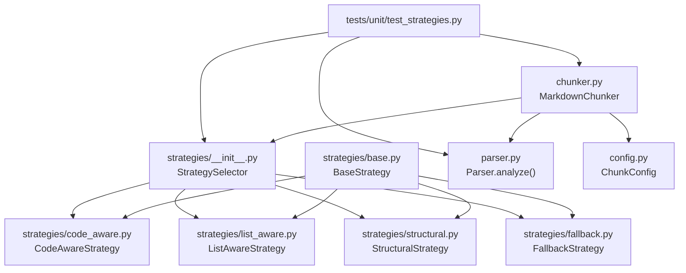
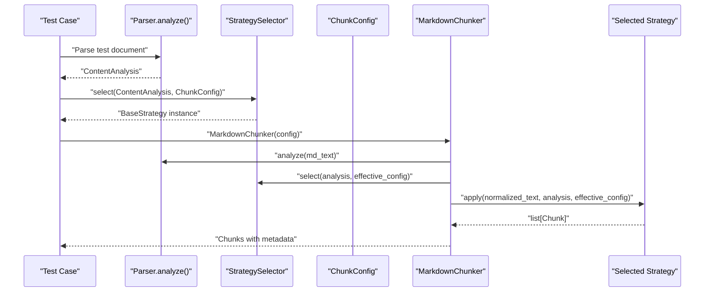
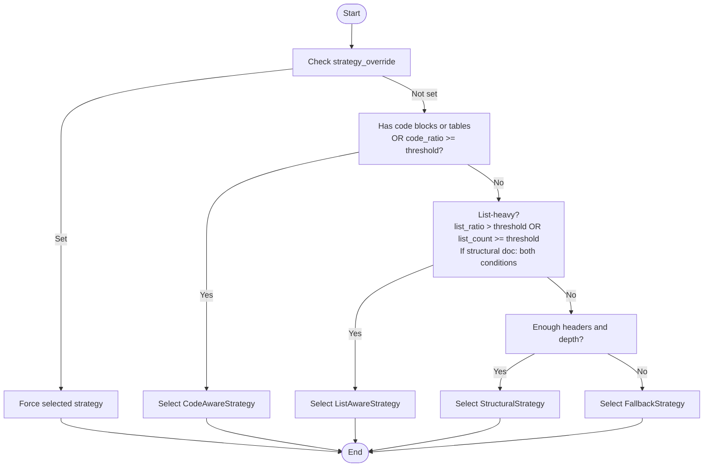
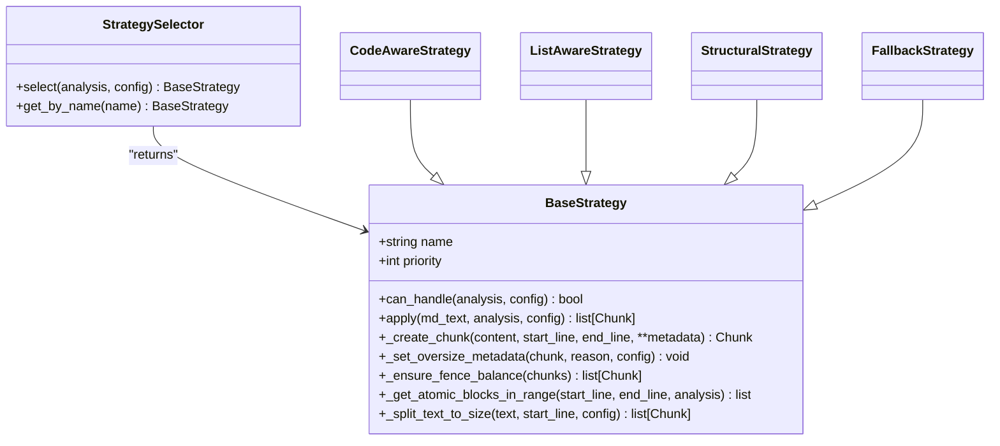
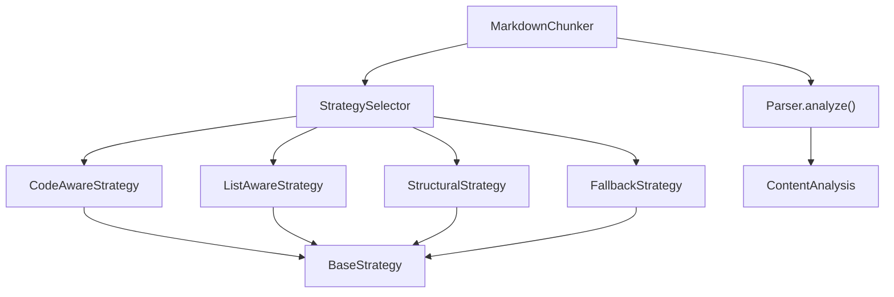

# Strategies Unit Testing

<cite>
**Referenced Files in This Document**
- [test_strategies.py](file://tests/unit/test_strategies.py)
- [strategies/__init__.py](file://src/chunkana/strategies/__init__.py)
- [strategies/base.py](file://src/chunkana/strategies/base.py)
- [strategies/code_aware.py](file://src/chunkana/strategies/code_aware.py)
- [strategies/list_aware.py](file://src/chunkana/strategies/list_aware.py)
- [strategies/structural.py](file://src/chunkana/strategies/structural.py)
- [strategies/fallback.py](file://src/chunkana/strategies/fallback.py)
- [parser.py](file://src/chunkana/parser.py)
- [chunker.py](file://src/chunkana/chunker.py)
- [config.py](file://src/chunkana/config.py)
- [types.py](file://src/chunkana/types.py)
- [code_heavy.md](file://tests/baseline/fixtures/code_heavy.md)
- [list_heavy.md](file://tests/baseline/fixtures/list_heavy.md)
- [structural.md](file://tests/baseline/fixtures/structural.md)
</cite>

## Table of Contents
1. [Introduction](#introduction)
2. [Project Structure](#project-structure)
3. [Core Components](#core-components)
4. [Architecture Overview](#architecture-overview)
5. [Detailed Component Analysis](#detailed-component-analysis)
6. [Dependency Analysis](#dependency-analysis)
7. [Performance Considerations](#performance-considerations)
8. [Troubleshooting Guide](#troubleshooting-guide)
9. [Conclusion](#conclusion)
10. [Appendices](#appendices)

## Introduction
This document explains the unit tests for strategy selection and behavior in the chunking subsystem. It focuses on how tests validate the selection of Code-Aware, List-Aware, Structural, and Fallback strategies based on content analysis, and how they verify each strategy’s adherence to intended behavior and performance characteristics. It also covers fallback mechanisms, edge cases, and guidance for testing new custom strategies.

## Project Structure
The strategy selection and application logic lives in the strategies package, with tests under tests/unit. The MarkdownChunker orchestrates parsing, strategy selection, and chunk creation. Parser extracts content analysis used by strategies to decide behavior.

**Diagram sources**
- [test_strategies.py](file://tests/unit/test_strategies.py#L1-L364)
- [strategies/__init__.py](file://src/chunkana/strategies/__init__.py#L1-L78)
- [strategies/base.py](file://src/chunkana/strategies/base.py#L1-L361)
- [strategies/code_aware.py](file://src/chunkana/strategies/code_aware.py#L1-L752)
- [strategies/list_aware.py](file://src/chunkana/strategies/list_aware.py#L1-L536)
- [strategies/structural.py](file://src/chunkana/strategies/structural.py#L1-L596)
- [strategies/fallback.py](file://src/chunkana/strategies/fallback.py#L1-L187)
- [parser.py](file://src/chunkana/parser.py#L1-L200)
- [chunker.py](file://src/chunkana/chunker.py#L1-L200)
- [config.py](file://src/chunkana/config.py#L1-L200)

**Section sources**
- [test_strategies.py](file://tests/unit/test_strategies.py#L1-L364)
- [strategies/__init__.py](file://src/chunkana/strategies/__init__.py#L1-L78)
- [chunker.py](file://src/chunkana/chunker.py#L1-L200)

## Core Components
- StrategySelector: Implements priority-based selection among Code-Aware, List-Aware, Structural, and Fallback strategies. Supports override via configuration.
- BaseStrategy: Defines the interface and shared helpers for creating chunks, enforcing oversize metadata, balancing code fences, and splitting text respecting size limits.
- Strategy implementations:
  - CodeAwareStrategy: Preserves atomic blocks (code, tables, LaTeX) and splits around them; supports code-context binding and table grouping.
  - ListAwareStrategy: Detects list-heavy documents and preserves list hierarchies; binds introduction paragraphs to lists; respects size limits.
  - StructuralStrategy: Splits by headers, maintains header hierarchy, and computes header_path and section_tags; preserves atomic blocks in large sections.
  - FallbackStrategy: Universal fallback that splits by paragraphs and preserves atomic blocks when present.
- Parser: Produces ContentAnalysis used by strategies to decide behavior.
- MarkdownChunker: Orchestrates parsing, selection, application, overlap, and validation.

**Section sources**
- [strategies/__init__.py](file://src/chunkana/strategies/__init__.py#L1-L78)
- [strategies/base.py](file://src/chunkana/strategies/base.py#L1-L361)
- [strategies/code_aware.py](file://src/chunkana/strategies/code_aware.py#L1-L752)
- [strategies/list_aware.py](file://src/chunkana/strategies/list_aware.py#L1-L536)
- [strategies/structural.py](file://src/chunkana/strategies/structural.py#L1-L596)
- [strategies/fallback.py](file://src/chunkana/strategies/fallback.py#L1-L187)
- [parser.py](file://src/chunkana/parser.py#L1-L200)
- [chunker.py](file://src/chunkana/chunker.py#L1-L200)

## Architecture Overview
The unit tests exercise the strategy selection pipeline and validate behavior across strategy-specific scenarios. They confirm:
- Correct strategy selection for code-heavy, list-heavy, structurally complex, and plain-text documents.
- Strategy-specific chunking patterns (preserving atomic blocks, respecting list hierarchies, splitting by headers).
- Metadata correctness (strategy, content_type, header_path, allow_oversize).
- Fallback behavior and oversize handling.

**Diagram sources**
- [test_strategies.py](file://tests/unit/test_strategies.py#L1-L364)
- [strategies/__init__.py](file://src/chunkana/strategies/__init__.py#L1-L78)
- [chunker.py](file://src/chunkana/chunker.py#L1-L200)
- [parser.py](file://src/chunkana/parser.py#L1-L200)

## Detailed Component Analysis

### Strategy Selection Logic and Coverage
- Code-Aware selection:
  - Documents with code blocks or tables trigger CodeAwareStrategy.
  - Documents exceeding code_ratio threshold also trigger CodeAwareStrategy.
  - Tests verify selection for code-heavy and table-heavy fixtures.
- Structural selection:
  - Documents with sufficient headers and depth trigger StructuralStrategy.
  - Tests verify selection for structurally complex documents.
- List-Aware selection:
  - Documents with high list_ratio or sufficient list_count trigger ListAwareStrategy.
  - For strongly structural documents, both list_ratio and list_count thresholds must be met to avoid interference with structural chunking.
  - Tests verify selection for list-heavy documents.
- Fallback selection:
  - Plain text without headers, code, or lists triggers FallbackStrategy.
  - Tests verify fallback for plain text.
- Strategy override:
  - When strategy_override is set, selection is forced to the specified strategy regardless of content analysis.
  - Tests verify override behavior for both code_aware and fallback.

Key validation points in tests:
- Strategy name assertions after selection.
- Override forcing behavior.
- Metadata presence for strategy and content_type.

**Section sources**
- [test_strategies.py](file://tests/unit/test_strategies.py#L1-L164)
- [strategies/__init__.py](file://src/chunkana/strategies/__init__.py#L1-L78)
- [config.py](file://src/chunkana/config.py#L1-L200)

### Strategy-Specific Behavior Validation

#### Code-Aware Strategy
- Atomic block preservation:
  - Code blocks and tables remain intact across chunk boundaries.
  - Tests verify that code and table chunks are produced and contain complete fenced content.
- Oversize handling:
  - Large atomic blocks are marked with allow_oversize and appropriate oversize_reason metadata.
- Fence balance:
  - Ensures balanced code fences across chunk boundaries; merges adjacent chunks when needed or marks errors when impossible.

Validation in tests:
- Preservation of code blocks and tables.
- Oversize metadata for oversized atomic blocks.

**Section sources**
- [test_strategies.py](file://tests/unit/test_strategies.py#L165-L220)
- [strategies/code_aware.py](file://src/chunkana/strategies/code_aware.py#L1-L752)
- [strategies/base.py](file://src/chunkana/strategies/base.py#L1-L361)

#### Structural Strategy
- Header-based splitting:
  - Splits sections by headers; preserves header_path and section_tags metadata.
  - Maintains structural context and local tags relative to the root section.
- Large section handling:
  - For sections exceeding max_chunk_size, preserves atomic blocks and sets oversize metadata when needed.
- Metadata correctness:
  - Tests verify header_path presence and hierarchy preservation.

Validation in tests:
- Multiple chunks produced for multi-section documents.
- header_path metadata present in chunks.
- Hierarchy preservation checks.

**Section sources**
- [test_strategies.py](file://tests/unit/test_strategies.py#L221-L269)
- [strategies/structural.py](file://src/chunkana/strategies/structural.py#L1-L596)
- [strategies/base.py](file://src/chunkana/strategies/base.py#L1-L361)

#### List-Aware Strategy
- List-heavy detection:
  - Uses list_ratio and list_count thresholds; for strongly structural documents, requires both conditions.
- List hierarchy preservation:
  - Splits at top-level items while keeping parent-child relationships intact.
- Introduction binding:
  - Binds introductory paragraphs to lists when patterns match and size allows.
- Oversize handling:
  - Marks oversized list chunks with list_hierarchy_integrity reason.

Validation in tests:
- Preservation of list items across chunks.
- Metadata for list content types and hierarchy.

**Section sources**
- [test_strategies.py](file://tests/unit/test_strategies.py#L270-L305)
- [strategies/list_aware.py](file://src/chunkana/strategies/list_aware.py#L1-L536)
- [strategies/base.py](file://src/chunkana/strategies/base.py#L1-L361)

#### Fallback Strategy
- Paragraph splitting:
  - Splits by paragraph boundaries and groups content to fit max_chunk_size.
- Atomic block handling:
  - Preserves atomic blocks when present; sets oversize metadata when needed.
- Oversize marking:
  - Tests verify allow_oversize flag for oversized chunks.

Validation in tests:
- Plain text handling and content preservation.
- Respect for size limits and oversize marking.

**Section sources**
- [test_strategies.py](file://tests/unit/test_strategies.py#L295-L364)
- [strategies/fallback.py](file://src/chunkana/strategies/fallback.py#L1-L187)
- [strategies/base.py](file://src/chunkana/strategies/base.py#L1-L361)

### Strategy Metadata Assertions
- Strategy metadata:
  - Each chunk includes strategy in metadata and its value is one of the four strategies.
- Content type metadata:
  - Each chunk includes content_type reflecting the chunk’s nature (code, table, list, section, preamble, text).

Validation in tests:
- Iterates through chunks and asserts presence and validity of strategy and content_type.

**Section sources**
- [test_strategies.py](file://tests/unit/test_strategies.py#L330-L364)

### Strategy Selection Flow and Decision Tree

**Diagram sources**
- [strategies/__init__.py](file://src/chunkana/strategies/__init__.py#L1-L78)
- [strategies/code_aware.py](file://src/chunkana/strategies/code_aware.py#L1-L752)
- [strategies/list_aware.py](file://src/chunkana/strategies/list_aware.py#L1-L536)
- [strategies/structural.py](file://src/chunkana/strategies/structural.py#L1-L596)
- [strategies/fallback.py](file://src/chunkana/strategies/fallback.py#L1-L187)
- [config.py](file://src/chunkana/config.py#L1-L200)

### Strategy Class Relationships

**Diagram sources**
- [strategies/base.py](file://src/chunkana/strategies/base.py#L1-L361)
- [strategies/__init__.py](file://src/chunkana/strategies/__init__.py#L1-L78)
- [strategies/code_aware.py](file://src/chunkana/strategies/code_aware.py#L1-L752)
- [strategies/list_aware.py](file://src/chunkana/strategies/list_aware.py#L1-L536)
- [strategies/structural.py](file://src/chunkana/strategies/structural.py#L1-L596)
- [strategies/fallback.py](file://src/chunkana/strategies/fallback.py#L1-L187)

## Dependency Analysis
- StrategySelector depends on BaseStrategy subclasses and ChunkConfig for override behavior.
- Strategies depend on ContentAnalysis from Parser to determine activation and chunking behavior.
- MarkdownChunker orchestrates parsing, selection, application, and validation.

**Diagram sources**
- [strategies/__init__.py](file://src/chunkana/strategies/__init__.py#L1-L78)
- [strategies/base.py](file://src/chunkana/strategies/base.py#L1-L361)
- [strategies/code_aware.py](file://src/chunkana/strategies/code_aware.py#L1-L752)
- [strategies/list_aware.py](file://src/chunkana/strategies/list_aware.py#L1-L536)
- [strategies/structural.py](file://src/chunkana/strategies/structural.py#L1-L596)
- [strategies/fallback.py](file://src/chunkana/strategies/fallback.py#L1-L187)
- [parser.py](file://src/chunkana/parser.py#L1-L200)
- [chunker.py](file://src/chunkana/chunker.py#L1-L200)
- [types.py](file://src/chunkana/types.py#L180-L236)

**Section sources**
- [strategies/__init__.py](file://src/chunkana/strategies/__init__.py#L1-L78)
- [chunker.py](file://src/chunkana/chunker.py#L1-L200)
- [parser.py](file://src/chunkana/parser.py#L1-L200)
- [types.py](file://src/chunkana/types.py#L180-L236)

## Performance Considerations
- Strategy selection is linear-time over the number of strategies (constant-time in practice).
- Strategies leverage shared line arrays from ContentAnalysis to avoid repeated splitting operations.
- Oversize handling and fence balancing are bounded by the number of chunks and atomic blocks.
- Paragraph splitting in FallbackStrategy and list splitting in ListAwareStrategy are linear in the number of paragraphs/items.

[No sources needed since this section provides general guidance]

## Troubleshooting Guide
Common issues and how tests detect them:
- Incorrect strategy selection:
  - Verify strategy name assertions after selection for known content types.
  - Confirm thresholds and structural conditions align with expectations.
- Suboptimal chunk boundaries:
  - For code-heavy documents, ensure code blocks and tables are preserved intact.
  - For list-heavy documents, ensure list items are not split mid-item.
  - For structurally complex documents, ensure header_path and section_tags are computed correctly.
- Oversized chunks:
  - Check allow_oversize and oversize_reason metadata for oversized atomic blocks.
- Fence imbalance:
  - Ensure code fences are balanced across chunk boundaries; otherwise, investigate merging or error flags.
- Edge cases:
  - Ambiguous content types (documents with headers and lists) should still select the correct strategy based on thresholds and structural strength.
  - Strategy override should force the desired strategy regardless of content analysis.

**Section sources**
- [test_strategies.py](file://tests/unit/test_strategies.py#L1-L364)
- [strategies/base.py](file://src/chunkana/strategies/base.py#L1-L361)

## Conclusion
The unit tests comprehensively validate strategy selection and behavior across code-heavy, list-heavy, structurally complex, and plain-text documents. They ensure atomic block integrity, proper metadata, and oversize handling, while confirming that strategy overrides work as intended. These validations provide confidence in the correctness and robustness of the chunking pipeline.

[No sources needed since this section summarizes without analyzing specific files]

## Appendices

### Strategy-Specific Chunking Patterns
- Code-heavy documents:
  - Strategy: CodeAwareStrategy
  - Pattern: Preserve code blocks and tables; split text around atomic blocks; mark oversize when needed.
  - Reference fixture: [code_heavy.md](file://tests/baseline/fixtures/code_heavy.md#L1-L74)
- List-heavy documents:
  - Strategy: ListAwareStrategy
  - Pattern: Preserve list hierarchies; bind introduction paragraphs to lists when appropriate; split at top-level items.
  - Reference fixture: [list_heavy.md](file://tests/baseline/fixtures/list_heavy.md#L1-L53)
- Structurally complex documents:
  - Strategy: StructuralStrategy
  - Pattern: Split by headers; compute header_path and section_tags; preserve atomic blocks in large sections.
  - Reference fixture: [structural.md](file://tests/baseline/fixtures/structural.md#L1-L50)
- Plain text documents:
  - Strategy: FallbackStrategy
  - Pattern: Paragraph-based splitting; preserve atomic blocks when present; respect size limits.

**Section sources**
- [test_strategies.py](file://tests/unit/test_strategies.py#L1-L364)
- [code_heavy.md](file://tests/baseline/fixtures/code_heavy.md#L1-L74)
- [list_heavy.md](file://tests/baseline/fixtures/list_heavy.md#L1-L53)
- [structural.md](file://tests/baseline/fixtures/structural.md#L1-L50)

### Guidance for Testing New Custom Strategies
- Implement BaseStrategy:
  - Define name, priority, can_handle, and apply methods.
  - Use _create_chunk for consistent chunk creation and metadata.
  - Use _set_oversize_metadata for oversized atomic blocks.
  - Use _ensure_fence_balance to maintain balanced code fences.
- Integrate with StrategySelector:
  - Add the new strategy to the strategies list in StrategySelector.
  - Ensure can_handle logic aligns with ContentAnalysis metrics.
- Write unit tests:
  - Validate strategy selection for representative content types.
  - Verify behavior for atomic blocks, oversize handling, and metadata.
  - Test edge cases and ambiguous content types.
- Validate pipeline:
  - Confirm MarkdownChunker selects and applies the strategy correctly.
  - Ensure post-processing steps (overlap, validation) do not interfere with strategy-specific behavior.

**Section sources**
- [strategies/base.py](file://src/chunkana/strategies/base.py#L1-L361)
- [strategies/__init__.py](file://src/chunkana/strategies/__init__.py#L1-L78)
- [chunker.py](file://src/chunkana/chunker.py#L1-L200)
- [config.py](file://src/chunkana/config.py#L1-L200)