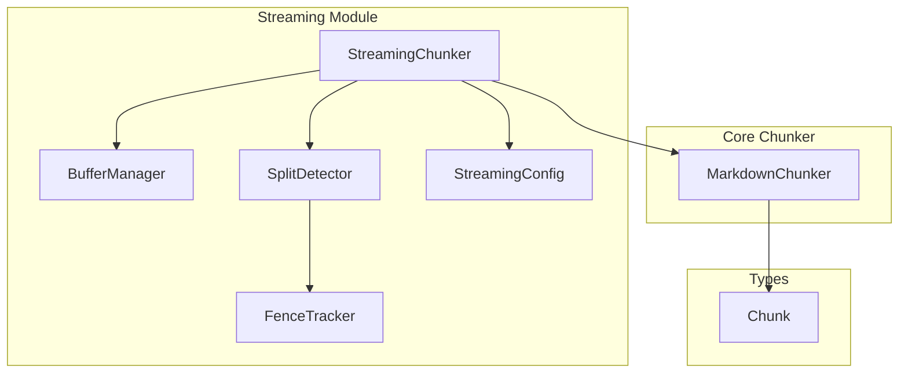
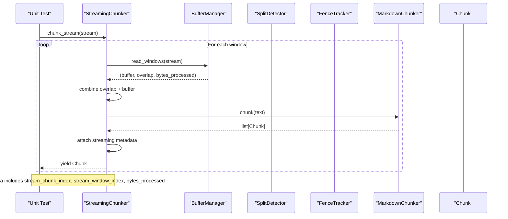
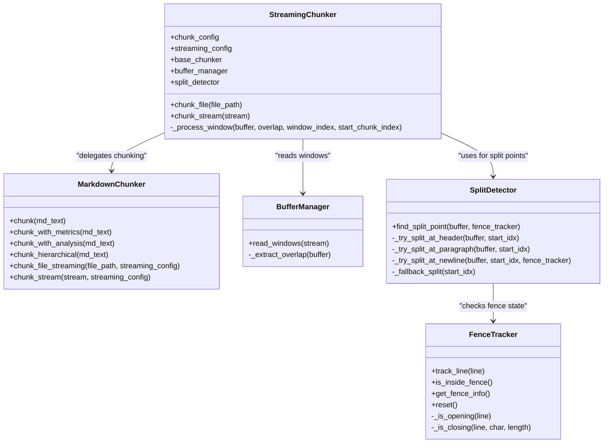
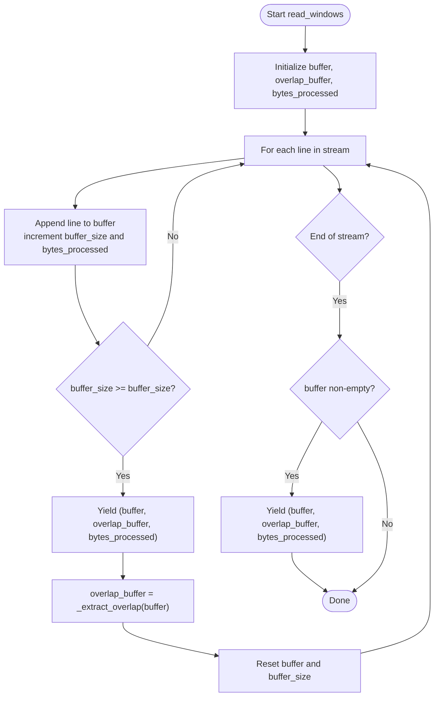
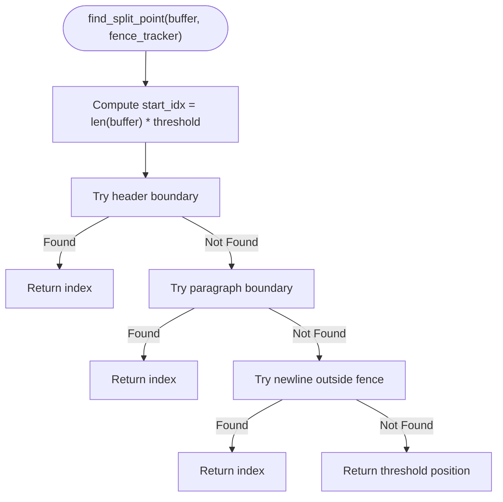
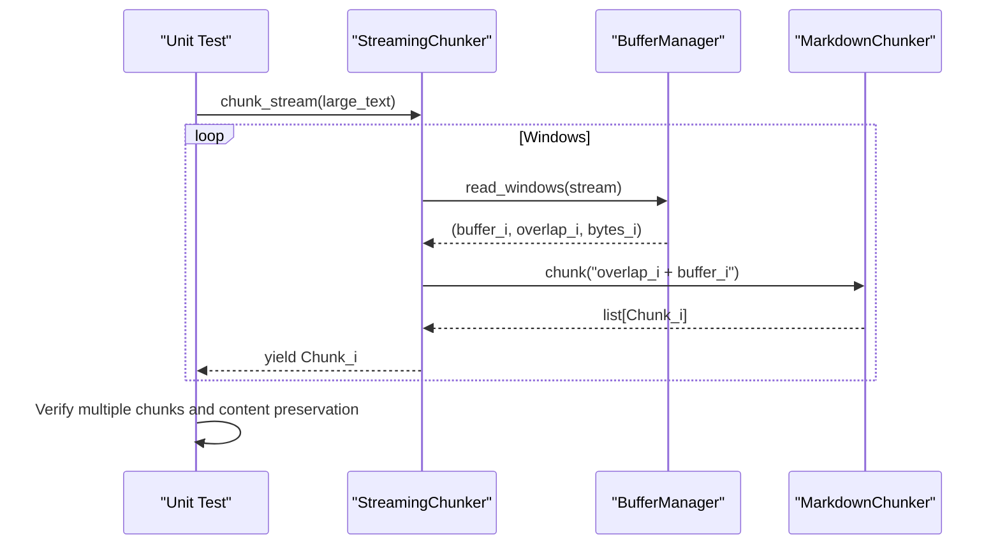
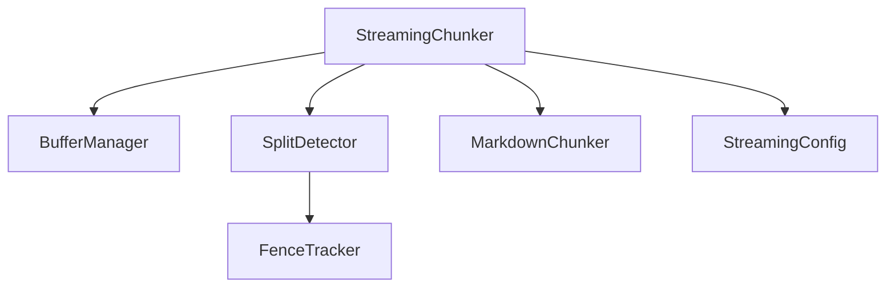

# Streaming Unit Testing

<cite>
**Referenced Files in This Document**
- [test_streaming.py](file://tests/unit/test_streaming.py)
- [streaming_chunker.py](file://src/chunkana/streaming/streaming_chunker.py)
- [buffer_manager.py](file://src/chunkana/streaming/buffer_manager.py)
- [fence_tracker.py](file://src/chunkana/streaming/fence_tracker.py)
- [split_detector.py](file://src/chunkana/streaming/split_detector.py)
- [config.py](file://src/chunkana/streaming/config.py)
- [chunker.py](file://src/chunkana/chunker.py)
- [types.py](file://src/chunkana/types.py)
</cite>

## Table of Contents
1. [Introduction](#introduction)
2. [Project Structure](#project-structure)
3. [Core Components](#core-components)
4. [Architecture Overview](#architecture-overview)
5. [Detailed Component Analysis](#detailed-component-analysis)
6. [Dependency Analysis](#dependency-analysis)
7. [Performance Considerations](#performance-considerations)
8. [Troubleshooting Guide](#troubleshooting-guide)
9. [Conclusion](#conclusion)
10. [Appendices](#appendices)

## Introduction
This document explains the unit tests for streaming chunking in test_streaming.py, focusing on how streaming mode processes large inputs efficiently. It covers streaming chunker behavior, buffer management, and large file processing. It also documents how tests validate incremental processing, state preservation, and memory efficiency, including examples of chunk emission patterns, buffer boundary handling, and continuity across stream segments. Edge cases such as partial line reads, buffer overflow conditions, and interrupted streams are addressed, along with how tests verify the StreamingChunker’s ability to maintain context across chunks and handle fence tracking in streaming mode. Finally, it provides best practices for testing streaming functionality with large inputs.

## Project Structure
The streaming-related components reside under src/chunkana/streaming and are exercised by tests/unit/test_streaming.py. The main chunker pipeline is implemented in src/chunkana/chunker.py, which the streaming chunker delegates to for actual chunking of windowed content.

**Diagram sources**
- [streaming_chunker.py](file://src/chunkana/streaming/streaming_chunker.py#L1-L99)
- [buffer_manager.py](file://src/chunkana/streaming/buffer_manager.py#L1-L62)
- [split_detector.py](file://src/chunkana/streaming/split_detector.py#L1-L93)
- [fence_tracker.py](file://src/chunkana/streaming/fence_tracker.py#L1-L65)
- [config.py](file://src/chunkana/streaming/config.py#L1-L24)
- [chunker.py](file://src/chunkana/chunker.py#L249-L300)
- [types.py](file://src/chunkana/types.py#L240-L399)

**Section sources**
- [test_streaming.py](file://tests/unit/test_streaming.py#L1-L363)
- [streaming_chunker.py](file://src/chunkana/streaming/streaming_chunker.py#L1-L99)
- [buffer_manager.py](file://src/chunkana/streaming/buffer_manager.py#L1-L62)
- [split_detector.py](file://src/chunkana/streaming/split_detector.py#L1-L93)
- [fence_tracker.py](file://src/chunkana/streaming/fence_tracker.py#L1-L65)
- [config.py](file://src/chunkana/streaming/config.py#L1-L24)
- [chunker.py](file://src/chunkana/chunker.py#L249-L300)
- [types.py](file://src/chunkana/types.py#L240-L399)

## Core Components
- StreamingConfig: Defines buffer_size, overlap_lines, max_memory_mb, and safe_split_threshold used by streaming components.
- BufferManager: Reads a stream in fixed-size windows and manages overlap between consecutive windows.
- SplitDetector: Determines safe split points within a buffer window prioritizing semantic boundaries and avoiding mid-fence splits.
- FenceTracker: Tracks code fence state across buffer boundaries to prevent splitting code blocks.
- StreamingChunker: Orchestrates streaming by reading windows, combining overlap, delegating to MarkdownChunker, and attaching streaming metadata.
- MarkdownChunker: Performs the actual chunking of text using strategies and adds standard metadata; streaming mode yields chunks with streaming metadata.
- Chunk: The data structure representing a chunk with content, line indices, and metadata.

Key streaming metadata attached by StreamingChunker:
- stream_chunk_index: Sequential index of the chunk within the stream.
- stream_window_index: Window index where the chunk originated.
- bytes_processed: Cumulative bytes processed so far.

**Section sources**
- [config.py](file://src/chunkana/streaming/config.py#L1-L24)
- [buffer_manager.py](file://src/chunkana/streaming/buffer_manager.py#L1-L62)
- [split_detector.py](file://src/chunkana/streaming/split_detector.py#L1-L93)
- [fence_tracker.py](file://src/chunkana/streaming/fence_tracker.py#L1-L65)
- [streaming_chunker.py](file://src/chunkana/streaming/streaming_chunker.py#L1-L99)
- [chunker.py](file://src/chunkana/chunker.py#L249-L300)
- [types.py](file://src/chunkana/types.py#L240-L399)

## Architecture Overview
The streaming pipeline reads a text stream in windows sized by buffer_size. Each window is overlapped by overlap_lines from the previous window to preserve context. Within each window, SplitDetector identifies safe split points, and FenceTracker ensures code fences remain intact. The windowed content is then chunked by MarkdownChunker, and StreamingChunker attaches streaming metadata before yielding chunks.

**Diagram sources**
- [streaming_chunker.py](file://src/chunkana/streaming/streaming_chunker.py#L56-L99)
- [buffer_manager.py](file://src/chunkana/streaming/buffer_manager.py#L29-L55)
- [split_detector.py](file://src/chunkana/streaming/split_detector.py#L26-L61)
- [fence_tracker.py](file://src/chunkana/streaming/fence_tracker.py#L10-L65)
- [chunker.py](file://src/chunkana/chunker.py#L85-L176)
- [types.py](file://src/chunkana/types.py#L240-L399)

**Section sources**
- [test_streaming.py](file://tests/unit/test_streaming.py#L54-L116)
- [streaming_chunker.py](file://src/chunkana/streaming/streaming_chunker.py#L56-L99)
- [buffer_manager.py](file://src/chunkana/streaming/buffer_manager.py#L29-L55)
- [split_detector.py](file://src/chunkana/streaming/split_detector.py#L26-L61)
- [fence_tracker.py](file://src/chunkana/streaming/fence_tracker.py#L10-L65)
- [chunker.py](file://src/chunkana/chunker.py#L85-L176)
- [types.py](file://src/chunkana/types.py#L240-L399)

## Detailed Component Analysis

### StreamingChunker Behavior and Streaming Metadata
- Initialization: StreamingChunker accepts ChunkConfig and optional StreamingConfig, initializes a MarkdownChunker, BufferManager, and SplitDetector.
- Streaming mode: chunk_stream iterates windows from BufferManager, processes each window via _process_window, and yields chunks with streaming metadata attached.
- Metadata: Each yielded chunk includes stream_chunk_index, stream_window_index, and bytes_processed.

Validation in tests:
- Initialization assertions confirm defaults and custom configs.
- chunk_stream_simple verifies that chunks are produced and contain streaming metadata.
- stream_window_index_increments ensures window indices increment across multiple windows.
- streaming_metadata_consistency checks that stream_chunk_index equals the iteration order and that stream_window_index and bytes_processed are present.

**Diagram sources**
- [streaming_chunker.py](file://src/chunkana/streaming/streaming_chunker.py#L18-L99)
- [chunker.py](file://src/chunkana/chunker.py#L249-L300)
- [buffer_manager.py](file://src/chunkana/streaming/buffer_manager.py#L13-L62)
- [split_detector.py](file://src/chunkana/streaming/split_detector.py#L10-L93)
- [fence_tracker.py](file://src/chunkana/streaming/fence_tracker.py#L10-L65)

**Section sources**
- [test_streaming.py](file://tests/unit/test_streaming.py#L54-L116)
- [streaming_chunker.py](file://src/chunkana/streaming/streaming_chunker.py#L37-L99)
- [chunker.py](file://src/chunkana/chunker.py#L249-L300)
- [types.py](file://src/chunkana/types.py#L240-L399)

### Buffer Management and Window Boundaries
- BufferManager reads a stream line-by-line, accumulating lines until buffer_size is reached, then emits a window with buffer, overlap, and bytes_processed.
- Overlap is extracted from the end of the previous buffer according to overlap_lines.
- The final remainder buffer is emitted after the loop.

Validation in tests:
- read_windows_small_file asserts a single-window output for small content and zero overlap.
- read_windows_large_file confirms multiple windows and non-empty overlap for subsequent windows.
- overlap_extraction verifies overlap length constraints.

**Diagram sources**
- [buffer_manager.py](file://src/chunkana/streaming/buffer_manager.py#L29-L55)

**Section sources**
- [test_streaming.py](file://tests/unit/test_streaming.py#L171-L232)
- [buffer_manager.py](file://src/chunkana/streaming/buffer_manager.py#L29-L55)

### Split Detection and Fence Tracking
- SplitDetector prioritizes safe split points:
  1. Before a header line.
  2. At paragraph boundaries (double newline).
  3. At a newline outside a fence.
  4. Fallback to threshold position.
- FenceTracker maintains a stack of open fences and detects opening/closing lines to avoid splitting mid-fence.

Validation in tests:
- find_split_point_at_header ensures a split occurs before a header.
- find_split_point_at_paragraph ensures a split occurs at a paragraph boundary.
- fallback_split validates threshold-based fallback when no semantic split is found.

**Diagram sources**
- [split_detector.py](file://src/chunkana/streaming/split_detector.py#L26-L61)
- [fence_tracker.py](file://src/chunkana/streaming/fence_tracker.py#L10-L65)

**Section sources**
- [test_streaming.py](file://tests/unit/test_streaming.py#L233-L287)
- [split_detector.py](file://src/chunkana/streaming/split_detector.py#L26-L61)
- [fence_tracker.py](file://src/chunkana/streaming/fence_tracker.py#L10-L65)

### Large File Processing and Incremental Chunk Emission
- Tests demonstrate streaming large documents, verifying multiple chunks and non-empty content.
- Preservation of code blocks across windows is validated by recombining chunk content and asserting presence of code snippets.

Validation in tests:
- large_document_streaming asserts multiple chunks and non-empty content.
- streaming_preserves_code_blocks ensures code blocks remain intact after streaming.

**Diagram sources**
- [streaming_chunker.py](file://src/chunkana/streaming/streaming_chunker.py#L56-L99)
- [buffer_manager.py](file://src/chunkana/streaming/buffer_manager.py#L29-L55)
- [chunker.py](file://src/chunkana/chunker.py#L85-L176)

**Section sources**
- [test_streaming.py](file://tests/unit/test_streaming.py#L289-L360)
- [streaming_chunker.py](file://src/chunkana/streaming/streaming_chunker.py#L56-L99)
- [chunker.py](file://src/chunkana/chunker.py#L85-L176)

### Edge Cases and Robustness
- Empty and whitespace-only streams: Tests assert zero chunks are produced.
- Partial line reads and buffer overflow: Managed by BufferManager’s byte-based windowing and overlap extraction.
- Interrupted streams: The pipeline continues to emit remaining content after the loop.

Validation in tests:
- empty_stream and whitespace_only_stream assert no chunks are produced.

**Section sources**
- [test_streaming.py](file://tests/unit/test_streaming.py#L150-L169)
- [buffer_manager.py](file://src/chunkana/streaming/buffer_manager.py#L29-L55)

## Dependency Analysis
StreamingChunker depends on BufferManager for windowing, SplitDetector for safe split points, and MarkdownChunker for chunking. SplitDetector uses FenceTracker to avoid mid-fence splits. StreamingConfig governs buffer_size, overlap_lines, and safe_split_threshold.

**Diagram sources**
- [streaming_chunker.py](file://src/chunkana/streaming/streaming_chunker.py#L18-L42)
- [split_detector.py](file://src/chunkana/streaming/split_detector.py#L10-L25)
- [fence_tracker.py](file://src/chunkana/streaming/fence_tracker.py#L10-L21)
- [config.py](file://src/chunkana/streaming/config.py#L8-L24)

**Section sources**
- [streaming_chunker.py](file://src/chunkana/streaming/streaming_chunker.py#L18-L42)
- [split_detector.py](file://src/chunkana/streaming/split_detector.py#L10-L25)
- [fence_tracker.py](file://src/chunkana/streaming/fence_tracker.py#L10-L21)
- [config.py](file://src/chunkana/streaming/config.py#L8-L24)

## Performance Considerations
- Memory efficiency: StreamingConfig.buffer_size limits per-window memory usage; overlap_lines provides context without duplicating content.
- Throughput: Using iterator-based chunk_stream avoids loading entire files into memory.
- Overlap cost: overlap_lines increases processing time slightly but improves chunk coherence across boundaries.
- Adaptive sizing: MarkdownChunker applies adaptive sizing when enabled; streaming mode still respects max_chunk_size and overlap constraints.

[No sources needed since this section provides general guidance]

## Troubleshooting Guide
Common streaming issues and how tests prevent them:
- Data corruption or state loss:
  - Ensure FenceTracker state is respected during split detection to avoid mid-fence splits.
  - Validate that overlap is correctly carried forward and combined with the current buffer.
- Incorrect chunk emission:
  - Confirm that stream_chunk_index increments monotonically and equals the iteration order.
  - Verify that stream_window_index increments across windows and that bytes_processed reflects cumulative bytes.
- Memory spikes:
  - Adjust buffer_size and overlap_lines in StreamingConfig to balance memory and performance.
- Empty or whitespace-only inputs:
  - Tests confirm zero chunks are produced, preventing downstream errors.

Best practices for testing streaming with large inputs:
- Use small buffer_size and overlap_lines to exercise boundary handling.
- Generate large documents programmatically to avoid static fixtures.
- Validate metadata consistency across chunks and windows.
- Test code block preservation and paragraph/header boundary splits.

**Section sources**
- [test_streaming.py](file://tests/unit/test_streaming.py#L133-L169)
- [test_streaming.py](file://tests/unit/test_streaming.py#L289-L360)
- [split_detector.py](file://src/chunkana/streaming/split_detector.py#L26-L61)
- [fence_tracker.py](file://src/chunkana/streaming/fence_tracker.py#L10-L65)
- [buffer_manager.py](file://src/chunkana/streaming/buffer_manager.py#L29-L55)

## Conclusion
The unit tests comprehensively validate streaming chunker behavior, including buffer management, safe split detection with fence awareness, and metadata consistency across windows and chunks. They demonstrate correctness for incremental processing, memory efficiency, and robustness against edge cases. The tests also verify large file handling and code block preservation, ensuring streaming mode maintains context and integrity.

[No sources needed since this section summarizes without analyzing specific files]

## Appendices
- Streaming metadata fields attached by StreamingChunker:
  - stream_chunk_index: Sequential index of the chunk within the stream.
  - stream_window_index: Window index where the chunk originated.
  - bytes_processed: Cumulative bytes processed so far.

**Section sources**
- [streaming_chunker.py](file://src/chunkana/streaming/streaming_chunker.py#L66-L77)
- [types.py](file://src/chunkana/types.py#L240-L399)