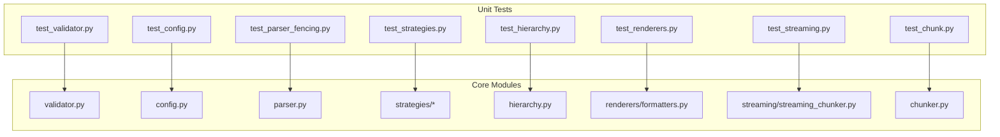
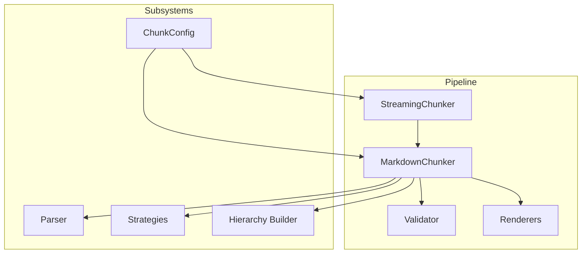
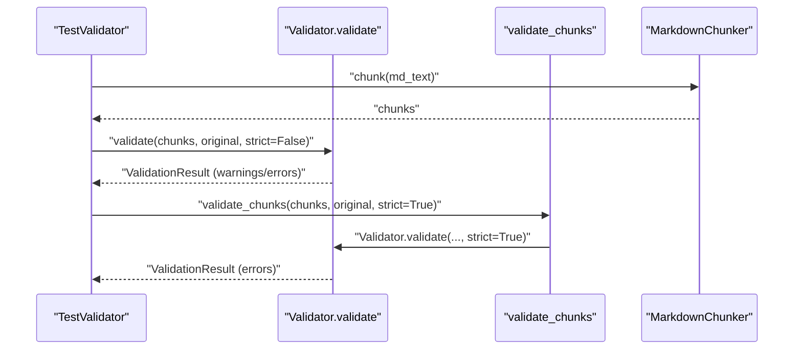
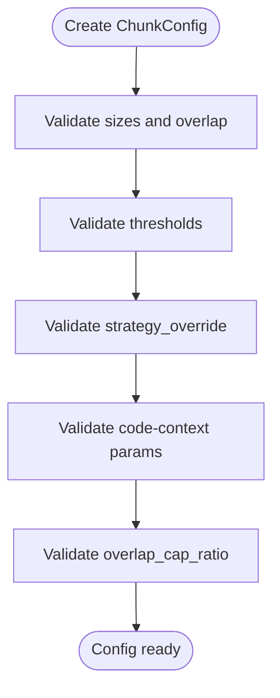
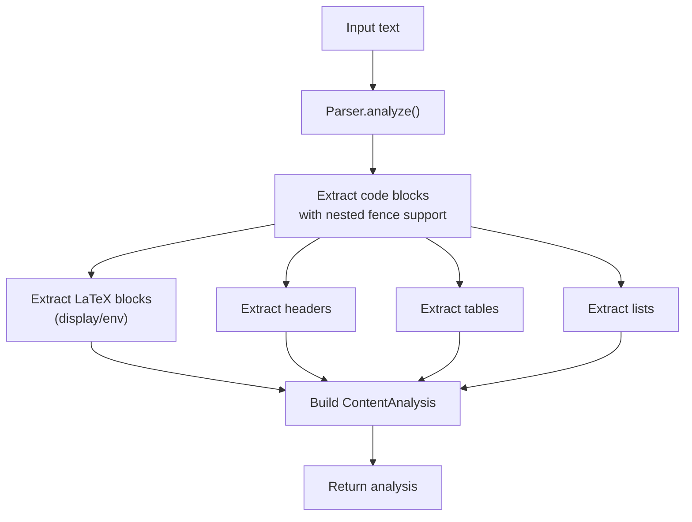
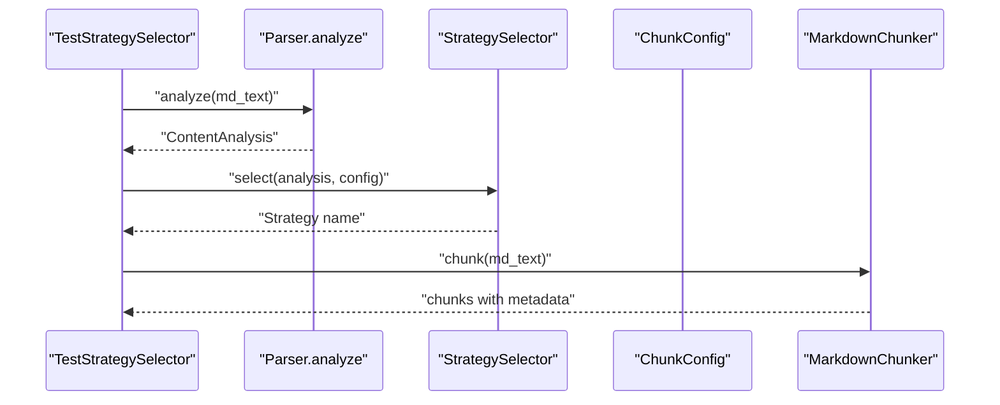
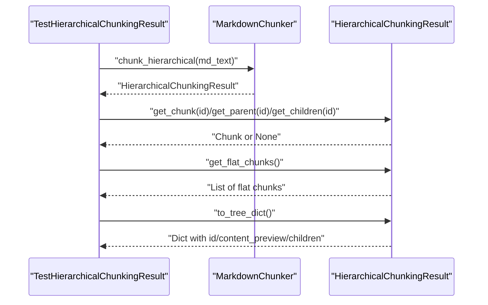
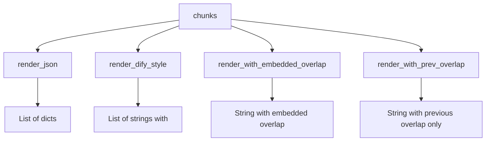
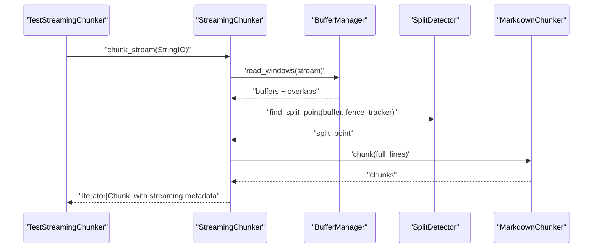
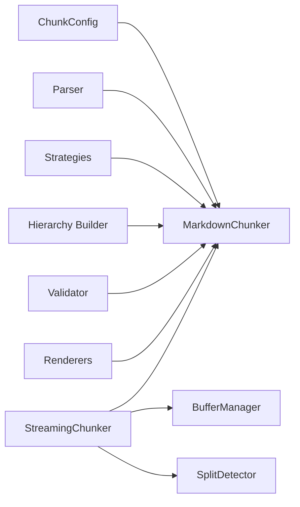

# Unit Testing

<cite>
**Referenced Files in This Document**
- [tests/unit/test_validator.py](file://tests/unit/test_validator.py)
- [src/chunkana/validator.py](file://src/chunkana/validator.py)
- [tests/unit/test_config.py](file://tests/unit/test_config.py)
- [src/chunkana/config.py](file://src/chunkana/config.py)
- [tests/unit/test_hierarchy.py](file://tests/unit/test_hierarchy.py)
- [tests/unit/test_parser_fencing.py](file://tests/unit/test_parser_fencing.py)
- [src/chunkana/parser.py](file://src/chunkana/parser.py)
- [tests/unit/test_renderers.py](file://tests/unit/test_renderers.py)
- [src/chunkana/renderers/formatters.py](file://src/chunkana/renderers/formatters.py)
- [tests/unit/test_strategies.py](file://tests/unit/test_strategies.py)
- [tests/unit/test_streaming.py](file://tests/unit/test_streaming.py)
- [src/chunkana/streaming/streaming_chunker.py](file://src/chunkana/streaming/streaming_chunker.py)
- [tests/unit/test_chunk.py](file://tests/unit/test_chunk.py)
- [src/chunkana/chunker.py](file://src/chunkana/chunker.py)
</cite>

## Table of Contents
1. [Introduction](#introduction)
2. [Project Structure](#project-structure)
3. [Core Components](#core-components)
4. [Architecture Overview](#architecture-overview)
5. [Detailed Component Analysis](#detailed-component-analysis)
6. [Dependency Analysis](#dependency-analysis)
7. [Performance Considerations](#performance-considerations)
8. [Troubleshooting Guide](#troubleshooting-guide)
9. [Conclusion](#conclusion)

## Introduction
This document explains the unit testing strategy for Chunkana’s core modules. It focuses on the tests under tests/unit/, how they map to specific modules, and how they validate key behaviors such as chunk validation, configuration handling, hierarchical chunking, parser fencing rules, renderer output, strategy application, and streaming behavior. It also provides practical guidance for writing robust unit tests, including setup patterns, assertion strategies, and edge-case coverage for Unicode content, special characters, and single-chunk documents.

## Project Structure
The unit tests are organized by functional area:
- Validation: tests/unit/test_validator.py
- Configuration: tests/unit/test_config.py
- Parser and Fencing: tests/unit/test_parser_fencing.py
- Strategies and Selection: tests/unit/test_strategies.py
- Hierarchical Navigation: tests/unit/test_hierarchy.py
- Renderers: tests/unit/test_renderers.py
- Streaming: tests/unit/test_streaming.py
- Chunk Data Model: tests/unit/test_chunk.py

**Diagram sources**
- [tests/unit/test_validator.py](file://tests/unit/test_validator.py#L1-L262)
- [src/chunkana/validator.py](file://src/chunkana/validator.py#L1-L221)
- [tests/unit/test_config.py](file://tests/unit/test_config.py#L1-L226)
- [src/chunkana/config.py](file://src/chunkana/config.py#L1-L507)
- [tests/unit/test_parser_fencing.py](file://tests/unit/test_parser_fencing.py#L1-L377)
- [src/chunkana/parser.py](file://src/chunkana/parser.py#L1-L800)
- [tests/unit/test_strategies.py](file://tests/unit/test_strategies.py#L1-L364)
- [tests/unit/test_hierarchy.py](file://tests/unit/test_hierarchy.py#L1-L268)
- [tests/unit/test_renderers.py](file://tests/unit/test_renderers.py#L1-L296)
- [src/chunkana/renderers/formatters.py](file://src/chunkana/renderers/formatters.py#L1-L146)
- [tests/unit/test_streaming.py](file://tests/unit/test_streaming.py#L1-L363)
- [src/chunkana/streaming/streaming_chunker.py](file://src/chunkana/streaming/streaming_chunker.py#L1-L99)
- [tests/unit/test_chunk.py](file://tests/unit/test_chunk.py#L1-L166)
- [src/chunkana/chunker.py](file://src/chunkana/chunker.py#L1-L800)

**Section sources**
- [tests/unit/test_validator.py](file://tests/unit/test_validator.py#L1-L262)
- [tests/unit/test_config.py](file://tests/unit/test_config.py#L1-L226)
- [tests/unit/test_parser_fencing.py](file://tests/unit/test_parser_fencing.py#L1-L377)
- [tests/unit/test_strategies.py](file://tests/unit/test_strategies.py#L1-L364)
- [tests/unit/test_hierarchy.py](file://tests/unit/test_hierarchy.py#L1-L268)
- [tests/unit/test_renderers.py](file://tests/unit/test_renderers.py#L1-L296)
- [tests/unit/test_streaming.py](file://tests/unit/test_streaming.py#L1-L363)
- [tests/unit/test_chunk.py](file://tests/unit/test_chunk.py#L1-L166)

## Core Components
- Validator: Enforces domain properties (content loss, size bounds, monotonic ordering, empty chunks, valid line numbers) and exposes a convenience function for validation.
- Config: Provides simplified configuration with validation, factory methods, serialization, and aliases.
- Parser: Extracts fenced code blocks, LaTeX, headers, tables, and lists with robust nested fence handling and line-number metadata.
- Strategies: Strategy selection and behavior tests for code-aware, structural, list-aware, and fallback strategies.
- Hierarchical Navigation: Tests for hierarchical chunking navigation (parent/children/siblings/ancestors), flat views, and tree serialization.
- Renderers: Tests for JSON, Dify-style, and overlap-embedding renderers, including metadata inclusion and Unicode handling.
- Streaming: Tests for StreamingConfig, BufferManager, SplitDetector, and StreamingChunker behavior across windows and large documents.
- Chunk Data Model: Tests for Chunk validation, serialization, and computed properties.

**Section sources**
- [src/chunkana/validator.py](file://src/chunkana/validator.py#L1-L221)
- [src/chunkana/config.py](file://src/chunkana/config.py#L1-L507)
- [src/chunkana/parser.py](file://src/chunkana/parser.py#L1-L800)
- [tests/unit/test_strategies.py](file://tests/unit/test_strategies.py#L1-L364)
- [tests/unit/test_hierarchy.py](file://tests/unit/test_hierarchy.py#L1-L268)
- [src/chunkana/renderers/formatters.py](file://src/chunkana/renderers/formatters.py#L1-L146)
- [tests/unit/test_streaming.py](file://tests/unit/test_streaming.py#L1-L363)
- [src/chunkana/streaming/streaming_chunker.py](file://src/chunkana/streaming/streaming_chunker.py#L1-L99)
- [tests/unit/test_chunk.py](file://tests/unit/test_chunk.py#L1-L166)

## Architecture Overview
The unit tests validate the behavior of the core pipeline and subsystems. They exercise:
- Configuration validation and serialization
- Parser correctness for nested fences and edge cases
- Strategy selection and preservation of atomic blocks
- Hierarchical navigation and tree serialization
- Renderer outputs and metadata fidelity
- Streaming chunking across windows and overlap handling
- Chunk-level validation and metadata integrity

**Diagram sources**
- [src/chunkana/chunker.py](file://src/chunkana/chunker.py#L1-L800)
- [src/chunkana/validator.py](file://src/chunkana/validator.py#L1-L221)
- [src/chunkana/renderers/formatters.py](file://src/chunkana/renderers/formatters.py#L1-L146)
- [src/chunkana/streaming/streaming_chunker.py](file://src/chunkana/streaming/streaming_chunker.py#L1-L99)
- [src/chunkana/config.py](file://src/chunkana/config.py#L1-L507)
- [src/chunkana/parser.py](file://src/chunkana/parser.py#L1-L800)

## Detailed Component Analysis

### Validator Tests
Purpose:
- Validate domain properties: no content loss, size bounds, monotonic ordering, no empty chunks, valid line numbers.
- Exercise strict vs non-strict modes and convenience validation function.

Key behaviors covered:
- Content loss detection via ratio comparison and warnings/errors depending on strictness.
- Oversize chunk metadata validation and reasons.
- Monotonic ordering enforcement.
- Edge cases: single-chunk documents, Unicode content, special characters.

Concrete examples from test_validator.py:
- Empty chunks list validation for empty input.
- Content loss detection when chunks omit significant content.
- Ordering issues detected when start_line is out of sequence.
- Oversize chunks must carry allow_oversize and a valid oversize_reason.
- Strict mode converts warnings into errors.
- Single-chunk documents and Unicode/special characters preserved.

**Diagram sources**
- [tests/unit/test_validator.py](file://tests/unit/test_validator.py#L1-L262)
- [src/chunkana/validator.py](file://src/chunkana/validator.py#L1-L221)
- [src/chunkana/chunker.py](file://src/chunkana/chunker.py#L1-L800)

**Section sources**
- [tests/unit/test_validator.py](file://tests/unit/test_validator.py#L1-L262)
- [src/chunkana/validator.py](file://src/chunkana/validator.py#L1-L221)

### Configuration Tests
Purpose:
- Validate ChunkConfig defaults, invalid values, and constraints.
- Factory methods for optimized profiles.
- Serialization/deserialization and alias behavior.
- Code-context binding and overlap-cap-ratio parameters.

Key behaviors covered:
- Positive/negative/zero constraints for sizes and overlap.
- Threshold ranges and strategy override validation.
- Serialization round-trips and unknown-field tolerance.
- Aliasing ChunkerConfig to ChunkConfig.
- Code-context binding defaults and toggles.
- Overlap-cap-ratio bounds and preservation.

**Diagram sources**
- [tests/unit/test_config.py](file://tests/unit/test_config.py#L1-L226)
- [src/chunkana/config.py](file://src/chunkana/config.py#L1-L507)

**Section sources**
- [tests/unit/test_config.py](file://tests/unit/test_config.py#L1-L226)
- [src/chunkana/config.py](file://src/chunkana/config.py#L1-L507)

### Parser and Fencing Tests
Purpose:
- Validate nested fenced code blocks, mixed fence types, unclosed fences, and metadata correctness.
- Ensure content preservation and line-number accuracy.

Key behaviors covered:
- Triple/backtick and tilde fences, quadruple fences, and mixed containment.
- Unclosed fences extending to end of document.
- Fence metadata: char, length, language, closed state.
- Content whitespace and empty lines preserved.
- Line numbers for fenced blocks.

**Diagram sources**
- [tests/unit/test_parser_fencing.py](file://tests/unit/test_parser_fencing.py#L1-L377)
- [src/chunkana/parser.py](file://src/chunkana/parser.py#L1-L800)

**Section sources**
- [tests/unit/test_parser_fencing.py](file://tests/unit/test_parser_fencing.py#L1-L377)
- [src/chunkana/parser.py](file://src/chunkana/parser.py#L1-L800)

### Strategy Tests
Purpose:
- Validate strategy selection based on content characteristics.
- Ensure atomic blocks (code, tables) are preserved.
- Verify structural metadata (header_path) and size limits.

Key behaviors covered:
- Code-heavy and table-heavy documents select code_aware.
- Many headers select structural.
- Many lists select list_aware.
- Plain text selects fallback.
- Strategy override forces a specific strategy.
- Oversized chunks receive allow_oversize and reason metadata.

**Diagram sources**
- [tests/unit/test_strategies.py](file://tests/unit/test_strategies.py#L1-L364)
- [src/chunkana/chunker.py](file://src/chunkana/chunker.py#L1-L800)

**Section sources**
- [tests/unit/test_strategies.py](file://tests/unit/test_strategies.py#L1-L364)
- [src/chunkana/chunker.py](file://src/chunkana/chunker.py#L1-L800)

### Hierarchical Navigation Tests
Purpose:
- Validate hierarchical chunking navigation: parent/children/ancestors/siblings.
- Ensure flat view and tree serialization correctness.
- Handle edge cases: empty docs, single paragraph, no headers, deep nesting.

Key behaviors covered:
- get_chunk/get_parent/get_children/get_ancestors/get_siblings/get_by_level.
- Bidirectional parent-child consistency.
- Flat chunks exclude root and enforce significant content for non-leaves.
- Tree serialization includes required fields.

**Diagram sources**
- [tests/unit/test_hierarchy.py](file://tests/unit/test_hierarchy.py#L1-L268)
- [src/chunkana/chunker.py](file://src/chunkana/chunker.py#L1-L800)

**Section sources**
- [tests/unit/test_hierarchy.py](file://tests/unit/test_hierarchy.py#L1-L268)
- [src/chunkana/chunker.py](file://src/chunkana/chunker.py#L1-L800)

### Renderer Tests
Purpose:
- Validate renderer outputs and metadata fidelity.
- Ensure Unicode and special characters are preserved.
- Confirm overlap embedding behavior and metadata placement.

Key behaviors covered:
- render_json returns list of dicts with chunk fields.
- render_dify_style includes metadata JSON block and line numbers.
- render_with_embedded_overlap/previews previous/next content.
- render_with_prev_overlap includes only previous content.
- Edge cases: empty lists, Unicode, special JSON characters, empty overlaps.

**Diagram sources**
- [tests/unit/test_renderers.py](file://tests/unit/test_renderers.py#L1-L296)
- [src/chunkana/renderers/formatters.py](file://src/chunkana/renderers/formatters.py#L1-L146)

**Section sources**
- [tests/unit/test_renderers.py](file://tests/unit/test_renderers.py#L1-L296)
- [src/chunkana/renderers/formatters.py](file://src/chunkana/renderers/formatters.py#L1-L146)

### Streaming Tests
Purpose:
- Validate StreamingConfig defaults and custom values.
- Ensure StreamingChunker processes streams and files correctly.
- Test BufferManager windowing and overlap extraction.
- Validate SplitDetector split-point heuristics and fallback thresholds.
- Verify streaming metadata consistency and large-document behavior.

Key behaviors covered:
- Default and custom streaming configurations.
- Windowed processing with overlap.
- Split detection near headers and paragraph boundaries.
- Large document streaming and code-block preservation.
- Streaming metadata fields: stream_chunk_index, stream_window_index, bytes_processed.

**Diagram sources**
- [tests/unit/test_streaming.py](file://tests/unit/test_streaming.py#L1-L363)
- [src/chunkana/streaming/streaming_chunker.py](file://src/chunkana/streaming/streaming_chunker.py#L1-L99)

**Section sources**
- [tests/unit/test_streaming.py](file://tests/unit/test_streaming.py#L1-L363)
- [src/chunkana/streaming/streaming_chunker.py](file://src/chunkana/streaming/streaming_chunker.py#L1-L99)

### Chunk Data Model Tests
Purpose:
- Validate Chunk creation constraints and computed properties.
- Ensure serialization/deserialization round-trips preserve Unicode.
- Verify size and line-count semantics.

Key behaviors covered:
- start_line must be >= 1; end_line >= start_line; content cannot be empty.
- to_dict/from_dict and to_json/from_json round-trips.
- size property counts characters; line_count computed from start/end.
- Unicode preservation across round-trips.

**Section sources**
- [tests/unit/test_chunk.py](file://tests/unit/test_chunk.py#L1-L166)

## Dependency Analysis
- Validator depends on ChunkConfig and Chunk types to enforce domain properties.
- MarkdownChunker orchestrates parsing, strategy selection, overlap, metadata enrichment, and validation.
- Parser is a standalone extractor with robust nested-fence handling and line-number tracking.
- Renderers are pure functions operating on Chunk objects without mutation.
- StreamingChunker composes BufferManager, SplitDetector, and MarkdownChunker for windowed processing.
- Config provides validation and factory methods used across the system.

**Diagram sources**
- [src/chunkana/chunker.py](file://src/chunkana/chunker.py#L1-L800)
- [src/chunkana/validator.py](file://src/chunkana/validator.py#L1-L221)
- [src/chunkana/parser.py](file://src/chunkana/parser.py#L1-L800)
- [src/chunkana/renderers/formatters.py](file://src/chunkana/renderers/formatters.py#L1-L146)
- [src/chunkana/streaming/streaming_chunker.py](file://src/chunkana/streaming/streaming_chunker.py#L1-L99)

**Section sources**
- [src/chunkana/chunker.py](file://src/chunkana/chunker.py#L1-L800)
- [src/chunkana/validator.py](file://src/chunkana/validator.py#L1-L221)
- [src/chunkana/parser.py](file://src/chunkana/parser.py#L1-L800)
- [src/chunkana/renderers/formatters.py](file://src/chunkana/renderers/formatters.py#L1-L146)
- [src/chunkana/streaming/streaming_chunker.py](file://src/chunkana/streaming/streaming_chunker.py#L1-L99)

## Performance Considerations
- Streaming chunking reduces memory usage by processing fixed-size buffers with overlap.
- Parser optimizations include pre-built patterns and position indexing for fast lookups.
- Overlap computation is metadata-only and avoids duplicating content in chunk.text.
- Adaptive sizing adjusts chunk sizes based on content complexity to balance retrieval quality and index size.

[No sources needed since this section provides general guidance]

## Troubleshooting Guide
Common issues and how tests catch them:
- Content loss detection: Validator warns or fails when combined chunk content is below a threshold compared to the original.
- Monotonic ordering enforcement: Validator sorts chunks if start_line is out of order.
- Oversize chunk metadata: When chunks exceed max size, they must include allow_oversize and a valid reason (code/table/section).
- Empty chunks and invalid line numbers: Chunk.__post_init__ enforces non-empty content and valid start/end lines.
- Streaming metadata: Ensure stream_chunk_index, stream_window_index, and bytes_processed are present and consistent.

Recommended debugging steps:
- Run targeted unit tests for the affected module (e.g., test_validator.py for validation failures).
- Use pytest with verbose output to inspect assertion messages.
- For streaming issues, verify buffer_size and overlap_lines; confirm split points near headers and paragraph boundaries.
- For renderer issues, validate metadata JSON presence and escape sequences.

**Section sources**
- [tests/unit/test_validator.py](file://tests/unit/test_validator.py#L1-L262)
- [src/chunkana/validator.py](file://src/chunkana/validator.py#L1-L221)
- [tests/unit/test_chunk.py](file://tests/unit/test_chunk.py#L1-L166)
- [tests/unit/test_streaming.py](file://tests/unit/test_streaming.py#L1-L363)

## Conclusion
The unit tests comprehensively validate Chunkana’s core behaviors across configuration, parsing, strategy selection, hierarchical navigation, rendering, streaming, and chunk validation. They enforce domain properties, ensure robust edge-case handling (Unicode, special characters, nested fences), and provide clear patterns for asserting correctness. New tests should mirror these patterns: isolate the unit under test, construct deterministic inputs, assert observable outputs and metadata, and cover both typical and edge cases.