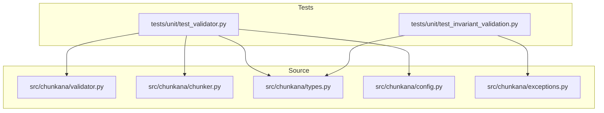
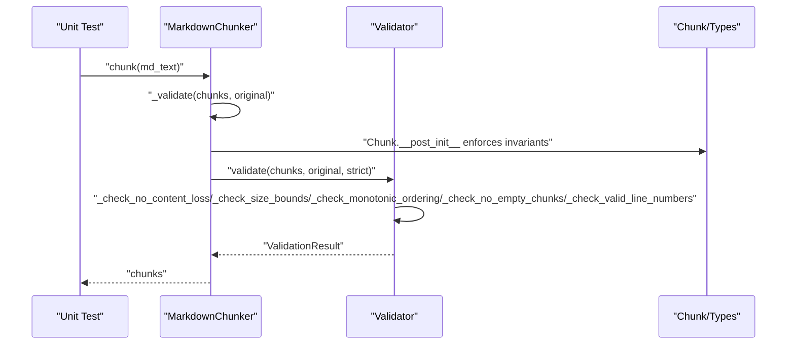
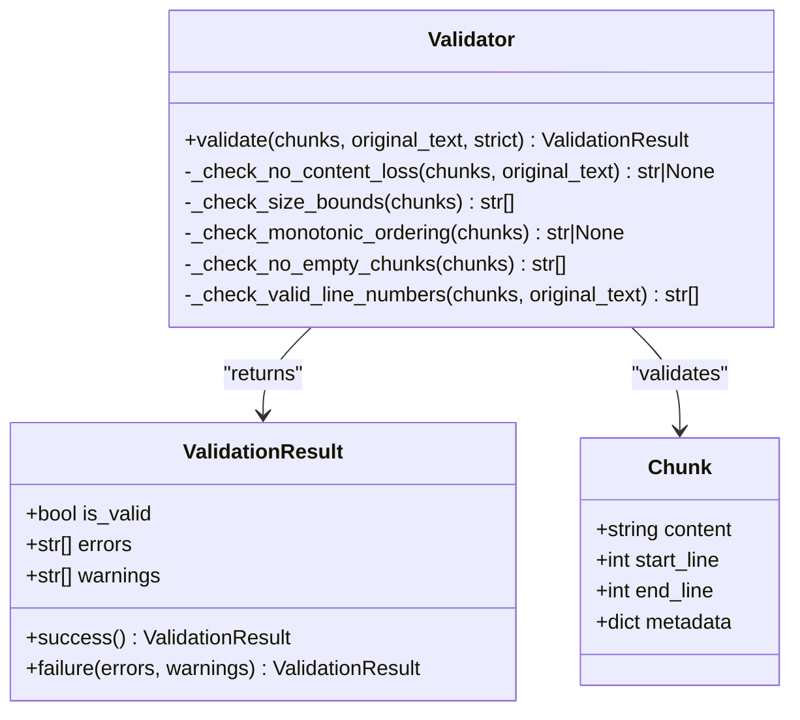
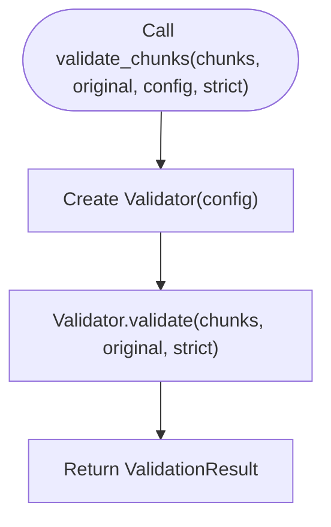
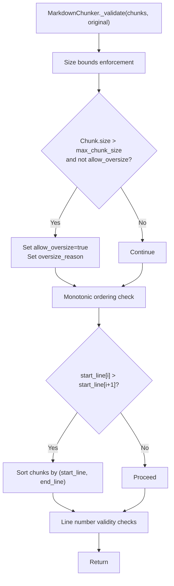
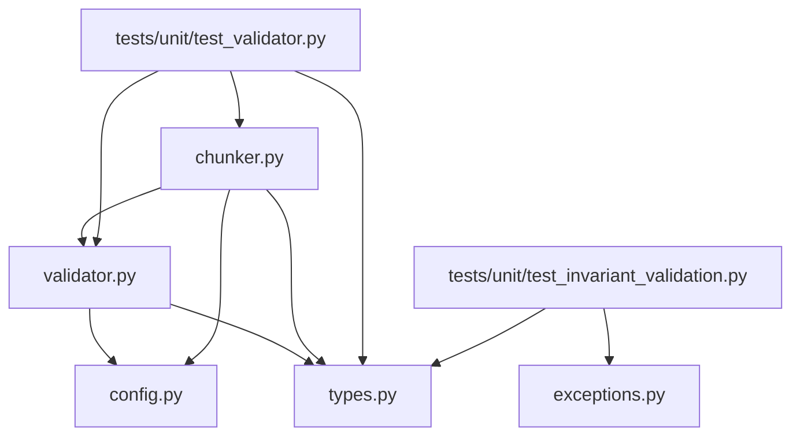

# Validator Unit Testing

<cite>
**Referenced Files in This Document**
- [validator.py](file://src/chunkana/validator.py)
- [types.py](file://src/chunkana/types.py)
- [chunker.py](file://src/chunkana/chunker.py)
- [config.py](file://src/chunkana/config.py)
- [test_validator.py](file://tests/unit/test_validator.py)
- [test_invariant_validation.py](file://tests/unit/test_invariant_validation.py)
- [exceptions.py](file://src/chunkana/exceptions.py)
</cite>

## Table of Contents
1. [Introduction](#introduction)
2. [Project Structure](#project-structure)
3. [Core Components](#core-components)
4. [Architecture Overview](#architecture-overview)
5. [Detailed Component Analysis](#detailed-component-analysis)
6. [Dependency Analysis](#dependency-analysis)
7. [Performance Considerations](#performance-considerations)
8. [Troubleshooting Guide](#troubleshooting-guide)
9. [Conclusion](#conclusion)
10. [Appendices](#appendices)

## Introduction
This document provides a comprehensive guide to the unit tests for the validator subsystem in the chunkana project. It focuses on how tests validate chunk integrity, metadata correctness, and structural invariants. It explains how the tests verify content fidelity, line number accuracy, monotonic ordering, and metadata completeness. Concrete examples from the test suite demonstrate assertions on chunk boundaries, header paths, and content preservation. Edge cases such as Unicode characters, empty content, and single-chunk inputs are covered. We also explain the relationship between Validator class methods and their corresponding test cases, address common failure modes, and provide guidance for extending the test suite.

## Project Structure
The validator unit tests reside under the tests/unit directory and exercise the validator module and related components. The validator module defines domain properties (PROP-1 through PROP-5) and a convenience function to validate arbitrary chunk lists against these properties. The chunker integrates validation into its pipeline and also sets metadata for oversized chunks. Configuration controls chunk size bounds and overlap behavior. Types define the Chunk data model and metadata fields used by tests.

**Diagram sources**
- [test_validator.py](file://tests/unit/test_validator.py#L1-L262)
- [test_invariant_validation.py](file://tests/unit/test_invariant_validation.py#L1-L321)
- [validator.py](file://src/chunkana/validator.py#L1-L221)
- [chunker.py](file://src/chunkana/chunker.py#L431-L470)
- [types.py](file://src/chunkana/types.py#L240-L376)
- [config.py](file://src/chunkana/config.py#L17-L126)
- [exceptions.py](file://src/chunkana/exceptions.py#L1-L248)

**Section sources**
- [test_validator.py](file://tests/unit/test_validator.py#L1-L262)
- [validator.py](file://src/chunkana/validator.py#L1-L221)
- [chunker.py](file://src/chunkana/chunker.py#L431-L470)
- [types.py](file://src/chunkana/types.py#L240-L376)
- [config.py](file://src/chunkana/config.py#L17-L126)

## Core Components
- Validator: Implements domain property checks (content loss, size bounds, monotonic ordering, empty chunks, valid line numbers) and returns a ValidationResult.
- validate_chunks: Convenience function delegating to Validator.validate.
- Chunk: Data model with content, start_line, end_line, and metadata fields. Enforces basic invariants via __post_init__.
- MarkdownChunker: Integrates validation into the chunking pipeline and enriches oversized chunks with metadata.
- ChunkConfig: Controls chunk size bounds and overlap behavior used by validators.

Key responsibilities:
- Validation: Ensures chunks satisfy domain properties and metadata constraints.
- Metadata completeness: Verifies presence and correctness of header_path, content_type, and other metadata fields.
- Structural invariants: Enforces monotonic ordering and line number validity.

**Section sources**
- [validator.py](file://src/chunkana/validator.py#L32-L221)
- [types.py](file://src/chunkana/types.py#L240-L376)
- [chunker.py](file://src/chunkana/chunker.py#L431-L470)
- [config.py](file://src/chunkana/config.py#L17-L126)

## Architecture Overview
The validator tests exercise both the standalone Validator.validate and the integrated validation performed by MarkdownChunker._validate. Tests also verify metadata completeness and hierarchical invariants separately.

**Diagram sources**
- [chunker.py](file://src/chunkana/chunker.py#L431-L470)
- [validator.py](file://src/chunkana/validator.py#L47-L199)
- [types.py](file://src/chunkana/types.py#L292-L307)

## Detailed Component Analysis

### Validator.validate and Domain Properties
The Validator.validate method orchestrates five domain property checks:
- PROP-1: No Content Loss
- PROP-2: Size Bounds
- PROP-3: Monotonic Ordering
- PROP-4: No Empty Chunks
- PROP-5: Valid Line Numbers

These are implemented by dedicated private methods and aggregated into a ValidationResult.

**Diagram sources**
- [validator.py](file://src/chunkana/validator.py#L32-L221)
- [types.py](file://src/chunkana/types.py#L240-L376)

**Section sources**
- [validator.py](file://src/chunkana/validator.py#L47-L199)

### validate_chunks Convenience Function
The validate_chunks function provides a simple interface to validate chunks with a given configuration and strictness setting.

**Diagram sources**
- [validator.py](file://src/chunkana/validator.py#L201-L221)

**Section sources**
- [validator.py](file://src/chunkana/validator.py#L201-L221)

### MarkdownChunker Integration and Oversize Metadata
The MarkdownChunker performs validation as part of its pipeline and enriches oversized chunks with metadata indicating allow_oversize and oversize_reason. It also ensures monotonic ordering by sorting when needed.

**Diagram sources**
- [chunker.py](file://src/chunkana/chunker.py#L431-L470)

**Section sources**
- [chunker.py](file://src/chunkana/chunker.py#L431-L470)

### Test Coverage and Assertions
The unit tests validate:
- Validator.validate behavior for valid chunks, empty chunks list, content loss detection, and ordering issues.
- ValidationResult factory methods and strict mode behavior.
- Chunker validation integration and oversize metadata assignment.
- Edge cases including single-chunk documents, Unicode content, and special characters.
- validate_chunks convenience function usage and strict mode differences.

Concrete examples from the test suite:
- Empty input produces a valid result for an empty chunks list.
- Content loss detection triggers warnings or invalid results depending on strict mode.
- Out-of-order chunks are detected and cause validation to fail.
- Oversize chunks receive allow_oversize and oversize_reason metadata.
- Monotonic ordering is enforced by the chunker.
- Single-chunk documents remain valid and preserve content.
- Unicode and special characters are preserved across chunks.

**Section sources**
- [test_validator.py](file://tests/unit/test_validator.py#L14-L262)

### Relationship Between Validator Methods and Tests
- _check_no_content_loss: Tested indirectly via content loss scenarios and strict mode behavior.
- _check_size_bounds: Verified by oversize chunk metadata assertions and size comparisons.
- _check_monotonic_ordering: Asserted by monotonic ordering tests and enforced by the chunker.
- _check_no_empty_chunks: Enforced by Chunk.__post_init__; tests ensure no empty chunks are produced.
- _check_valid_line_numbers: Validated by line number assertions and total lines computation.

**Section sources**
- [validator.py](file://src/chunkana/validator.py#L93-L199)
- [types.py](file://src/chunkana/types.py#L292-L307)
- [test_validator.py](file://tests/unit/test_validator.py#L14-L262)

### Common Failure Modes and Detection
Common failure modes and how tests detect them:
- Metadata corruption: Tests verify presence of allow_oversize and oversize_reason for oversized chunks.
- Content truncation: Tests compare total output length to input length and assert warnings or invalid results in strict mode.
- Monotonic ordering violations: Tests construct out-of-order chunks and assert validation failures.
- Empty content: Chunk.__post_init__ raises errors for empty content; tests ensure no empty chunks are produced.
- Invalid line numbers: Tests assert start_line >= 1, end_line >= start_line, and end_line <= total_lines.

**Section sources**
- [validator.py](file://src/chunkana/validator.py#L115-L199)
- [types.py](file://src/chunkana/types.py#L292-L307)
- [test_validator.py](file://tests/unit/test_validator.py#L34-L110)

### Guidance for Extending the Test Suite
To extend the test suite with new validation scenarios:
- Add edge cases for boundary conditions (e.g., zero-length overlaps, minimal chunk sizes).
- Introduce malformed metadata scenarios (e.g., missing header_path, inconsistent is_leaf).
- Cover hierarchical invariant tests for parent-child relationships and orphaned chunks.
- Validate strict vs. non-strict mode behavior for each property.
- Add performance tests for large documents and pathological chunk distributions.

**Section sources**
- [test_invariant_validation.py](file://tests/unit/test_invariant_validation.py#L1-L321)

## Dependency Analysis
The validator module depends on ChunkConfig and Chunk types. The chunker depends on Validator for standalone validation and integrates validation into its pipeline. Tests depend on both modules and assert behavior across configurations.

**Diagram sources**
- [validator.py](file://src/chunkana/validator.py#L1-L221)
- [chunker.py](file://src/chunkana/chunker.py#L431-L470)
- [config.py](file://src/chunkana/config.py#L17-L126)
- [types.py](file://src/chunkana/types.py#L240-L376)
- [test_validator.py](file://tests/unit/test_validator.py#L1-L262)
- [test_invariant_validation.py](file://tests/unit/test_invariant_validation.py#L1-L321)
- [exceptions.py](file://src/chunkana/exceptions.py#L1-L248)

**Section sources**
- [validator.py](file://src/chunkana/validator.py#L1-L221)
- [chunker.py](file://src/chunkana/chunker.py#L431-L470)
- [config.py](file://src/chunkana/config.py#L17-L126)
- [types.py](file://src/chunkana/types.py#L240-L376)
- [test_validator.py](file://tests/unit/test_validator.py#L1-L262)
- [test_invariant_validation.py](file://tests/unit/test_invariant_validation.py#L1-L321)
- [exceptions.py](file://src/chunkana/exceptions.py#L1-L248)

## Performance Considerations
- Validation complexity: Each property check iterates over chunks with O(n) complexity. This is efficient for typical chunk counts.
- Memory footprint: Validation operates on existing chunk objects; no additional allocations are required.
- Overlap context: While not part of validation, overlap metadata affects downstream processing and should be considered when measuring throughput.

[No sources needed since this section provides general guidance]

## Troubleshooting Guide
- Content loss warnings: Adjust strict mode or review chunking strategy to reduce overlap-induced variance.
- Oversize chunks: Ensure allow_oversize and oversize_reason are set appropriately; verify reasons align with code blocks, tables, or sections.
- Monotonic ordering failures: Re-sort chunks or adjust chunking strategy to respect header paths and section boundaries.
- Empty content errors: Validate Chunk creation constraints and ensure strategies do not produce empty content.
- Invalid line numbers: Confirm start_line and end_line reflect actual document positions and that end_line >= start_line.

**Section sources**
- [validator.py](file://src/chunkana/validator.py#L115-L199)
- [types.py](file://src/chunkana/types.py#L292-L307)
- [chunker.py](file://src/chunkana/chunker.py#L431-L470)

## Conclusion
The validator unit tests comprehensively cover chunk integrity, metadata correctness, and structural invariants. They validate content fidelity, line number accuracy, monotonic ordering, and metadata completeness, with robust handling of edge cases. The tests demonstrate how Validator.validate and validate_chunks enforce domain properties and how MarkdownChunker integrates validation into its pipeline. By following the guidance provided, contributors can extend the test suite to cover additional scenarios and maintain high-quality chunking behavior.

[No sources needed since this section summarizes without analyzing specific files]

## Appendices

### Appendix A: Property Definitions and Test Mapping
- PROP-1: No Content Loss — tested via content loss scenarios and strict mode behavior.
- PROP-2: Size Bounds — tested via oversize chunk metadata and size comparisons.
- PROP-3: Monotonic Ordering — tested via ordering assertions and enforced by the chunker.
- PROP-4: No Empty Chunks — enforced by Chunk.__post_init__; tests ensure no empty chunks.
- PROP-5: Valid Line Numbers — tested via line number assertions and total lines computation.

**Section sources**
- [validator.py](file://src/chunkana/validator.py#L93-L199)
- [types.py](file://src/chunkana/types.py#L292-L307)
- [test_validator.py](file://tests/unit/test_validator.py#L34-L110)