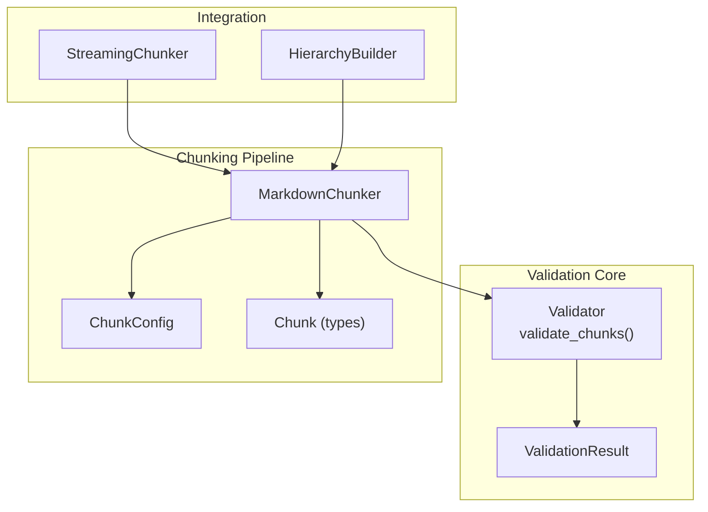
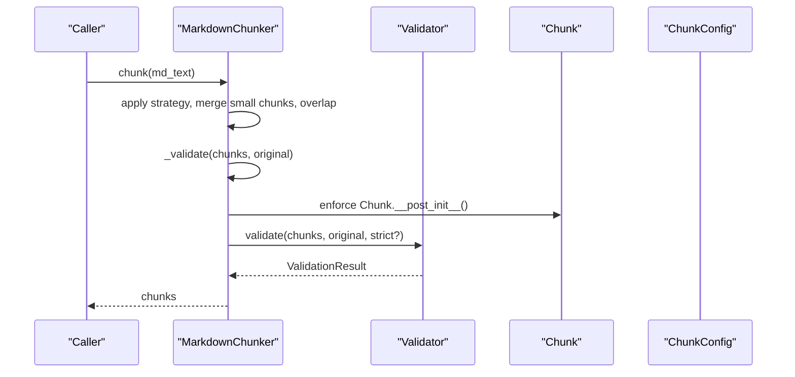
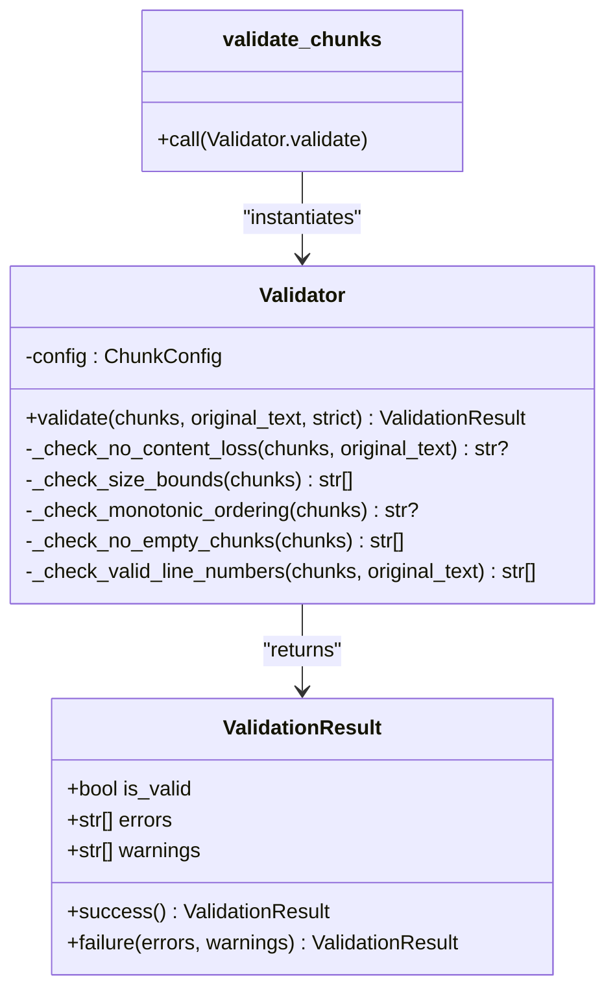
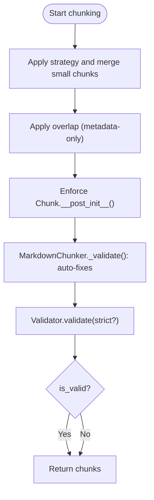
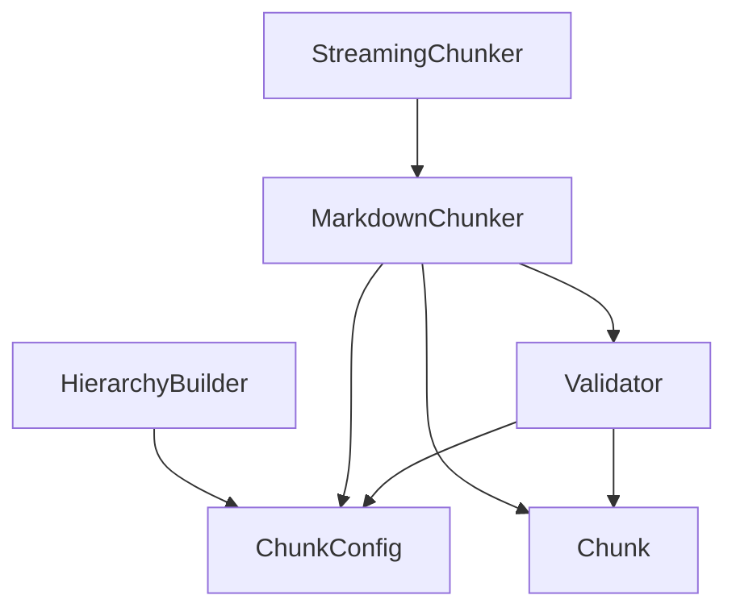

# Validation System

<cite>
**Referenced Files in This Document**
- [validator.py](file://src/chunkana/validator.py)
- [types.py](file://src/chunkana/types.py)
- [chunker.py](file://src/chunkana/chunker.py)
- [config.py](file://src/chunkana/config.py)
- [test_validator.py](file://tests/unit/test_validator.py)
- [test_invariants.py](file://tests/property/test_invariants.py)
- [streaming_chunker.py](file://src/chunkana/streaming/streaming_chunker.py)
- [hierarchy.py](file://src/chunkana/hierarchy.py)
</cite>

## Table of Contents
1. [Introduction](#introduction)
2. [Project Structure](#project-structure)
3. [Core Components](#core-components)
4. [Architecture Overview](#architecture-overview)
5. [Detailed Component Analysis](#detailed-component-analysis)
6. [Dependency Analysis](#dependency-analysis)
7. [Performance Considerations](#performance-considerations)
8. [Troubleshooting Guide](#troubleshooting-guide)
9. [Conclusion](#conclusion)
10. [Appendices](#appendices)

## Introduction
This document explains Chunkana’s validation system that ensures integrity of chunked output. It focuses on the Validator class and ValidationResult data structure, detailing validation rules for content preservation, monotonic line ordering, metadata correctness, and hierarchical tree invariants. It also covers how validation integrates automatically during chunking, how to invoke validate_chunks() as a standalone function, and how strict mode elevates warnings to errors. Special cases such as Unicode content, HTML entities, and fenced code blocks are addressed, along with best practices for handling validation results, debugging failures, and extending the validator with custom rules.

## Project Structure
The validation system spans several modules:
- Validator and ValidationResult define the validation API and results.
- Chunker orchestrates chunking and applies validation at key stages.
- Types define the Chunk data structure and metadata fields used by validators.
- Config controls runtime behavior including strict mode and overlap behavior.
- Tests demonstrate detection of content loss, out-of-order chunks, and invalid metadata, and show how strict mode affects outcomes.
- Streaming chunker integrates validation into streaming pipelines.
- Hierarchy builder enforces hierarchical tree invariants and demonstrates strict vs. non-strict handling.

**Diagram sources**
- [validator.py](file://src/chunkana/validator.py#L15-L221)
- [types.py](file://src/chunkana/types.py#L240-L375)
- [chunker.py](file://src/chunkana/chunker.py#L85-L176)
- [config.py](file://src/chunkana/config.py#L17-L120)
- [streaming_chunker.py](file://src/chunkana/streaming/streaming_chunker.py#L18-L99)
- [hierarchy.py](file://src/chunkana/hierarchy.py#L900-L966)

**Section sources**
- [validator.py](file://src/chunkana/validator.py#L15-L221)
- [types.py](file://src/chunkana/types.py#L240-L375)
- [chunker.py](file://src/chunkana/chunker.py#L85-L176)
- [config.py](file://src/chunkana/config.py#L17-L120)
- [streaming_chunker.py](file://src/chunkana/streaming/streaming_chunker.py#L18-L99)
- [hierarchy.py](file://src/chunkana/hierarchy.py#L900-L966)

## Core Components
- Validator: Implements domain property checks (content preservation, size bounds, monotonic ordering, empty chunks, valid line numbers) and exposes validate_chunks() as a convenience function.
- ValidationResult: Encapsulates validation outcome with is_valid, errors, and warnings.
- Chunk: Defines the validated data structure with content, start_line, end_line, and metadata fields used by validators.
- MarkdownChunker: Applies validation during chunking and sets oversize metadata when appropriate.
- ChunkConfig: Controls strict mode and other behaviors that influence validation.

Key responsibilities:
- Validator.validate() runs all domain property checks and aggregates results.
- validate_chunks() creates a Validator and delegates validation.
- Chunk.__post_init__() enforces basic invariants at construction time.
- MarkdownChunker._validate() performs automatic fixes and metadata enrichment during chunking.

**Section sources**
- [validator.py](file://src/chunkana/validator.py#L15-L221)
- [types.py](file://src/chunkana/types.py#L240-L375)
- [chunker.py](file://src/chunkana/chunker.py#L431-L470)
- [config.py](file://src/chunkana/config.py#L108-L111)

## Architecture Overview
The validation architecture integrates at two primary points:
- During chunking: MarkdownChunker._validate() performs automatic fixes and metadata updates, then calls Validator.validate() to enforce strict checks.
- Standalone validation: validate_chunks() allows external validation of arbitrary chunk lists.

**Diagram sources**
- [chunker.py](file://src/chunkana/chunker.py#L85-L176)
- [chunker.py](file://src/chunkana/chunker.py#L431-L470)
- [validator.py](file://src/chunkana/validator.py#L47-L91)
- [types.py](file://src/chunkana/types.py#L297-L307)
- [config.py](file://src/chunkana/config.py#L108-L111)

## Detailed Component Analysis

### Validator and ValidationResult
- ValidationResult: Holds is_valid, errors, and warnings. Provides success() and failure() factories.
- Validator.validate(): Runs five domain properties:
  - PROP-1: No Content Loss
  - PROP-2: Size Bounds (with oversize metadata validation)
  - PROP-3: Monotonic Ordering
  - PROP-4: No Empty Chunks
  - PROP-5: Valid Line Numbers
- strict mode: Treats warnings as errors when true.

**Diagram sources**
- [validator.py](file://src/chunkana/validator.py#L15-L221)

**Section sources**
- [validator.py](file://src/chunkana/validator.py#L15-L221)

### Validation Rules and Examples
- Content Preservation (PROP-1): Total output length compared to input with allowance for overlap and normalization. Tests demonstrate detection of significant content loss as a warning by default and as an error under strict mode.
- Monotonic Ordering (PROP-3): start_line must be non-decreasing across chunks. Tests show detection of out-of-order chunks.
- Size Bounds (PROP-2): Enforces max_chunk_size unless allow_oversize is set; oversize_reason must be one of predefined values.
- No Empty Chunks (PROP-4): Enforces non-empty content via Chunk.__post_init__().
- Valid Line Numbers (PROP-5): start_line >= 1, end_line >= start_line, end_line <= total lines.

Concrete examples from tests:
- Content loss detection: Creating a chunk with only part of the input triggers a warning by default and an error under strict mode.
- Out-of-order chunks: Swapping start_line values across adjacent chunks triggers an ordering error.
- Oversize chunks: Large code blocks trigger allow_oversize metadata and oversize_reason.

**Section sources**
- [validator.py](file://src/chunkana/validator.py#L93-L198)
- [test_validator.py](file://tests/unit/test_validator.py#L40-L71)
- [test_validator.py](file://tests/unit/test_validator.py#L193-L208)

### Integration Points in Chunking
- Automatic validation during chunking: MarkdownChunker._validate() performs:
  - Content loss check (relaxed).
  - Oversize metadata enrichment (allow_oversize and oversize_reason).
  - Ordering fix (sort by start_line/end_line).
  - Enforces Chunk.__post_init__ invariants (empty content and line number validity).
- validate_chunks(): Standalone function to validate arbitrary chunk lists with optional strict mode.

**Diagram sources**
- [chunker.py](file://src/chunkana/chunker.py#L431-L470)
- [chunker.py](file://src/chunkana/chunker.py#L85-L176)
- [validator.py](file://src/chunkana/validator.py#L47-L91)
- [types.py](file://src/chunkana/types.py#L297-L307)

**Section sources**
- [chunker.py](file://src/chunkana/chunker.py#L431-L470)
- [chunker.py](file://src/chunkana/chunker.py#L85-L176)
- [validator.py](file://src/chunkana/validator.py#L47-L91)
- [types.py](file://src/chunkana/types.py#L297-L307)

### Strict Mode and Warnings vs Errors
- Strict mode elevates warnings to errors. Tests demonstrate:
  - validate_chunks(chunks, text, strict=False) produces a warning-only result.
  - validate_chunks(chunks, text, strict=True) produces an error result.
- Hierarchy builder demonstrates strict vs non-strict handling:
  - In strict mode, invariant violations raise immediately.
  - In non-strict mode, violations are logged and auto-fixed where possible.

**Section sources**
- [test_validator.py](file://tests/unit/test_validator.py#L193-L208)
- [hierarchy.py](file://src/chunkana/hierarchy.py#L949-L961)

### Special Cases: Unicode, HTML Entities, Fenced Code Blocks
- Unicode content: Tests confirm Unicode headers and content are preserved across chunks.
- HTML entities and special characters: Tests confirm special characters are preserved in chunked output.
- Fenced code blocks: Tests confirm atomic block integrity; code blocks are not split across chunks.

**Section sources**
- [test_validator.py](file://tests/unit/test_validator.py#L222-L262)
- [test_invariants.py](file://tests/property/test_invariants.py#L194-L221)

### Streaming Integration
- StreamingChunker uses MarkdownChunker to chunk each window and yields chunks with streaming metadata. Validation occurs via the underlying chunker pipeline.

**Section sources**
- [streaming_chunker.py](file://src/chunkana/streaming/streaming_chunker.py#L43-L99)
- [chunker.py](file://src/chunkana/chunker.py#L85-L176)

## Dependency Analysis
- Validator depends on ChunkConfig and Chunk types.
- MarkdownChunker composes Validator and uses ChunkConfig to control strict mode and overlap behavior.
- HierarchyBuilder uses strict_mode to decide whether to raise or log invariant violations.
- StreamingChunker composes MarkdownChunker to inherit validation behavior.

**Diagram sources**
- [validator.py](file://src/chunkana/validator.py#L47-L91)
- [chunker.py](file://src/chunkana/chunker.py#L85-L176)
- [config.py](file://src/chunkana/config.py#L108-L111)
- [streaming_chunker.py](file://src/chunkana/streaming/streaming_chunker.py#L18-L42)
- [hierarchy.py](file://src/chunkana/hierarchy.py#L949-L961)

**Section sources**
- [validator.py](file://src/chunkana/validator.py#L47-L91)
- [chunker.py](file://src/chunkana/chunker.py#L85-L176)
- [config.py](file://src/chunkana/config.py#L108-L111)
- [streaming_chunker.py](file://src/chunkana/streaming/streaming_chunker.py#L18-L42)
- [hierarchy.py](file://src/chunkana/hierarchy.py#L949-L961)

## Performance Considerations
- Validation is linear in the number of chunks and is lightweight compared to parsing and strategy application.
- Oversize metadata enrichment avoids repeated computation by setting allow_oversize and oversize_reason once per oversized chunk.
- Streaming mode inherits validation behavior from the base chunker, ensuring consistent checks across pipelines.

[No sources needed since this section provides general guidance]

## Troubleshooting Guide
Common issues and resolutions:
- Content loss detected:
  - Cause: Chunks miss significant content compared to input.
  - Action: Review strategy selection and ensure preserve_atomic_blocks is enabled for code and tables.
  - Reference: PROP-1 check and tests.
- Out-of-order chunks:
  - Cause: start_line decreases across adjacent chunks.
  - Action: Ensure monotonic ordering is maintained; the chunker auto-fixes ordering by sorting.
  - Reference: PROP-3 check and tests.
- Oversize chunks without proper metadata:
  - Cause: Chunk exceeds max_chunk_size without allow_oversize or invalid oversize_reason.
  - Action: Ensure allow_oversize is set and oversize_reason is one of code_block_integrity, table_integrity, section_integrity.
  - Reference: PROP-2 check and chunker auto-enrichment.
- Empty chunks or invalid line numbers:
  - Cause: Chunk content is empty or line numbers are out of bounds.
  - Action: Validate Chunk.__post_init__() constraints; ensure start_line >= 1 and end_line >= start_line.
  - Reference: Chunk.__post_init__() and PROP-5 check.
- Strict mode failures:
  - Cause: Warnings become errors under strict mode.
  - Action: Adjust input or disable strict mode for non-critical warnings.
  - Reference: strict_mode in config and tests.

**Section sources**
- [validator.py](file://src/chunkana/validator.py#L93-L198)
- [chunker.py](file://src/chunkana/chunker.py#L431-L470)
- [types.py](file://src/chunkana/types.py#L297-L307)
- [config.py](file://src/chunkana/config.py#L108-L111)
- [test_validator.py](file://tests/unit/test_validator.py#L40-L71)
- [test_validator.py](file://tests/unit/test_validator.py#L193-L208)

## Conclusion
Chunkana’s validation system provides robust integrity checks across content preservation, structural ordering, size bounds, and metadata correctness. It integrates seamlessly into the chunking pipeline and can be invoked standalone for external validation. Strict mode offers a powerful way to enforce stricter policies, while non-strict mode allows graceful handling with warnings and auto-fixes. Special cases like Unicode, HTML entities, and fenced code blocks are supported by existing tests and validation rules.

[No sources needed since this section summarizes without analyzing specific files]

## Appendices

### Best Practices for Handling Validation Results
- Always inspect ValidationResult.is_valid and review errors and warnings.
- Use strict mode in CI or production to catch regressions early.
- For streaming or large files, rely on StreamingChunker to inherit validation behavior.
- Extend validation by adding custom rules to Validator.validate() and composing them with existing checks.

[No sources needed since this section provides general guidance]