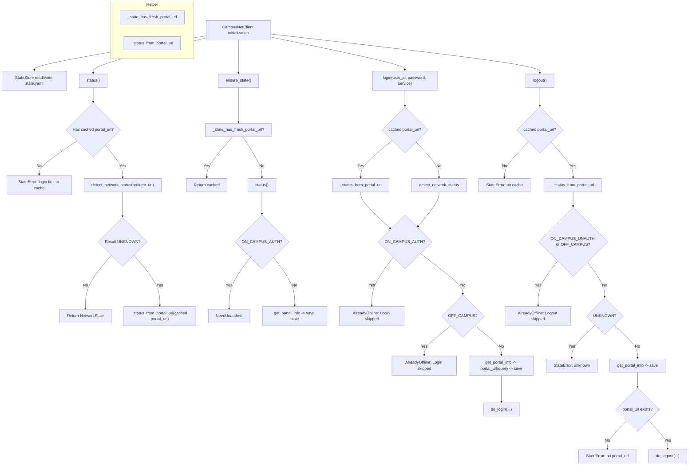

# cnc


[](https://www.python.org)
[](https://github.com/ermengchao/cnc/main/LICENSE)
[](https://github.com/ermengchao/cnc/commits)
[](https://github.com/ermengchao/cnc)
[](https://github.com/ermengchao/cnc)

English | [简体中文](<https://github.com/ermengchao/cnc/blob/main/README.zh-CN.md>)

## Introduction

> `cnc` is a third-party campus network client for schools using Ruijie as the campus network provider. As a Python CLI tool, `cnc` is easy to install and lets you perform operations such as login, logout, status check, and keep-alive.

## Plan

- [x] :chart_with_upwards_trend: Add images
- [x] :pencil2: Add flowchart（Using `Mermaid`）
- [x] :iphone: Support `iOS Shortcut` 
- [x] :rocket: Support multiple ISP
- [x] :school: Support multiple places(dormitory, classroom, etc.)
- [x] :hammer: Upload to `PyPI`
- [ ] :beer: Upload to `Homebrew`
- [ ] :eyes: Add graphical user interface（maybe `Next.js` or `Gradio`）
- [ ] :file_folder: Package into a container

## Install

- Pip
```shell
pip install cnc-cli
```

- Source Code
  1. Clone this repository

  ```shell
  git clone https://github.com/ermengchao/cnc . && cd cnc
  ```

  2. Install the `cnc` package

  ```shell
  pip install -e .
  ```

## Usage

:exclamation::exclamation: Before first usage, please run

```python
cnc login
```

to create the cache. Cache example:

```yaml
portal_url: http://10.254.241.19
updated_at: 1766905991
```

- portal_url: Portal URL for authentication (varies by school)
- updated_at: Cache creation time

If the cache is not created properly, all commands except `login` may be limited.

After the cache is created, you can use `cnc` normally. Supported operations:

- [login](#login): Log in to campus network
- [logout](#logout): Log out of campus network
- [status](#status): Check campus network status
- [keep-alive](#keep-alive): Keep login alive via a persistent script (recommended with `systemd`)
- [help](#help): Show usage help

### login

Use:

```shell
cnc login --user-id 2023083061 --password ****** --service 电信
```

Input:

- `user-id`: Campus network account. You can also set `CNC_USER_ID`
- `password`: Campus network password. You can also set `CNC_PASSWORD`
- `service`: ISP. You can also set `CNC_SERVICE`

Output:

- `Login successful`: Login succeeded
- `Already online. Login skipped.`: Already online, login skipped
- `You appear to be offline. Login skipped.`: Not connected to campus network
- `Login failed: <error>`: Login failed with server error
- `State is missing/expired but you appear to be already authenticated...`: Cache missing

### logout

Use:

```shell
cnc logout
```

Input:

- None (uses cached `portal_url`)

Output:

- `Logged out successfully`: Logout succeeded
- `Already offline. Logout skipped.`: Already offline, logout skipped
- `Logout failed: <error>`: Logout failed with server error
- `No cached portal_url found. Please run `cnc login` once to initialize the cache before using other commands.`: Cache missing

### status

Use:

```shell
cnc status
```

Input:

- None (uses cached `portal_url`)

Output:

- `Status: on_campus_unauth`: On campus but unauthenticated
- `Status: on_campus_auth`: On campus and authenticated
- `Status: off_campus`: Off campus
- `Status: unknown`: Status unknown
- `No cached portal_url found. Please run `cnc login` once to initialize the cache before using other commands.`: Cache missing

### keep-alive

Use (polling mode, default):

```shell
cnc keep-alive --polling --interval-seconds 300
```

Use (daily relogin mode):

```shell
cnc keep-alive --relogin --user-id 2023083061 --password ****** --service 电信 --run-at 05:00
```

Input:

- `--polling` or `--relogin` (choose one)
- `--interval-seconds`: Polling interval in seconds (polling mode only, default `300`)
- `--user-id`, `--password`, `--service`: Relogin mode only (can also use `CNC_USER_ID`, `CNC_PASSWORD`, `CNC_SERVICE`)
- `--run-at`: Daily relogin time (relogin mode only, `HH:MM`, default `05:00`)

Output:

- `Choose only one mode: --polling or --relogin`: Mode conflict
- `relogin mode requires --user-id, --password, and --service`: Missing relogin args
- `Keep-alive failed: <error>`: Keep-alive failed
- `No cached portal_url found. Please run `cnc login` once to initialize the cache before using other commands.`: Cache missing

### help

Use:

```shell
cnc help
cnc help login
```

Input:

- Optional subcommand name

Output:

- Prints CLI help text

## Process



## Principles

> Optional. If you are interested, you can refer to the steps below. If you run into any issues, feel free to open an [issue](<https://github.com/ermengchao/cnc/issues>)!

### Login principle

Login is essentially a `POST` request to `http://{portal_url}/eportal/Interface.do?method=login`, with the following fields:

```shell
# Header
-H 'Content-Type: application/x-www-form-urlencoded; charset=UTF-8' \

# Body
# User info
--data-urlencode "userId=$userId" \
--data-urlencode "password=$password" \
--data-urlencode "service=$service" \
--data-urlencode "queryString=$queryString" \
# Placeholder fields
--data-urlencode 'operatorPwd=' \
--data-urlencode 'operatorUserId=' \
--data-urlencode 'validcode=' \
--data-urlencode 'passwordEncrypt=false'
```

### Logout principle

Logout is essentially a `POST` request to `http://{portal_url}/eportal/Interface.do?method=logout`. Unlike login, logout does not require a request body.

### Status principle

Status is essentially a `GET` request to `http://{portal_url}/eportal/redirectortosuccess.jsp`, and you can determine the state by checking the `Location` header:

- Authenticated: `Location=http://{portal_url}/eportal/./success.jsp`
- Unauthenticated: `Location=http://123.123.123.123/`
- Off campus: request timeout

## LICENSE

[MIT LICENSE](<https://github.com/Chaoermeng/cuit-campus-network/blob/main/LICENSE>)
