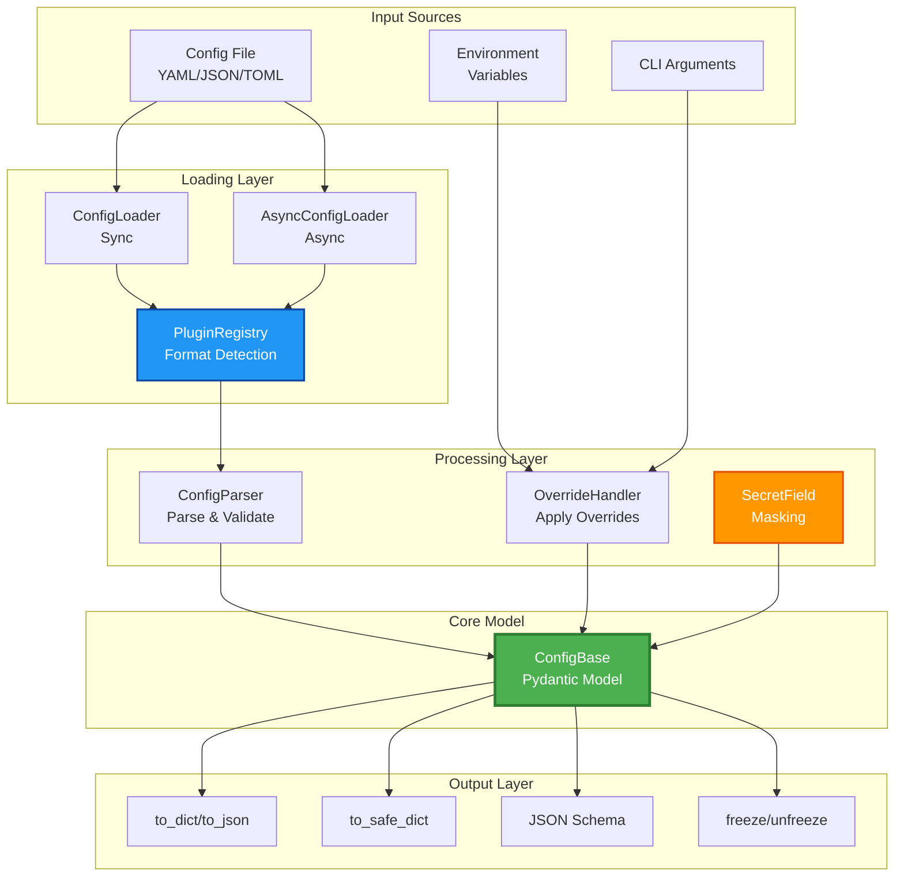

# Architecture Documentation

This document describes the internal architecture of **confee**, a Hydra-style configuration management library with Pydantic v2 type safety.

---

## 🏗️ System Overview

confee is designed around a **plugin-based architecture** with clean separation between:
- **Configuration modeling** (Pydantic v2 validation)
- **File loading** (sync/async, multi-format)
- **Override handling** (CLI args, environment variables)
- **Security** (secret masking, immutability)

---

## 📊 Data Flow Diagram



---

## 🧩 Component Architecture

### 1. ConfigBase (`config.py`)
**Purpose**: Core Pydantic model with immutability and secret management

**Responsibilities**:
- Pydantic v2 BaseModel with additional features
- Freeze/unfreeze mechanism for runtime immutability
- Secret field masking for sensitive data
- Dictionary/JSON conversion utilities
- Schema generation

**Key Methods**:
```python
class ConfigBase(BaseModel):
    @classmethod
    def load(cls, config_file, **kwargs) -> Self
    def freeze() -> Self
    def unfreeze() -> Self
    def to_safe_dict(mask="***MASKED***") -> dict
    def to_json_schema() -> dict
```

**Design Pattern**: Active Record + Builder
- Combines data model with loading logic
- Method chaining for freeze/unfreeze

---

### 2. ConfigLoader (`loaders.py`)
**Purpose**: Synchronous file loading with format auto-detection

**Responsibilities**:
- Load config from local files or remote URLs
- Auto-detect format from file extension
- Support YAML, JSON, TOML via plugins
- Handle file references (`@file:`, `@config:`)

**Key Functions**:
```python
class ConfigLoader:
    @staticmethod
    def load(path: str | Path) -> dict

    @staticmethod
    def load_remote(url: str, timeout: int) -> dict

    @staticmethod
    def _detect_format(path: str) -> str
```

**Design Pattern**: Static Factory
- No instance state required
- Format detection via plugin registry

---

### 3. AsyncConfigLoader (`async_loader.py`)
**Purpose**: Asynchronous file loading with file watching

**Responsibilities**:
- Async file I/O for remote configs
- File watching for hot-reload
- Same format detection as sync loader

**Key Functions**:
```python
class AsyncConfigLoader:
    @staticmethod
    async def load_remote(url: str, timeout: int) -> dict

    @staticmethod
    async def watch_file(path: str, callback: Callable)
```

**Design Pattern**: Observer (for file watching)
- Monitors file changes
- Triggers callbacks on modification

---

### 4. PluginRegistry (`plugins.py`)
**Purpose**: Extensible format loader registration

**Responsibilities**:
- Register custom format loaders
- Default loaders for YAML/JSON/TOML
- Format detection from file extensions

**Usage**:
```python
@PluginRegistry.loader(".ini")
def load_ini(path: str) -> dict:
    # Custom loader implementation
    ...
```

**Design Pattern**: Registry + Strategy
- Loaders registered by file extension
- Strategy pattern for different formats

---

### 5. OverrideHandler (`overrides.py`)
**Purpose**: Apply CLI args and environment variables

**Responsibilities**:
- Parse CLI arguments (`key=value`, `nested.key=value`)
- Parse environment variables (`PREFIX_KEY`, `PREFIX_NESTED__KEY`)
- Merge overrides with priority (CLI > env > file)
- Type coercion (string → bool/int/float)

**Key Functions**:
```python
class OverrideHandler:
    def apply_overrides(base_dict: dict, overrides: list[str]) -> dict
    def from_env(prefix: str) -> dict
    def _parse_dotted_key(key: str, value: Any, target: dict)
```

**Design Pattern**: Command
- Encapsulates override operations
- Supports undo (not currently implemented)

---

### 6. SecretField (`config.py`)
**Purpose**: Mark and mask sensitive configuration values

**Responsibilities**:
- Field marker for sensitive data
- Masking in `to_safe_dict()` / `to_safe_json()`
- Direct access still works (for app logic)

**Implementation**:
```python
def SecretField(default: Any = ..., **kwargs) -> Any:
    """Mark a field as secret for masking in outputs."""
    return Field(default, json_schema_extra={"secret": True}, **kwargs)
```

**Design Pattern**: Decorator (field-level)
- Adds metadata to Pydantic fields
- Processed during serialization

---

### 7. ConfigParser (`parser.py`)
**Purpose**: Parse and merge configuration sources

**Responsibilities**:
- Combine file, env, CLI sources
- Respect priority order
- Validate against Pydantic schema

**Design Pattern**: Facade
- Simplifies complex multi-source loading
- Single interface for all config sources

---

### 8. Error Formatters (`error_formatter.py`, `help_formatter.py`)
**Purpose**: User-friendly error messages and help generation

**Responsibilities**:
- Format Pydantic validation errors
- Generate CLI help from config schema
- Colorized terminal output

**Design Pattern**: Template Method
- Base formatting logic
- Customizable templates

---

## 🔐 Security Architecture

### Secret Masking
```
User Config → SecretField Marker → to_safe_dict() → ***MASKED***
                                 → Direct Access  → Actual Value
```

**Key Points**:
- Secrets masked only in serialization
- Direct attribute access returns real value
- Custom mask strings supported

### Immutability (Freeze)
```python
# Implementation using class-level set
_frozen_instances: ClassVar[Set[int]] = set()

def __setattr__(self, name: str, value: Any):
    if id(self) in ConfigBase._frozen_instances:
        raise AttributeError("Cannot modify frozen configuration")
    super().__setattr__(name, value)
```

**Trade-offs**:
- ✅ Simple implementation
- ⚠️ Memory: Uses `Set[int]`, should use `WeakSet` for GC safety

---

## 🔌 Plugin System

### Format Loader Plugin
```python
@PluginRegistry.loader(".custom")
def load_custom(file_path: str) -> dict:
    # Parse custom format
    return parsed_dict
```

**Execution Flow**:
1. User calls `ConfigBase.load("config.custom")`
2. Loader detects `.custom` extension
3. Registry looks up custom loader
4. Loader returns parsed dictionary
5. Pydantic validates against schema

---

## 📁 File Organization

```
src/confee/
├── __init__.py          # Public API exports
├── config.py            # ConfigBase, SecretField (459 lines)
├── loaders.py           # Sync loading (433 lines)
├── async_loader.py      # Async loading (334 lines)
├── overrides.py         # CLI/env overrides (186 lines)
├── parser.py            # Config parsing (54 lines)
├── plugins.py           # Plugin registry (414 lines)
├── schema.py            # JSON schema generation (94 lines)
├── colors.py            # Terminal colors (88 lines)
├── help_formatter.py    # CLI help (168 lines)
└── error_formatter.py   # Error messages (98 lines)
```

**Total**: ~2,300 lines (excluding tests)

---

## 🎯 Design Decisions

### 1. Pydantic v2 as Foundation
**Rationale**:
- Built-in type validation
- JSON schema generation
- IDE autocomplete support
- Large ecosystem

**Trade-off**: Tight coupling to Pydantic

---

### 2. Plugin-Based Loaders
**Rationale**:
- Extensibility for custom formats
- Lazy loading of optional dependencies
- Clean separation of concerns

**Alternative Considered**: Hard-coded loaders
- ❌ Not extensible
- ❌ Forces all dependencies to be installed

---

### 3. Class-Level Freeze Tracking
**Rationale**:
- Simple implementation
- Per-instance freeze state
- No modification of Pydantic internals

**Known Issue**: Memory leak risk (uses `Set[int]` instead of `WeakSet`)
- **TODO**: Migrate to `WeakSet[ConfigBase]` for GC safety

---

### 4. Override Priority: CLI > Env > File
**Rationale**:
- Follows 12-factor app principles
- CLI provides highest flexibility
- Environment for deployment config
- File for defaults

**Alternative Considered**: User-configurable priority
- ❌ Adds complexity
- ❌ Violates principle of least surprise

---

## 🚧 Known Limitations

### 1. Format Detection Duplication
**Issue**: `_detect_format()` duplicated in `loaders.py` and `async_loader.py`

**Fix**: Extract to shared utility module

---

### 2. OverrideHandler Uses `SystemExit`
**Issue**: Calls `sys.exit(1)` instead of raising exceptions

**Impact**: Hard to test, breaks library conventions

**Fix**: Raise custom exceptions instead

---

### 3. Freeze Implementation Memory Safety
**Issue**: `_frozen_instances: Set[int]` doesn't allow GC

**Fix**: Use `WeakSet` for automatic cleanup

---

## 🔄 Extension Points

### 1. Custom Format Loaders
```python
from confee import PluginRegistry

@PluginRegistry.loader(".xml")
def load_xml(path: str) -> dict:
    import xml.etree.ElementTree as ET
    # Parse XML to dict
    ...
```

### 2. Custom Validators
```python
class AppConfig(ConfigBase):
    @model_validator(mode='after')
    def check_production(self) -> Self:
        if self.environment == 'production' and self.debug:
            raise ValueError('Debug must be disabled in production')
        return self
```

### 3. Custom Secret Masking
```python
config.to_safe_dict(mask="[REDACTED]")
config.to_safe_json(mask="<SECRET>")
```

---

## 📚 References

- **Pydantic v2 Docs**: https://docs.pydantic.dev/latest/
- **12-Factor App**: https://12factor.net/config
- **Hydra**: https://hydra.cc/ (inspiration)

---

## 🛠️ Future Architecture Improvements

### Phase 1: Code Quality
1. ✅ Eliminate format detection duplication
2. ✅ Replace `SystemExit` with exceptions
3. ✅ Migrate to `WeakSet` for freeze tracking

### Phase 2: Features
1. Config diff and merge utilities
2. Config versioning support
3. Hot-reload for long-running processes

### Phase 3: Performance
1. Lazy config loading
2. Config caching layer
3. Async-first API

---

**Last Updated**: January 2026
**Version**: 0.0.dev
**Maintainer**: JunSeok Kim (@bestend)
