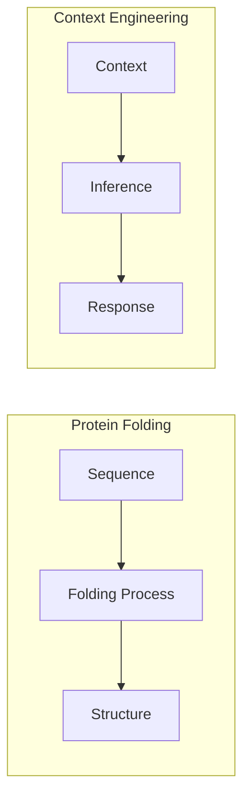

# Type-Safe Context Engineering

ContextFS is built on theoretical foundations from the paper **"Type-Safe Context Engineering: Lessons from Protein Folding for Building Reliable AI Systems"** by Matthew Long and The YonedaAI Collaboration.

## The Central Insight

> Just as protein sequences uniquely determine native structures under Anfinsen's thermodynamic hypothesis, well-designed context should uniquely constrain model responses.

This insight from computational biology provides a principled framework for understanding when AI prompting succeeds and when it fails.

## Context as Type

In type theory, a **type** specifies the set of valid values. A **term** is a value that inhabits a type.

We can view context engineering through this lens:

| Type Theory | Context Engineering |
|-------------|---------------------|
| Type | Context (prompt, examples, constraints) |
| Term | Response |
| Type inhabitation | Valid response generation |
| Type error | Invalid/unexpected response |

### Type-Safe Context

Context is **type-safe** when it uniquely determines the class of valid responses:

```python
# Type-safe: constraints fully specify valid response structure
context = """
Return a JSON object with exactly these fields:
- "approved": boolean
- "issues": list of strings
- "summary": string under 100 chars

Review this code: {code}
"""
```

### Type-Unsafe Context

Context is **type-unsafe** when it's ambiguous or underdetermined:

```python
# Type-unsafe: many valid interpretations
context = "Review the code"
# Could mean: security review, style review, performance review...
```

## The Protein Folding Analogy

### Anfinsen's Dogma

Christian Anfinsen won the 1972 Nobel Prize for demonstrating that a protein's amino acid sequence uniquely determines its 3D structure. The sequence is the "type" and the structure is the "canonical term."

### AlphaFold's Success

AlphaFold solved protein folding not by learning physics, but by learning efficient **proof search** over the constraint space defined by sequences. It succeeds because protein folding is **type-safe**—the sequence fully determines the structure.

### Application to AI

The same principle applies to AI systems:



When context fully constrains valid responses (type-safe), inference reliably produces correct outputs.

## Failure Mode Taxonomy

### 1. Underdetermined (Type Too Broad)

Context doesn't constrain the response space sufficiently:

```python
# Problem: ambiguous
prompt = "Write code"

# Fix: specify language, purpose, constraints
prompt = """
Write a Python function that:
- Takes a list of integers
- Returns the sum of even numbers
- Handles empty lists by returning 0
"""
```

### 2. Overdetermined (Contradictory Constraints)

Context contains conflicting requirements:

```python
# Problem: contradictory
prompt = """
Write a response that is:
- Under 50 words
- Covers all aspects of the topic in detail
"""

# Fix: resolve contradiction
prompt = """
Write a brief 50-word summary of the key point.
"""
```

### 3. Mismatched Types

Output structure doesn't match input constraints:

```python
# Problem: format mismatch
prompt = "Analyze this data and return your findings"

# Fix: specify output type
prompt = """
Analyze this data and return a JSON object:
{
  "findings": [string],
  "recommendations": [string],
  "confidence": float 0-1
}
"""
```

## Design Principles

### Principle 1: Explicit Type Signatures

Always specify the expected output structure:

```python
from pydantic import BaseModel

class CodeReview(BaseModel):
    approved: bool
    issues: list[str]
    suggestions: list[str]
    summary: str

# Use with TypeSafe Context library
result = agent.run(task="Review: {code}", response_type=CodeReview)
```

### Principle 2: Constraint Completeness

Ensure constraints fully determine valid responses:

```python
# Incomplete
"Summarize the document"

# Complete
"Summarize the document in 3 bullet points, each under 20 words, focusing on actionable insights"
```

### Principle 3: Progressive Refinement

Start with broad types and refine:

```python
# Step 1: Rough outline
outline = agent.run("Outline the solution", response_type=Outline)

# Step 2: Detailed implementation per section
for section in outline.sections:
    details = agent.run(f"Implement: {section}", response_type=Implementation)
```

### Principle 4: Chaperone Systems

Use validation and retry mechanisms (inspired by molecular chaperones):

```python
@retry(max_attempts=3)
def get_validated_response(prompt, response_type):
    response = model.generate(prompt)
    validated = response_type.model_validate_json(response)
    return validated
```

## Connection to ContextFS

ContextFS implements these principles:

### Typed Memories

Memories are categorized by type for better retrieval:

```python
ctx.save(
    content="Use JWT for authentication",
    type=MemoryType.DECISION,  # Explicit type
    tags=["auth"]
)
```

### Semantic Type Matching

Search finds memories by semantic similarity—matching the "meaning type":

```python
# Finds authentication decisions even with different wording
results = ctx.search("how do we handle user login?")
```

### Context Composition

ContextFS helps compose well-typed context:

```python
# Get relevant prior decisions
context = ctx.get_context_for_task("Implement OAuth")

# Context now includes typed memories that constrain the response space
prompt = f"""
Prior decisions:
{context}

Task: Implement OAuth login following our established patterns.
"""
```

## Further Reading

- [Full Paper (PDF)](https://github.com/MagnetonIO/typesafe-context/tree/main/paper/pdf)
- [TypeSafe Context Library](https://github.com/MagnetonIO/typesafe-context)
- [Theoretical Foundations](theory.md)
