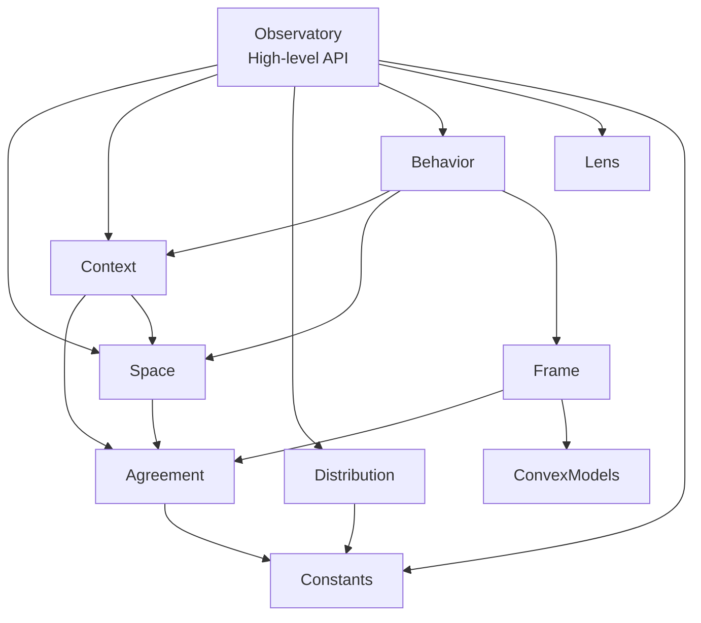

# Contrakit API Reference

**A Python library for mathematical modeling of observational contradictions and multi-perspective analysis.** Put differently, it's about understanding disagreement.

This API reference provides detailed documentation for each module in the `contrakit` library, including usage patterns, architecture notes, and entry points for both casual users and advanced integrators.

## Quick Start

```python
from contrakit import Observatory

# Create a simple observational system
obs = Observatory.create(symbols=["Yes", "No"])
voter = obs.concept("Voter")
obs.perspectives[voter] = {"Yes": 0.6, "No": 0.4}
behavior = obs.perspectives.to_behavior()
print(f"Agreement: {behavior.agreement.result:.3f}")
```

**Need help?** [Open an issue](https://github.com/off-by-some/contrakit/issues) or [start a discussion](https://github.com/off-by-some/contrakit/discussions).

## How to Use This API

Not sure where to begin? Start with [`observatory.py`](observatory.md)—it wraps core components in a more intuitive interface. Power users can work directly with lower-level modules following the dependency chain below.

### Module Dependency Flow



## Core Modules

## `space.py` – Defining what can be measured
Foundation for observable spaces and measurement schemas. Defines observables, alphabets, and provides algebraic operations for composing/restricting spaces.

## `distribution.py` – Immutable probability containers
Core data structure for probability mass functions. Optimized for constant-time lookups, safe convex operations, and includes validation/mixing metrics.

## `context.py` – Measurement contexts & relationships
Defines subsets of observables measured together. Provides set operations and assignment restriction algorithms for different experimental setups.

## `behavior.py` – Multi-perspective analysis
Represents collections of probability distributions across contexts. Analyzes consistency, detects contradictions, and quantifies information cost.

## `convex_models.py` – Optimization solvers
High-level convex optimization programs using CVXPY. Computes agreement coefficients and finds optimal global distributions for contradiction analysis.

## 🔭 `observatory.py` – High-level fluent API
User-friendly interface for constructing behaviors. Provides fluent methods for defining concepts, assigning distributions, and includes lens system for viewpoint modeling. Consider this your main entry point.


## Additional Resources

* **[Quickstart Examples](../../../examples/)** — Practical examples demonstrating each module
* **[Mathematical Theory Paper](../../docs/paper/A%20Mathematical%20Theory%20of%20Contradiction.pdf)** — Formal foundations and theoretical background
* **[Main README](../../../README.md)** — Project overview and installation instructions

---

Check out the [Quickstart Examples](../../../examples/) or dive into [`observatory.py`](observatory.md) to model your first behavior.
