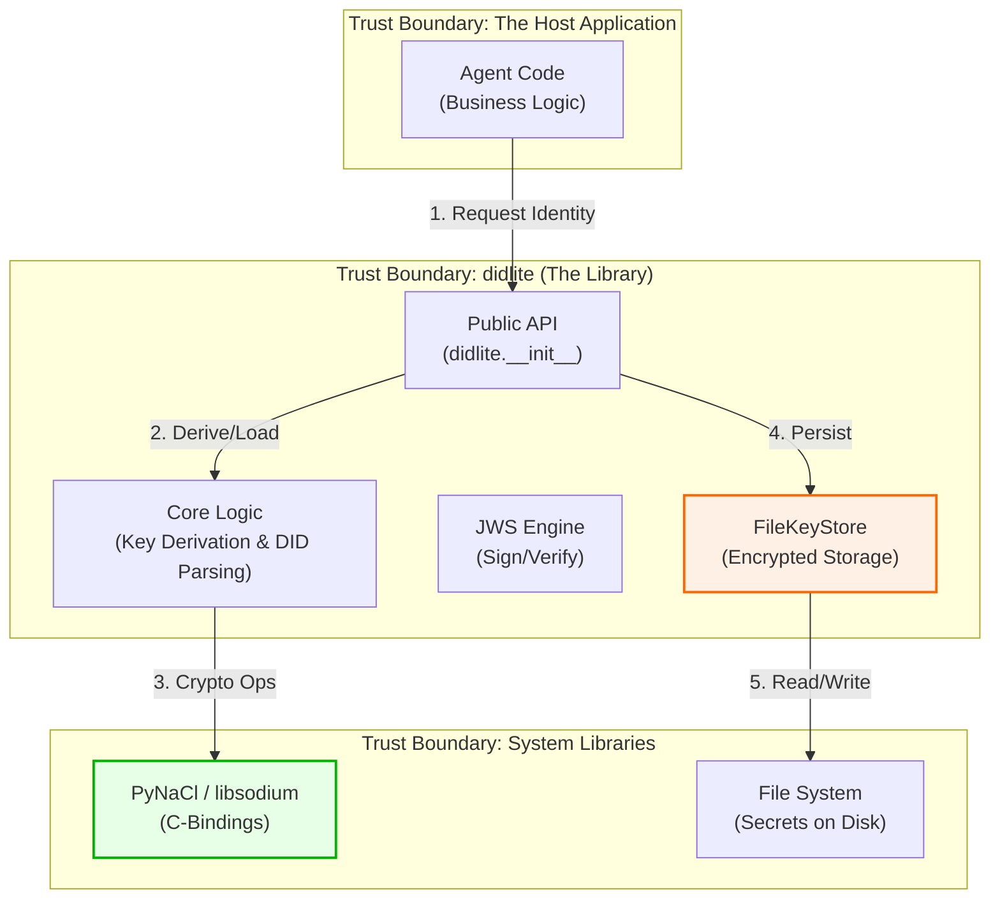

Diagram A: Component Architecture & Trust Boundaries
This diagram shows that didlite is a self-contained "Crypto Enclave" that relies on pynacl (libsodium) for the heavy lifting.

```mermaid
graph TD
    subgraph "Trust Boundary: The Host Application"
        Agent["Agent Code<br/>(Business Logic)"]
    end

    subgraph "Trust Boundary: didlite (The Library)"
        API["Public API<br/>(didlite.__init__)"]
        Core["Core Logic<br/>(Key Derivation & DID Parsing)"]
        JWS["JWS Engine<br/>(Sign/Verify)"]
        Store["FileKeyStore<br/>(Encrypted Storage)"]
    end

    subgraph "Trust Boundary: System Libraries"
        NaCl["PyNaCl / libsodium<br/>(C-Bindings)"]
        FS["File System<br/>(Secrets on Disk)"]
    end

    %% Flows
    Agent -->|1. Request Identity| API
    API -->|2. Derive/Load| Core
    Core -->|3. Crypto Ops| NaCl
    API -->|4. Persist| Store
    Store -->|5. Read/Write| FS
    
    %% Security Notes
    style NaCl fill:#e6ffe6,stroke:#00b300,stroke-width:2px
    style Store fill:#fff0e6,stroke:#ff6600,stroke-width:2px
```