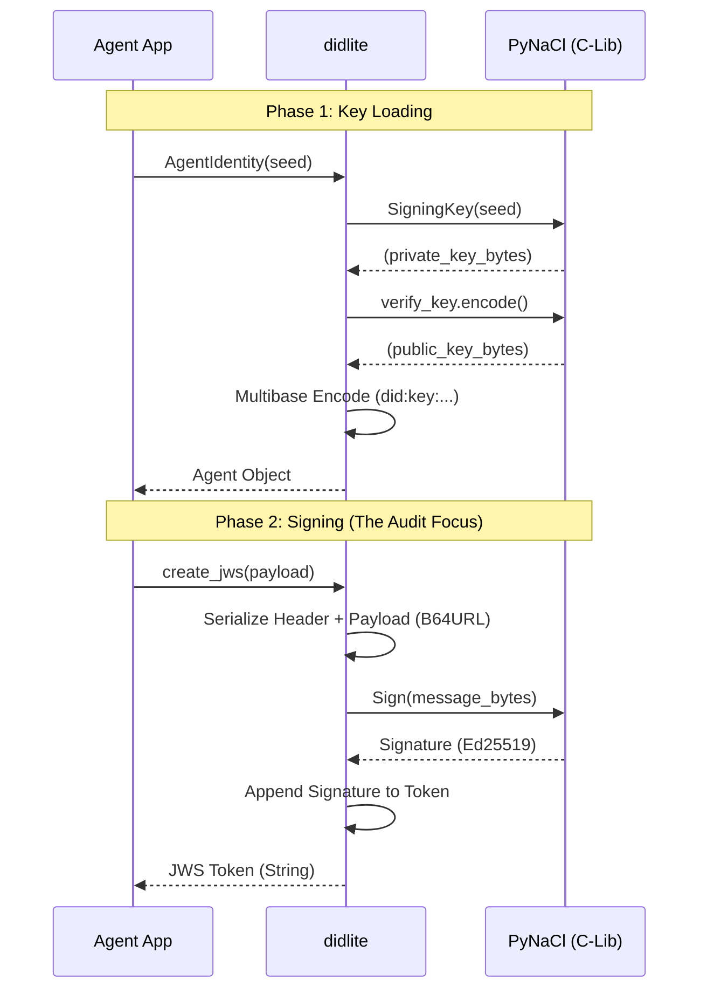

Diagram B: The JWS Signing Flow (Data Integrity)
We are using existing crypto utilities

```mermaid
sequenceDiagram
    participant App as Agent App
    participant Lite as didlite
    participant Lib as PyNaCl (C-Lib)

    Note over App, Lib: Phase 1: Key Loading
    App->>Lite: AgentIdentity(seed)
    Lite->>Lib: SigningKey(seed)
    Lib-->>Lite: (private_key_bytes)
    Lite->>Lib: verify_key.encode()
    Lib-->>Lite: (public_key_bytes)
    Lite->>Lite: Multibase Encode (did:key:...)
    Lite-->>App: Agent Object

    Note over App, Lib: Phase 2: Signing (The Audit Focus)
    App->>Lite: create_jws(payload)
    Lite->>Lite: Serialize Header + Payload (B64URL)
    Lite->>Lib: Sign(message_bytes)
    Lib-->>Lite: Signature (Ed25519)
    Lite->>Lite: Append Signature to Token
    Lite-->>App: JWS Token (String)
```