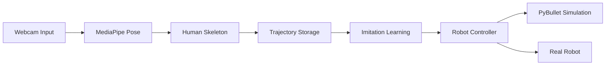
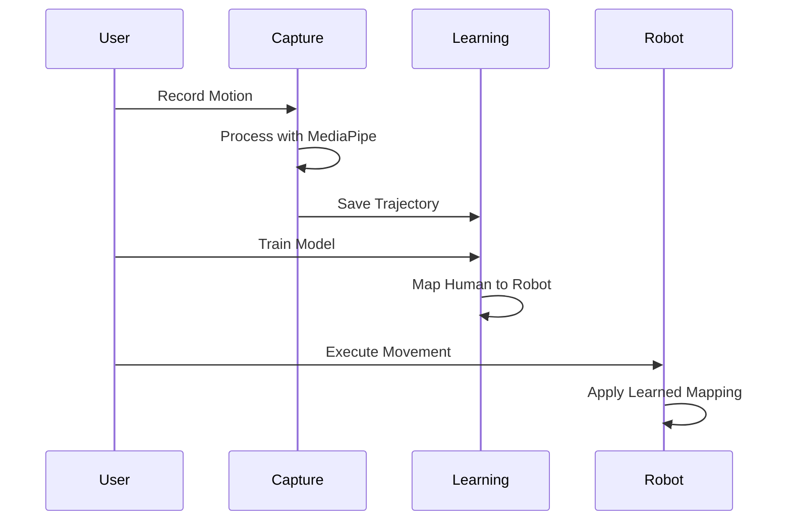

<div align="center">


# DifoTrain

### Human to Robot Motion Transfer

[](https://www.python.org/downloads/)
[](LICENSE)
[](https://github.com/psf/black)

</div>

---

## Overview

DifoTrain is a comprehensive pipeline designed to capture human motion through webcam input, learn intelligent mappings to robot joint configurations, and control robotic systems to authentically imitate human movements in both simulated and real-world environments.

## Features

<table>
<tr>
<td width="50%">

**Motion Capture**

Real-time human pose estimation using Google MediaPipe Pose Landmarker for accurate motion tracking.

</td>
<td width="50%">

**Representation**

Standardized skeleton representation for human and robot states, enabling seamless data transfer.

</td>
</tr>
<tr>
<td width="50%">

**Learning**

Imitation learning module using PyTorch to map human joint positions and angles to robot commands.

</td>
<td width="50%">

**Control**

Robot controller integration with comprehensive PyBullet simulation support.

</td>
</tr>
</table>

## Installation

This project uses `uv` for dependency management, but standard `pip` works as well.

### Prerequisites

- Python 3.13 or higher
- Webcam for motion recording

### Setup

#### Step 1: Install Dependencies

Using `uv` (Recommended):

```bash
uv sync
```

Using `pip`:

```bash
pip install -r requirements.txt
```

Direct installation:

```bash
pip install mediapipe opencv-python numpy torch
```

#### Step 2: Download MediaPipe Model

The system requires the `pose_landmarker_lite.task` model file. Run the setup script to download it automatically:

```bash
python setup_mediapipe.py
```

## Usage

### 1. Record Human Motion

Capture motion from your webcam. This saves a trajectory file to `storage/human_trajectory.json`.

```bash
python main.py record
```

> Press `q` to stop recording.

### 2. Generate Dummy Data (Optional)

If you don't have a webcam, you can generate synthetic test data:

```bash
python -m tests.generate_dummy_data
```

### 3. Train Imitation Model

Train a neural network to map human states to robot actions using the recorded data.

```bash
python -m learning.imitation
```

### 4. Run Robot Controller

Execute the robot controller to perform the trajectory using retargeting and the learned model.

```bash
python -m robot.controller
```

## Project Structure

```
difotrain/
├── capture/           # Modules for webcam capture and MediaPipe processing
├── representation/    # Data structures for Skeleton and Trajectory states
├── storage/          # JSON storage for recorded movements
├── learning/         # PyTorch models for imitation learning
├── robot/            # Robot control interfaces
├── simulation/       # PyBullet simulation environments
└── tests/            # Unit tests and data generators
```

## Architecture



## Workflow



## Technologies

- **MediaPipe**: Human pose estimation and landmark detection
- **PyTorch**: Neural network training and inference
- **OpenCV**: Video capture and image processing
- **PyBullet**: Physics simulation and robot control
- **NumPy**: Numerical computing and array operations

## Contributing

Contributions are welcome. Please feel free to submit a Pull Request.

## License

This project is licensed under the MIT License - see the LICENSE file for details.

## Acknowledgments

- Google MediaPipe team for the pose estimation models
- PyBullet community for the simulation framework
- PyTorch team for the deep learning framework

---

<div align="center">

Made with dedication to advancing human-robot interaction

</div>
