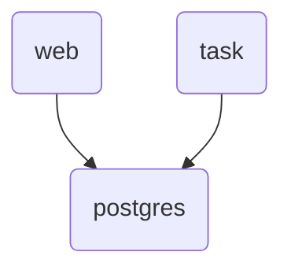

## Design Notes

Many of the specific choices made in the dispatcherd design are to enable pg_notify use.
The advantage of using pg_notify is that you get an extremely simple topology.
Imagine a web and a task runner service, invoked separately, using postgres.



However, pg_notify is not a true queue, and this drives the design of the dispatcherd,
having its main process listening for messages and farming the work out to worker subprocesses.

This helps with pg_notify use, but still doesn't solve all the problems,
because those problems ultimately need persistent storage.
Current plan is to offer a "stock" solution in the form of a django-ansible-base app.

https://github.com/ansible/django-ansible-base

End-goal features and design proposals have been moved to the issue queue.

### AWX dispatcher

This is directly taken from the AWX dispatcher.

https://github.com/ansible/awx/tree/devel/awx/main/dispatch

This was introduced in:

https://github.com/ansible/awx/pull/2266

> ...much like the callback receiver implementation in 3.3.0 (on which this code is based), this entry point is a kombu.ConsumerMixin.

### Kombu (Celery)

Kombu was used by AWX before its transition to a custom solution. Kombu is a sub-package of celery.

https://github.com/celery/kombu

In messaging module, this has a `Producer` and `Consumer` classes.
In mixins it has a `ConsumerMixin`. AWX dispatcher has consumer classes,
but no methods seem to have made it from kombu into AWX dispatch.

This doesn't deal with worker pool management. It does have examples with `Worker` classes.
These follow a similar contract with `process_task` here.

### AMQP

https://www.rabbitmq.com/tutorials/amqp-concepts

This protcol deals with publishers, exchanges, queues, and consumers.

### ProcessPoolExecutor

The python `ProcessPoolExecutor` uses both a single call queue and a single results queue.

https://github.com/python/cpython/blob/f1d33dbddd3496b062e1fbe024fb6d7b023a35f5/Lib/concurrent/futures/process.py#L217

Some things it does is not applicable to the dispatcher here, because it strives to adhere
to an existing contract around python futures that we do not care about.

The local worker thread has many commonalities to the results thread being used here.
It is most interesting to the the three-fold criteria for wakeups in that thread:

```python
result_item, is_broken, cause = self.wait_result_broken_or_wakeup()
```

By comparision, the results thread used here only has 1 condition.
In some shutdown or recycle cases, it may be canceled.

An important similarity is that the manager maintains an internal working queue.
This is also done in this library, and diverges from AWX practice.
In AWX dispatcher, a full queue may put messages into individual worker IPCs.
This caused bad results, like delaying tasks due to long-running jobs,
while the pool had many other workers free up in the mean time.

### Worker Task Cancelation Signals

Originally, the dispatcher library used **SIGTERM** to forcibly cancel a running task. However,
some user code (or third-party libraries) register custom SIGTERM handlers, which caused
collisions and made forcible timeouts/cancellations unreliable.

To avoid these conflicts, dispatcher now uses **SIGUSR1** for per-task cancelation. This means:

1. **Task**: When the dispatcher needs to cancel a running task (for example, due to a timeout),
   it sends SIGUSR1 to that worker subprocess instead of SIGTERM.

2. **Worker**: In the worker code (`WorkerSignalHandler`), the `SIGUSR1` handler raises
   `DispatcherCancel`, which immediately stops the current task’s execution path.

3. **Shutdown**: In contrast, a full worker shutdown typically uses SIGINT, or the main process can call terminate().
The SIGTERM signal isn't used by default for per-worker shutdown in current code.

#### Why SIGUSR1

SIGUSR1 is less commonly used by applications, so it’s less likely that user code
will override it (unlike SIGTERM). This ensures that the dispatcher’s forced cancel
mechanism remains reliable across a wide variety of user tasks, libraries, or Python
frameworks that might expect to intercept SIGTERM for graceful shutdown.

### Notable python tasking systems

https://taskiq-python.github.io/guide/architecture-overview.html#context

https://python-rq.org/docs/workers/

https://dramatiq.io/

https://docs.celeryq.dev/
