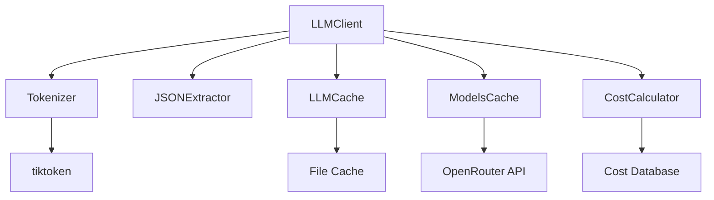
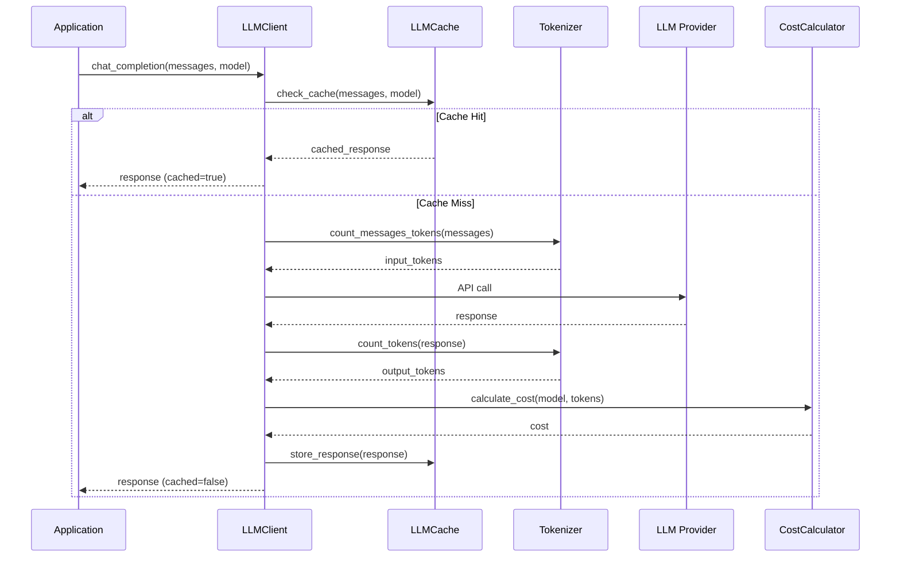
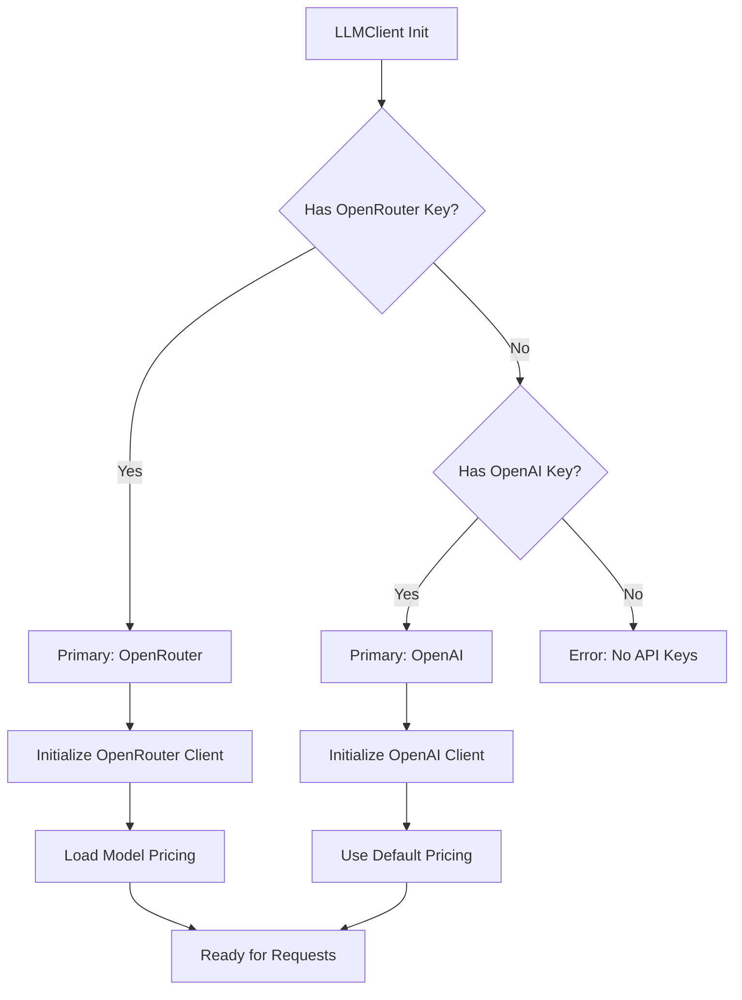
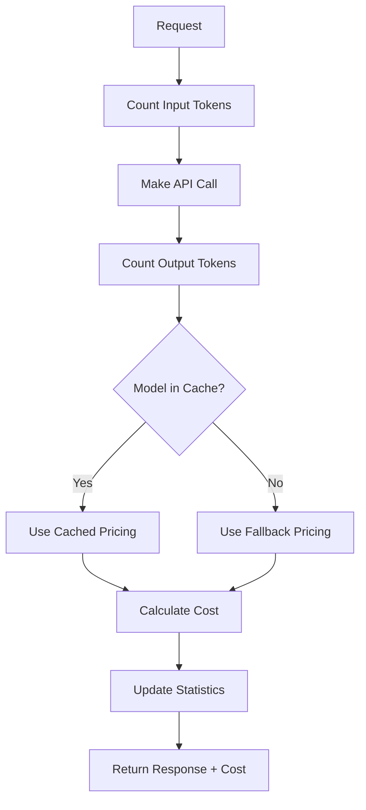

# 🧠 Django LLM Module

## Overview

**Django LLM** is a modular, type-safe LLM integration system for Django applications built with `django-cfg`. It provides multi-provider support, intelligent caching, cost tracking, and seamless integration with Django models.

**Key Features:**
- 🔄 Multi-provider support (OpenAI, OpenRouter)
- 💰 Automatic cost calculation and tracking
- 🚀 Intelligent caching with TTL
- 🔧 Type-safe configuration with Pydantic 2
- 📊 Token counting and usage analytics
- 🎯 JSON extraction utilities

---

## Modules

### Core Components

```
django_llm/
├── llm/
│   ├── client.py          # Main LLMClient class
│   ├── cache.py           # LLM response caching
│   ├── models_cache.py    # Model pricing cache
│   ├── costs.py           # Cost calculation utilities
│   ├── tokenizer.py       # Token counting utilities
│   └── extractor.py       # JSON extraction utilities
└── __init__.py            # Public API exports
```

### Architecture



---

## APIs

### LLMClient

**Primary interface for LLM operations**

```python
from django_cfg.modules.django_llm.llm.client import LLMClient

# Initialize with multiple API keys
client = LLMClient(
    apikey_openrouter="sk-or-v1-...",
    apikey_openai="sk-proj-...",
    cache_dir=Path("cache/llm"),
    cache_ttl=3600,
    max_cache_size=1000
)

# Chat completion
response = client.chat_completion(
    messages=[
        {"role": "user", "content": "Explain quantum computing"}
    ],
    model="openai/gpt-4o-mini"
)

# Generate embeddings
embedding = client.generate_embedding(
    text="Sample text for embedding",
    model="text-embedding-ada-002"
)

# Get client info
info = client.get_client_info()
```

### Cost Calculation

```python
from django_cfg.modules.django_llm.llm.costs import calculate_chat_cost

# Calculate cost for chat completion
cost = calculate_chat_cost(
    model="openai/gpt-4o-mini",
    input_tokens=100,
    output_tokens=50,
    models_cache=models_cache
)

# Estimate cost before API call
estimated = client.estimate_cost(
    model="openai/gpt-4o-mini",
    input_tokens=100,
    output_tokens=50
)
```

### Tokenizer

```python
from django_cfg.modules.django_llm.llm.tokenizer import Tokenizer

tokenizer = Tokenizer()

# Count tokens in text
count = tokenizer.count_tokens("Hello world", "gpt-4o-mini")

# Count tokens in messages
messages = [{"role": "user", "content": "Hello"}]
count = tokenizer.count_messages_tokens(messages, "gpt-4o-mini")
```

### JSON Extraction

```python
from django_cfg.modules.django_llm.llm.extractor import JSONExtractor

extractor = JSONExtractor()

# Extract JSON from LLM response
response_text = "Here's the data: {'name': 'John', 'age': 30}"
json_data = extractor.extract_json_from_response(response_text)
```

---

## Data Models

### LLMClient Configuration

```python
from typing import Optional, Dict, Any
from pathlib import Path

class LLMClientConfig:
    """LLM Client configuration"""
    
    def __init__(
        self,
        apikey_openrouter: Optional[str] = None,
        apikey_openai: Optional[str] = None,
        cache_dir: Optional[Path] = None,
        cache_ttl: int = 3600,
        max_cache_size: int = 1000,
        models_cache_ttl: int = 86400
    ):
        self.apikey_openrouter = apikey_openrouter
        self.apikey_openai = apikey_openai
        self.cache_dir = cache_dir or Path("cache/llm")
        self.cache_ttl = cache_ttl
        self.max_cache_size = max_cache_size
        self.models_cache_ttl = models_cache_ttl
```

### Response Models

```python
from typing import Dict, Any, List, Optional

class ChatResponse:
    """Chat completion response"""
    content: str
    usage: Dict[str, int]
    model: str
    cost: Optional[float]
    cached: bool

class EmbeddingResponse:
    """Embedding generation response"""
    embedding: List[float]
    usage: Dict[str, int]
    model: str
    cost: Optional[float]
    cached: bool
```

### Cost Models

```python
from decimal import Decimal

class ModelPricing:
    """Model pricing information"""
    input_cost_per_token: Decimal
    output_cost_per_token: Decimal
    embedding_cost_per_token: Optional[Decimal]
    context_length: int
    
class UsageStats:
    """Usage statistics"""
    total_requests: int
    total_tokens: int
    total_cost: Decimal
    cache_hits: int
    cache_misses: int
```

---

## Flows

### Chat Completion Flow



### Multi-Provider Selection



### Cost Calculation Flow



---

## Usage Examples

### Basic Setup

```python
# In Django settings (via django-cfg)
from django_cfg.modules.django_llm.llm.client import LLMClient
from api.environment import env

# Initialize client
llm_client = LLMClient(
    apikey_openrouter=env.api_keys.openrouter,
    apikey_openai=env.api_keys.openai
)
```

### Document Processing

```python
# In Dramatiq task
@dramatiq.actor(queue_name="knowledge")
def process_document_async(document_id: int):
    document = Document.objects.get(id=document_id)
    
    # Initialize LLM client
    llm_client = LLMClient(
        apikey_openrouter=env.api_keys.openrouter,
        apikey_openai=env.api_keys.openai
    )
    
    # Generate embeddings
    embedding_response = llm_client.generate_embedding(
        text=document.content,
        model="text-embedding-ada-002"
    )
    
    # Store embedding
    document.embedding = embedding_response['embedding']
    document.embedding_cost = embedding_response.get('cost', 0)
    document.save(update_fields=['embedding', 'embedding_cost'])
```

### Chat with Context

```python
def chat_with_context(user_query: str, context_docs: List[str]) -> str:
    llm_client = LLMClient(
        apikey_openrouter=env.api_keys.openrouter,
        apikey_openai=env.api_keys.openai
    )
    
    # Build context
    context = "\n".join(context_docs)
    
    messages = [
        {
            "role": "system", 
            "content": f"Answer based on this context:\n{context}"
        },
        {"role": "user", "content": user_query}
    ]
    
    response = llm_client.chat_completion(
        messages=messages,
        model="openai/gpt-4o-mini"
    )
    
    return response['content']
```

### Cost Monitoring

```python
def get_llm_usage_stats() -> Dict[str, Any]:
    llm_client = LLMClient(
        apikey_openrouter=env.api_keys.openrouter,
        apikey_openai=env.api_keys.openai
    )
    
    stats = llm_client.get_usage_stats()
    cache_info = llm_client.cache.get_cache_info()
    
    return {
        'total_requests': stats['total_requests'],
        'total_cost': float(stats['total_cost']),
        'cache_hit_rate': cache_info['hit_rate'],
        'models_used': stats['models_used']
    }
```

---

## Terms

**LLM Client**: Main interface for interacting with Large Language Models
**Provider**: External LLM service (OpenAI, OpenRouter, etc.)
**Token**: Smallest unit of text processing in LLMs
**Embedding**: Vector representation of text for semantic search
**Cache Hit**: Request served from local cache without API call
**Cost Calculation**: Automatic tracking of API usage costs
**Model Pricing**: Per-token costs for different LLM models
**Context Length**: Maximum tokens a model can process
**Usage Stats**: Aggregated metrics about LLM usage
**JSON Extraction**: Parsing structured data from LLM responses