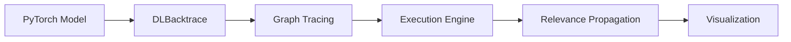

# PyTorch Backend Overview

DLBacktrace provides comprehensive support for PyTorch models through the **DLBacktrace** API.

---

## Architecture

The PyTorch backend is built on several key components:



### Components

1. **DLBacktrace**: Main entry point for PyTorch models
2. **Graph Builder**: Traces computational graph using `torch.export_for_training`
3. **Execution Engine**: Executes operations and tracks activations
4. **Relevance Propagation**: Calculates layer-wise relevance
5. **Visualization**: Generates graph visualizations

---

## Supported Models

### Vision Models

- **CNNs**: ResNet, VGG, DenseNet, EfficientNet, MobileNet
- **Vision Transformers**: ViT
- **Detection Models**: Custom detection architectures
- **Segmentation Models**: U-Net style architectures

### NLP Models

- **BERT Family**: BERT, RoBERTa, DistilBERT, ALBERT
- **LLaMA**: LLaMA-3.2-(1B, 3B), LLaMA-3.1-8B
- **Qwen**: Qwen3(from 0.6 B to 14B)
- **Custom Transformers**: Any transformer-based architecture

### Custom Models

Any PyTorch `nn.Module` that uses supported operations.

---

## Key Features

### 1. Dynamic Graph Tracing

Uses PyTorch's `torch.export` for robust graph capture:

```python
dlb = DLBacktrace(
    model=model,
    input_for_graph=(dummy_input,)
)
```

### 2. 100+ Supported Operations

- Linear layers, convolutions
- Pooling operations
- Activation functions
- Attention mechanisms
- Tensor manipulations
- And more...

### 3. Device Support

Seamless CPU and GPU support:
- Automatic device detection
- Mixed precision handling
- CUDA acceleration

---

## Next Steps

- [DLBacktrace API](dlbacktrace.md) - Detailed API reference
- [Execution Engines](execution-engines.md) - Understanding execution
- [Supported Operations](operations.md) - Full operation list
- [Model Tracing](tracing.md) - Graph tracing details
- [Examples](../../examples/colab-notebooks.md) - Interactive notebooks


