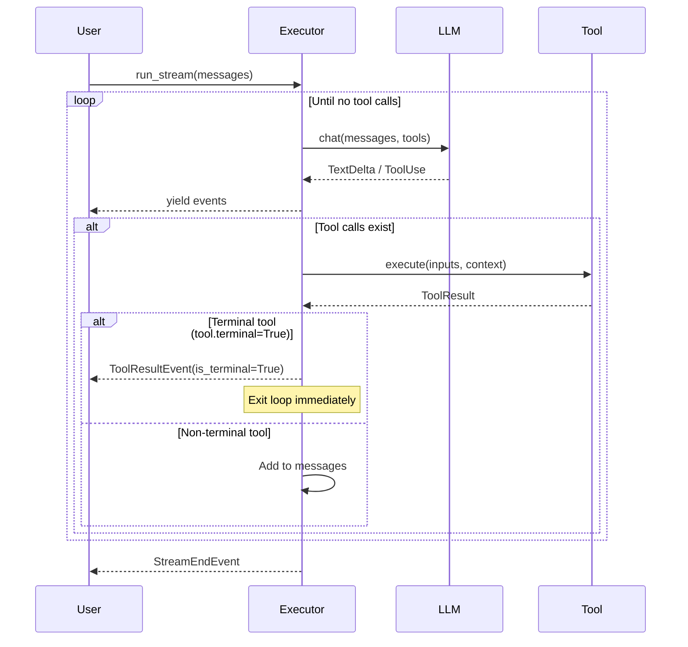

# AgentExecutor

`AgentExecutor` manages the agentic loop: send messages → LLM responds with tool calls → execute tools → repeat until done.

## Basic Usage

```python
from dobby import AgentExecutor, OpenAIProvider, Tool

executor = AgentExecutor(
    provider="openai",
    llm=OpenAIProvider(model="gpt-4o"),
    tools=[MyTool()],
)

async for event in executor.run_stream(messages, system_prompt="You are helpful."):
    match event.type:
        case "text-delta":
            print(event.delta, end="")
        case "tool-use":
            print(f"\n[Tool: {event.name}]")
```

---

## Initialization

```python
executor = AgentExecutor(
    provider="openai",           # "openai" | "azure-openai" | "anthropic"
    llm=provider,                # Provider instance
    tools=[Tool1(), Tool2()],    # Optional tools
    output_type=MyOutputModel,   # Optional structured output
    output_mode="tool",          # "tool" | "native"
)
```

| Parameter | Type | Description |
|-----------|------|-------------|
| `provider` | `str` | Provider name for schema formatting |
| `llm` | `OpenAIProvider` | LLM provider instance |
| `tools` | `list[Tool]` | Available tools |
| `output_type` | `type[BaseModel]` | Pydantic model for structured output |
| `output_mode` | `str` | How to get structured output |

### Accessing Registered Tools

```python
# Get all tools as dict[name, Tool]
executor.tools

# Get tool names
list(executor.tools.keys())  # ['search', 'fetch_data', ...]

# Get a specific tool
executor.tools['search']
```

---

## run_stream()

```python
async for event in executor.run_stream(
    messages,                    # Conversation history
    system_prompt="...",         # Optional system prompt
    context=my_context,          # Passed to Injected[T] tools
    max_iterations=10,           # Max tool call loops
    reasoning_effort="medium",   # For o1/o3 models
    approved_tool_calls=set(),   # Pre-approved tool call IDs
):
    ...
```

---

## Event Types

The executor yields all provider events plus tool events:

| Event | Description |
|-------|-------------|
| `StreamStartEvent` | Stream started |
| `TextDeltaEvent` | Text chunk |
| `ReasoningDeltaEvent` | Reasoning chunk |
| `ToolUseEvent` | Tool call from LLM |
| `ToolStreamEvent` | Progress from streaming tool |
| `ToolResultEvent` | Tool execution result (check `is_terminal` for terminal tools) |
| `ToolUseEndEvent` | Tool finished |
| `StreamEndEvent` | Stream/iteration finished |

> For terminal tools that exit the loop, see [Terminal Tools](./tools/creating-tools.md#terminal-tools).

---

## Agentic Loop



---

## Structured Output

Force LLM to return structured data:

```python
from pydantic import BaseModel

class WeatherResponse(BaseModel):
    city: str
    temperature: float
    conditions: str

executor = AgentExecutor(
    provider="openai",
    llm=provider,
    output_type=WeatherResponse,
    output_mode="tool",  # Uses tool call to get structured output
)

async for event in executor.run_stream(messages):
    if event.type == "stream-end":
        # Find the final_result tool call
        for part in event.parts:
            if isinstance(part, ToolUsePart) and part.name == "final_result":
                result = WeatherResponse(**part.inputs)
                print(result)
```

---

## Context Injection

Pass runtime context to tools:

```python
@dataclass
class AppContext:
    db: Database
    user_id: str

context = AppContext(db=db, user_id="123")

async for event in executor.run_stream(
    messages,
    context=context,
):
    ...
```

Tools receive context via `Injected[T]`:

```python
@dataclass
class DBTool(Tool):
    async def __call__(
        self,
        ctx: Injected[AppContext],
        query: str,
    ) -> list:
        return await ctx.db.query(query)
```

---

## Tool Approval

For sensitive tools, require pre-approval:

```python
async for event in executor.run_stream(
    messages,
    approved_tool_calls={"call_abc"},
):
    if event.type == "tool-use":
        if event.id not in approved_tool_calls:
            # Pause and ask user for approval
            pass
```
