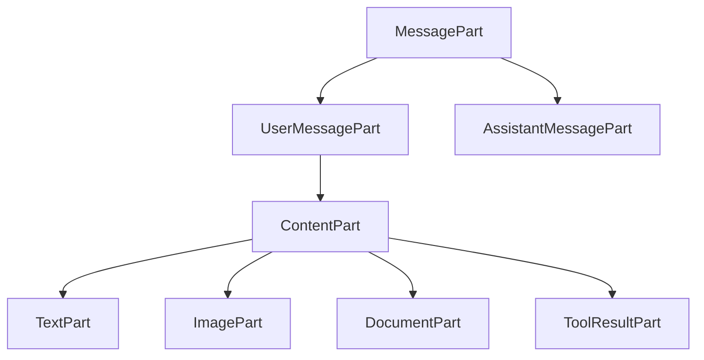

# Message Types

Dobby uses dataclasses for all message and content types. Each type has a `kind` or `role` discriminator field for pattern matching.

## Message Structure



---

## Message Types

### UserMessagePart

User messages contain a list of content parts, including tool results.

```python
from dobby.types import UserMessagePart, TextPart, ImagePart, ToolResultPart

# Simple text message
message = UserMessagePart(
    parts=[
        TextPart(text="What's in this image?"),
        ImagePart(source=URLImageSource(url="https://...")),
    ]
)

# Tool result (returned after tool execution)
tool_result = UserMessagePart(
    parts=[
        ToolResultPart(
            tool_use_id="call_123",
            name="search",
            parts=[TextPart(text="Search results: ...")],
            is_error=False,
        )
    ]
)
```

### AssistantMessagePart

Assistant responses with text, reasoning, or tool calls.

```python
from dobby.types import AssistantMessagePart, TextPart, ToolUsePart

message = AssistantMessagePart(
    parts=[
        TextPart(text="Let me search for that."),
        ToolUsePart(id="call_123", name="search", inputs={"query": "..."}),
    ]
)
```

---

## Content Parts

### TextPart

Simple text content.

```python
from dobby.types import TextPart

part = TextPart(text="Hello, world!")
# part.kind == "text"
```

### ImagePart

Image content with base64 or URL source.

```python
from dobby.types import ImagePart, URLImageSource, Base64ImageSource

# URL image
url_image = ImagePart(
    source=URLImageSource(url="https://example.com/image.jpg")
)

# Base64 image
b64_image = ImagePart(
    source=Base64ImageSource(
        data="iVBORw0KGgo...",
        media_type="image/png"
    )
)
```

### DocumentPart

PDF or text document content.

```python
from dobby.types import DocumentPart, URLSource, Base64PDFSource

# URL document
doc = DocumentPart(
    source=URLSource(url="https://example.com/doc.pdf"),
    filename="report.pdf"
)

# Base64 PDF
pdf = DocumentPart(
    source=Base64PDFSource(data="JVBERi0...", media_type="application/pdf"),
    filename="report.pdf"
)
```

### ToolResultPart

Results from tool execution. Included in `UserMessagePart.parts`.

```python
from dobby.types import ToolResultPart, TextPart

result = ToolResultPart(
    tool_use_id="call_123",
    name="search",
    parts=[TextPart(text="Search results: ...")],
    is_error=False,
)
# result.kind == "tool_result"
```

---

## Response Parts

### ReasoningPart

Model's reasoning (when using reasoning models).

```python
from dobby.types import ReasoningPart

reasoning = ReasoningPart(text="Let me think about this...")
# reasoning.kind == "reasoning"
```

### ToolUsePart

Tool call from the model.

```python
from dobby.types import ToolUsePart

tool_call = ToolUsePart(
    id="call_abc123",
    name="search",
    inputs={"query": "Python tutorials"}
)
# tool_call.kind == "tool_use"
```

---

## Type Aliases

```python
# Content parts for user messages (includes tool results)
type ContentPart = TextPart | ImagePart | DocumentPart | ToolResultPart

# Response parts for assistant messages
type ResponsePart = TextPart | ReasoningPart | ToolUsePart

# All message types
type MessagePart = UserMessagePart | AssistantMessagePart
```

---

## Pattern Matching

Use Python's `match` statement with dataclass patterns:

```python
for message in messages:
    match message:
        case UserMessagePart(parts=parts):
            for part in parts:
                match part:
                    case TextPart(text=text):
                        print(f"User: {text}")
                    case ImagePart():
                        print("User sent an image")
                    case ToolResultPart(name=name, parts=result_parts):
                        print(f"Tool result: {name}")
        
        case AssistantMessagePart(parts=parts):
            for part in parts:
                match part:
                    case TextPart(text=text):
                        print(f"Assistant: {text}")
                    case ToolUsePart(name=name):
                        print(f"Tool call: {name}")
```
