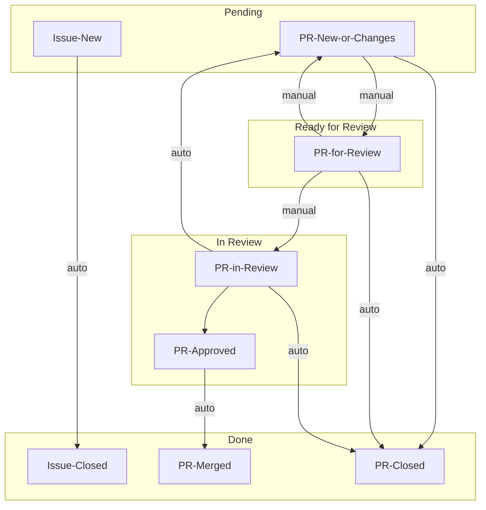

# Team processes

## Release

- Make sure you're up to date, and have the git-ignored credentials file `.pypirc`.
- Make one last feature branch with the new version number in the name:
  - Run `scripts/changelog.py` to update the `CHANGELOG.md`.
  - Review the updates and pull a couple highlights to the top.
  - Bump `dp_wizard/VERSION`, and add the new number at the top of the `CHANGELOG.md`.
  - Commit your changes, make a PR, and merge this branch to main.
- Update `main` with the latest changes: `git checkout main; git pull`
- Publish: `flit publish --pypirc .pypirc`

This project is configured so there are two different install possibilities from pypi:
- `pip install 'dp_wizard[app]'` pins all dependencies, and is the best route for most users.
- `pip install dp_wizard` does not pin dependencies, and is best if you're using `dp_wizard` as a library.

The cloud deployment is [configured](https://connect.posit.cloud/mccalluc/content/01966942-7eab-da99-0887-a7c483756aa8/edit) to update on pushes to the `cloud-deployment` branch.
If you are on `main`, with no local changes, run `scripts/deploy.sh`.

## Conventions

Branch names should be of the form `NNNN-short-description`, where `NNNN` is the issue number being addressed.

Add developer-only dependencies in `requirements-dev.in`; Add other dependencies in `requirements.in`. After an edit to either file run `scripts/requirements.py` to install the new dependency locally and update `pyproject.toml`.

A Github [project board](https://github.com/orgs/opendp/projects/10/views/2) provides an overview of the issues and PRs.
When PRs are [Ready for Review](https://github.com/orgs/opendp/projects/10/views/2?filterQuery=status%3A%22Ready+for+Review%22) they should be flagged as such so reviewers can find them.

- For `manual` transitions, the status of the issue or PR will need to be updated by hand, either on the issue, or by dragging between columns on the board.
- For `auto` transitions, some other action (for example, approving a PR) should trigger a [workflow](https://github.com/orgs/opendp/projects/10/workflows).
- These are the only states that matter. Whether PR is a draft or has assignees does not matter.
- If we need anything more than this, we should consider a paid plan, so that we have access to more workflows.
