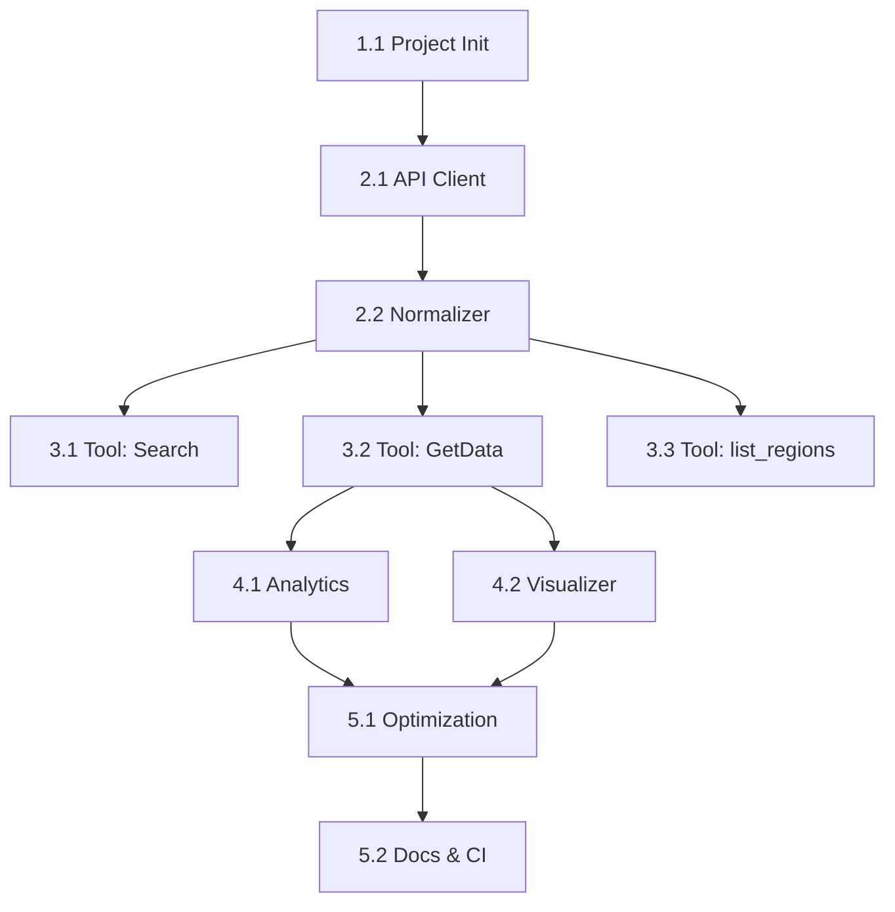

# Implementation Plan - e-Stat Dashboard MCP Server

This plan outlines the step-by-step implementation of the e-Stat Dashboard MCP Server based on [SPEC.md](./SPEC.md). It has been updated to clarify scope, add concrete acceptance criteria, and track implementation status.

## Status Dashboard

- Legend: Not started / In progress / Blocked / Done
- Owners: TBD unless assigned

| ID | Task | Status | Owner | ETA | Notes |
|----|------|--------|-------|-----|-------|
| 1.1 | Project initialization | Done | TBD | TBD | Scaffolding, deps, hello server |
| 2.1 | API client (httpx, retries, timeouts) | Done | TBD | TBD | Add backoff + rate-limiting guard |
| 2.2 | Normalization (search/data/region) | Done | TBD | TBD | Flat timeseries; unit/cycle handling |
| 3.1 | Tool: search_indicators | Done | TBD | TBD | Cache search results (TTL) |
| 3.2 | Tool: get_stats_data | Done | TBD | TBD | Validate date/cycle; clean JSON |
| 3.3 | Tool: list_regions (optional) | Done | TBD | - | From getRegionInfo, normalized |
| 4.1 | Analytics helpers + tool | Done | TBD | TBD | summary/cagr/yoy/correlation |
| 4.2 | Visualization code generator | Done | TBD | TBD | matplotlib + japanize-matplotlib |
| 5.1 | Error handling + UX polish | Done | TBD | TBD | Standard error schema across tools |
| 5.2 | Docs + CI (lint/test) | Done | TBD | TBD | README, GH Actions |

Checklist
- [x] 1.1 Project initialization
- [x] 2.1 API client with retries/timeouts
- [x] 2.2 Normalizers (indicator list / stats / region)
- [x] 3.1 Tool: search_indicators
- [x] 3.2 Tool: get_stats_data
- [x] 3.3 Tool: list_regions (optional)
- [x] 4.1 Tool: analyze_stats
- [x] 4.2 Tool: generate_graph_code
- [x] 5.1 Error handling, type hints, logging
- [x] 5.2 Docs + CI

## Phase 1: Project Skeleton & Configuration

### Task 1.1: Project Initialization
- Status: Not started | Owner: TBD
- Goal: Set up the Python project structure, dependency management, and basic MCP server scaffolding.
- Changes:
  - Initialize `pyproject.toml` with `uv` or `poetry`.
  - Dependencies: `mcp`, `httpx`, `pandas`, `matplotlib`, `seaborn`, `japanize-matplotlib`.
  - Create directory structure: `src/e_stat_dashboard_mcp/`.
  - Create `src/e_stat_dashboard_mcp/server.py` with a minimal MCP server and tool registration skeleton.
  - Setup `README.md` with basic usage instructions.
  - Config: `config.py` for constants (e.g., base URL, Lang=JP) and env-reading.
- Acceptance criteria (DoD):
  - Repo installs with one command; `python -m e_stat_dashboard_mcp.server` starts an MCP server.
  - Linter/formatter configured locally (ruff/black optional) without CI.
  - README shows how to start and inspect the server.

## Phase 2: Core API Client & Normalization

### Task 2.1: API Client Implementation
- Status: Not started | Owner: TBD
- Goal: Implement the low-level wrapper for the e-Stat Dashboard API.
- Changes:
  - Create `src/e_stat_dashboard_mcp/api_client.py`.
  - Implement `EStatClient` using `httpx.AsyncClient` with:
    - Timeouts, retry with exponential backoff (HTTP 5xx, 429), basic rate-limiting guard.
    - Methods: `get_indicator_info`, `get_data`, `get_region_info`.
    - Parameterization for `Lang`, `TimeFrom`, `TimeTo`; validate date format `YYYYMM00`.
  - Error mapping: translate HTTP/network errors into unified client exceptions.
- Acceptance criteria (DoD):
  - Unit tests with mocked responses cover success, 4xx, 5xx, 429 with retry.
  - Default timeout set; backoff configured; base URL in config.

### Task 2.2: Data Normalization Logic
- Status: Not started | Owner: TBD
- Goal: Implement the logic to flatten deep JSON responses into usable structures.
- Changes:
  - Create `src/e_stat_dashboard_mcp/normalizer.py`.
  - Implement `normalize_indicator_list` (for search results).
  - Implement `normalize_stats_data` (for `getData` responses):
    - Convert `STATISTICAL_DATA.DATA_INF.DATA_OBJ` to a flat list of dicts.
    - Extract `@time`, `$`, `@unit`, `@cycle`; coerce numeric values; drop missing.
    - Interpret `@cycle` to human-readable labels; keep original `@time` as `original_time`.
  - Implement `normalize_region_info` (optional) for `getRegionInfo`.
- Acceptance criteria (DoD):
  - Sample fixtures included; unit tests validate shapes, types, edge cases.

## Phase 3: Primary MCP Tools (Search & Retrieve)

### Task 3.1: Tool - `search_indicators`
- Status: Not started | Owner: TBD
- Goal: Expose the search functionality as an MCP tool.
- Changes:
  - Define tool schema as in SPEC.md; register in `tools.py` (or within `server.py`).
  - Connect to `EStatClient.get_indicator_info` and `normalize_indicator_list`.
  - Caching: introduce `cache.py` with in-memory TTL (24h) keyed by normalized keyword.
  - Ranking tweak (optional): prefer exact keyword hits, then substring, then others.
- Acceptance criteria (DoD):
  - MCP inspector can search typical terms (例: 完全失業率) and returns concise ranked list.
  - Cache hit reduces API calls during tests (log indicates cache used).

### Task 3.2: Tool - `get_stats_data`
- Status: Not started | Owner: TBD
- Goal: Expose data retrieval as an MCP tool.
- Changes:
  - Register tool: `get_stats_data` with SPEC.md input schema.
  - Connect to `EStatClient.get_data` and `normalize_stats_data`.
  - Validate `from_date`, `to_date` (YYYYMM00) and `cycle` (1/2/3/4).
  - Output clean JSON (list of objects) with stable field order.
- Acceptance criteria (DoD):
  - Returns flattened dataset for a known indicator code within a bounded date range.
  - Graceful errors for invalid date format or empty results.

### Task 3.3: Tool - `list_regions` (optional)
- Status: Backlog | Owner: TBD
- Goal: Expose region hierarchy for filters and UI auto-complete.
- Changes:
  - Register tool: `list_regions` backed by `getRegionInfo` and `normalize_region_info`.
  - Cache responses (TTL 7d) because region codes change infrequently.
- Acceptance criteria (DoD):
  - Returns stable list (code/name/parent) for common parents (Japan, Prefs).

## Phase 4: Analytic & Visualization Tools

### Task 4.1: Analytics Module & Tool
- Status: Not started | Owner: TBD
- Goal: Implement statistical analysis helpers.
- Changes:
  - Create `src/e_stat_dashboard_mcp/analytics.py`.
  - Implement `calculate_cagr`, `calculate_yoy`, `calculate_summary`, `correlation`.
  - Register tool: `analyze_stats`.
  - Connect tool inputs (JSON string) to pandas DataFrame logic.
- Acceptance criteria (DoD):
  - Deterministic outputs with unit tests over sample payloads; numeric precision documented.

### Task 4.2: Visualization Generator Tool
- Status: Not started | Owner: TBD
- Goal: Generate Python plotting code for the user.
- Changes:
  - Create `src/e_stat_dashboard_mcp/visualizer.py`.
  - Implement templates for `matplotlib` (Line, Bar, Scatter).
  - Register tool: `generate_graph_code`.
  - Ensure generated code includes `japanize_matplotlib` import and font setup.
- Acceptance criteria (DoD):
  - Generated scripts execute and render a plot against example payloads without manual fixes.

## Phase 5: Refinement & Documentation

### Task 5.1: Optimization & Error Handling
- Status: Not started | Owner: TBD
- Goal: Improve user experience and reliability.
- Changes:
  - Standardize error schema across tools: `code`, `message`, `details`.
  - Better messages for empty results, API timeouts, invalid params.
  - Add type hints, structured logging; ensure sensitive info not logged.
  - Centralize validation helpers (date/cycle) and reuse.
- Acceptance criteria (DoD):
  - All tools return consistent error envelopes; logs show clear context; mypy passes (if configured).

### Task 5.2: Final Documentation & CI
- Status: Not started | Owner: TBD
- Goal: Prepare for release.
- Changes:
  - Update `README.md` with tool docs, examples, and troubleshooting.
  - Set up GitHub Actions for lint/test (matrix Python 3.10–3.12).
  - Optionally add publish workflow (tag-triggered) if shipping to PyPI.
- Acceptance criteria (DoD):
  - README covers setup, tool usage, examples; CI runs lint + tests successfully.

## Dependencies Graph

## Cross-cutting Design Decisions (from SPEC alignment)

- Caching layer: In-memory TTL cache initially (`cache.py`). If persistent cache is needed later, introduce SQLite-backed store with the same interface.
- Retries and rate limiting: Use exponential backoff on 5xx/429, with jitter; hard cap concurrent requests via client instance.
- Localization: Default `Lang=JP` from SPEC. Keep a single place to configure language.
- Input schemas: Mirror SPEC.md definitions in tool registration, including enums and descriptions to improve DX.
- Data types: Coerce numeric values; keep original string fields for traceability. Document unit/cycle in outputs.
- Security: No secrets required (Dashboard API is public). Still avoid logging full URLs with query if not necessary.

## Risks & Mitigations
- API quotas or instability -> add retries/backoff and caching; expose helpful error messages.
- Data shape changes -> defensive parsing in normalizers; tests with fixtures.
- Large payloads -> encourage date filters; consider pagination/streaming if needed.

## Open Questions
- Do we need a persistent cache (SQLite) in v1, or is in-memory sufficient?
- Should we add Vega-Lite code generation alongside matplotlib in v1?
- Do we expose region filtering in `get_stats_data` in v1, or ship minimal first?
