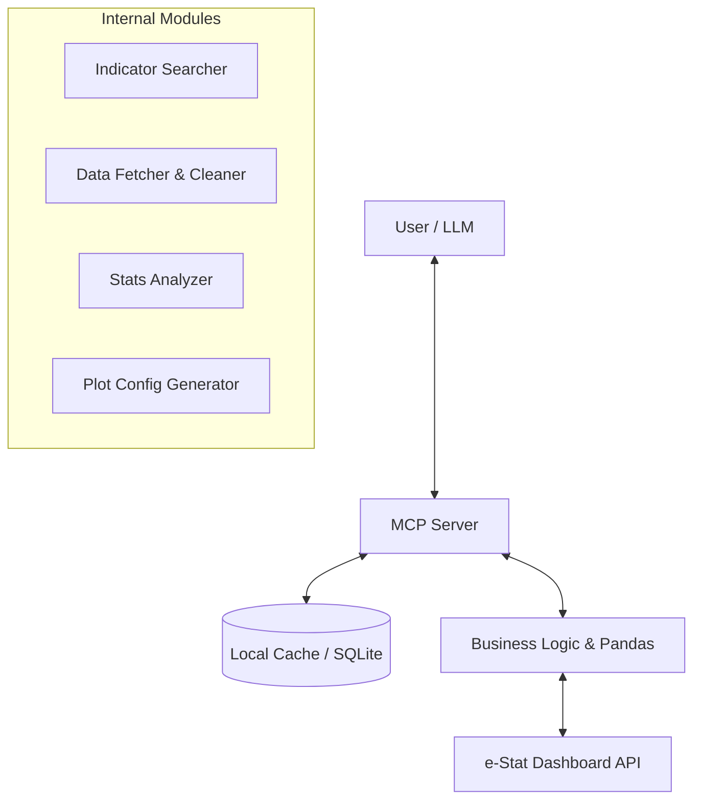

# e-Stat Dashboard MCP Server 仕様書

## 1. 概要

本サーバーは、総務省統計局が提供する「統計ダッシュボードAPI (Ver 1.0)」を利用し、日本の主要な統計データをLLM (Large Language Model) に提供するためのインターフェースです。
**認証不要（AppID不要）**なDashboard APIを使用し、検索、データ取得、分析、可視化コード生成までをワンストップで提供します。

### 特徴（付加価値機能）

*   **セマンティック検索レイヤー**: 複雑な19桁のコードを意識せず、自然言語（例：「失業率」「人口」）から適切な統計系列を特定する検索機能。
*   **インテリジェント・キャッシュ**: APIレスポンスおよびマスターデータ（地域コード等）をキャッシュし、応答速度の向上とサーバー負荷を軽減。
*   **データ正規化**: e-Stat特有の深くネストされたJSON構造を、LLMが理解しやすいフラットな時系列データ（CSV/JSON）に変換して返却。
*   **分析・可視化支援**: 生データだけでなく、成長率計算やグラフ描画用コード（Python/Vega-Lite）を生成する機能。

## 2. システムアーキテクチャ



## 3. 技術スタック

*   **Language**: Python 3.10+
*   **Framework**: `mcp` (Model Context Protocol SDK)
*   **HTTP Client**: `httpx` (非同期通信)
*   **Data Processing**: `pandas` (データ整形・統計計算)
*   **Visualization**: `matplotlib` / `seaborn` (コード生成用テンプレート)

## 4. MCP ツール定義

以下の4つの主要ツールを公開します。

### 4.1. `search_indicators` (統計探索)

ユーザーの曖昧なキーワードから、利用可能な統計系列（Indicator）を検索します。

*   **API Endpoint**: `GET /Json/getIndicatorInfo`
*   **Description**: 統計ダッシュボードから統計項目を検索します。AIはユーザーが「～のデータを知りたい」と言った際に最初にこれを呼び出します。
*   **Input Schema**:
    ```json
    {
      "type": "object",
      "properties": {
        "keyword": {
          "type": "string",
          "description": "検索キーワード（例: '完全失業率', '消費者物価指数', '総人口'）"
        }
      },
      "required": ["keyword"]
    }
    ```
*   **Internal Logic**:
    1.  `GET https://dashboard.e-stat.go.jp/api/1.0/Json/getIndicatorInfo?Lang=JP&SearchIndicatorWord={URL_ENCODED_KEYWORD}` をコール。
    2.  レスポンス `METADATA_INF.CLASS_INF.CLASS_OBJ.CLASS` (リスト) をパース。
    3.  `@name` (系列名), `@code` (系列コード), `@unit` (単位) を抽出。
    4.  **LLM向け最適化**: 上位10〜20件に絞り、Markdownのリスト形式で返却してトークンを節約する。

### 4.2. `get_stats_data` (データ取得・正規化)

指定された統計系列と条件に基づいてデータを取得し、整形して返します。

*   **API Endpoint**: `GET /Json/getData`
*   **Description**: 統計データを取得します。系列コードが必要です。期間指定を行うことでレスポンスサイズを最適化できます。
*   **Input Schema**:
    ```json
    {
      "type": "object",
      "properties": {
        "indicator_code": {
          "type": "string",
          "description": "search_indicatorsで取得したコード（例: '0301010000020020010'）"
        },
        "from_date": {
          "type": "string",
          "description": "開始時期（YYYYMM00形式）。例: 2020年1月以降 -> '20200100'。省略時は全期間。"
        },
        "to_date": {
          "type": "string",
          "description": "終了時期（YYYYMM00形式）。"
        },
        "cycle": {
            "type": "string",
            "enum": ["1", "2", "3", "4"],
            "description": "1:月次, 2:四半期, 3:年次, 4:年度 (指定がない場合はAPIレスポンスから自動判別)"
        },
        "limit": {
            "type": "integer",
            "description": "最大取得件数。指定した場合、最新のデータから順にN件を返します。"
        }
      },
      "required": ["indicator_code"]
    }
    ```
*   **Internal Logic**:
*   **Internal Logic**:
    1.  APIコール: `GET https://dashboard.e-stat.go.jp/api/1.0/Json/getData?Lang=JP&IndicatorCode={code}&TimeFrom={from_date}&TimeTo={to_date}`
    2.  レスポンス `STATISTICAL_DATA.DATA_INF.DATA_OBJ` (リスト) をパース。
    3.  各要素の `VALUE` オブジェクトから、`@time` (時期), `$` (値), `@unit` (単位), `@cycle` (周期) を抽出。
    4.  **レスポンス形式**: 以下のJSONオブジェクト（Wrapper）を返します。
        ```json
        {
          "data": [
            {"date": "2023-01", "value": 2.4, "unit": "%", "cycle": "月次", "original_time": "20230100"},
            ...
          ],
          "resourceUri": null,
          "meta": {
             "size_bytes": 1234,
             "is_resource": false,
             "record_count": 10
          }
        }
        ```
    5.  **Resource URI (Large Data)**: データ量が閾値 (1MB目安) を超える場合、データを一時ファイルに保存し、`data` を `null`、`resourceUri` に取得用URIを設定して返します。クライアントは `read_resource` ツールを使用してデータを取得する必要があります。

### 4.3. `read_resource` (リソース読み込み)

`get_stats_data` などで `resourceUri` が返された場合に、その実体（ファイル内容）を取得します。

*   **API Endpoint**: Internal (File System)
*   **Description**: 一時保存された大規模データリソースを読み込みます。
*   **Input Schema**:
    ```json
    {
      "type": "object",
      "properties": {
        "uri": {
          "type": "string",
          "description": "リソースURI (例: 'resource://e-stat/temp/estat_XXXX.json')"
        }
      },
      "required": ["uri"]
    }
    ```

### 4.4. `analyze_stats` (統計分析)

取得したデータに対して基本的な統計計算を行います。

*   **Description**: 取得したデータセットに対して、成長率や基本統計量を計算します。`data_json`（クライアント側データ）または `indicator_code`（サーバー側取得）のいずれかが必須です。
*   **Input Schema**:
    ```json
    {
      "type": "object",
      "properties": {
        "analysis_type": {
          "type": "string",
          "enum": ["summary", "cagr", "yoy", "correlation"],
          "description": "summary:基本統計量 (基礎統計量+分散+CV+四分位数), cagr:年平均成長率, yoy:前年同期比, correlation:相関"
        },
        "data_json": {
          "type": "string",
          "description": "get_stats_dataで取得したJSONデータ（文字列）。省略時はindicator_codeまたはdata_uriが必須。"
        },
        "indicator_code": {
          "type": "string",
          "description": "データ取得から分析までサーバー側で行う場合に指定。"
        },
        "data_uri": {
          "type": "string",
          "description": "get_stats_dataで取得したリソースURI。大規模データを直接サーバー側で読み込みます。"
        },
        "from_date": {"type": "string"},
        "to_date": {"type": "string"},
        "cycle": {"type": "string"}
      },
      "required": ["analysis_type"]
    }
    ```
*   **Internal Logic**: Pandasを使用し、正確な数値を計算して返却します。`indicator_code`指定時はサーバー側でAPIコールを行い、大量データのトークン消費を抑えます。
    *   `analysis_type`='summary': 基礎統計量 (Count, Mean, Median, Min, Max, StdDev, Variance, Quartiles, CV, Skewness, Kurtosis)
    *   `analysis_type`='cagr' (or 'growth'): 年平均成長率 (CAGR) と総成長率
    *   `analysis_type`='yoy': 前年同月比 (Year-Over-Year)
    *   `analysis_type`='trend': 線形回帰によるトレンド分析 (Slope, R^2, Direction)
    *   `analysis_type`='anomaly': 最新データの異常検知 (Z-Score)

*   **Output Schema**:
    *   **Summary**:
        ```json
        {
          "count": 12,
          "mean": 105.5,
          "median": 102.0,
          "min": 98.2,
          "max": 115.0,
          "std_dev": 5.2,
          "variance": 27.04,
          "percentile_25": 100.1,
          "percentile_75": 110.5,
          "coefficient_of_variation": 0.049,
          "skewness": 0.1,
          "kurtosis": -0.5
        }
        ```
    *   **Trend**:
        ```json
        {
          "slope": 1.23,
          "r_squared": 0.95,
          "intercept": 80.0,
          "direction": "up",
          "latest_value": 115.0
        }
        ```
    *   **Anomaly**:
        ```json
        {
          "latest_date": "2023-01",
          "latest_value": 200.0,
          "mean_history": 100.0,
          "std_history": 10.0,
          "z_score": 10.0,
          "is_anomaly": true
        }
        ```

### 4.4. `generate_graph_code` (可視化コード生成)

データをグラフ化するためのPythonコードを生成します。

*   **Description**: データを可視化するためのPythonコード (Matplotlib + Japanize) を生成します。
*   **Input Schema**:
    ```json
    {
      "type": "object",
      "properties": {
        "data_payload": { "type": ["string", "array"], "description": "グラフ化データ。JSON文字列 または 既にパース済みの配列([{\"date\":...,\"value\":...}, ...])。省略時はdata_uriが必須" },
        "data_uri": { "type": "string", "description": "データのResource URI (get_stats_dataのresourceUri)" },
        "graph_type": { "type": "string", "enum": ["line", "bar", "scatter"] },
        "title": { "type": "string" },
        "x_label": { "type": "string" },
        "y_label": { "type": "string" }
      },
      "required": ["graph_type"]
    }
    ```
*   **Notes**:
    - `data_payload` を配列で渡す場合は「レコードの配列」を想定します（各レコードは少なくとも `date`, `value` を含む）。
    - `data_uri` は大規模データ時に `get_stats_data` が返す `resourceUri` を指定します。
*   **Examples**:
    - `generate_graph_code(data_payload=[{"date":"2020-01","value":10}], graph_type="line", title="Sample")`
    - `generate_graph_code(data_uri="resource://e-stat/temp/estat_xxx.json", graph_type="bar", title="Bar Chart")`
*   **Value Add**: 日本語フォント対応（`japanize_matplotlib`）を含んだ、実行可能なスニペットを返します。

---

## 5. API概要 (開発者用メモ)

Base URL: `https://dashboard.e-stat.go.jp/api/1.0/Json/`

| Endpoint | 主要パラメータ | 用途 |
| :--- | :--- | :--- |
| `getIndicatorInfo` | `SearchIndicatorWord` (URL Encoded) | 統計系列の検索 |
| `getData` | `IndicatorCode`, `TimeFrom`, `TimeTo` | 統計データの取得 |
| `getRegionInfo` | `ParentRegionCode` | 地域一覧の取得 |

*   **TimeFrom/TimeTo 形式**:
    *   月次: `YYYYMM00` (例: 20240100)
    *   年次: `YYYY1000` ? (要確認、基本はAPIから返ってくる `@time` をそのまま使用推奨)
    *   *Note*: `getData` のレスポンスに含まれる `@time` は `YYYYMM00` 形式で返るため、リクエストもそれに合わせる。

## 6. エラーハンドリング仕様

MCPサーバーは以下の状況で適切なエラーメッセージをその旨と共に返します。

1.  **該当データなし**:
    *   コード: `DATA_NOT_FOUND`
    *   メッセージ: "指定された条件（地域・時期）に一致する統計データが見つかりませんでした。"
2.  **APIエラー**:
    *   コード: `API_ERROR`
    *   メッセージ: "e-Stat Dashboard APIからエラーが返されました (Status: {status})"
3.  **検索結果過多**:
    *   `search_indicators` でヒット数が多すぎる場合、上位のみを表示し「検索ワードをより具体的にしてください」と警告。

## 7. ディレクトリ構造案

```
.
├── src/
│   ├── e_stat_dashboard_mcp/
│   │   ├── __init__.py
│   │   ├── server.py       # MCP Server Entrypoint
│   │   ├── api_client.py   # httpx wrapper for Dashboard API
│   │   ├── normalizer.py   # JSON -> Flat Data converter
│   │   ├── analytics.py    # Pandas logic
│   │   └── tools.py        # MCP Tool definitions
├── tests/
├── pyproject.toml
└── README.md
```
