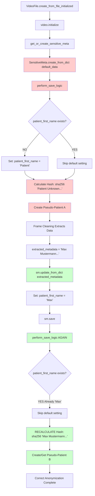

# Two-Phase Patient Data Pattern

## Overview

The endoreg-db system implements a **two-phase pattern** for handling patient data during video import and anonymization. This pattern allows the system to:

1. **Create valid SensitiveMeta instances** even when patient data is not yet available
2. **Update with real patient data** once it becomes available (e.g., from OCR extraction)
3. **Maintain referential integrity** while recalculating hashes and pseudo-entities

This document explains how this pattern works and why it's necessary.

---

## The Problem

During video import, patient data is not immediately available:

```python
# Video import starts
video = VideoFile.create_from_file_initialized(file_path, center_name, processor_name)
video.initialize()  # ← Needs SensitiveMeta, but no patient data yet!
```

However, `SensitiveMeta` requires:
- `patient_first_name` (for hash calculation)
- `patient_last_name` (for hash calculation)  
- `patient_dob` (for hash calculation)
- `center` (for anonymization)

**Without these fields, hash calculation fails:**
```
AssertionError: First name is required to calculate patient hash.
```

Patient data is only extracted **later** during frame cleaning:
```python
# lx_anonymizer extracts patient data from video frames
extracted_metadata = {
    "patient_first_name": "Max",
    "patient_last_name": "Mustermann",
    "patient_dob": date(1985, 3, 15),
}
```

---

## The Solution: Two-Phase Pattern

### Phase 1: Initial Creation (with Defaults)

```python
default_data = {
    "patient_first_name": "Patient",      # Default
    "patient_last_name": "Unknown",       # Default
    "patient_dob": date(1990, 1, 1),      # Default
    "examination_date": date.today(),
    "center": video.center,
}
sensitive_meta = SensitiveMeta.create_from_dict(default_data)
```

**What happens internally:**
1. `perform_save_logic()` is called
2. Default names are already set (no replacement needed)
3. Hash is calculated: `sha256("Patient Unknown 1990-01-01 ...")`
4. Temporary pseudo-entities are created based on this hash

**Result:** Video import can proceed without errors ✅

---

### Phase 2: Update (with Extracted Data)

Later, when real patient data is extracted, it **overwrites** the defaults:

```python
# video_import.py - _update_sensitive_metadata()
extracted_metadata = {
    "patient_first_name": "Max",
    "patient_last_name": "Mustermann",
    "patient_dob": date(1985, 3, 15),
}

sm.update_from_dict(extracted_metadata)
sm.save()  # ← Triggers perform_save_logic() AGAIN
```

**What happens internally:**
1. `update_from_dict()` sets new values:
   - `instance.patient_first_name = "Max"` (overwrites "Patient")
   - `instance.patient_last_name = "Mustermann"` (overwrites "Unknown")
2. `save()` is called → triggers `perform_save_logic()`
3. Default-setting is **skipped** (names already exist):
   ```python
   if not instance.patient_first_name:  # ← FALSE (already "Max")
       instance.patient_first_name = DEFAULT_UNKNOWN_NAME  # ← NOT EXECUTED
   ```
4. Hash is **RECALCULATED** with real data:
   - `sha256("Max Mustermann 1985-03-15 ...")`
5. **New pseudo-entities** are created/retrieved based on new hash

**Result:** Correct anonymization with real patient data ✅

---

## Code Flow Diagram



---

## Key Implementation Details

### 1. Default Name Setting (sensitive_meta_logic.py)

```python
@transaction.atomic
def perform_save_logic(instance: "SensitiveMeta") -> "Examiner":
    """
    CRITICAL: Set default patient names BEFORE hash calculation.
    
    Two-phase approach:
    - Phase 1: Set defaults if names are missing
    - Phase 2: Skip if names already exist (real data)
    """
    
    if not instance.patient_first_name:
        instance.patient_first_name = DEFAULT_UNKNOWN_NAME  # "unknown"
        
    if not instance.patient_last_name:
        instance.patient_last_name = DEFAULT_UNKNOWN_NAME  # "unknown"
    
    # Hash is ALWAYS recalculated (uses current field values)
    instance.patient_hash = calculate_patient_hash(instance)
    instance.examination_hash = calculate_examination_hash(instance)
    
    # Pseudo-entities created based on current hash
    pseudo_patient = get_or_create_pseudo_patient_logic(instance)
    # ...
```

### 2. Initial Creation (video_file.py)

```python
def get_or_create_sensitive_meta(self) -> "SensitiveMeta":
    """Creates SensitiveMeta with default patient data."""
    
    if self.sensitive_meta is None:
        default_data = {
            "patient_first_name": "Patient",
            "patient_last_name": "Unknown",
            "patient_dob": date(1990, 1, 1),
            "examination_date": date.today(),
            "center": self.center,  # ← Can pass Center object OR "center_name": "hospital_name" string
        }
        self.sensitive_meta = SensitiveMeta.create_from_dict(default_data)
```

**Note:** `create_from_dict()` accepts **both** formats:
- `"center": center_obj` (Center object)
- `"center_name": "hospital_name"` (String)

This flexibility allows different parts of the codebase to use whichever format is more convenient.

### 3. Update with Real Data (sensitive_meta_logic.py)

```python
def update_sensitive_meta_from_dict(instance: "SensitiveMeta", data: Dict[str, Any]) -> "SensitiveMeta":
    """Updates instance fields and triggers save (hash recalculation)."""
    
    # Update instance attributes
    for k, v in selected_data.items():
        setattr(instance, k, v)  # Overwrites defaults
    
    # Trigger save → perform_save_logic() → hash recalculation
    instance.save()
    return instance
```

### 4. Integration in Video Import (video_import.py)

```python
def _update_sensitive_metadata(self, extracted_metadata: Dict[str, Any]):
    """Updates SensitiveMeta with extracted patient data."""
    
    sm = self.current_video.sensitive_meta
    sm.update_from_dict(extracted_metadata)
    # → Overwrites "Patient Unknown" with "Max Mustermann"
    # → save() triggers hash recalculation
    # → New pseudo-entities created
```

---

## Example Timeline

| Step | Action | patient_first_name | patient_hash | Pseudo-Patient |
|------|--------|-------------------|--------------|----------------|
| 1 | `video.initialize()` | - | - | - |
| 2 | `get_or_create_sensitive_meta()` | "Patient" | `hash("Patient Unknown...")` | Pseudo-Patient A (temp) |
| 3 | Frame cleaning extraction | "Patient" | `hash("Patient Unknown...")` | Pseudo-Patient A |
| 4 | `update_from_dict({"patient_first_name": "Max"})` | "Max" | - | - |
| 5 | `save()` → `perform_save_logic()` | "Max" | `hash("Max Mustermann...")` | Pseudo-Patient B (real) |

**Final state:** Correctly anonymized with real patient data and proper pseudo-entities ✅

---

## Why This Pattern Works

### 1. **Conditional Default Setting**
```python
if not instance.patient_first_name:  # Only sets if missing
    instance.patient_first_name = DEFAULT_UNKNOWN_NAME
```
- **First save:** Field is empty → default is set
- **Second save:** Field has "Max" → condition is False → skipped

### 2. **Hash Always Recalculated**
```python
# This runs on EVERY save, regardless of phase
instance.patient_hash = calculate_patient_hash(instance)
```
- **First save:** Hash of "Patient Unknown"
- **Second save:** Hash of "Max Mustermann"

### 3. **Pseudo-Entities Auto-Update**
```python
# get_or_create based on current hash
pseudo_patient = get_or_create_pseudo_patient_logic(instance)
```
- **First save:** Creates/retrieves pseudo-patient with temp hash
- **Second save:** Creates/retrieves **different** pseudo-patient with real hash

---

## Testing the Pattern

### Test Initial Creation
```python
def test_initial_creation_with_defaults():
    video = VideoFile.create_from_file_initialized(...)
    sm = video.sensitive_meta
    
    assert sm.patient_first_name == "Patient"
    assert sm.patient_last_name == "Unknown"
    assert sm.patient_hash is not None  # Hash calculated successfully
```

### Test Update with Real Data
```python
def test_update_with_extracted_data():
    video = VideoFile.create_from_file_initialized(...)
    sm = video.sensitive_meta
    initial_hash = sm.patient_hash
    
    # Extract real data
    sm.update_from_dict({
        "patient_first_name": "Max",
        "patient_last_name": "Mustermann",
        "patient_dob": date(1985, 3, 15),
    })
    
    assert sm.patient_first_name == "Max"  # Updated
    assert sm.patient_last_name == "Mustermann"  # Updated
    assert sm.patient_hash != initial_hash  # Hash recalculated
```

---

## Common Pitfalls (Avoided by This Pattern)

### ❌ **Wrong: Direct `objects.create()` without defaults**
```python
# OLD CODE (BROKEN)
self.sensitive_meta = SensitiveMeta.objects.create(center=self.center)
# → save() called immediately
# → perform_save_logic() tries to calculate hash
# → ERROR: "First name is required to calculate patient hash"
```

### ❌ **Wrong: `create_from_dict()` without center parameter**
```python
# BROKEN - Missing center information
default_data = {
    "patient_first_name": "Patient",
    "patient_last_name": "Unknown",
}
self.sensitive_meta = SensitiveMeta.create_from_dict(default_data)
# → ERROR: "center_name is required in data dictionary"
```

### ✅ **Right: `create_from_dict()` with defaults and center**
```python
# NEW CODE (WORKING) - Option 1: Center object
default_data = {
    "patient_first_name": "Patient",
    "patient_last_name": "Unknown",
    "patient_dob": date(1990, 1, 1),
    "center": self.center,  # ← Center object
}
self.sensitive_meta = SensitiveMeta.create_from_dict(default_data)

# NEW CODE (WORKING) - Option 2: Center name string
default_data = {
    "patient_first_name": "Patient",
    "patient_last_name": "Unknown",
    "patient_dob": date(1990, 1, 1),
    "center_name": "university_hospital_wuerzburg",  # ← String
}
self.sensitive_meta = SensitiveMeta.create_from_dict(default_data)
# → Hash calculation succeeds
# → Video import proceeds
# → Real data can be updated later
```

**Why both formats are supported:**
- `video_file.py` has access to the Center **object** (`self.center`)
- `video_import.py` may only have the center **name** string
- Both are valid and will work correctly

---

## Related Documentation

- **Implementation:** `endoreg_db/models/metadata/sensitive_meta_logic.py`
- **Video Integration:** `endoreg_db/models/media/video/video_file.py`
- **Import Service:** `endoreg_db/services/video_import.py`
- **Hash Calculation:** `endoreg_db/utils/hashs.py`

---

## Summary

The two-phase pattern allows endoreg-db to:
1. ✅ Create valid SensitiveMeta instances without patient data
2. ✅ Import videos without blocking on missing information
3. ✅ Update with real data once available
4. ✅ Maintain proper anonymization with correct hashes
5. ✅ Avoid "First name required" errors during hash calculation

**Key principle:** Defaults are temporary placeholders that get replaced by real data, with hash recalculation ensuring correct anonymization.
