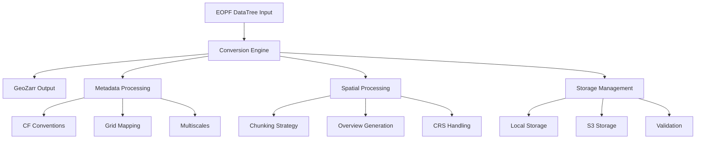
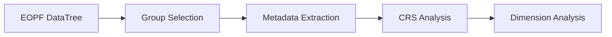
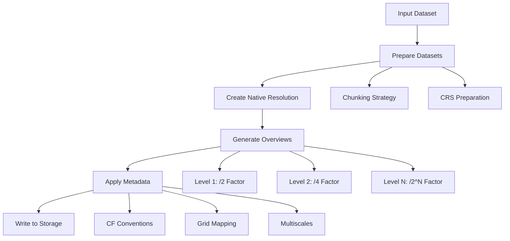

# Architecture

This document describes the architecture and design principles of the EOPF GeoZarr library.

## Overview

The EOPF GeoZarr library is designed to convert EOPF (Earth Observation Processing Framework) datasets to GeoZarr-spec 0.4 compliant format while maintaining scientific accuracy and optimizing performance.

This implementation follows our [GeoZarr Mini Spec](geozarr-minispec.md), which defines the specific subset of the GeoZarr specification that this library implements, including implementation-specific details for chunking, CF compliance, and multiscale dataset organization.

## Design Principles

### 1. Scientific Integrity First

- **Native CRS Preservation**: Maintains original coordinate reference systems to avoid reprojection artifacts
- **Data Accuracy**: Preserves original data values without unnecessary transformations
- **Metadata Fidelity**: Ensures all scientific metadata is properly transferred and enhanced

### 2. Performance Optimization

- **Aligned Chunking**: Optimizes chunk sizes to prevent partial chunks and improve I/O performance
- **Lazy Loading**: Uses xarray and Dask for memory-efficient processing
- **Parallel Processing**: Supports distributed computing for large datasets

### 3. Cloud-Native Design

- **Storage Agnostic**: Works with local filesystems, S3, and other cloud storage
- **Scalable**: Designed for processing large Earth observation datasets
- **Robust**: Includes retry logic and error handling for network operations

## System Architecture



## Core Components

### 1. Conversion Engine (`conversion/geozarr.py`)

The main conversion engine orchestrates the transformation process:

```python
# test: skip
def create_geozarr_dataset(
    dt_input: xr.DataTree,
    groups: List[str],
    output_path: str,
    **kwargs
) -> xr.DataTree
```

**Key Functions:**

- `setup_datatree_metadata_geozarr_spec_compliant()`: Sets up GeoZarr-compliant metadata
- `write_geozarr_group()`: Writes individual groups with proper structure
- `create_geozarr_compliant_multiscales()`: Creates multiscales metadata

### 2. File System Utilities (`conversion/fs_utils.py`)

Handles storage operations across different backends:

**Local Storage:**

- Path normalization and validation
- Zarr group operations
- Metadata consolidation

**S3 Storage:**

- S3 path parsing and validation
- Credential management
- S3-specific Zarr operations

**Key Functions:**

- `get_storage_options()`: Unified storage configuration
- `validate_s3_access()`: S3 access validation
- `consolidate_metadata()`: Metadata consolidation

### 3. Processing Utilities (`conversion/utils.py`)

Core processing algorithms:

**Chunking:**

```python
# test: skip
def calculate_aligned_chunk_size(
    dimension_size: int,
    target_chunk_size: int
) -> int
```

**Downsampling:**

The library uses xarray's built-in `.coarsen()` method for efficient downsampling operations, providing better integration with lazy evaluation and memory management.

**Sentinel-2 Optimization:**

The S2 optimization module uses a functional programming approach with stateless functions for improved testability and maintainability:

```python
# test: skip
def convert_s2_optimized(
    dt_input: xr.DataTree,
    output_path: str,
    **kwargs
) -> xr.DataTree
```

### 4. Command Line Interface (`cli.py`)

Provides user-friendly command-line access:

- `convert`: Main conversion command
- `validate`: GeoZarr compliance validation
- `info`: Dataset information display

## Data Flow

### 1. Input Processing



1. **DataTree Loading**: Load EOPF dataset using xarray
2. **Group Selection**: Select specific measurement groups to process
3. **Metadata Extraction**: Extract coordinate and variable metadata
4. **CRS Analysis**: Determine native coordinate reference system
5. **Dimension Analysis**: Calculate optimal chunking and overview levels

### 2. Conversion Process



### 3. Output Structure

The library creates a hierarchical structure compliant with GeoZarr specification:

```
output.zarr/
├── .zattrs                    # Root attributes with multiscales
├── measurements/
│   ├── r10m/                  # Resolution group
│   │   ├── .zattrs           # Group attributes
│   │   ├── 0/                # Native resolution
│   │   │   ├── b02/          # Band data
│   │   │   ├── b03/
│   │   │   ├── b04/
│   │   │   ├── b08/
│   │   │   ├── x/            # X coordinates
│   │   │   ├── y/            # Y coordinates
│   │   │   └── spatial_ref/  # CRS information
│   │   ├── 1/                # Overview level 1 (/2)
│   │   └── 2/                # Overview level 2 (/4)
│   ├── r20m/                 # 20m resolution group
│   └── r60m/                 # 60m resolution group
└── .zmetadata                # Consolidated metadata
```

## Metadata Architecture

### 1. CF Conventions Compliance

The library ensures full CF (Climate and Forecast) conventions compliance:

```python
# Coordinate variables
x_attrs = {
    'standard_name': 'projection_x_coordinate',
    'long_name': 'x coordinate of projection',
    'units': 'm',
    '_ARRAY_DIMENSIONS': ['x']
}

y_attrs = {
    'standard_name': 'projection_y_coordinate', 
    'long_name': 'y coordinate of projection',
    'units': 'm',
    '_ARRAY_DIMENSIONS': ['y']
}
```

### 2. Grid Mapping Variables

Each dataset includes proper grid mapping information:

```python
# test: skip
grid_mapping_attrs = {
    'grid_mapping_name': 'transverse_mercator',  # or appropriate mapping
    'projected_crs_name': crs.to_string(),
    'crs_wkt': crs.to_wkt(),
    'spatial_ref': crs.to_wkt(),
    'GeoTransform': transform_string
}
```

### 3. Multiscales Metadata

GeoZarr-compliant multiscales structure:

```python
# test: skip
multiscales = [{
    'version': '0.4',
    'name': group_name,
    'type': 'reduce',
    'metadata': {
        'method': 'mean',
        'version': '0.1.0'
    },
    'datasets': [
        {'path': '0', 'pixels_per_tile': tile_width},
        {'path': '1', 'pixels_per_tile': tile_width},
        {'path': '2', 'pixels_per_tile': tile_width}
    ],
    'coordinateSystem': {
        'wkid': crs_epsg,
        'wkt': crs.to_wkt()
    }
}]
```

## Performance Considerations

### 1. Chunking Strategy

The library implements intelligent chunking to optimize performance:

```python
def calculate_aligned_chunk_size(dimension_size: int, target_chunk_size: int) -> int:
    """Calculate chunk size that divides evenly into dimension size."""
    if target_chunk_size >= dimension_size:
        return dimension_size
    
    # Find largest divisor <= target_chunk_size
    for chunk_size in range(target_chunk_size, 0, -1):
        if dimension_size % chunk_size == 0:
            return chunk_size
    return 1
```

**Benefits:**

- Prevents partial chunks that waste storage
- Improves read/write performance
- Reduces memory fragmentation
- Better Dask integration

### 2. Memory Management

**Lazy Loading:**

- Uses xarray's lazy loading capabilities
- Processes data in chunks to manage memory usage
- Supports out-of-core processing for large datasets

**Band-by-Band Processing:**

```python
# test: skip
def write_dataset_band_by_band_with_validation(
    ds: xr.Dataset,
    output_path: str,
    max_retries: int = 3
) -> None
```

### 3. Parallel Processing

**Dask Integration:**

- Supports Dask distributed computing
- Automatic parallelization of chunk operations
- Configurable cluster setup

**Retry Logic:**

- Robust error handling for network operations
- Configurable retry attempts
- Graceful degradation on failures

## Storage Architecture

### 1. Storage Abstraction

The library provides a unified interface for different storage backends:

```python
# test: skip
def get_storage_options(path: str, **kwargs) -> Optional[Dict[str, Any]]:
    """Get storage options based on path type."""
    if is_s3_path(path):
        return get_s3_storage_options(path, **kwargs)
    return None
```

### 2. S3 Integration

**Features:**

- Automatic credential detection
- Custom endpoint support
- Bucket validation
- Optimized multipart uploads

**Configuration:**

```python
# test: skip
s3_options = {
    'key': os.environ.get('AWS_ACCESS_KEY_ID'),
    'secret': os.environ.get('AWS_SECRET_ACCESS_KEY'),
    'endpoint_url': os.environ.get('AWS_ENDPOINT_URL'),
    'region_name': os.environ.get('AWS_DEFAULT_REGION', 'us-east-1')
}
```

### 3. Metadata Consolidation

Zarr metadata consolidation for improved performance:

```python
def consolidate_metadata(output_path: str, **storage_kwargs) -> None:
    """Consolidate Zarr metadata for faster access."""
    store = get_zarr_store(output_path, **storage_kwargs)
    zarr.consolidate_metadata(store)
```

## Error Handling and Validation

### 1. Input Validation

- DataTree structure validation
- Group existence checks
- CRS compatibility verification
- Dimension consistency checks

### 2. Processing Validation

- Chunk alignment verification
- Memory usage monitoring
- Progress tracking
- Intermediate result validation

### 3. Output Validation

- GeoZarr specification compliance
- Metadata completeness checks
- Data integrity verification
- Performance metrics collection

## Extensibility

### 1. Plugin Architecture

The library is designed to support extensions:

- Custom storage backends
- Additional metadata formats
- Custom processing algorithms
- Validation plugins

### 2. Configuration System

Flexible configuration through:

- Environment variables
- Configuration files
- Runtime parameters
- Default value inheritance

## Testing Architecture

### 1. Unit Tests

- Individual function testing
- Mock external dependencies
- Edge case coverage
- Performance benchmarks

### 2. Integration Tests

- End-to-end conversion workflows
- Storage backend testing
- Real dataset processing
- Cloud environment testing

### 3. Local Test Data

The library uses an efficient testing approach with **lightweight JSON-based Zarr groups** that contain only the structure and metadata (no chunked array data). This provides:

- **Faster Test Execution**: Tests run locally without downloading large datasets
- **No Remote Dependencies**: Eliminates need for network access during testing
- **Lightweight Fixtures**: JSON files define Zarr group structure using `pydantic-zarr`

Test fixtures are created from JSON schemas stored in `tests/test_data_api/{s1_examples,s2_examples}/` directories, making the test suite both comprehensive and efficient.

### 4. Validation Tests

- GeoZarr specification compliance
- Metadata accuracy verification
- Data integrity checks
- Performance regression testing

This architecture ensures the EOPF GeoZarr library is robust, performant, and maintainable while meeting the specific needs of Earth observation data processing.
