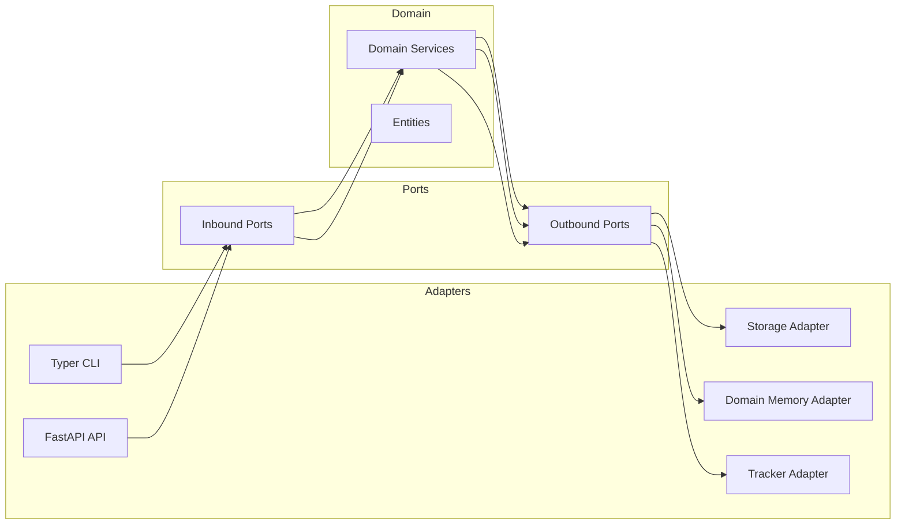

# 02. 아키텍처 설계

## 이 장의 목적 / 독자 / 선행 지식

- **목적**: EvalVault의 아키텍처 경계(domain/ports/adapters)와 의존성 규칙을 내부 개발자 관점에서 “실수 방지용”으로 정리한다.
- **독자**: 기능 추가/리팩토링/통합 작업을 하는 내부 개발자
- **선행 지식**: Python 패키지 구조, 인터페이스(Protocol/ABC) 개념

---

## TL;DR

- EvalVault는 **Hexagonal Architecture (Ports & Adapters)** 를 채택해 도메인 로직을 외부 의존성(LLM/DB/Tracker 등)으로부터 격리한다.
- 의존성 방향은 **Adapters → Ports → Domain** 이며, 도메인은 외부 세계를 모른다.
- 확장(새 LLM/새 DB/새 Tracker)은 보통 **Outbound Port + Adapter 구현**으로 해결된다.
- 기능/정책의 변화는 먼저 **Domain Service**에서 정의하고, Adapter는 “연결”로 제한한다.

---

## 1) 소스 구조(핵심만)

```text
src/evalvault/
├── domain/          # 엔티티/서비스/메트릭: 비즈니스 규칙의 단일 진실
├── ports/           # 인터페이스(계약): inbound/outbound
├── adapters/        # 외부 통합: CLI, FastAPI, LLM, DB, Tracker...
└── config/          # 설정/프로필/계측: 런타임 구성
```

---

## 2) 계층별 책임과 금지 사항

### 2.1 Domain

- **책임**
  - 평가/분석/학습의 규칙과 오케스트레이션(서비스)
  - 핵심 데이터 구조(엔티티)
- **금지(원칙)**
  - 외부 API(OpenAI/Ollama 등) 직접 호출
  - DB/파일시스템 직접 접근
  - FastAPI/Typer 같은 프레임워크 의존

실제 예:
- 평가 엔진: `src/evalvault/domain/services/evaluator.py` (`class RagasEvaluator`)
- 분석 오케스트레이션: `src/evalvault/domain/services/pipeline_orchestrator.py` (`class PipelineOrchestrator`)

### 2.2 Ports

- **책임**
  - 도메인이 “무엇을 필요로 하는지” 정의(Outbound)
  - 도메인이 “무엇을 제공하는지” 정의(Inbound)
- **원칙**
  - Port는 구현 세부를 강제하지 않는다.

실제 예:
- 트레이싱 포트: `src/evalvault/ports/outbound/tracer_port.py` (`class TracerPort`)
- Domain Memory 포트: `src/evalvault/ports/outbound/domain_memory_port.py` (MemoryInsightPort/MemoryLifecyclePort 등)
- 분석 모듈 포트: `src/evalvault/ports/outbound/analysis_module_port.py`

### 2.3 Adapters

- **책임**
  - Port 계약을 특정 기술 스택으로 구현
  - 입력/출력 변환(예: HTTP 요청 → 도메인 호출)
- **금지(권장)**
  - 도메인 정책/규칙을 임의로 주입(도메인에 있어야 할 로직을 어댑터에 넣지 않는다)

실제 예:
- Domain Memory SQLite 어댑터: `src/evalvault/adapters/outbound/domain_memory/sqlite_adapter.py`
- 분석 파이프라인 서비스 팩토리: `src/evalvault/adapters/outbound/analysis/pipeline_factory.py`

---

## 3) 의존성 규칙 (실무 관점)

### 규칙

- 어댑터는 포트에 의존할 수 있다.
- 포트는 도메인에 속하며, 도메인과 같은 방향(내부)으로 관리된다.
- 도메인은 어댑터를 모른다.

### 흔한 실수

- “빠르게 붙이기”를 이유로 도메인 서비스에서 외부 SDK를 직접 호출
- CLI/HTTP 모델을 도메인 엔티티로 그대로 끌고 들어오기
- Adapter가 도메인 정책(예: threshold 판단)을 임의로 수행

---

## 4) 확장 전략 (새 기능을 어디에 추가할지)

### 4.1 새 LLM 제공자 연동

- Outbound Port가 이미 있다면: Adapter를 추가/확장한다.
- Port가 없다면: Port 계약을 먼저 정의하고(도메인 요구사항 기반), Adapter를 구현한다.

### 4.2 새 저장소(Postgres 등)

- Storage Port 구현체를 추가하고, 마이그레이션/스키마는 Adapter에 둔다.

### 4.3 새 분석 모듈(DAG 노드) 추가

- 원칙: **분석 모듈(노드) 등록 → 템플릿에서 노드/엣지 연결 → 산출물(artifacts/index.json) 안정화**
- 모듈 등록 근거: `src/evalvault/adapters/outbound/analysis/pipeline_factory.py`
- 노드/의도 정의 근거: `src/evalvault/domain/entities/analysis_pipeline.py` (`AnalysisIntent`, `AnalysisNode`)

---

## 5) 아키텍처 다이어그램(개념)



> **NOTE**: 도메인은 바깥(Adapters)을 모르는 구조를 유지한다.

---

## 6) 운영/테스트 관점에서의 장점

- 테스트에서 도메인 서비스를 “포트의 mock”으로 검증하기 쉽다.
- 외부 연동(LLM/DB/Tracker)이 바뀌어도 도메인 정책(평가/분석 규칙)을 유지할 수 있다.

---

## 7) 향후 변경 시 업데이트 가이드

- 새 어댑터가 추가되면: 02장(경계/규칙)에는 “어디가 정책인지/연결인지”를 명확히 추가한다.
- 포트 계약이 바뀌면: 02장 + 08장(커스터마이징)의 절차(Port → Adapter)를 함께 갱신한다.
- 분석 파이프라인 노드가 늘어나면: 02장에서는 “모듈 등록과 템플릿 연결” 원칙만 유지하고, 상세 목록은 07장(고급 기능) 또는 06장(근거 매핑)에 둔다.

---

## Evidence

- `docs/new_whitepaper/INDEX.md` (백서 전체 맥락)
- `src/evalvault/domain/` (도메인 서비스/엔티티)
- `src/evalvault/ports/` (계약 정의)
- `src/evalvault/adapters/` (CLI/FastAPI/외부 통합)
- `src/evalvault/ports/outbound/tracer_port.py` (도메인 트레이싱 포트)

---

## 전문가 관점 체크리스트

- [ ] ‘도메인 중심’ 서술이 유지되는가(어댑터 중심 설명으로 흐르지 않는가)
- [ ] 신규 개발자가 “어디에 코드를 추가해야 하는지” 결정할 수 있는가
- [ ] 다이어그램 없이도 텍스트로 이해 가능한가
